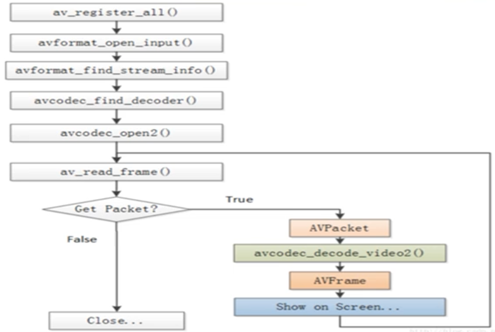
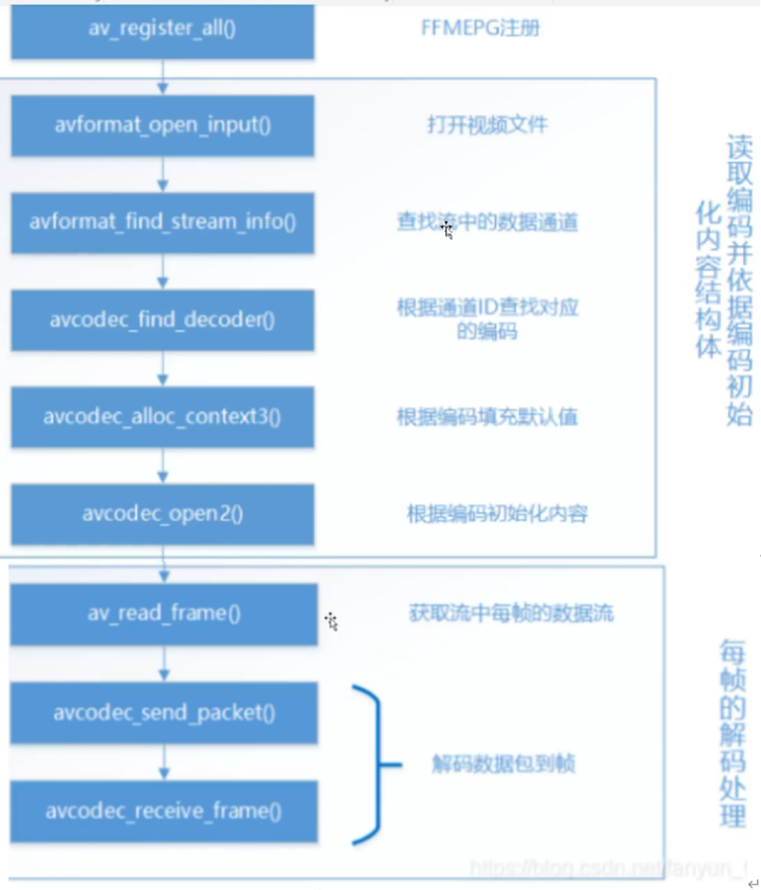

# FFmpeg 学习笔记


## 视频编码过程


```C++
// 该示例是把一个视频的rgb格式的输出为一个mp4格式的

av_register_all();
avcodec_register_all();

AVCoder *codec = avcodec_find_encoder(AV_CODEC_ID_H264);

// 创建编码器空间
AVCodeContext *c = avcodec_alloc_context3(codec);
// 设置编码器的一些参数
c->bit_rate = 4000000000;				// 压缩比特率
c->width = width;
c->height = height;
c->time_base = {1, fps};
c->framerate = {fps, 1};
c->gop_size = 50;						// 画面组关键帧大小
c->max_b_frame = 0;						// b帧
c->pix_fmt = AV_PIX_FMT_YUV420P;
c->codec_id = AV_CODEC_H264;
c->thread_count = 4;					// 处理线程数
c->flag |= AV_CODEC_FLAG_GLOBAL_HEADER;	// 全局编码信息

// 打开编码器
int ret = avcodec_open2(c, codec, NULL);	

// 创建输出上下文
AVFormatContext *oc = NULL;
// 这个例子中，char outfile[] = "test.mp4"
avformat_alloc_output_context2(&oc, 0, 0, outfile);


// 添加视频流
AVStream *st = avformat_new_stream(oc, NULL);
// 如果不这里不写 有时候会发生莫名错误
// 但是我觉得可能是这个上次mp4文件需要的，正常推流可能不需要
st->id = 0;
st->codecpar->codec_tag = 0;
avcodec_parameters_from_context(st->codecpar, c);
// 输出末尾为1，输入为0
// 打印输入和输出格式的详细信息
av_dump_format(oc, 0, outfile, 1);


// RGB 转 YUV
SwsContext *ctx = NULL;
ctx = sws_getContext(width, height, AV_PIX_FMT_BGRA,
                     width, height, AV_PIX_FMT_YUV420P,
                     SWS_BICUBIC, NULL, NULL, NULL);
// 输入空间
// 输出MP4所以最后乘4 ？好像是BGRA就是乘4
unsigned char *rgb = new unsigned char[width * height * 4];
// 输出空间
AVFrame *yuv = av_frame_alloc();
yuv->format = AV_PIX_FMT_YUV420P;
yuv->width = width;
yuv->height = height;
ret = av_frame_get_buff(yuv, 32);	// 32是什么意思？

// 写入mp4头文件
ret = avio_open(&oc->pb, outfile, AVIO_FLAG_WRITE);
ret = avformat_write_header(oc, NULL);


int p =0;
while(true) {
    int len = fread(rgb, 1, width * height * 4, fp);
    if (len <= 0) break;
    uint8_t *indata[AV_NUM_DATA_POINTERS]={ 0 };
    indata[0] = rgb;
    int inlinesize [AV_NUM_DATA_POINTERS]={ 0 };
    inlinesize[0] = width * 4;
    // bgra 转 yuv 的具体过程
    int h = sws_scale(ctx, indata, inlinesize, 0, height,
                      yuv->data, yuv->linesize);
    if(h <= 0) break;
    
    //编码视频帧
    yuv->pts = p;
    p += 3600:
    ret = avcodec_send_frame(c, yuv);
    AVPacket pkt;
    av_init_packet(&pkt);
    ret = avcodec_receive_packet(c, &pkt);
    
    
    av_interleaved_write_frame(oc, &pkt);
    
}


```

​	这篇[视频流编码流程](https://www.jianshu.com/p/4826c3c34caa)博客比较好，讲的很基础，而且就是图片输出视频的形式.


## 视频解码




​	B站UP主 ffmpeg学堂 讲解内容，感觉不太明白。

```C++
av_register_all();
avformat_network_init();    // 网络流需要

// 打开视频文件
AVFormatContext* pFormat = NULL;

// // 打开本地文件
// const char* path = "xx.mp4";
       
// 打开网络流
const char* path = "流地址";
AVDictionary* opt = NULL;
av_dict_set(&opt, "rtsp_transport", "tcp", 0);
av_dict_set(&opt, "max_delay", 550, 0);

int ret = avformat_open_input(&pFormat, path, NULL, &opt);
if(ret) {
    printf("failed\n");
    return -1;
}

// 寻找流信息 -> hH264 width height
// 网络流似乎没有下面这部分操作
ret = avformat_find_stream_info(pFormat, NULL);
if(ret) {
    printf("failed\n");
    return -1;
}
int time  = pFormat->duration();
int mbittime = (time / 1000000) / 60;
int mmintime = (time / 1000000) % 60;
av_dump_format(pFormat, NULL, path, 0);     // 显示相应的信息
int VideoStream = -1, AudioStream = -1;
VideoStream = av_find_best_stream(pFormat, AVMEDIA_TYPE_VIDEO, -1, -1, NULL, NULL);

// 寻找解码器
AVCodec* vCodec = avcodec_find_decoder(pFormat->streams[VideoStream]->codec->codec_id);
if(!vCodec) {
    printf("failed\n");
    return -1;
}

// 打开解码器，并初始化解码器的上下文
ret = avcodec_open2(pFormat->streams[VideoStream]->codec->codec_id,
                vCodec, NULL);
if(ret) {
    printf("failed\n");
    return -1;
}

// 解码视频
// 申请原始空间
AVFrame* frame = av_frame_alloc();
AVFrame* frameYUV = av_frame_alloc();
int width = pFormat->streams[VideoStream]->codec->width;
int height = pFormat->streams[VideoStream]->codec->height;
// 分配空间 进行图像转换
int nSize = avpicture_get_size(AV_PIX_FMT_YUV420P, 
                    width, height);
uint8_t* buff = NULL
buff = (uint8_t *)av_malloc(nSize);

// 一帧图像
avpicture_full((AVPicture *)frameYUV, buff, AV_PIX_FMT_YUV420P, 
                    width, height);
AVPacket* packet = (AVPacket *)av_malloc(size(AVPacket));

// 转化上下文
sws_getConText(width, height, AV_PIX_FMT_YUV420P);
// 读帧
while(av_read_frame(pFormat, packet) >= 0){
    if(packet->stream_index == AVMEDIA_TYPE_VIDEO) {
        
    }
}
```

B站UP主 OA工作流 讲解的解码过程




