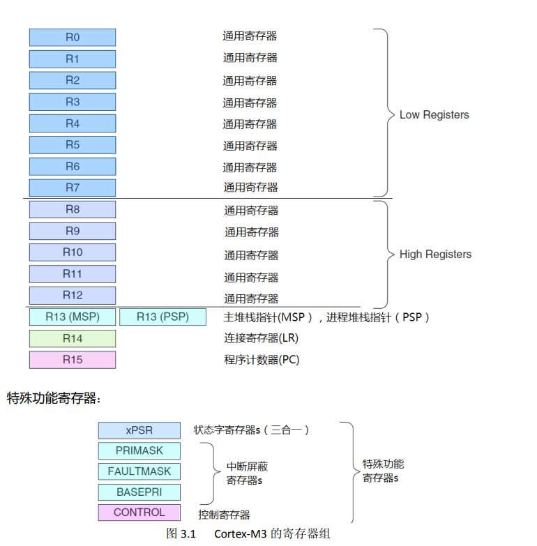
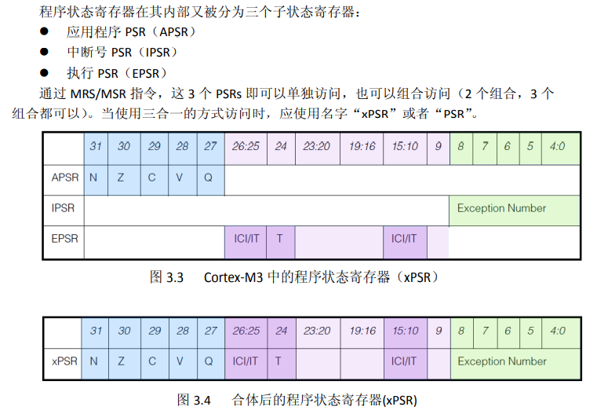
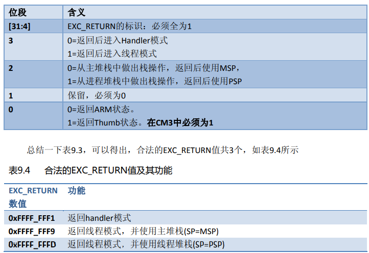

# FreeRTOS

## 汇编相关

### 寄存器相关

​	cortex内核中，存在以下寄存器：



​	对于 M3、M4 内核而言它们支持的是 Thumb2 指令集，它支持 16 位、32 位指令混合编程 。对于内核来说使用的是 ARM 指令集 还是 Thumb 指令集，就是在 XPSR 程序状态寄存器。xPSR具体如下所示：



​	其中第24位就代表当前指令的指令集类型。

### 函数调用的底层

​	在ARM中，当一个函数调用使用少量参数时，参数是通过r0-r3寄存器进行传值，而当参数多于4个时，会将多出的参数压入栈中进行传递。具体来说，对于少于等于4的情况就比较简单，没有什么多余的操作，直接把参数分别存入r0-r3中即可，然后使用`BL`指令跳转到函数对应的位置（这个函数入口应该是由编译器生成），在跳转的同时，**LR寄存器存入当前位置的下一条指令的位置**（`PC + 一个单位的汇编指令长度`，**调用BL指令后，系统会自动填充LR**），当函数执行完成后，使用`BX LR`跳转到原来执行的地方，目前可以理解为`BX LR`==`MOV PC, LR`。

​	为什么函数调用中一般不存在对寄存器当前值进行保护？因为函数都是按顺序执行的，单纯发生一个跳转，通用寄存器中值都是一些计算的过程量，具体的计算得到的数值都存储到了全局变量和局部变量中，例如都使用`STR`指令存储在对应的内存单元中。但也存在对寄存器压栈保存的时候，具体看寄存器中存储的值是否是未完成的过程量。然后我们看下面的例子。

```c
// 在进入add函数后，r0-r3寄存器中都是存放了add前四个参数，然后又要立马调用sub函数，而r0-r3中又要存放sub函数的前四个参数了，同时跳转的时候LR寄存器也会被修改了?
int add(int a, int b, int c, int d, int e, int f)
{
	int i = sub(1, 2, 3, 4, 5, 6);
	int tmp = a + b + c + d + e + f + i;
	return tmp;
}

// 对应汇编开始为 PUSH {r7, LR}
// 对应汇编结束为 POP {r7, PC}     代替 BX LR 完成指令跳转
// 至于为什么要对r7进行保护，也不太清楚，可能是它存在未完成的过程量
```

​	编译器会在进入add后，会将r0-r3寄存器中的值压栈，在函数里面r0-r3就可以被解放出来做运算，之后需要用到前四个参数的时候，就直接出栈使用；对于上述情况也还将LR压栈，则LR就可以被正常修改了，最后add执行完后，一般栈顶就指向之前压入的LR的值了，也会用类似于`POP PC`的指令跳转到原来的位置。

### 中断的底层理解

​	ARM中触发中断后，硬件会自动将xPSR，PC，LR，r12，r3-r0进行压栈处理（压栈的PC应该就指向了当前指令的下一条了，而压栈的LR寄存器中的值就是正常的函数返回地址，因为触发中断可能是发生在一个函数中），进行现场保护，然后跳转到中断服务函数中，同时**LR被更新为特殊的exc_return值**，其高28位都为1，低四位有特殊含义，如下图所示。



​	ARM体系结构的C编译器遵循AAPCS原则，对函数调用由如下规定：

​	r0-r3，r12，LR，xPSR为**调用者保存寄存器**，系统自动保存。R4-R11为**被调用者保存寄存器**，就是任何中断函数如果要操作这些寄存器则要先保存，中断函数返回前要恢复。

​	目前理解在中断服务函数中，只能使用保护过的通用寄存器进行运算操作，如果需要使用到r4-r11寄存器的话，则在函数的开始就应该对r4-r11寄存器进行压栈保存，在中断服务函数执行完后再出栈还原。具体在中断服务函数中是否需要对r4-r11寄存器压栈操作，**应该取决于编译器（因为函数中只是一些简单的运算，使用r0-r3寄存器完全可以完成，应该没必要使用r4-r11），或者用户使用内联汇编进行操作（实时操作系统的中任务切换过程）**。

​	对于浮点数单元的寄存器（内核有FPU单元）也一样，s0-s15 为调用者保存寄存器，s16-s31 为被调用者保存寄存器。

​	当中断服务函数执行完后，会执行`BX LR`，而LR中不像普通函数调用那样存放的是返回地址，而是exc_return，这个时候系统会**根据exc_return的后四位作出相应的设置**，如上图所示。而**实际的返回地址则是由硬件自动恢复现场，出栈后，将PC的值还原**，回到触发中断前的执行位置（这里是只考虑前后台系统）。


## 中断

​	中断优先级的数字越小，对应的优先级越高

​	而任务的优先级的数字越小，对应的优先级越低

​	https://www.bilibili.com/read/cv12812948


