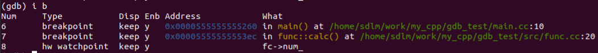
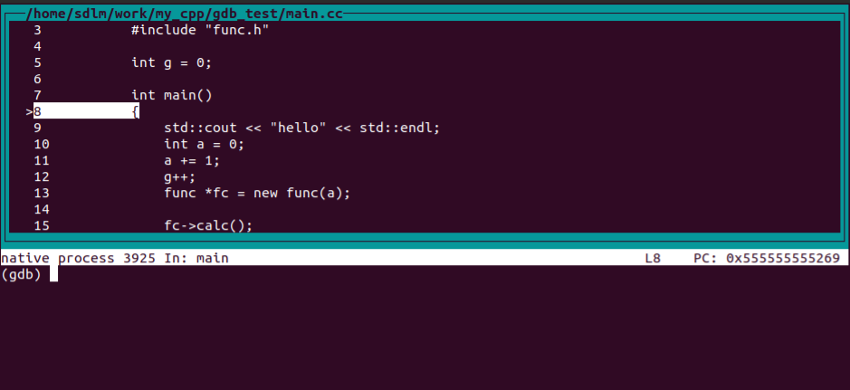

# GDB


[TOC]

## 编译debug版本

​		使用g++或者gcc编译debug版本增加 -g 选项即可。

​		使用cmake编译出debug版本。

```shell
# 添加-DCMAKE_BUILD_TYPE的选项
cmake -DCMAKE_BUILD_TYPE=Debug ..
```

​	

## gdb基本命令

```shell
# 启动gdb后，运行start执行到程序的开始
strat

# 继续运行程序
continue
c

# 单步运行，不进入函数内部
next
n
# 单步运行，进入函数内部
step
s
# 输入回车键重复上次命令

# 设置断点，简写为 b
break 行号
b 行号
# 在对应的文件中的行号设置断点
b 文件名:行号
# 在函数入口设置断点
b 函数名
# 设置条件断点，如for循环中当变量i为7时触发，b main.cc:22 if i == 7
b 文件名:行号 if 条件

# 设置观察点，当变量值发生改变时中断程序
watch 变量名

# 显示断点和观察点信息，会显示num号，删除时使用num号删除，具体内容如下图所示
info break
i b
```



```shell
# 删除断点和观察点，Num为上图所示的Num号
delete Num
d Num
# 删除所有断点
d breakpoints
# 根据行号删除断点
clear 行号
# 删除函数入口的断点
clear 函数名

# 打印变量值
print 变量名
p 变量名

# 显示当前作用域内的所有局部变量
info locals
# 显示当前函数的参数
info args

# 显示当前代码运行位置
where

# 当程序在运行过程中，输入 Ctrl+c 暂停运行程序，可以进行gdb命令操作

# 重新启动程序
run

# 退出gdb调试
quit
q

# 切换到源代码布局模式，如下图所示
layout src
# 切换上一布局
layout prev
# 切换下一布局
layout next
# 关闭布局
layout off

# 开启在子进程的调试
set follow-fork-mode child
```




