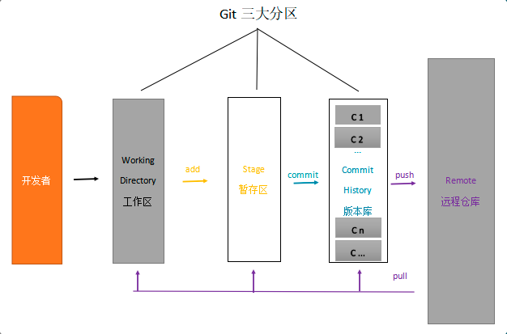
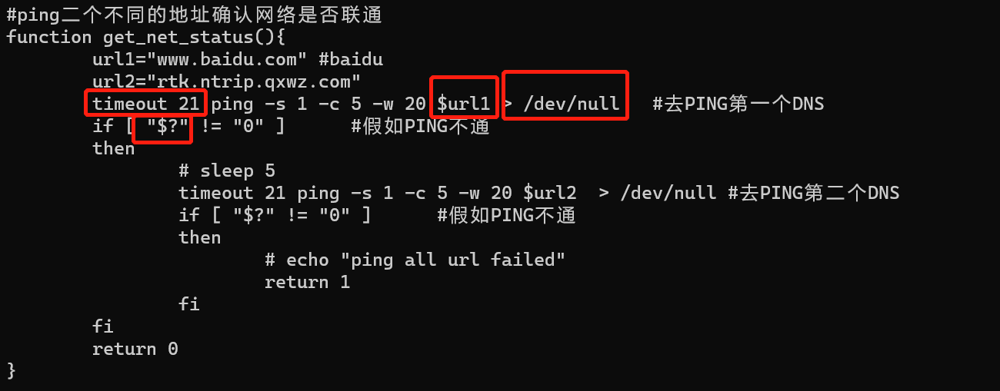
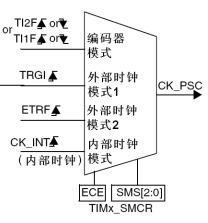
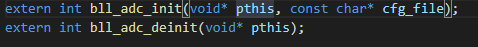
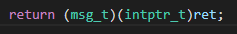
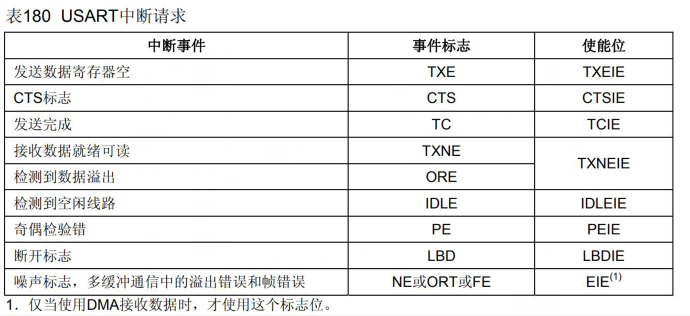

<h1 style="text-align:center">Inter Note</h1>

[TOC]

##MY LOG

### 2021.05.11

#### linux文件解压

​	xxx.tar.gz文件使用指令`tar zxvf`解压 ；对于xxx.tar.xz文件使用指令`xz -d xxx.tar.xz`将其解压成xxx.tar，然后使用`tar xvf xxx.tar`解压；对于xxx.zip文件使用指令`unzip xxx.zip`解压。

#### ssh密钥生成问题

​	许多 Git 服务器都使用 SSH 公钥进行认证。 为了向 Git 服务器提供 SSH 公钥，如果某系统用户尚未拥有密钥，必须事先为其生成一份。 在linnux中使用`$ ssh-keygen -t rsa -C "youremail@example.com"`，密钥类型可以用 -t 选项指定。如果没有指定则默认生成用于SSH-2的RSA密钥。这里使用的是rsa。邮箱可以随意填写，之后生成的过程就全部回车即可。

​	之后可以使用` cat ~/.ssh/id_rsa.pub`查看生成的哈希数。

#### 远程连接和传输文件

​	使用`ssh root@xxx.xxx.xxx.xxx`（连接对象的IP地址），而且好像要保证主机的IP和其在一个局域网（前三个相同）；传输文件使用`scp 源文件位置 目标位置`。

#### 网络设备问题

​	一台PC设备中不同网卡有不同的IP地址，如有线网卡的IP和无线网卡的IP，windows中可以在网络设置中对网卡进行设置；Linux中`ifconfig`指令用于显示或设置网络设备，同时也可以设置网络设备的状态，或是显示目前的设置，如`ifconfig eth0 donw`为关闭eth0网卡，`ifconfig eth0 up`为打开eth0网卡。

#### linux指令

​	` top`命令用于实时显示process 的动态。

​	`kill`命令用于删除执行中的程序或工作。常用`kill -9 进程编号`

### 2021.05.12

#### 指令

​	`df -h`

​	`tail -f`

​	`umount`

​	`sync`

#### 串口相关

​	串口+DMA

​	串口的FIFO循环队列，STM32串口的硬件本身没有FIFO，F1的DMA也没有FIFO

### 2021.05.13

#### 串口中断问题

​	一般使用HAL_UART_Receive_IT(&UART1_Handler, (u8 *)aRxBuffer, RXBUFFERSIZE)函数开启串口接收中断，并绑定接收数组及其大小，对于接收中断的回调函数有接收一半的回调和接收完成的回调函数。

#### 定时器相关

​	定时中断为什么不使能自动装载的功能？

#### STM32中ADC的采集模式

​	循环查询+DMA的方式

#### 宏定义中使用do{}while(0)的好处

​	[链接](https://blog.csdn.net/liliangbao/article/details/4163440)

###2021.05.14

#### 定时器相关

​	使用F4关闭自动装载功能，查看定时器的实际效果

#### Linux指令

​	`repo`

​	`ln`链接

### 2021.05.17

####Linux指令

​	`sp`

#### 临时修改IP地址

​	`ifconfig 网卡名称 xxx.xxx.xxx.xxx`

#### A4设备测试过程

​	开机后，快速按紧下键，进入工厂测试模式后蜂鸣器会响，之后松开。

###2021.05.19

#### git



​	`git add`

​	`git diff`

​	`git commit`： git commit -am "描述"，就不用先git add了，默认提交全部文件

​	`git push`

​	`git log`: 显示日志信息，git log --pretty=oneline 代表一行显示log信息

​	`git reflog`: 显示完整的日志信息。

​	`git pull`

​	`git statue`

​	`git branch`

​	`git checkout`: 除了切换和新建分支外，还可以删除原来修改的文件，git checkout -b XXXX 新建分支并切换到该分支

​	`git stash`

​	`git restore`: 把文件从暂存区中移出

​	`git reset`: 版本回退，git reset --hard HEAD~n 代表回退n次，git reset --hard [版本号] 代表回退到对于的commit。git reset HEAD -- path/filename 是将文件从暂存区移出的一种方法。如果commit之后，想撤回刚刚的操作，可以使用 git reset --soft HEAD^


#### Qt相关

​		注意信号与槽的关系，信号可以是一些控件的动作事件，也可以是对应的信号函数，使用connect()函数进行绑定，可以用于不同界面（即不同的类）中的信号传递，如一个界面中的信号函数，可以触发另外一个界面中与它绑定的槽函数，信号函数前面要用`emit`修饰，它的参数就是可以传递给槽函数的参数，具体用法可以自己百度。

### 2021.05.21

#### 任务1

​	修改Soc_code/ambarella/boards/cv22_walnut/rootfs/default/etc/init.d/Meg-acm.sh的脚本文件，将检测4g是否能联网函数中的ping修改成AT指令的形式。



#### 4g固件升级流程

​	注意需要`pkill -9 Meg-acm.sh`

#### awk和grep

​	对于grep指令需要注意灵活使用一些正则表达式，如`.*`代表任意字符等，可以将[grep](https://www.cnblogs.com/flyor/p/6411140.html)。

​	对于awk指令的用法比较多，目前使用的为按对应的分隔符分割，然后在输出对于位置的字符串，如`cat test.txt | awk -F , '{ print $1 $4 }'`，例如test.txt中为`SY10,BN22,31,ZM78,89`，后面的指令会将这个字符串按`,`分割，最后输出第一个和第四个字符串，则会输出`SY10ZM78`，详细用法自己百度。

### 2021.05.24

#### 往A4中修改代码的方法

​	build.sh用来编译文件，b.sh负责将编译好的上传至A4中，上传不同的源文件需要修改b.sh中的上传位置，同时有的可能需要杀死一些进程才能成功上传。debug方法在代码中使用loge()，然后实时查看A4中/data/a4bsp/stat.log中的信息(使用指令`tail -f stat.log`)。

####linux中操作后台运行程序的方法

​	在指令是加&为指令在后台运行，一般是常用让cat指令在后台运行。使用`pkill -9 cat`能杀死在后台运行的cat指令。

#### 结构体中char buf[0]相对于char *buf的好处

​	char buf[0]不占内存，在结构体内地址连续。

#### 问题1

​	在Qt中，目前有一个问题：

```C++
cahr buf[255];
memset(buf, 0x2f, sizeof buf);
qDebug() << buf;
```

​	最后输出会多9个字符：

​	

目前还不知道是什么问题。

### 2021.05.25

#### malloc的应用场景

​	一般用到大块内存一般都使用malloc()从堆上申请，最后记得使用free()释放内存；如果直接申请数组的话，就存放在栈中，栈空间比较有限，程序可能会跑崩掉。

### 2021.05.26

#### char中的'\0'

​	对于char数组需要注意区分普通的char数组和字符串，如果结尾为'\0'则为字符串，对应十六进制为0x00，有一些库函数识别到'\0'认为为char数组的结尾，就算'\0'后还有正常的字符，可以认为该char数组为第一个'\0'前字符组成的字符串。

#### sprintf

​	可以用于拼接字符或则数组，存放在一个新的字符串中，如`sprintf(buf, "test: %s,%d", old_buf, num)`

### 2021.06.01

#### 定时器的时钟源问题



​	一般都是默认使用内部时钟，目前理解如果做级联的定时器应该是使用外部时钟模式1，然后外部时钟模式2有一个引脚可以外接脉冲信号。


### 2021.06.05

#### linux指令

​	`tail`


### 2021.06.07

#### linux指令

​	`du`: 查看文件大小，`du -s`为显示当前目录的总大小，`du -h`为以合适的内存的单位显示。

#### list_for_each_entry

​	linux内核

#### pthread_mutex_init

​	进程互斥锁


### 2021.06.08

#### __cplusplus

```c
#ifdef __cplusplus
extern "C" {
#endif // __cplusplus

#ifdef __cplusplus
}
#endif // __cplusplus
```

​	关于这段代码的作用

#### \#pragma pack(1)

​	它的作用和结构体的字节对齐相关

#### typedef定义函数指针

​	[函数指针](https://blog.csdn.net/zpznba/article/details/103479130)


#### 问题1

​	为什么多头文件中都声明了`typedef int32_t msg_t; `，而不是用一个公共的数据类型库。

#### 问题2



​	为什么头文件声明函数中还需要这个extern

### 2021.06.09

#### 问题1



​	为什么前面有两个类似于强制转换的东西？

#### 问题2

​	关于头文件前面的头文件名的设置的__主要看个人代码习惯吧？

### 2021.06.10

#### Git指令

​	`git branch -av`: 查看本地和远端的分支

​	`git diff HEAD^`: 查看显示上一次提交之前工作目录与git仓库之间的差异，可以查看拉下来的文件有那些具体的修改。

​	`git add`: 一般新建的文件git status不会追踪，要用git add将新文件添加进去

### 2021.06.23

#### __IO

​	这是ST库里面的宏定义：

```
#ifdef __cplusplus
  #define   __I     volatile             /*!< Defines 'read only' permissions */
#else
  #define   __I     volatile const       /*!< Defines 'read only' permissions */
#endif
#define     __O     volatile             /*!< Defines 'write only' permissions */
#define     __IO    volatile             /*!< Defines 'read / write' permissions */
```

​	目前还没有完全理解这些东西的用法，可以看看这篇博客[\_\_I,\_\_O,\_\_IO](https://blog.csdn.net/qq_27312943/article/details/51273064)，解释的比较清楚，但是还是不懂这些东西的具体用法。

#### SPI+DMA


####UART、SPI的中断事件

stm32F1的UART相关的中断事件：




### 2021.07.05

#### DHCP

​	DHCP（动态主机配置协议）是一个局域网的网络协议。指的是由服务器控制一段IP地址范围，客户机登录服务器时就可以自动获得服务器分配的IP地址和子网掩码。


### 2021.07.06

#### wlanapi无线库

连接无线网络步骤如下

1. 通过WlanOpenHandle打开wifi服务句柄
2. WlanEnumInterfaces枚举无线网卡接口
3. WlanScan开启主动扫查（调用为了避免在连接状态下，网卡不主动获取无线列表）
4. WlanGetAvailableNetworkList获取有效网络信息
5. 选择好需要连接的wifi后，调用WlanSetProfile设置配置文件（这一步生成配置文件有点复杂，是一个xml文件）
6. 调用WlanConnect直接连接即可

总的来说，流程是固定的，但是wlanapi里面的一些数据结构有点复杂，需要花时间去理解消化一下。


### 2021.07.09

#### C++读取文件

​	C++读取文件的全部内容的一种方式：

```c++
#include <string>
#include <fstream>
#include <iostream>
#include <sstream>
using namespace std;
 
int main()
{
	ifstream file;
	stringstream tmp; 
	string ss;
	file.open("profile_template.xml");
	tmp << file.rdbuf();
	file.close();
	ss = tmp.str();
	cout << ss;
	return(0);
}
```

#### linux指令相关

​	使用 && 连接两条linux指令为将两条指令在同一个终端中执行。

#### VS生成的lib文件和Qt调用相关

​	VS生成的lib库中如果含有一些特殊的库时，可能Qt就不太容易调用，甚至使用string都可能导致Qt调用失败。


### 2021.07.12

#### git指令

​	`git add -u`：不会将 Untracked files 添加至暂存区


###2021.08.31

#### access

​	access()函数用来判断用户是否具有访问某个文件的权限(或判断某个文件是否存在). 


