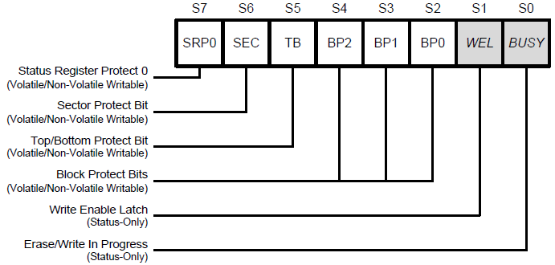
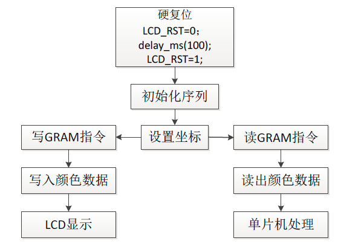
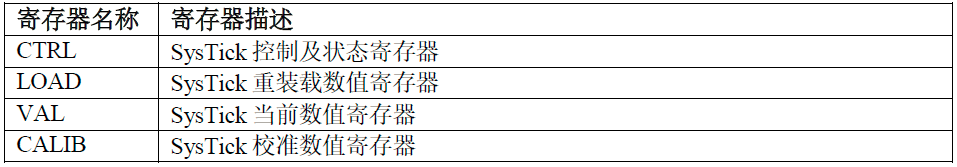
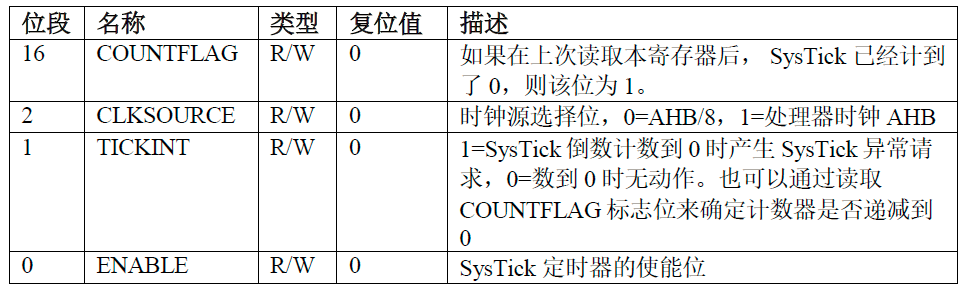

# STM32学习笔记

[TOC]

## flash W25Q128

###Flash简介

​	flash属于广义的EEPROM，因为它也是电擦除的rom。但是为了区别于一般的按字节为单位的擦写的EEPROM，我们都叫它flash。flash做的改进就是擦除时不再以字节为单位，而是以块为单位，一次简化了电路，数据密度更高，降低了成本。上M的rom一般都是flash。

​	flash分为nor flash和nand flash。nor flash数据线和地址线分开，可以实现ram一样的随机寻址功能，可以读取任何一个字节，但是擦除仍要按块来擦。nand flash同样是按块擦除，但是数据线和地址线复用，不能利用地址线随机寻址，读取只能按页来读取（nandflash按块来擦除，按页来读，norflash没有页）。由于nandflash引脚上复用，因此读取速度比nor flash慢一点，但是擦除和写入速度比nor flash快很多，nand flash内部电路更简单，因此数据密度大，体积小，成本也低，因此大容量的flash都是nand型的。小容量的2～12M的flash多是nor型的。使用寿命上，nand flash的擦除次数是nor的数倍。而且nand flash可以标记坏块，从而使软件跳过坏块。nor flash 一旦损坏便无法再用。因为nor flash可以进行字节寻址，所以程序可以在nor flash中运行。嵌入式系统多用一个小容量的nor flash存储引导代码，用一个大容量的nand flash存放文件系统和内核。

###概述

​	W25Q128(128Mbit，16MByte)，被组织为65536个可编程的页，每页256bytes。擦除方式分为16页一组（即一个扇区4kbytes，总共4096个扇区），128页一组（即8个扇区32kbytes），256页一组（即16个扇区或1个块64kbytes），或整个芯片擦除。

​	W25Q128 可以支持 SPI 的**模式 0** 和**模式 3**，也就是 `CPOL=0/CPHA=0` 和`CPOL=1/CPHA=1` 这两种模式。

​	W25Q128有三个8位的状态寄存器，下面以状态寄存器1为例。



​	S0和S1都为只读位，**S0为1时为擦除/写正在进行，S0为0时为空闲**，这个状态位很重要，在擦除操作和写操作时，**S1为1时写使能，S1为0时写禁止**，在**写页、写状态寄存器、擦除操作**前都需要**写使能**，操作完后，需要**判断BUSY位**，其为0才能进行下一步操作。其他位都和flash的写保护相关，置1后就不能进行写操作或者擦除操作，具体详见芯片手册。

​	Flash 写入数据时和 EEPROM 类似，**不能跨页写入，一次最多写入一页，W25Q128的一页是 256 字节**。注意写前需要**写使能操作**，写完一个页后，**需要判断BUSY位**，其为0时才能进行下一个操作。

###调试过程

​	正点原子的官方例程里面的连续写的逻辑可以借鉴一下。感觉比我之前写的要简洁一些。

​	写和擦除操作时需要注意是否写保护。

​	需要注意正点原子官方例程中的写状态寄存器的函数，少了必要的写使能和busy等待。


## LCD的驱动

### 问题

​	SRAM、ROM、PSRAM和flash的一些区别。

​	目前还是没有很懂关于RS口的命令和数据的选择还有LCD上地址映射的关系，不知道如何描述这个问题，主要是关于FSMC的工作流程还是不是很了解。

现在大概懂了，要区分LCD连接的地址线和数据线，LCD的RS是接到地址线A6上的，而D0-D15就依次接到FSMC的数据线上，所以我们在写命令和写数据的时候只要地址线A6为输出不同就行。

### LOG

​	2021.03.08：把LCD的ID读取出来的。至少读寄存器和写寄存器的函数没有错。是利用FSMC对LCD进行操作。

### 概述

​	对于LCD需要使用专门的LCD驱动芯片，探索者里面使用的驱动芯片的型号为NT35510，要编写NT35510的驱动需要仔细阅读其芯片手册，我们使用的80并口的方式，需要查看这款芯片对应的驱动时序图，包括地址建立时间，数据保存时间等，这个涉及到FSMC的相关设置，还有驱动芯片的各种操作指令和指令格式，例如设置扫描方向指令、写GRAM指令、设置坐标指令等。

​	我们是把 TFTLCD当成 SRAM设备使用，使用F4里面的FMSC的Bank1的第4号区。具体关于FMSC的初始化设置不详细说，主要注意FMSC里面的时序设置。FMSC初始化后，具体的操作就好像对一个内存块进行操作。具体如下所示，在硬件连接上A6对应RS，RS为0时写命令，RS为2时写数据，详细的解释可以看正点原子的F4开发手册。

```c
// LCD地址结构体
typedef struct lcd
{
    __IO uint16_t LCD_REG;	// 写命令
    __IO uint16_t LCD_RAM;	// 写数据
}LCD_TypeDef;

// 使用NOR/SRAM的Bank1.sector4,地址位HADDR[27,26]=11 A6作为数据命令区分线 
// 注意设置时STM32内部会右移一位对其! 111 1110=0X7E
#define LCD_BASE    ((uint32_t)(0x6C000000 | 0x0000007E))
#define LCD         ((LCD_TypeDef *)LCD_BASE)
```

​	关于LCD的初始化问题，需要根据厂商会提供一段初始化代码，直接使用就行，对于我们个人可以建立一个用存放LCD关键参数的结构体，里面可以存放LCD的屏幕尺寸、横竖屏标志位以及之后会经常使用写GRAM和坐标对应的寄存器编号等。之后可以对LCD进行默认的设置，比如设置竖屏，还有相应的扫描方式。

​	关于LCD的画点的流程图如下：




​	然后根据这个流程可以封装 画点 -> 写字符 -> 写字符串 等函数，关于常用字符的点阵列有一些专门的软件可以生成。


##外部SRAM

​	和LCD一样，使用FSMC控制，主要需要阅读对应SRAM的芯片手册，查看基本配置和时序图，然后进行对应的FSMC初始化配置。


##串口

###LOG

​	2021.03.25：关于串口接收数据的过程还可以在多看看别人是怎么操作的，感觉正点原子的做法和我想的不太一样，一次串口接收中断就接收一个字符的效率是不是不太高。


##DMA

###STM32F4中DMA简介

​	DMA，全称为: Direct Memory Access，即直接存储器访问。DMA 传输方式无需CPU直接控制传输，也没有中断处理方式那样保留现场和恢复现场的过程，通过硬件为RAM与I/0设备开辟一条直接传送数据的通路，能使CPU的效率大为提高。
​	STM32F4最多有2个DMA控制器(DMA1 和DMA2)，共16个数据流(每个控制器8个)，每个DMA控制器都用于管理一个或多个外设的存储器访问请求。每个数据流总共可以有多达8个通道(或称请求)。每个数据流通道都有一个仲裁器，用于处理DMA请求间的优先级。它可以执行下列事务: 外设到存储器的传输、存储器到外设的传输、存储器到存储器的传输。仅DMA2控制器支持存储器到存储器的传输，DMA1不支持。

###LOG

​	2021.03.25: 使用DMA发送数据，感觉最后总会剩下一个数据不发送，最后停在了99%

###概述

​	本例程是使用串口1的DMA通道，根据DMA数据流通道的映射表，使用DMA2数据流7的通道4，DMA需要配置的参数不是很多，在CUBE中进行配置，关于DMA的一些相关函数具体看手册，对于DMA串口发送的流程大致为：初始化DMA -> 开启DMA -> 等待传输完成，在此过程中可以进行其他操作 ->传输完成后，清除传输完成标志位，关闭DMA，然后可以重复在2-4步骤之间进行。关于DMA的接收，比较常用的有DMA+串口空闲中断的方式，关于这种方式可以参考这个博客：[DMA+串口空闲中断](https://blog.csdn.net/Hola_ya/article/details/81560204)


## FIFO

### 概述

​	STM32中FIFO就是一个先进先出的缓存器，一开始始终不是很理解它的实际作用以及在使用过程中的操作流程。实际上，在工程中需要经常使用FIFO，这里有一篇博客一个作用点说的不错：[串口接收FIFO](https://blog.csdn.net/wangwenxue1989/article/details/48289715)，这也帮我解决了之前不清楚正点原子中关于串口接收中断只接收一个字符的疑问。


## 延时函数

### SysTick定时器

​	SysTick—系统定时器是属于CM4 内核中的一个外设，内嵌在NVIC 中。系统定时器是一个24bit 的向下递减的计数器，计数器每计数一次的时间为1/SYSCLK。当重装载数值寄存器的值递减到0 的时候，系统定时器就产生一次中断，以此循环往复。

​	SysTick—系统定时有4 个寄存器，简要介绍如下。在使用SysTick 产生定时的时候，只需要配置前三个寄存器，最后一个校准寄存器不需要使用。



​	重点关注CTRL寄存器，其主要的寄存器位如下所示。



​	在HAL库中，在内核中SysTick的主要配置函数如下所示。

```c
__STATIC_INLINE uint32_t SysTick_Config(uint32_t ticks)
{
  // reload寄存器位24bit，最大值为2^24
  if ((ticks - 1UL) > SysTick_LOAD_RELOAD_Msk){
    return (1UL);                                                  
  }
  // 配置reload寄存器的初始值
  SysTick->LOAD  = (uint32_t)(ticks - 1UL);          
  // 配置SysTick中断的中断优先级，为15，优先级最低
  NVIC_SetPriority (SysTick_IRQn, (1UL << __NVIC_PRIO_BITS) - 1UL); 
  // 配置counter计数器的值
  SysTick->VAL = 0UL;     
  // 配置sysTick的时钟为系统时钟，F407为168Mhz；另外还可以设置为8分频
  // 使能中断
  // 使能SysTick
  SysTick->CTRL  = SysTick_CTRL_CLKSOURCE_Msk |
                   SysTick_CTRL_TICKINT_Msk   |
                   SysTick_CTRL_ENABLE_Msk;                         
  return (0UL);                                                     
}
```

### delay函数的实现

​	delay函数的实现挺简单的。这里使用查询的方式，具体代码如下所示。

```c
void delay_us(uint32_t us)
{
    HAL_SYSTICK_Config(168000000/1000000);		// 开启SysTick，定时周期为1us
    // 查询的方式
    for(int i=0;i<us;i++)
    {
        while(!((SysTick->CTRL) & (1<<16)));	// 通过判断标志位，是否到达1us
    }
    SysTick->CTRL &= ~SysTick_CTRL_ENABLE_Msk;	// 关闭SysTick
}
```

​	也可以中SysTick中断的方式，就是在SysTick_Handler()中添加延时相关的中断函数。


### MDK的编译过程


##问题

1. streambuffer数据结构
2. 延时函数的编写
3. MDK的编译过程
4. FatFs文件系统

