[TOC]


# 开发记录

## 功能对应

### 1. 地磁及空间软件

#### 1.1 地磁指数 ×

​	这个功能在pydarn中没有具体的函数对应，但是它本身就是普通的数据绘图，只要能正常读取数据就行了。


的


#### 2.1 太阳风数据 ×

​	这个功能在pydarn中没有具体的函数对应，但是它本身就是普通的数据绘图，只要能正常读取数据就行了。

### 2. 物理模型

#### 2.1 AACGM坐标转换 ×

​	这个功能在pydarn中没有具体的函数对应，但是单纯的坐标转换应该使用AACGM-v2的库就能够实现。


#### 2.2 射线追踪 ××

​	这个功能在pydarn中没有具体的函数对应，而且没有在他们的开发日志中看到相关的描述，具体可能需要自己看老版代码实现了。

 


### 3. 雷达数据可视化软件

#### 3.1 雷达信息提取 √√

​	pydarn3.0的对应函数为`pydarn.read_hdw_file('sas')`。

```python
hdw_data = pydarn.read_hdw_file('sas')
print("雷达ID:", hdw_data.stid, "\n雷达坐标:", hdw_data.geographic, "\n波位数:", hdw_data.beams, "\n距离门数:", hdw_data.gates)

```

​	目前还不知道雷达法向和主阵子阵距离是对应那个参数

#### 3.2 雷达视场可视化 √√

​	pydarn3.0的对应函数为`pydarn.Fan.plot_fov()`。

```python
_, _, ax, ccrs = pydarn.Fan.plot_fov(stid=66,
                                     date=dt.datetime(2022, 1, 8, 14, 5),
                                     fov_color='red',
                                     alpha=0.5,
                                     line_color='blue',
                                     line_alpha=1,
                                     grid=True,
                                     radar_label=True,
                                     radar_location=True,
                                     # coords=pydarn.Coords.GEOGRAPHIC,
                                     projs=pydarn.Projs.GEO)
ax.coastlines()
plt.show()
```

​	现有函数无法实现设置线型和线宽，同时也不支持AACGM坐标转换


#### 3.3 距离-时间-参数强度可视化 √√

​	pydarn3.0的对应函数为`pydarn.RTP.plot_summary()`。

```python
fitacf_file = '../HF radar data/20190626.0200.00.jme.fitacf'
fitacf_data = pydarn.SuperDARNRead(fitacf_file).read_fitacf()
pydarn.RTP.plot_summary(fitacf_data, beam_num=2)
plt.show()
```

​	感觉这个函数很完善了，还多了一个角度参数，具体以后再微调


#### 3.4 扇形图 √√

​	pydarn3.0的对应函数为`pydarn.Fan.plot_fan()`。

```python
fitacf_file = '../HF radar data/20190626.0200.00.jme.fitacf'
fitacf_data = pydarn.SuperDARNRead(fitacf_file).read_fitacf()
ax, _, _, _, _ = pydarn.Fan.plot_fan(fitacf_data,
                                     scan_index=5,
                                     parameter='w_l',
                                     radar_label=True,
                                     groundscatter=True,
                                     coords=pydarn.Coords.GEOGRAPHIC,
                                     projs=pydarn.Projs.GEO,
                                     colorbar_label="Velocity m/s")
ax.coastlines()
plt.show()
```

​	感觉这个函数很完善了，线型和线宽还是没有，可能需要自己添加绘制副图的功能


#### 3.5 北方中纬分系统六部雷达观测的不规则体速度图 √

​	pydarn3.0的对应函数为`pydarn.Grid.plot_grid()`。

```python
file = "../HF radar data/20190626.north.grid2"
SDarn_read = pydarn.SuperDARNRead(file)
grid_data = SDarn_read.read_grid()
stime = dt.datetime(2019, 6, 26, 4, 30)
gridplot = pydarn.Grid.plot_grid(grid_data, start_time=stime,
                                 colorbar_label='Velocity (m/s)',
                                 radar_label=True, line_color='blue',
                                 fov_color='grey')
plt.show()
```

​	这个函数目前还不知地图的叠加，除此之外还存在很多未完善的小问题。


#### 3.6 北半球所有雷达观测到的不规则体速度图 √

​	与3.5类似。

#### 3.7 北半球电离层对流图 √

​	pydarn3.0的对应函数为`pydarn.Maps.plot_mapdata()`。

```python
map_file = "../HF radar data/20190626.north.map2"
map_data = pydarn.SuperDARNRead().read_dmap(map_file)

pydarn.Maps.plot_mapdata(map_data, record=150,
                         parameter=pydarn.MapParams.FITTED_VELOCITY,
                         lowlat=60, colorbar_label='Velocity m/s',
                         contour_fill=True,
                         contour_fill_cmap='RdBu',
                         contour_colorbar=True,
                         contour_colorbar_label='Potential (kV)',
                         pot_minmax_color='r',
                         map_info=True, imf_dial=True, hmb=True)
plt.show()
```

​	这个函数目前还不知地图的叠加，除此之外还存在很多未完善的小问题。


### 4. 通用软件

#### 4.1 L1级数据读取 √√√

​	pydarn3.0的对应函数为`pydarn.SuperDARNRead(file).read_rawacf()`。

​	满足要求

#### 4.2 L2级数据读取 √√√

​	pydarn3.0的对应函数为`pydarn.SuperDARNRead(file).read_fitacf()`。

​	满足要求

#### 4.3 L3级GRD数据读取 √√√

​	pydarn3.0的对应函数为`pydarn.SuperDARNRead(file).read_grid()`。

​	满足要求

#### 4.4 L3级MAP数据读取 √√√

​	pydarn3.0的对应函数为`pydarn.SuperDARNRead(file).read_dmap()`。

​	满足要求

#### 4.5 时间转换


#### 4.6 虚高模型


#### 4.7 坐标转换


#### 4.8 太阳相关计算


#### 4.9 地球计算相关


## 代码架构

​	gme，plotting，model，utils


## 代码说明

### 绘制雷达视场图相关	

关于雷达视场图的门数gate和波位数beams的说明：


​	则需要绘制出这个图线，需要绘制101x17条线。

### 绘制扇形图相关

1. 参数中的'gflg'是什么东西？
2. 它的整体绘图逻辑，是直接根据雷达的视场图，使用对应的坐标转换函数转换得到整个视场图的每个点的坐标（地理坐标、磁地方时或者极坐标），如gates=16，Beams=100，则就是17 * 101个点的二维坐标，然后从fitacf文件中获取的参数数据也是对应16 * 100个点的数据，刚好对应视场图的每个点。然后使用`ax.pcolormesh()`函数可以直接进行绘制。所以它里面没有存每个色块的坐标值，而是直接使用视场图得到的。


### 绘制速度图相关

​	目前的一些问题：

- [x] 参数中的thetas和rs似乎是极坐标的表示方法。
- [x] 下图为JME的正确的速度图。


- [x] 目前感觉grid中的速度点的坐标数据为磁纬度经度。需要转化一下

- [ ] 目前关于一些雷达视场图的叠加还需要优化一些细节，同时地图叠加内部处理逻辑需要优化；同时还没有实现速度合成，目前评估感觉不太难，需要对grid数据进行具体的分析。
- [ ] 目前地图叠加功能不兼容MLT和AACGM的转换。

​	

​	开发进度：

1. 2022/06/14完成的地图叠加的速度图像。


## 绘制对流图相关

​	pydran3.0的绘图结果：


​	开发问题：

- [ ] 东经为正，西经为负，在绘制速度线的时候，在东西经180°交接处，会出现BUG。增加判断对180°左右的西经加360°进行处理


- [ ] 在绘制对流等高线的时候出现了类似的问题


## 雷达数据说明

1. 目前感觉雷达数据文件中的坐标是地理坐标，对于其他坐标系需要自己转换一下。

```python
lat = SuperDARNRadars.radars[stid].hardware_info.geographic.lat
lon = SuperDARNRadars.radars[stid].hardware_info.geographic.lon

# Convert to geomag coords
if coords == Coords.AACGM_MLT or coords == Coords.AACGM:
    geomag_radar = aacgmv2.get_aacgm_coord(lat, lon, 250, date)
    lat = geomag_radar[0]
    lon = geomag_radar[1]
    if coords == Coords.AACGM_MLT:
        mltshift = geomag_radar[1] -\
        (aacgmv2.convert_mlt(geomag_radar[1], date) * 15)
        lon = geomag_radar[1] - mltshift
        if projs == Projs.POLAR:
            lon = np.radians(lon)
```

2. 


## 问题总结

### 1. 地图坐标转换问题

​	目前pydarn3.0的版本不支持地图的坐标转换，无论是MLT还是AACGM都不支持。

### 2. 修改的源代码文件

- projections.py
- maps.py
- grid.py
- fan.py : 增加地图叠加功能


# 常用代码

## python库相关

1. `pip list`：python安转库的列表
2. `pip install [package]`：安装软件包
3. `pip uninstall [package]`：卸载软件包
4. `pip install --upgrade [package]`：升级某个软件包
5. `conda env list`：查看Python的虚拟环境
6. `conda create -n [env_name] python=[version]`：创建python的虚拟环境
7. `conda activate [env_name]`：激活虚拟环境
8. `conda install [package]`：使用conda安装库
9. `conda update [package]`：更新库
10. `conda remove -n [env_name] --all`： 删除环境
11. `sudo apt-get --purge remove `：ubuntu删除包，及其依赖项


## Pydarn相关

1. `conda install -c conda-forge cartopy=0.19`：cartopy的安装
2. `convert_latlon()`：在地磁坐标和AACGM坐标之间转换
3. 


## python编程相关

1. `name.shape`：输出变量的维度


# 安装说明

ubuntu18中安装cartopy0.20
conda install proj
conda install -c conda-forge geos
pip install git+https://github.com/SciTools/cartopy.git

​	ubuntu18.04中环境：

```python
## dokcer安装
sudo apt install make
sudo apt install docker
sudo apt install docker.io

## docker 删除
sudo docker rm -f [ID]		# 删除容器
sudo docker image rm [ID]	# 删除镜像
sudo docker image ls		# 查看镜像
sudo docker container ls	# 查看容器

## Fortran编译
sudo apt-get install -y libmpich-dev

## pydarn的依赖包：
pip install PyYAML
pip install pyDARNio
pip install aacgmv2
pip install matplotlib
pip install pandas

## 数据爬取依赖包
pip install requests
pip install beautifulsoup4
pip install lxml

## 安装cartopy


```


​	centos8中环境：

```shell
## centos8中安装cartopy0.20：
conda install proj
conda install -c conda-forge geos
sudo yum install gcc
sudo yum install gcc-c++
pip install git+https://github.com/SciTools/cartopy.git

## pydarn的依赖包：
pip install PyYAML
pip install pyDARNio
pip install aacgmv2

## 射线追踪依赖包：
pip install pandas
sudo dnf install -y openmpi-devel
sudo ln -s /usr/lib64/openmpi/bin/mpif90 /usr/bin/mpif90 #Needed for raydarn to 
sudo ln -s /usr/lib64/openmpi/bin/mpiexec /usr/bin/mpiexec
# 射线追踪最后的模型文件需要放在 davitpy->models 的文件路径下面

## cdf文件
pip install spacepy
pip install numpy scipy h5py networkx
sudo yum install ncurses-devel
# 需要在官网下载cdf包 https://cdf.gsfc.nasa.gov/
# 进入cdf*dist文件夹
make all.help
make OS=linux ENV=gnu CURSES=yes FORTRAN=no UCOPTIONS=-O2 SHARED=yes -j4 all
make install
# 在python中需要指明路径
# 设置环境变量的方法后续研究
import os
os.environ["CDF_LIB"]='/home/sdlm/ziwu/cdf38_1-dist-all/cdf38_1-dist/lib'
from spacepy import pycdf


```


### 用户安装

正常ubuntu安装：

```shell
# 安装好python3.9环境的Miniconda
# 进入对应的python3.9的环境
# 在pydarn的文件夹中直接运行
make install

```

docker中安装说明：

```shell
# 先安转Miniconda
chmod 777 Miniconda...
./Miniconda...
source ~/.bashrc

# 安装一些必要的包
apt update
apt install python3-tk
apt install -y tk-dev
apt install -y openssh-server
apt install -y vim

# 修改rt.py，新增--allow-run-as-root

# 安装pydarn
make install_docker
```


# 日常记录

## 2022.09.12

​	将IRI2016模型移植，并且按照davitpy中的修改了内部fortran文件，同时好像是 igrf.for 存在存放数据文件的绝对绝对路径长度大于存放路径的字符串长度的情况，会直接终止程序，没有报错信息，需要注意修改，完成对路径的兼容操作，具体模型存放在air14的ubuntu虚拟机中的 /home/sdlm/project/ray_test1/ 中。

​	同时目前发现使用iri2016生成的数据文件和davitpy中iri模型生成的同一个时间点的数据文件，主要是iscat和rays文件大小不一样，对于其他文件大小相同，但是不清楚内部的内容是否一致，目前缺少解码的软件，无法比对文件内容。

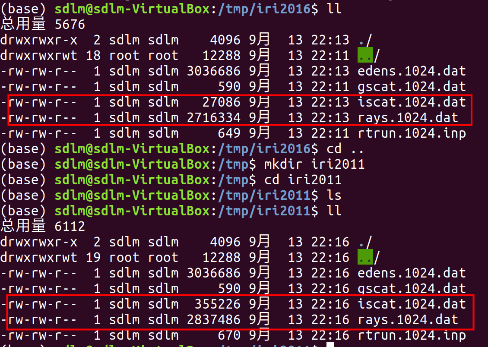

## 2022.09.13

​	测试IRI2016模型+github中的raytrace_mpi.f90文件，生成的数据文件如下，和不替换的raytrace_mpi.f90的生成的文件大小一样。之后主要需要分析一下github中的读取文件的代码和davitpy的区别。

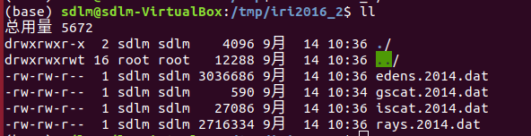

## 2022.09.17

### 绘制代码分析	

对于iri2012模型生成的数据文件及读取代码的分析

- ray..dat 为射线的网格数据，对于iri2012模型，在davitpy中的数据读取代码中，该字典的结构为`paths[rtime][raz][rel][]`（其中 raz 应该代表 beam），最后一项包括`nrstep,r,th,gran,nr`。对应读取数据函数为 `readRay()`，图像绘制函数为 `rays.plot()`，单独绘制的图像如下所示。

  在`rays.plot()`函数中好像只使用了`th,r`的数据进行绘制，`aax.plot(rays['th'], rays['r']*1e-3, c=raycolor, zorder=zorder, alpha=alpha)`

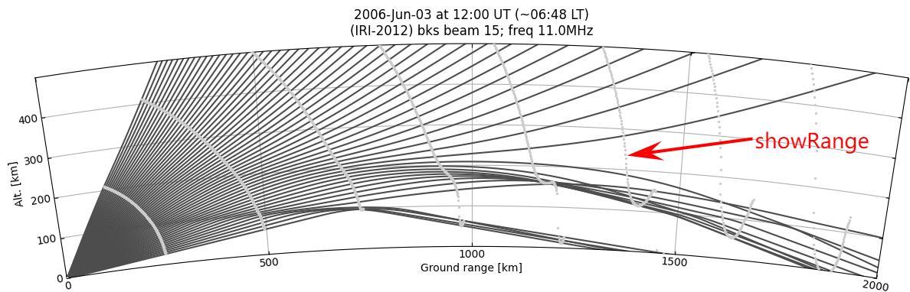

- edens..dat 为背景颜色数据，对于iri2012模型，在davitpy中的数据读取代码中，该字典的结构为`edens[rtime][raz][]`，最后一项包括`th,nel,dip`。对应读取数据函数为 `readEdens()`，图像绘制函数为 `ionos.plot()`，单独绘制的图像如下所示。

  在`ionos.plot()`函数中好像只使用了`th,nel`的数据进行绘制。

  ```python
  X, Y = np.meshgrid(self.edens[time][beam]['th'], ax.Re + np.linspace(60,560,250))
  im = aax.pcolormesh(X, Y, np.log10( self.edens[time][beam]['nel'] ), 
              vmin=nel_lim[0], vmax=nel_lim[1], cmap=nel_cmap,rasterized=nel_rasterize)
  ```

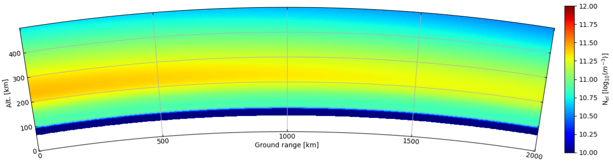

- iscat..dat 为射线追踪黑线数据，对于iri2012模型，在davitpy中的数据读取代码中，该字典的结构为`isc[rtime][raz][rel][]`，最后一项包括`nstp,r,th,gran,rel,w,nr,lat,lon,h`

- gscat..dat 为射线追踪黑线数据，对于iri2012模型，在davitpy中的数据读取代码中，该字典的结构为`gsc[rtime][raz][rel][]`，最后一项包括`r,th,gran,lat,lon`。与 iscat..dat 一起使用，对应读取数据函数为 `readScatter()`，图像绘制函数为 `scatter.plot()`，单独绘制的图像如下所示。

  对于 gscat..dat 似乎只使用到了`r,th`，而且`r`没有参与到实际的绘制中。

  ```python
  if len(rays['r']) == 0: continue
      _ = aax.scatter(rays['th'], ax.Re*np.ones(rays['th'].shape), 
                      color='0', zorder=zorder)
  ```

  对于 iscat..dat 使用了`w,nstp,th,r,h,rel`，而图像绘制值使用了`th,r,h,rel`

  ```python
  if weighted:
      wmin = np.min( [ r['w'].min() for r in self.isc[time][beam].values() if r['nstp'] > 0] )
      wmax = np.max( [ r['w'].max() for r in self.isc[time][beam].values() if r['nstp'] > 0] )
  
      for ir, (el, rays) in enumerate( sorted(self.isc[time][beam].items()) ):
          if rays['nstp'] == 0: continue
              t = rays['th']
              r = rays['r']*1e-3
              spts = np.array([t, r]).T.reshape(-1, 1, 2)
              h = rays['h']*1e-3
              rel = np.radians( rays['rel'] )
              r = np.sqrt( r**2 + h**2 + 2*r*h*np.sin( rel ) )
              t = t + np.arcsin( h/r * np.cos( rel ) )
              epts = np.array([t, r]).T.reshape(-1, 1, 2)
              segments = np.concatenate([spts, epts], axis=1)
              lcol = LineCollection( segments, zorder=zorder )
              if weighted:
                  _ = lcol.set_cmap( cmap )
                  _ = lcol.set_norm( plt.Normalize(0, 1) )
                  _ = lcol.set_array( ( rays['w'] - wmin ) / wmax )
                  else:
                      _ = lcol.set_color('0')
                      _ = aax.add_collection( lcol )
  ```

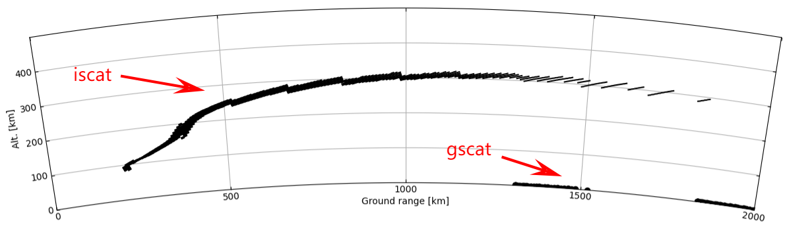


### 具体数据分析

​	目前查看ray..dat绘制图像相关的数据，自己制作的iri2016的生产的数据明显和原始davitpy中生成的数据不一致。第一个我做的，第二个图为davitpy

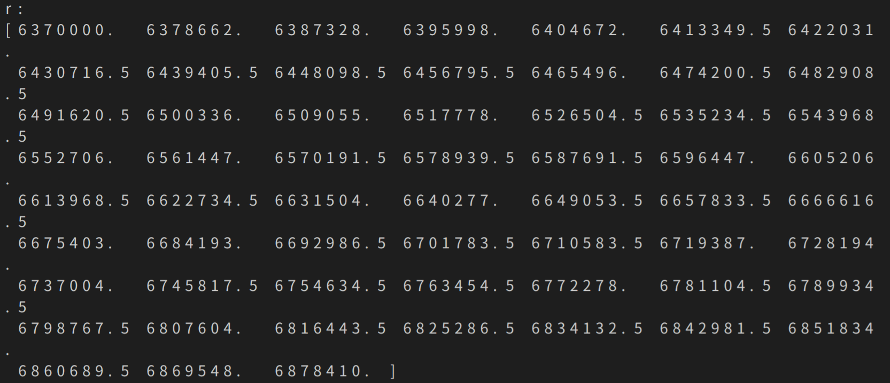

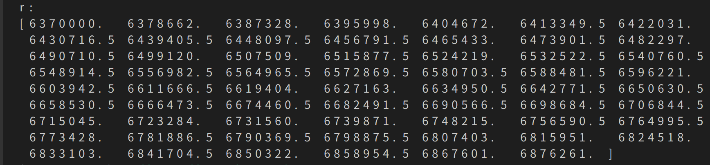

​	然后对于edens..dat，我自己生成的数据有全是-1的，所以基本断定是ForTran代码生成的数据问题了。


### 测试superdarn的fort文件夹

​	首先东西在 fort -> rtmpi 文件夹中，makefile文件最好修改一下make clean，然后直接make好像会报错，如下所示。目前感觉是 fort -> iri2016 中的igrf.o没有删除和重新生成吧，还是Makefile的问题，需要修改。

​	目前的解决方案为在 iri2016 中首先把 makefile 中的缩进修改一下，然后 make clean，再 make。然后在 rtmpi 中在 Makefile 中clean指令中新增两条

```makefile
find . -name "*~" -o -name "*.o" -o -name "*.mod" | xargs rm -f $(EXEC)
rm -f $(EXEC) $(IRIOBJS)
```

​	然后在 rtmpi 中 make clean，再 make，就会正常生成可执行文件

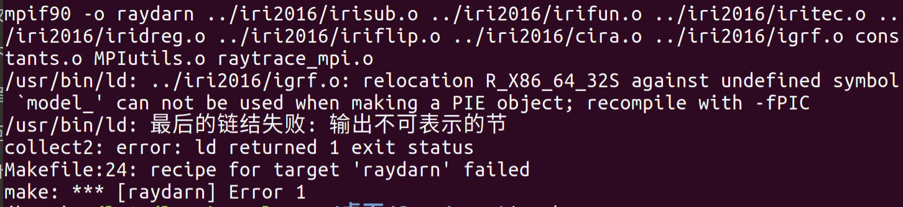

​	目前是这样，明天再设置打印信息试试


## 2022.09.18

### 测试fort

​	位于air14虚拟机中的`/home/sdlm/project/model_test/models_fort/`路径中。

​	目前定位到 raytrace_mpi.f90 中的 IRI_SUB 函数调用失败。而且目前只保留了 IRI2016 和 rtmpi 的文件夹。

​	目前发现具体的调用关系如下：

```C
raytrace_mpi.f90:IRI_ARR() -> irisub.for:IRI_SUB() -> igrf.for:FELDCOF() -> igrf.for:GETSHC()	
```

​	然后在 igrf.for:FELDCOF() 会因为找不到 dgrf..dat 文件而直接 STOP 掉，没有任何报错信息。

​	**解决方法**：把 IRI2016 的全部数据文件放入 rtmpi 文件夹中，好像就可以运行了

​	目前测试生成2006年6月3日12点的射线追踪，下面分别为davitpy和fort的结果。

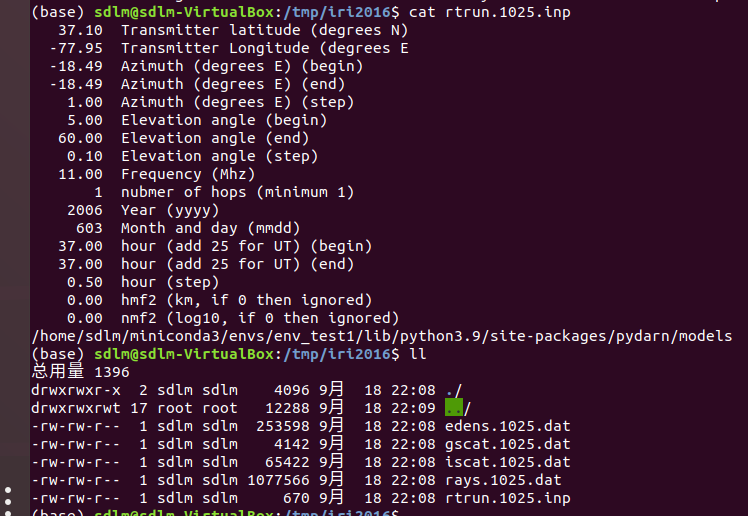

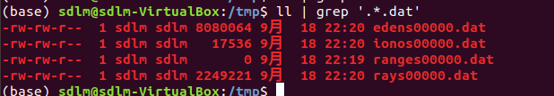

​	目前好像是其他的文件没有生成，而且fort一直运行不会终止。比如 gscat..dat 和 iscat..dat 。明天再来具体看看


## 2022.09.20

### 测试fort

​	上次不能运行的fort中的程序，现在突然又可以运行了，如下所示。

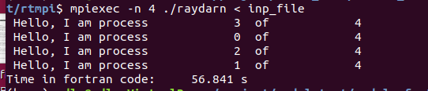

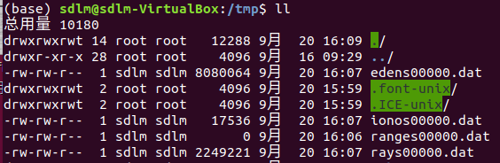

## 2022.09.22

### python绘图部分开发

​	新生成的文件在数据读取和解析上存在一定问题，首先在`_readHeader`上的数据读取存在问题。可能是因为fort生成的格式与之前的有所区别。

​	目前打算采用read函数按二进制格式读取davitpy和fort生成的数据文件，对比里面的数据格式和内容的区别。


## 2022.09.23

​	目前发现fort生成的rays..dat数据需要按如下方式读取。

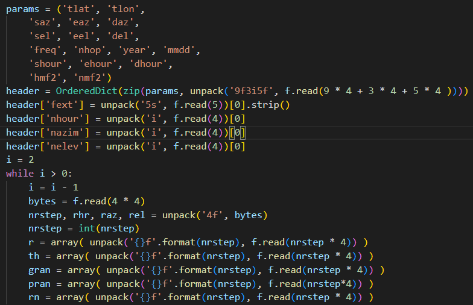

​	在header的顺序和类型略有区别，本质上是raytrace_mpi.f90中param结构体的内容设计不一样，以及在读写顺序不一样。然后后面实际的数据可能就是在iri2016的模型生成的数据不一样，会比davitpy多一组数据，就是在原来的代码中注释掉的pran。

​	但是目前fort生成的数据内容和davitpy中的还是对不上，需要进一步定位。

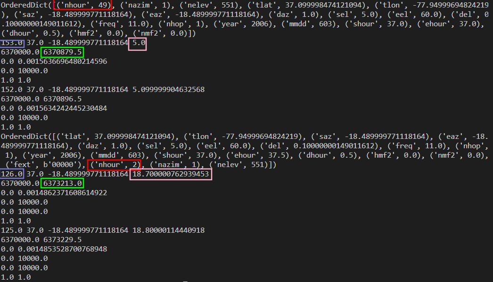

​	目前测试**fort需要并行数为 2 才能得出与davitpy一样的结果**，但是好像步长会不太一样。

​	不对，最后发现还是不太一样，在readray中的循环读取中总体循环了552次，不是很明白这个意思。

## 2022.09.26

​	正常就是552次，对应该时间点就是用552条数据，然后实际绘制过程中有一个step的参数，demo中step都是10，所以最后绘制出来就是56条线。

​	目前就是感觉 fort 生成的数据有问题。有可能还是因为引用的数据文件的路径不对，但是也不会产生报错的那种。

​	明天再测试一下 github 中的案例。

## 2022.09.27

​	尝试了一下github中的，数据生成根据没有什么问题，能按照davitpy的代码直接出图，但是目前比较的新的年份的绘制结果还存疑，明天仔细试试，然后具体运行的话还需要解决一下数据文件路径的问题，明天看看。

## 2022.09.28

​	今天尝试修改 github 的那个版本，解决模型中路径的问题。修改 /home/sdlm/project/ray_test_git/my_radar_plot 路径下的代码。

​	没有去修改代码，而是直接使用 `os.chdir(PAHT_RTFORT)` 将shell路径跳转到模型和数据文件所在的文件夹，然后再运行 mpiexec 指令，就解决了。

​	目前测试2017.09.03的可以绘制，2018年的也可以，但是到了2019就不太行了，然后就是 iscat..dat 和 gscat..dat 的数据有问题。

## 2022.09.29

- 首先重新在github上下载模型进行尝试。

  测试后还是生成的 iscat..dat 和 gscat..dat 的数据格式有问题。

- 目前发现github中的和davitpy的生成的gscat..dat格式不一样，所以davitpy中读取数据的方式需要修改成github中读取数据的代码。修改后gscat..dat可以正常用于绘图。

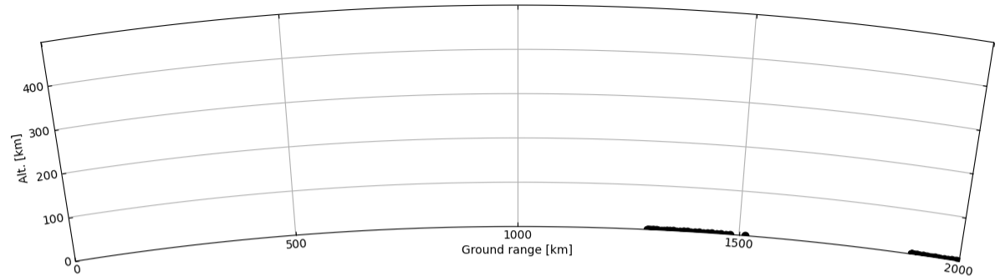

- iscat..dat数据文件感觉就是生成的又问题呀，每组数据的步长一直为0，很奇怪。
- 目前将github中的raytrace_mpi.f90改为davitpy后，生成的iscat..dat，还是不太对，每一组的数据的步长也不太一样，具体内容还没有去比对

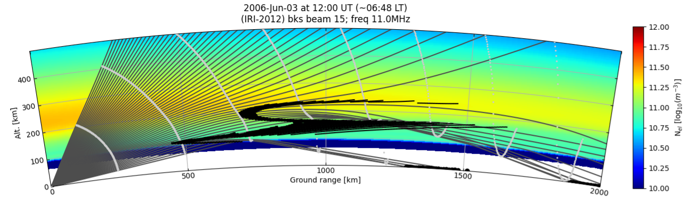


## 2022.10.03

- 开始对比iscat..dat的数据，目前发现rel的数据好像不太对。第一个是改进后的github版本，第二个是davitpy版本

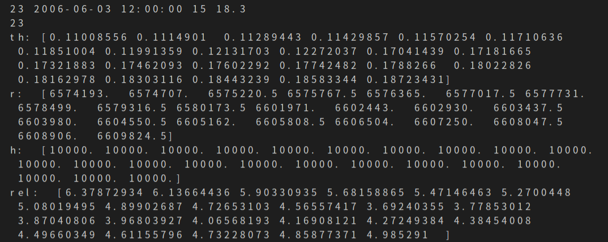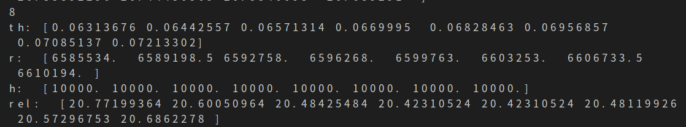

## 2022.10.04

- 目前打印了github生成的iscat..dat中所有数据，没有与davitpy中rel值相类似的范围的值。说明生成iscat..dat的代码有问题，可能还是raytrace_mpi.f90的问题，不能直接使用davitpy的，还是需要修改一下，但是github中的输出的iscat..dat又是乱数据。目前觉得需要分析模型中的iscat..dat生成的代码，才能进一步定位问题，太难了，，，，
- 原来github上模型可以使用，是我自己rt.py中关于iscat..dat和gscat..dat的问题读取有问题，按照github中rt.py进行替换即可。以下是目前绘制的2017年的图像。然后2018年6月3号之前的都可以（它不一定是分界点），之后的就不太行了。

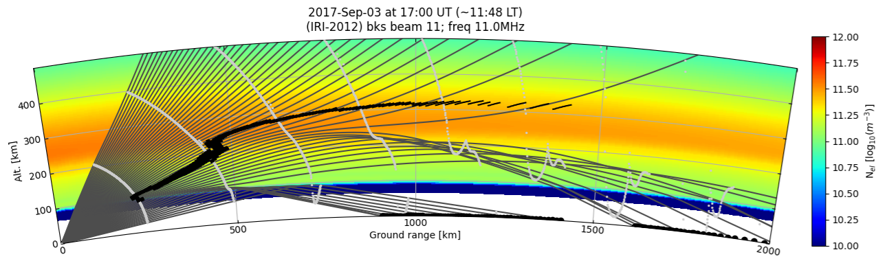

- 尝试将github中的模型的数据文件和fortran代码替换为fort的试试。

  失败，单纯替换没有作用，最后绘制的图像为空图

- 累了，，，不知道应该怎么尝试了，，

- 

### 2022.10.25

​	最近尝试画图，发现好像cartopy的库用不了了，好像是geos的库需要升级为3.7的版本了。

​	https://libgeos.org/usage/download/这个网站可以下载3.7以上的，然后按里面的安装就行。

​	然后使用`sudo conda install -c conda-forge cartopy=0.20`好像就可以安装了

​	然后注意一下`export CDF_LIB=/app/source/cdf38_1-dist/lib`这个好像有用。

- requests bs4 不知道为什么也少了？


### 2022.12.19

​	目前numpy的版本为1.23，matplotlib版本为3.3.5


