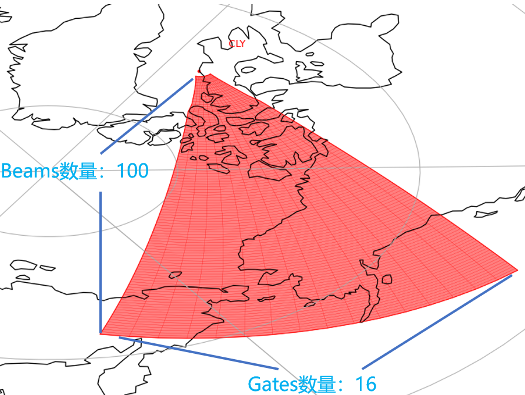
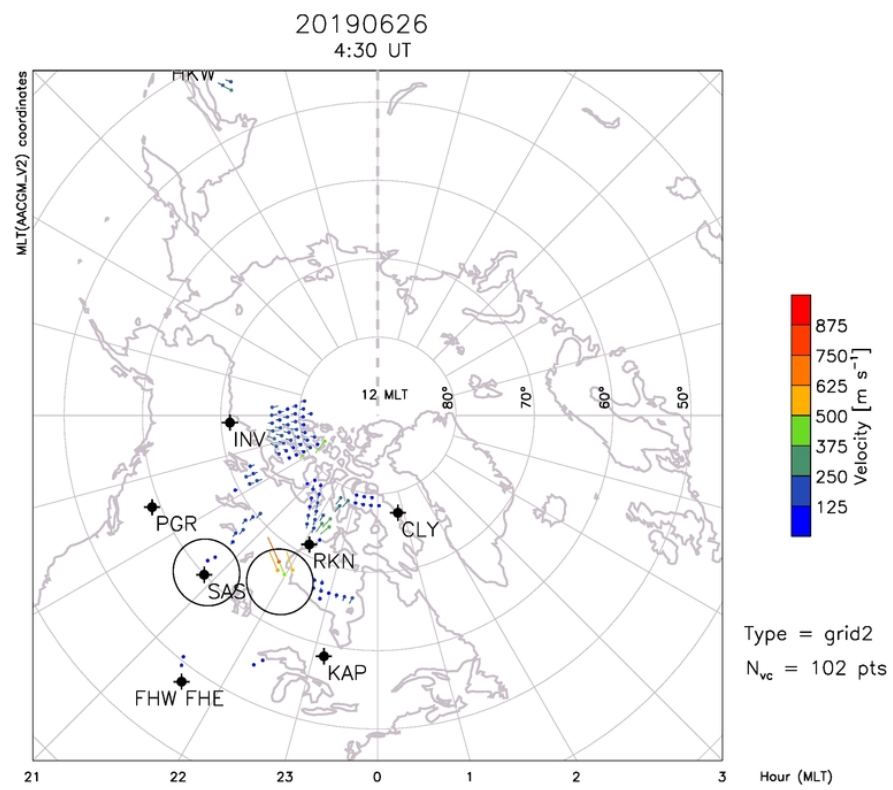
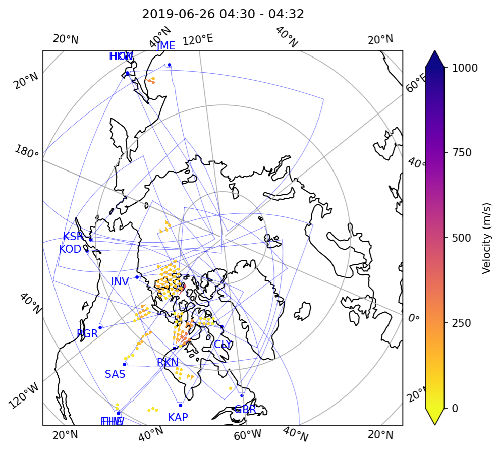
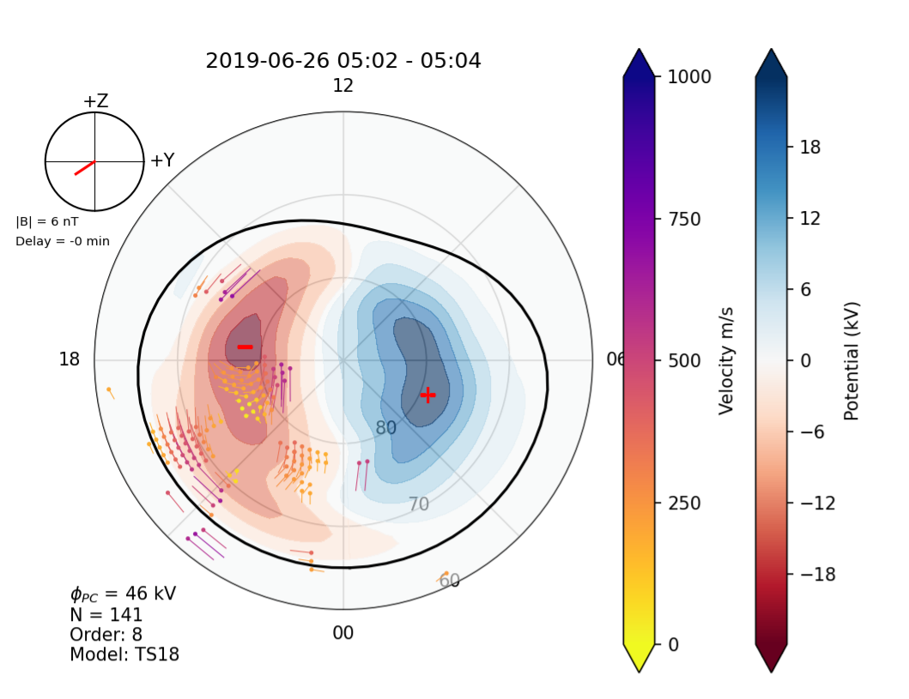
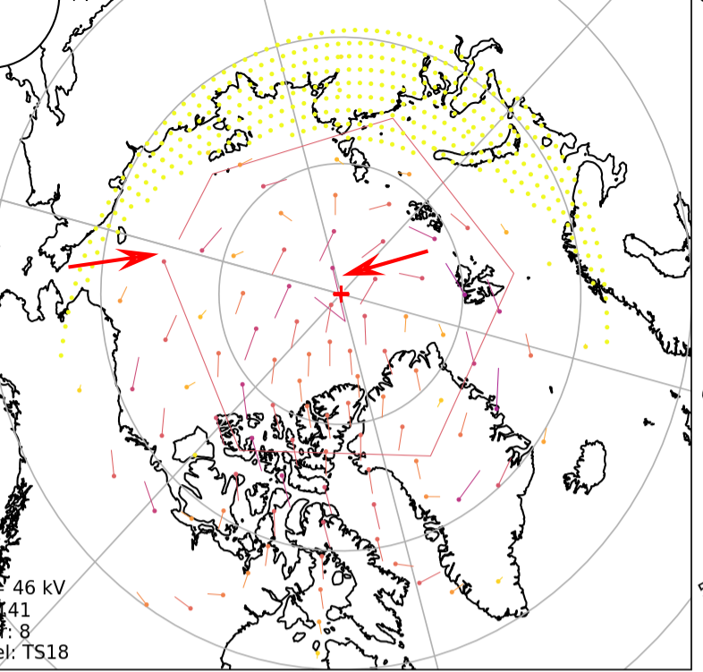
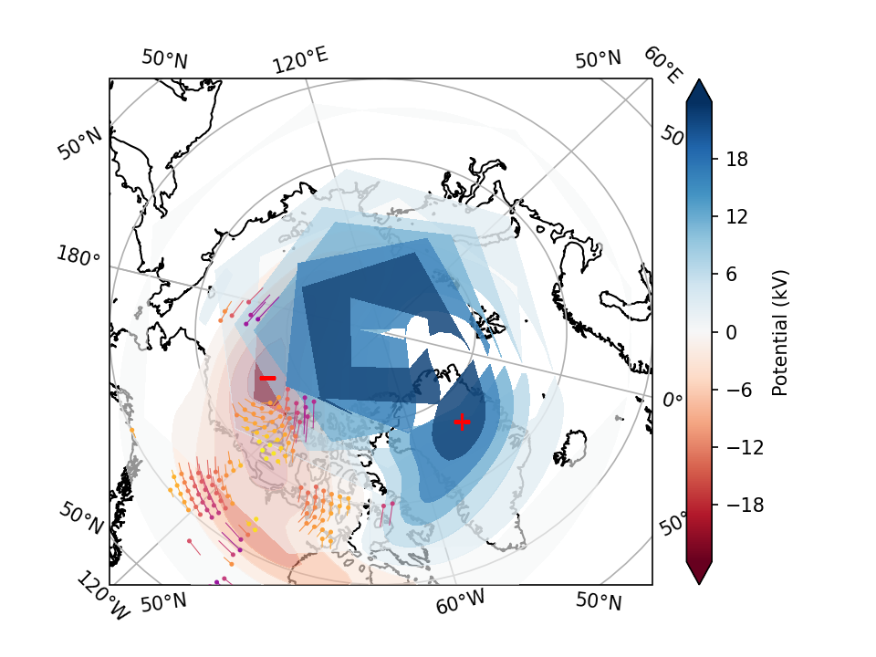

[TOC]


# 开发记录

## 功能对应

### 1. 地磁及空间软件

#### 1.1 地磁指数 ×

​	这个功能在pydarn中没有具体的函数对应，但是它本身就是普通的数据绘图，只要能正常读取数据就行了。


#### 2.1 太阳风数据 ×

​	这个功能在pydarn中没有具体的函数对应，但是它本身就是普通的数据绘图，只要能正常读取数据就行了。

### 2. 物理模型

#### 2.1 AACGM坐标转换 ×

​	这个功能在pydarn中没有具体的函数对应，但是单纯的坐标转换应该使用AACGM-v2的库就能够实现。


#### 2.2 射线追踪 ××

​	这个功能在pydarn中没有具体的函数对应，而且没有在他们的开发日志中看到相关的描述，具体可能需要自己看老版代码实现了。

 


### 3. 雷达数据可视化软件

#### 3.1 雷达信息提取 √√

​	pydarn3.0的对应函数为`pydarn.read_hdw_file('sas')`。

```python
hdw_data = pydarn.read_hdw_file('sas')
print("雷达ID:", hdw_data.stid, "\n雷达坐标:", hdw_data.geographic, "\n波位数:", hdw_data.beams, "\n距离门数:", hdw_data.gates)

```

​	目前还不知道雷达法向和主阵子阵距离是对应那个参数

#### 3.2 雷达视场可视化 √√

​	pydarn3.0的对应函数为`pydarn.Fan.plot_fov()`。

```python
_, _, ax, ccrs = pydarn.Fan.plot_fov(stid=66,
                                     date=dt.datetime(2022, 1, 8, 14, 5),
                                     fov_color='red',
                                     alpha=0.5,
                                     line_color='blue',
                                     line_alpha=1,
                                     grid=True,
                                     radar_label=True,
                                     radar_location=True,
                                     # coords=pydarn.Coords.GEOGRAPHIC,
                                     projs=pydarn.Projs.GEO)
ax.coastlines()
plt.show()
```

​	现有函数无法实现设置线型和线宽，同时也不支持AACGM坐标转换


#### 3.3 距离-时间-参数强度可视化 √√

​	pydarn3.0的对应函数为`pydarn.RTP.plot_summary()`。

```python
fitacf_file = '../HF radar data/20190626.0200.00.jme.fitacf'
fitacf_data = pydarn.SuperDARNRead(fitacf_file).read_fitacf()
pydarn.RTP.plot_summary(fitacf_data, beam_num=2)
plt.show()
```

​	感觉这个函数很完善了，还多了一个角度参数，具体以后再微调


#### 3.4 扇形图 √√

​	pydarn3.0的对应函数为`pydarn.Fan.plot_fan()`。

```python
fitacf_file = '../HF radar data/20190626.0200.00.jme.fitacf'
fitacf_data = pydarn.SuperDARNRead(fitacf_file).read_fitacf()
ax, _, _, _, _ = pydarn.Fan.plot_fan(fitacf_data,
                                     scan_index=5,
                                     parameter='w_l',
                                     radar_label=True,
                                     groundscatter=True,
                                     coords=pydarn.Coords.GEOGRAPHIC,
                                     projs=pydarn.Projs.GEO,
                                     colorbar_label="Velocity m/s")
ax.coastlines()
plt.show()
```

​	感觉这个函数很完善了，线型和线宽还是没有，可能需要自己添加绘制副图的功能


#### 3.5 北方中纬分系统六部雷达观测的不规则体速度图 √

​	pydarn3.0的对应函数为`pydarn.Grid.plot_grid()`。

```python
file = "../HF radar data/20190626.north.grid2"
SDarn_read = pydarn.SuperDARNRead(file)
grid_data = SDarn_read.read_grid()
stime = dt.datetime(2019, 6, 26, 4, 30)
gridplot = pydarn.Grid.plot_grid(grid_data, start_time=stime,
                                 colorbar_label='Velocity (m/s)',
                                 radar_label=True, line_color='blue',
                                 fov_color='grey')
plt.show()
```

​	这个函数目前还不知地图的叠加，除此之外还存在很多未完善的小问题。


#### 3.6 北半球所有雷达观测到的不规则体速度图 √

​	与3.5类似。

#### 3.7 北半球电离层对流图 √

​	pydarn3.0的对应函数为`pydarn.Maps.plot_mapdata()`。

```python
map_file = "../HF radar data/20190626.north.map2"
map_data = pydarn.SuperDARNRead().read_dmap(map_file)

pydarn.Maps.plot_mapdata(map_data, record=150,
                         parameter=pydarn.MapParams.FITTED_VELOCITY,
                         lowlat=60, colorbar_label='Velocity m/s',
                         contour_fill=True,
                         contour_fill_cmap='RdBu',
                         contour_colorbar=True,
                         contour_colorbar_label='Potential (kV)',
                         pot_minmax_color='r',
                         map_info=True, imf_dial=True, hmb=True)
plt.show()
```

​	这个函数目前还不知地图的叠加，除此之外还存在很多未完善的小问题。


### 4. 通用软件

#### 4.1 L1级数据读取 √√√

​	pydarn3.0的对应函数为`pydarn.SuperDARNRead(file).read_rawacf()`。

​	满足要求

#### 4.2 L2级数据读取 √√√

​	pydarn3.0的对应函数为`pydarn.SuperDARNRead(file).read_fitacf()`。

​	满足要求

#### 4.3 L3级GRD数据读取 √√√

​	pydarn3.0的对应函数为`pydarn.SuperDARNRead(file).read_grid()`。

​	满足要求

#### 4.4 L3级MAP数据读取 √√√

​	pydarn3.0的对应函数为`pydarn.SuperDARNRead(file).read_dmap()`。

​	满足要求

#### 4.5 时间转换


#### 4.6 虚高模型


#### 4.7 坐标转换


#### 4.8 太阳相关计算


#### 4.9 地球计算相关


## 代码架构

​	gme，plotting，model，utils


## 代码说明

### 绘制雷达视场图相关	

关于雷达视场图的门数gate和波位数beams的说明：



​	则需要绘制出这个图线，需要绘制101x17条线。

### 绘制扇形图相关

1. 参数中的'gflg'是什么东西？
2. 它的整体绘图逻辑，是直接根据雷达的视场图，使用对应的坐标转换函数转换得到整个视场图的每个点的坐标（地理坐标、磁地方时或者极坐标），如gates=16，Beams=100，则就是17 * 101个点的二维坐标，然后从fitacf文件中获取的参数数据也是对应16 * 100个点的数据，刚好对应视场图的每个点。然后使用`ax.pcolormesh()`函数可以直接进行绘制。所以它里面没有存每个色块的坐标值，而是直接使用视场图得到的。


### 绘制速度图相关

​	目前的一些问题：

- [x] 参数中的thetas和rs似乎是极坐标的表示方法。
- [x] 下图为JME的正确的速度图。



- [x] 目前感觉grid中的速度点的坐标数据为磁纬度经度。需要转化一下

- [ ] 目前关于一些雷达视场图的叠加还需要优化一些细节，同时地图叠加内部处理逻辑需要优化；同时还没有实现速度合成，目前评估感觉不太难，需要对grid数据进行具体的分析。
- [ ] 目前地图叠加功能不兼容MLT和AACGM的转换。

​	

​	开发进度：

1. 2022/06/14完成的地图叠加的速度图像。




## 绘制对流图相关

​	pydran3.0的绘图结果：



​	开发问题：

- [ ] 东经为正，西经为负，在绘制速度线的时候，在东西经180°交接处，会出现BUG。增加判断对180°左右的西经加360°进行处理



- [ ] 在绘制对流等高线的时候出现了类似的问题



## 雷达数据说明

1. 目前感觉雷达数据文件中的坐标是地理坐标，对于其他坐标系需要自己转换一下。

```python
lat = SuperDARNRadars.radars[stid].hardware_info.geographic.lat
lon = SuperDARNRadars.radars[stid].hardware_info.geographic.lon

# Convert to geomag coords
if coords == Coords.AACGM_MLT or coords == Coords.AACGM:
    geomag_radar = aacgmv2.get_aacgm_coord(lat, lon, 250, date)
    lat = geomag_radar[0]
    lon = geomag_radar[1]
    if coords == Coords.AACGM_MLT:
        mltshift = geomag_radar[1] -\
        (aacgmv2.convert_mlt(geomag_radar[1], date) * 15)
        lon = geomag_radar[1] - mltshift
        if projs == Projs.POLAR:
            lon = np.radians(lon)
```

2. 


## 问题总结

### 1. 地图坐标转换问题

​	目前pydarn3.0的版本不支持地图的坐标转换，无论是MLT还是AACGM都不支持。

### 2. 修改的源代码文件

- projections.py
- maps.py
- grid.py
- fan.py : 增加地图叠加功能


# 常用代码

## python库相关

1. `pip list`：python安转库的列表
2. `pip install [package]`：安装软件包
3. `pip uninstall [package]`：卸载软件包
4. `pip install --upgrade [package]`：升级某个软件包
5. `conda env list`：查看Python的虚拟环境
6. `conda create -n [env_name] python=[version]`：创建python的虚拟环境
7. `conda activate [env_name]`：激活虚拟环境
8. `conda install [package]`：使用conda安装库
9. `conda update [package]`：更新库


## Pydarn相关

1. `conda install -c conda-forge cartopy=0.19`：cartopy的安装
2. `convert_latlon()`：在地磁坐标和AACGM坐标之间转换
3. 


## python编程相关

1. `name.shape`：输出变量的维度

