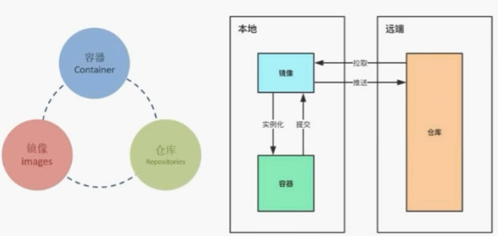

# Docker


### Docker安装

```shell
yum install -y yum-utils
# 替换下载docker安装包的源
sudo yum-contig-manager --add-repo https://download.docker.com/linux/centos/docker-ce.repo
sudo yum-contig-manager --add-repo http://mirrors.aliyun.com/docker-ce/linux/centos/docker-ce.repo
sudo yum install -y docker-ce docker-ce-cli containerd.io 

# 查看docker信息
docker info

# 替换docker的镜像
mkdir -p /etc/docker
vi /etc/docker/daemon.json
{
	"registry-mirrors":["https://02xz0m84.mirror.aliyuncs.com"]
}
systemctl daemon-reload		# 重新加载镜像
systemctl restart docker	# 重新启动docker


```


### Docker镜像、容器与仓库




```shell
# 拉取镜像
docker pull [镜像名]

# 显示镜像
docker images

# 强制删除镜像
docker rmi -f [镜像ID]
docker rmi [repository]:[tag]

```

​	在[dockerhub](hub.docker.com)中注册账号，然后可以把自己制作的镜像上传

```shell
# 给docker打标签，感觉这个类似于版本号
docker tag [ID] [标签]

# 登录一下dockerhub
docker login
# 登录成功后，会将用户信息保存在 .docker/config.json 中
cat .docker/config.json

# 推送镜像到自己的仓库
docker push [repository]:[tag]

# 拉取仓库
docker pull [repository]:[tag]

```

​	容器相关

```shell
# 显示容器
docker ps		# 运行的
docker ps -a	# 所有的

# 启动容器
docker run [options] [镜像ID:需要运行的镜像] [command:启动容器时运行的命令]
# options为 -it 启动一个交互式容器, --rm 退出后删除容器，--name [容器名字] 自己为容器起一个名字，-d 在后台运行容器

# 退出容器并停止
exit
# 退出不停止
ctrl+p+q

# 进入容器
docker exec [options] [镜像ID:需要运行的镜像] [command:启动容器时运行的命令]	# options和docker run一样
docker attach
# docker exec:进入容器开启一个新的终端（常用）执行exit退出的时候不会停止容器
# docker attach:进入容器正在执行的终端exit退出会停止容器

# 删除容器
docker rm [容器ID]

#从容器内 拷出
docker cp 容器ID/名称: 容器内路径  容器外路径

#从外部 拷贝文件到容器内
docker cp 容器外路径 容器ID/名称: 容器内路径

# 提交容器到镜像中
sudo docker commit 容器ID 镜像名称:版本号

# 将镜像保存成tar文件
sudo docker save 镜像名称:版本号 > ~/project/radar_plot.tar


```


