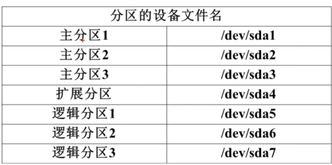
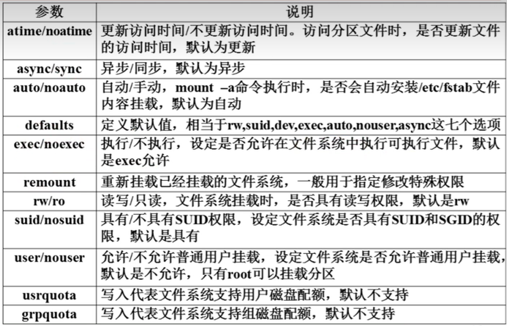
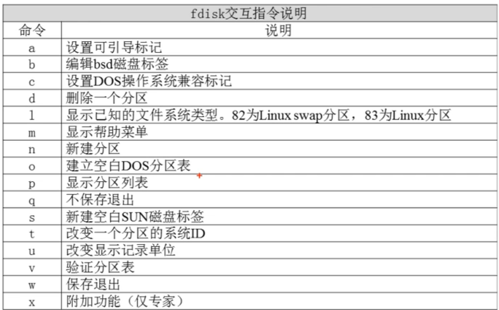
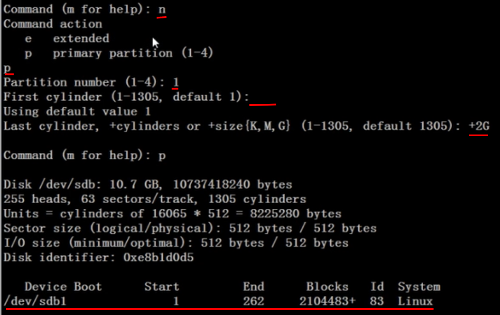

# linuxNote

[TOC]

## 文件系统管理

### 文件系统简介

​		一个硬盘的主分区总共最多只能分四个。扩展分区只能有一个，也算是主分区的一种；其不能存储数据和格式化，必须再划分为逻辑分区才能使用。




​		==ext、ext2、ext3、ext4和xfs的特点==

### 常用命令


```shell
# 文件系统占用大小查看命令
# 包括文件大小和被系统占用的空间
# 常用: df -h
df [选项] [挂载点]

# 用于显示目录或文件占用的磁盘空间
# 只包含文件大小
du -sh [目录路径]	# 查看该目录下所有文件大小总和
du -h --max-depth=1 | sort -hr	# 查看目录的一级子目录的大小，并降序排序

# 文件系统修复命令
fsck [选项] 分区设备文件名

# 显示磁盘状态命令
dumpe2fs 分区设备文件名
```

​		

### 文件系统挂载

```shell
# 文件系统的挂载
mount		# 查询系统中已经挂载的设备
mount -a	# 依据配置文件/etc/fstab的内容进行挂载
mount [-t 文件系统] [-L 卷标名] [-o 特殊选项] 设备文件名 挂载点	# 挂载设备，可以直接 mount 设备文件名 挂载点

# 假设要将光盘/dev/sr0挂载到/mnt/sr文件夹上（可以是任意文件夹）
mount /dev/sr0 /mnt/sr
# 卸载，以下两个指令都可以
umount /dev/sr0
umount /mnt/sr

```

​		mount的特殊选项



### 文件系统分区

#### MBR

​		MBR分区表最大仅支持2TB。

```shell
fdisk -l		# 查看所有能被识别到的存储设备，并显示分区信息
# 假设新加入的硬盘的系统分配的设备名为/dev/sdb，对其进行分区
fdisk /dev/sdb	# 然后就进入分区的交互引导过程
```



按如下划分第一个分区，名为/dev/sdb1，从磁盘起始位置2GB大小：



​		同理还可以继续划分主分区和扩展分区，然后在扩展分区中划分逻辑分区。划分好后输入w保存退出。

```shell
# 重新读取分区表
partprobe
# 格式化分区
mkfs -t ext4 /dev/sdb1
# 挂载分区
mount /dev/sdb1 /disk1
```


#### GPT

​		GPT支持最大18EB（1EB=100万TB）的分区

```shell
# 设置为gpt
sudo parted /dev/sdb1 mklabel gpt
# 0~100%都分配给dev/sdb1
sudo parted -a optimal /dev/sdb1 mkpart primary 0% 100%

# 重新读取分区表
partprobe
# 格式化分区
mkfs -t ext4 /dev/sdb1
# 挂载分区
mount /dev/sdb1 /disk1
```


### 文件系统的自动挂载

​		在/etc/fstab中内容如下所示：

```shell
# <file system>							<mount point>   <type>  	<options>       <dump>  <pass>
UUID=d5abbd65-9681-490f-ab70-bf3844091a33 /               ext4    errors=remount-ro 0       1
/dev/sdb1                                 /home/sdlm/data ext4    defaults         0       0

```

- 第一字段：分区设备文件名或者UUID（dumpe2fs可以查看）

- 第二字段：挂载点
- 第三字段：文件系统格式
- 第四字段：挂载参数，可以默认使用 defaults，该参数详见mount的特殊选项表格
- 第五字段：指定分区是否被dump备份，0代表不备份，1代表每天备份，2 代表不定期备份
- 第六字段：指定分区是否被fsck检测，0代表不检测，其他数组代表优先级，越小越高。一般设置为0，系统分区设置1

​		一般在修改后，直接调用`mount  -a`查看是否修改正确。


## 进程间通信

### 管道

​		Linux中的管道主要分为两种类型：匿名管道（Pipe）和命名管道（Named Pipe，也叫FIFO）。

1. **匿名管道**：

   - 适用于父子进程间的通信。

   - 只能单向传输数据。

   - 创建匿名管道（pipe()函数）时，会返回两个文件描述符，一个用于读，一个用于写。

     ```c++
     #include <unistd.h>
     int pipefd[2];
     // 创建匿名管道
     // pipefd[0] 是管道的读端，pipefd[1] 是写端
     pipe(pipefd)
     ```

   - 匿名管道不需要将数据拷贝到磁盘中，属于内存级文件，没有路径、文件名和inode，因此而得名。

2. **命名管道**：

   - 可用于任意两个进程间的通信，不仅限于父子进程。

   - 有一个名字，可以在不同的进程之间进行通信。

     ```c++
     #include <sys/types.h>
     #include <sys/stat.h>
     
     int status = mkfifo("/tmp/myfifo", 0666); // 创建有名管道
     ```

   - 适用于长时间运行的进程。

​		详细可以看[深入理解Linux管道](https://blog.csdn.net/m0_74091159/article/details/142268154)。


### 共享内存

#### mmap

​		内存映射是一种将磁盘文件的内容映射到进程的虚拟内存空间中的技术。这意味着文件的内容被映射到进程的地址空间中，使得**进程可以直接通过访问内存的方式来读取或写入文件的内容**，而**无需调用传统的read和write系统调用**。这种方式能够提高对文件的访问效率，并且简化了对文件的操作。

​		内存映射的主要特点包括：

- 性能优势：由于文件内容直接映射到了内存中，因此读取文件的操作可以直接通过内存访问完成，避免了频繁的磁盘IO操作，从而提高了读取文件的速度。

- 简化操作：通过内存映射，文件被映射到了进程的地址空间中，进程可以像操作内存一样对文件进行读写，这样就简化了对文件的操作流程。

- 共享内存：多个进程可以共享同一个文件的内存映射，这样可以实现进程间的数据共享，而无需进行显式的数据传输。
- 同步问题：虽然`mmap`提供了高效的进程间通信方式，但它也带来了同步问题。多个进程同时访问同一个共享内存区域可能会导致数据竞争和不一致。因此，在使用`mmap`进行进程间通信时，必须采取适当的同步机制（如信号量、互斥锁等）来确保数据的一致性和完整性。


```c++
// 功能：创建共享内存映射
// 函数返回值：成功返回创建的映射区首地址，失败返回MAP_FAILED（ ((void *) -1) ），设置errno值。
void *mmap(void *addr, size_t length, int prot, int flags, int fd, off_t offset);                


addr：指定要映射的内存地址，一般设置为 NULL 让操作系统自动选择合适的内存地址。
 
length：必须>0。映射地址空间的字节数，它从被映射文件开头 offset 个字节开始算起。
 
prot：指定共享内存的访问权限。
可取如下几个值的可选：
    PROT_READ（可读）, 
    PROT_WRITE（可写）, 
    PROT_EXEC（可执行）,
    PROT_NONE（不可访问）。
 
flags：由以下几个常值指定：
    MAP_SHARED（共享的）,
    MAP_PRIVATE（私有的）, 
    MAP_ANONYMOUS（匿名映射，用于血缘关系进程间通信）
    MAP_FIXED（表示必须使用 start 参数作为开始地址，如果失败不进行修正），
    其中，MAP_SHARED , MAP_PRIVATE必选其一，而 MAP_FIXED 则不推荐使用。
   
fd：表示要映射的文件句柄。如果匿名映射写-1。
 
offset：表示映射文件的偏移量，一般设置为 0 表示从文件头部开始映射。
```

详细可以看[Linux内存映射](https://blog.csdn.net/weixin_57604904/article/details/136554565)。

##### 进程写入和读取示例

```c++
// 写入进程
#include <stdio.h>
#include <stdlib.h>
#include <fcntl.h>
#include <sys/mman.h>
#include <sys/stat.h>
#include <unistd.h>
#include <string.h>

int main() {
    const char *shm_name = "/shm";
    size_t length = 4096; // 映射区域大小
    // 创建并初始化共享内存文件
    int shm_fd = shm_open(shm_name, O_RDWR | O_CREAT, S_IRUSR | S_IWUSR);
    if (shm_fd == -1) {
        perror("Error opening file");
        exit(EXIT_FAILURE);
    }
    if (ftruncate(shm_fd, length) == -1) {
        perror("Error setting file size");
        close(shm_fd);
        exit(EXIT_FAILURE);
    }
    // 将文件映射到内存
    void *mapped = mmap(NULL, length, PROT_READ | PROT_WRITE, MAP_SHARED, shm_fd, 0);
    if (mapped == MAP_FAILED) {
        perror("Error mmapping the file");
        close(shm_fd);
        exit(EXIT_FAILURE);
    }
    close(shm_fd);  // 已映射了文件，文件描述符不再需要
    // 向共享映射区写入数据
    const char *message = "Hello from Process ABCDEFG!";
    memcpy(mapped, message, strlen(message) + 1); // +1 是为了包含空字符
    // 等待一段时间以便进程B可以读取数据（在实际应用中，应该使用更可靠的同步机制）
    sleep(5);
    // 取消映射
    if (munmap(mapped, length) == -1) {
        perror("Error un-mmapping the file");
        exit(EXIT_FAILURE);
    }
    // 删除共享内存对象
    shm_unlink(shm_name);
    return 0;
}
```


```c++
// 读取进程
#include <stdio.h>
#include <stdlib.h>
#include <fcntl.h>
#include <sys/mman.h>
#include <sys/stat.h>
#include <unistd.h>
#include <string.h>

int main() {
    const char *shm_name = "/shm";
    size_t length = 4096; // 映射区域大小
    // 创建并初始化共享内存文件
    int shm_fd = shm_open(shm_name, O_RDWR | O_CREAT, S_IRUSR | S_IWUSR);
    if (shm_fd == -1) {
        perror("Error opening file");
        exit(EXIT_FAILURE);
    }
    // 将文件映射到内存
    void *mapped = mmap(NULL, length, PROT_READ, MAP_SHARED, shm_fd, 0);
    if (mapped == MAP_FAILED) {
        perror("Error mmapping the file");
        close(shm_fd);
        exit(EXIT_FAILURE);
    }
    close(shm_fd);  // 已映射了文件，文件描述符不再需要
    // 从共享映射区读取数据
    char buffer[256];
    memcpy(buffer, mapped, strlen((char *)mapped) + 1); // +1 是为了包含可能的空字符
    // 打印读取到的数据
    printf("Received message: %s\n", buffer);

    // 取消映射
    if (munmap(mapped, length) == -1) {
        perror("Error un-mmapping the file");
        exit(EXIT_FAILURE);
    }
    // 删除共享内存对象
    shm_unlink(shm_name);

    return 0;
}
```


##### 进程同步写入和读取示例

```c++
// 写入
#include <stdio.h>
#include <stdlib.h>
#include <fcntl.h>
#include <sys/mman.h>
#include <sys/stat.h>
#include <unistd.h>
#include <string.h>
#include <pthread.h>

#define SHM_NAME "/my_shm"
#define SHM_SIZE 1024

typedef struct {
    pthread_mutex_t mutex;
    pthread_cond_t cond;
    int ready;
    char data[SHM_SIZE - sizeof(pthread_mutex_t) - sizeof(pthread_cond_t) - sizeof(int)];
} shm_data;

int main() {

    // 创建并初始化共享内存文件
    int shm_fd = shm_open(SHM_NAME, O_RDWR | O_CREAT, S_IRUSR | S_IWUSR);
    if (shm_fd == -1) {
        perror("Error opening file");
        exit(EXIT_FAILURE);
    }
    if (ftruncate(shm_fd, SHM_SIZE) == -1) {
        perror("Error setting file size");
        close(shm_fd);
        exit(EXIT_FAILURE);
    }

    // 将文件映射到内存
    shm_data *ptr = (shm_data *)mmap(NULL, SHM_SIZE, PROT_READ | PROT_WRITE, MAP_SHARED, shm_fd, 0);
    if (ptr == MAP_FAILED) {
        perror("Error mmapping the file");
        close(shm_fd);
        exit(EXIT_FAILURE);
    }
    close(shm_fd);  // 已映射了文件，文件描述符不再需要


    // 初始化互斥锁和条件变量
    pthread_mutexattr_t mutex_attr;
    pthread_mutexattr_init(&mutex_attr);
    pthread_mutexattr_setpshared(&mutex_attr, PTHREAD_PROCESS_SHARED);
    pthread_mutex_init(&ptr->mutex, &mutex_attr);

    pthread_condattr_t cond_attr;
    pthread_condattr_init(&cond_attr);
    pthread_condattr_setpshared(&cond_attr, PTHREAD_PROCESS_SHARED);
    pthread_cond_init(&ptr->cond, &cond_attr);
    ptr->ready = 0;
    
    sleep(3);       // 这段延时用于启动读取的进程
    // 进行10次写入
    for(int i = 0; i < 10; i++) {
        pthread_mutex_lock(&ptr->mutex);
        sprintf(ptr->data, "Hello from writer! times: %d", i);
        ptr->ready = 1;
        pthread_cond_signal(&ptr->cond);
        pthread_mutex_unlock(&ptr->mutex);
        sleep(1);
    }

    // 如果度读进程还在等待信号量的话，会导致阻塞，释放信号量失败
    pthread_mutex_destroy(&ptr->mutex);
    pthread_cond_destroy(&ptr->cond);
    // 取消映射
    if (munmap(ptr, SHM_SIZE) == -1) {
        perror("Error un-mmapping the file");
        exit(EXIT_FAILURE);
    }
    // 删除共享内存对象
    shm_unlink(SHM_NAME);

    printf("writer exit!\n");

    return 0;
}
```


```c++
// 读取
#include <stdio.h>
#include <stdlib.h>
#include <fcntl.h>
#include <sys/mman.h>
#include <sys/stat.h>
#include <unistd.h>
#include <string.h>
#include <pthread.h>

#define SHM_NAME "/my_shm"
#define SHM_SIZE 1024

typedef struct {
    pthread_mutex_t mutex;
    pthread_cond_t cond;
    int ready;
    char data[SHM_SIZE - sizeof(pthread_mutex_t) - sizeof(pthread_cond_t) - sizeof(int)];
} shm_data;

int main() {

    // 创建并初始化共享内存文件
    int shm_fd = shm_open(SHM_NAME, O_RDWR | O_CREAT, S_IRUSR | S_IWUSR);
    if (shm_fd == -1) {
        perror("Error opening file");
        exit(EXIT_FAILURE);
    }
    if (ftruncate(shm_fd, SHM_SIZE) == -1) {
        perror("Error setting file size");
        close(shm_fd);
        exit(EXIT_FAILURE);
    }

    // 将文件映射到内存
    shm_data *ptr = (shm_data *)mmap(NULL, SHM_SIZE, PROT_READ | PROT_WRITE, MAP_SHARED, shm_fd, 0);
    if (ptr == MAP_FAILED) {
        perror("Error mmapping the file");
        close(shm_fd);
        exit(EXIT_FAILURE);
    }
    close(shm_fd);  // 已映射了文件，文件描述符不再需要
    int times = 0;
    // 进行10次读取
    while(times++ < 10) {
        pthread_mutex_lock(&ptr->mutex);
        while (!ptr->ready) {
            pthread_cond_wait(&ptr->cond, &ptr->mutex);
        }
        printf("Data: %s\n", ptr->data);
        ptr->ready = 0;
        pthread_mutex_unlock(&ptr->mutex);
    }


    // 取消映射
    if (munmap(ptr, SHM_SIZE) == -1) {
        perror("Error un-mmapping the file");
        exit(EXIT_FAILURE);
    }
    // 删除共享内存对象
    shm_unlink(SHM_NAME);

    printf("reader exit!\n");

    return 0;
}
```


## git常用指令


```shell
# 创建本地仓库
git init --bare <name>

# 只将追踪的文件加入暂存区
git add -u

# 从暂存区移出
git reset <file>
# 全部移出
git reset
# Git 2.23版本以上
git restore --staged <file>
git restore --staged .

# 移出暂存区并取消对文件的跟踪
git rm --cached <file>
git rm --cached -r <directory>


```

