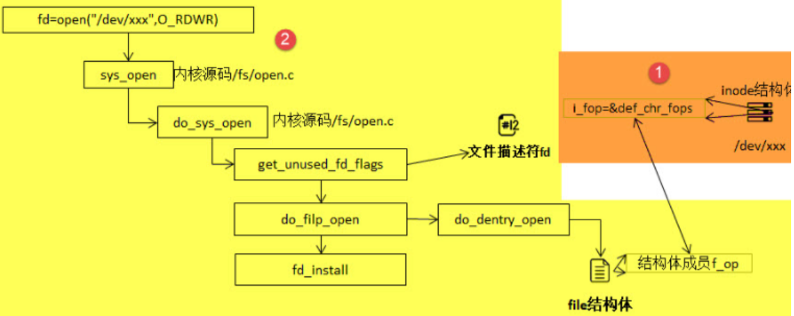
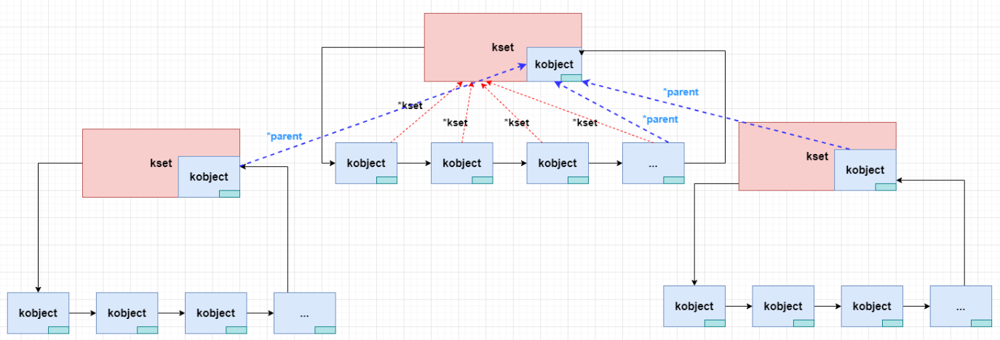
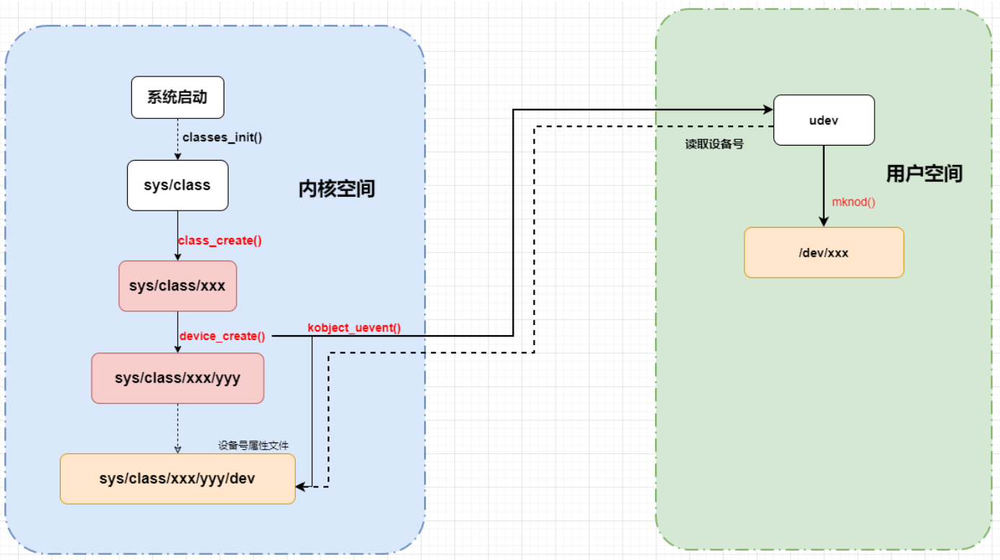

# Linux驱动开发

[toc]

## 1 内核模块的基本概念

#### 作用

解决linux内核可扩展性和可维护性相对较差的缺陷，linux是宏内核。

#### 现代内核派系

宏内核：关键功能和服务功能均在内核空间提供

 - 运行效率高
 - 扩展性较差

微内核：内核空间只提供关键功能，服务功能在用户空间提供

- 运行效率较低
- 安全性、扩展性较高


#### 内核模块加载/卸载

- 使用insmod命令加载

- 使用rmmod命令卸载

#### 内核模块入口/出口

- module_init()：加载模块式该函数自动执行，进行初始化操作
- module_exit()：卸载模块时函数自动执行，进行清理操作

#### 内核模块信息声明

- MODULE_LICENSE()：表示模块代码接受的软件许可协议，Linux内核遵循GPL V2开源协议，内核模块与linux内核保持一致即可。
- MODULE_AUTHOR()：描述模块的作者信息
- MODULE_DESCRIPTION()：对模块的简单介绍
- MODULE_ALIAS()：给模块设置一个别名


## 2 内核模块实验1

#### 实验环境

- 开发板烧录好Debian镜像
- 启动开发板，搭建好nfs客户端，挂载共享文件夹
- 获取Debian镜像的内核源码并编译

#### 编译4.19.71版本内核

内核模块的功能需要依赖内核提供的各种底层接口

1.下载linux内核源码

​	github:

```
git clone https://github.com/Embedfire/ebf-buster-linux.git
```

​	gitee:

```
git clone https://gitee.com/Embedfire/ebf-buster-linux.git
```

2.安装必要环境工具库

```
sudo apt install make gcc-arm-linux-gnueabihf gcc bison flex libssl-dev dpkg-dev lzop
```

3.一键编译内核

```
sudo ./make_deb.sh
```

4.获取编译出来的内核相关文件

```
/home/pi/build
```

#### 内核模块头文件

- #include <linux/module.h>：包含内核模块信息声明的相关函数
- #include <linux/init.h>：包含了 module_init()和 module_exit()函数的声明
- #include <linux/kernel.h>：包含内核提供的各种函数，如printk

#### 内核模块打印函数

- printf：glibc实现的打印函数，工作于用户空间

- printk：内核模块无法使用glibc库函数，内核自身实现的一个类printf函数，但是需要指定打印等级。
  - \#define KERN_EMERG 	"<0>" 通常是系统崩溃前的信息
  - #define KERN_ALERT          "<1>" 需要立即处理的消息
  - #define KERN_CRIT             "<2>" 严重情况
  - #define KERN_ERR              "<3>" 错误情况
  - #define KERN_WARNING   "<4>" 有问题的情况
  - #define KERN_NOTICE       "<5>" 注意信息
  - #define KERN_INFO            "<6>" 普通消息
  - #define KERN_DEBUG        "<7>" 调试信息

查看当前系统printk打印等级：`cat /proc/sys/kernel/printk`

- 当前控制台日志级别
- 默认消息日志级别
- 最小的控制台级别
- 默认控制台日志级别

打印内核所有打印信息：dmesg

- 内核log缓冲区大小有限制，缓冲区数据可能被冲掉

#### Makefile分析

- KERNEL_DIR：指向linux内核具体路径
- export：导出变量给子Makefile使用 
- obj-m := <模块名>.o：定义要生成的模块
- $(MAKE)：Makefile的默认变量，值为make

- 选项”-C”：让make工具跳转到linux内核目录下读取顶层Makefile

- M=：表示内核模块源码目录
- $(CURDIR)：Makefile默认变量，值为当前目录所在路径

- make modules：执行Linux顶层Makefile的伪目标，它实现内核模块的源码读取并编译为.ko文件

#### 编译内核模块

```
make
```

#### 把生成的内核模块拷贝到nfs共享目录

```
make copy
```

#### 开发板加载内核模块

```
insmod xxx.ko
```

#### 实验相关指令

```shell
insmod
dmesg
lsmod
rmmod
```


## 3 内核模块实验2

#### mobaxterm设置窗口行数、列数

Linux终端窗口

- 查询终端窗口的行列数：stty size
- 设置终端窗口列数：stty cols xx
- 设置终端窗口行数：stty rows xx

mobaxterm窗口

- 右击会话窗口，选择“edit session ”->"Terminal settings"->"Terminial font settings"->"Terminal size"

#### 模块参数

根据不同应用场合给内核模块传递不同参数，提高内核模块灵活性

- 定义一个常见变量
- 使用module_param宏把传参值赋给变量

```
module_param(name, type, perm)
```

- name：参数名
- type：参数类型，如int、byte、bool、charp...
- perm：读写权限
  - 不允许设置可执行权限
  - 在“/sys/module/模块名/parameters”目录下，会生成该参数对应的文件名

#### 符号共享

内核模块可以共享导出的符号表

- 变量共享
- 函数共享

```
EXPORT_SYMBOL(sym)
```

- sym：变量名或者函数名

##### 查看符号表

```
cat /proc/kallsyms | grep xxx
```

##### Makefile修改

- 有依赖关系的模块，放在一起进行编译
- clean伪目标增加清除共享文件夹指令

##### 模块手动加载

- 加载时，必须先加载相关依赖模块
- 卸载时，顺序相反

##### 模块自动加载

- 所有内核模块统一放到"/lib/modules/内核版本"目录下

  ```
  cp *.ko /lib/modules/内核版本
  ```

- 建立模块依赖关系：

  ```
  depmod -a 
  ```

- 查看模块依赖关系

  ```
  cat /lib/modules/内核版本/modules.dep
  ```

- 加载模块及其依赖模块

  ```
  modprobe xxx
  ```

- 卸载模块及其依赖模块

  ```
  modprobe -r xxx
  ```

  


## 4 Linux内核是怎么设计字符设备的

#### Linux哲学

一切皆文件

#### 如何把字符设备抽象成文件

##### 复习文件描述符本质

open()函数,在文件系统中找到指定文件的操作接口，绑定到进程task_srtuct->files_struct->fd_array[]->file_operations


##### 思路

把底层寄存器配置操作放在文件操作接口里面，新建一个文件绑定该文件操作接口，应用程序通过操作指定文件来设置底层寄存器

#### 硬件层原理

##### 基本接口实现

- 查原理图，数据手册，确定底层需要配置的寄存器

- 类似裸机开发

- 实现一个文件的底层操作接口，这是文件的基本特征

  ```
  struct file_operations 
  ```

  ebf-buster-linux/include/linux/fs.h

  

  - 几乎所有成员都是函数指针，用来实现文件的具体操作

#### 驱动层原理

把file_operations文件操作接口注册到内核，内核通过主次设备号来登记记录它

- 构造驱动基本对象：struct cdev，里面记录具体的file_operations

  ```
  cdev_init()
  ```

- 两个hash表

  - chrdevs：登记设备号

    ```
    __register_chrdev_region()
    ```

  - cdev_map->probe：保存驱动基本对象struct cdev

    ```
    cdev_add()
    ```

#### 文件系统层原理

mknod指令+主从设备号

- 构建一个新的设备文件
- 通过主次设备号在cdev_map中找到cdev->file_operations

- 把cdev->file_operations绑定到新的设备文件中

到这里，应用程序就可以使用open()、write()、read()等函数来控制设备文件了


## 5 设备号的组成与哈希表

#### 设备号

ebf-buster-linux/include/linux/kdev_t.h

```
#define MINORBITS	20
#define MINORMASK	((1U << MINORBITS) - 1)

#define MAJOR(dev)	((unsigned int) ((dev) >> MINORBITS))
#define MINOR(dev)	((unsigned int) ((dev) & MINORMASK))
#define MKDEV(ma,mi)	(((ma) << MINORBITS) | (mi))

理论取值范围
主设备号：2^12=1024*4=4k
次设备号：2^20=1024*1024=1M
```

- 已注册的设备号可以使用`cat /proc/devices`查看

- 内核是希望一个设备驱动(file_operation)可以独自占有一个主设备号和多个次设备号，而通常一个设备文件绑定一个主设备号和一个次设备号，所以设备驱动与设备文件是一对一或者一对多的关系。

#### hash table

哈希表、散列表


- 数组的优缺点：查找快，增删元素效率低，容量固定

- 链表的优缺点：查找慢，增删元素效率高，容量不限

- 哈希表：数组+链表

  - 以主设备号为编号，使用哈希函数`f(major)=major%255`来计算数组下标
  - 主设备号冲突(如0、255)，则以次设备号为比较值来排序链表节点。

哈希函数的设计目标：链表节点尽量平均分布在各个数组元素中，提高查询效率


## 6 从源码看如何管理设备号

##### 关键数据结构梳理

ebf-buster-linux/fs/char_dev.c

```
static struct char_device_struct {
	//指向下一个链表节点
    struct char_device_struct *next;
	//主设备号
    unsigned int major;
	//次设备号
    unsigned int baseminor;
	//次设备号的数量
    int minorct;
	//设备的名称
    char name[64];
	//内核字符对象(已废弃)
    struct cdev *cdev;      /* will die */

} *chrdevs[CHRDEV_MAJOR_HASH_SIZE];
```

#### __register_chrdev_region函数分析

ebf-buster-linux/fs/char_dev.c

保存新注册的设备号到chrdevs哈希表中，防止设备号冲突

分析结论：

- 主设备号为0，动态分配设备号：

  - 优先使用：255~234
- 其次使用：511~384

- 主设备号最大为512


## 7 从源码看如何保存file_operation接口

#### 关键数据结构梳理

kernel/ebf-buster-linux/include/linux/cdev.h

字符设备管理对象

```
struct cdev {
	//内核驱动基本对象
    struct kobject kobj;
	//相关内核模块
    struct module *owner;
	//设备驱动接口
    const struct file_operations *ops;
	//链表节点
    struct list_head list;
	//设备号
    dev_t dev;
	//次设备号的数量
    unsigned int count;

} __randomize_layout;
```


ebf-buster-linux/fs/char_dev.c

哈希表probes

```
struct kobj_map {
	struct probe {
		//指向下一个链表节点
		struct probe *next;
		//设备号
		dev_t dev;
		//次设备号的数量
		unsigned long range;
		struct module *owner;
		kobj_probe_t *get;
		int (*lock)(dev_t, void *);
		//空指针，内核常用技巧
		void *data;
	} *probes[255];
	struct mutex *lock;
};
```

#### cdev_init函数分析

ebf-buster-linux/fs/char_dev.c

保存file_operation到cdev中

#### cdev_add函数分析

ebf-buster-linux/fs/char_dev.c

根据哈希函数保存cdev到probes哈希表中，方便内核查找file_operation使用


## 8 如何创建一个设备文件

#### mknod引入

创建指定类型的特殊文件

mknod --help

```
用法：mknod [选项]... 名称 类型 [主设备号 次设备号]
Create the special file NAME of the given TYPE.
...
当类型为"p"时可不指定主设备号和次设备号，否则它们是必须指定的。
如果主设备号和次设备号以"0x"或"0X"开头，它们会被视作十六进制数来
解析；如果以"0"开头，则被视作八进制数；其余情况下被视作十进制数。
可用的类型包括：

  b      创建(有缓冲的)区块特殊文件
  c, u   创建(没有缓冲的)字符特殊文件
  p      创建先进先出(FIFO)特殊文件
```

如：

mkmod /dev/test c 2 0

#### 原理分析


#### init_special_inode函数分析

ebf-buster-linux/fs/inode.c

判断文件的inode类型，如果是字符设备类型，则把def_chr_fops作为该文件的操作接口，并把设备号记录在inode->i_rdev。

#### 要点

inode上的file_operation并不是自己构造的file_operation，而是字符设备通用的def_chr_fops，那么自己构建的file_operation等在应用程序调用open函数之后，才会绑定在文件上。


## 9 open函数如何查找file_operation接口



- get_unused_fd_flags
  - 为本次操作分配一个未使用过的文件描述符

- do_file_open
  - 生成一个空白struct file结构体
  - 从文件系统中查找到文件对应的inode

- do_dentry_open

```
static int do_dentry_open(struct file *f,
			  struct inode *inode,
			  int (*open)(struct inode *, struct file *))
{
	...
	/*把inode的i_fop赋值给struct file的f_op*/
	f->f_op = fops_get(inode->i_fop);
	...
	if (!open)
		open = f->f_op->open;
	if (open) {
		error = open(inode, f);
		if (error)
			goto cleanup_all;
	}
	...
}
```

- def_chr_fops->chrdev_open

  ​	ebf-buster-linux/fs/char_dev.c

```
static int chrdev_open(struct inode *inode, struct file *filp)
{
	const struct file_operations *fops;
	struct cdev *p;
	struct cdev *new = NULL;
	...
	struct kobject *kobj;
	int idx;
	/*从内核哈希表cdev_map中，根据设备号查找自己注册的sturct cdev，获取cdev中的file_operation接口*/
	kobj = kobj_lookup(cdev_map, inode>i_rdev,&idx);
	new = container_of(kobj, struct cdev, kobj);
	...
	inode->i_cdev = p = new;
	...
	fops = fops_get(p->ops);
	...
	/*把cdev中的file_operation接口赋值给struct file的f_op*/
	replace_fops(filp, fops);
	
	/*调用自己实现的file_operation接口中的open函数*/
	if (filp->f_op->open) {
		ret = filp->f_op->open(inode, filp);
		if (ret)
			goto out_cdev_put;
	}
	...
}
```


## 10 led字符设备驱动实验

驱动模块= 内核模块(.ko)+ 驱动接口(file_operations)

- 在内核模块入口函数里获取gpio相关寄存器并初始化
- 构造file_operations接口，并注册到内核

- 创建设备文件，绑定自定义file_operations接口
- 应用程序echo通过写设备文件控制硬件led

#### 驱动模块初始化

##### 地址映射

GPIO寄存器物理地址和虚拟地址映射

ebf-buster-linux/arch/arm/include/asm/io.h

```
void __iomem *ioremap(resource_size_t res_cookie, size_t size)
```

参数：

- res_cookie：物理地址

- size：映射长度

返回值：

- void * 类型的指针，指向被映射的虚拟地址
- __iomem 主要是用于编译器的检查地址在内核空间的有效性

##### 虚拟地址读写

```
readl()/ writel()	//过时

void iowrite32(u32 b, void __iomem *addr)   //写入一个双字（32bit）

unsigned int ioread32(void __iomem *addr)   //读取一个双字（32bit）
```

检查cpu大小端，调整字节序，以提高驱动的可移植性

#### 自定义led的file_operations接口

````
static struct file_operations led_fops = {
	.owner = THIS_MODULE,
	.open = led_open,
	.read = led_read,
	.write = led_write,
	.release = led_release,
};
````

- owner：设置驱动接口关联的内核模块，防止驱动程序运行时内核模块被卸载
- release：文件引用数为0时调用

#### 拷贝数据

include/linux/uaccess.h

```
copy_from_user(void *to, const void __user *from, unsigned long n)
```

参数：

- *to：将数据拷贝到内核的地址

- *from  需要拷贝数据的用户空间地址

- n   拷贝数据的长度（字节）

返回值：

失败：没有被拷贝的字节数

成功：0

#### register_chrdev函数

ebf-buster-linux/include/linux/fs.h

```
static inline int register_chrdev(unsigned int major, const char *name,
				  const struct file_operations *fops)
{
	return __register_chrdev(major, 0, 256, name, fops);
}
```

#### __register_chrdev函数

kernel/ebf-buster-linux/fs/char_dev.c

```
int __register_chrdev(unsigned int major, unsigned int baseminor,unsigned int count, const char *name,const struct file_operations *fops)
{
	struct char_device_struct *cd;
	struct cdev *cdev;
	int err = -ENOMEM;

	cd = __register_chrdev_region(major, baseminor, count, name);
...
	cdev = cdev_alloc();
...
	cdev->owner = fops->owner;
	cdev->ops = fops;
...
	err = cdev_add(cdev, MKDEV(cd->major, baseminor), count);
...
}
```

- 次设备号为0，次设备号数量为256

#### 总结

```shell
cat /proc/devices		# 查看linux系统中所有设备的主设备号
sudo sh -c "command"	# 用于管道或者重定向指令作为一条指令，赋予管理员权限
```


## 11 linux设备驱动模型

#### 为什么需要设备驱动模型

- 早期内核（2.4之前）没有统一的设备驱动模型，但照样可以用
- 2.4~2.6期间使用devfs，挂载在/dev目录。
  - 需要在内核驱动中创建设备文件(devfs_register)，命名死板
- 2.6以后使用sysfs，挂载在/sys目录
  - 将设备分类、分层次统一进行管理
  - 配合udev/mdev守护进程动态创建设备文件，命令规则自由制定

#### sysfs概述

linux系统通过sysfs体现出设备驱动模型

- sysfs是一个虚拟文件系统（类似proc文件系统）
- 目录对应的inode节点会记录基本驱动对象(kobject)，从而将系统中的设备组成层次结构
- 用户可以读写目录下的不同文件来配置驱动对象(kobject)的不同属性

#### 设备驱动模型基本元素

- kobject：sysfs中的一个目录，常用来表示基本驱动对象，不允许发送消息到用户空间
- kset：sysfs中的一个目录，常用来管理kobject，允许发送消息到用户空间

- kobj_type：目录下属性文件的操作接口

#### 驱动模型一



kset可批量管理kobject

kobject无法批量管理kobject

#### 驱动模型二


- 上层kobject节点无法遍历查找下层kobject

#### kobject

sysfs中每一个目录都对应一个kobject

include/linux/kobject.h

```
struct kobject {
	//用来表示该kobject的名称
	const char		*name;
	//链表节点
	struct list_head	entry;
	//该kobject的上层节点，构建kobject之间的层次关系
	struct kobject		*parent;
	//该kobject所属的kset对象，用于批量管理kobject对象
	struct kset		*kset;
	//该Kobject的sysfs文件系统相关的操作和属性
	struct kobj_type	*ktype;
	//该kobject在sysfs文件系统中对应目录项
	struct kernfs_node	*sd; /* sysfs directory entry */
	//该kobject的引用次数
	struct kref		kref;
#ifdef CONFIG_DEBUG_KOBJECT_RELEASE
	struct delayed_work	release;
#endif
	//记录内核对象的初始化状态
	unsigned int state_initialized:1;
	//表示该kobject所代表的内核对象有没有在sysfs建立目录
	unsigned int state_in_sysfs:1;
	unsigned int state_add_uevent_sent:1;
	unsigned int state_remove_uevent_sent:1;
	unsigned int uevent_suppress:1;
};
```

#### kset

```
struct kset {
	//用来将起中的object对象构建成链表
	struct list_head list;
	//自旋锁
	spinlock_t list_lock;
	//当前kset内核对象的kobject变量
	struct kobject kobj;
	//定义了一组函数指针，当kset中的某些kobject对象发生状态变化需要通知用户空间时，调用其中的函数来完成
	const struct kset_uevent_ops *uevent_ops;
}
```

#### kobj_type

```
struct kobj_type {
	//销毁kobject对象时调用
	void (*release)(struct kobject *kobj);
	//kobject对象属性文件统一操作接口
	const struct sysfs_ops *sysfs_ops;
	//kobject默认属性文件的名字、"文件具体操作接口"
	struct attribute **default_attrs;                                                         
	const struct kobj_ns_type_operations *(*child_ns_type)(struct kobject *kobj);
	const void *(*namespace)(struct kobject *kobj);
	void (*get_ownership)(struct kobject *kobj, kuid_t *uid, kgid_t *gid);
};
```


## 12 kobject：驱动的基石

- 构建一个kobject对象 
- 构建一个sysfs中的目录项(kernfs_node)
- 把他们关联起来

#### 重点

- 关注sysfs目录项与kobject对象的关联过程
- 关注kobject对象默认的属性文件操作接口

#### kobject_create_and_add()函数

lib/kobject.c

```
struct kobject *kobject_create_and_add(const char *name, struct kobject *parent)
{
	struct kobject *kobj;
	int retval;
	/*创建并初始化一个kobject对象*/
	kobj = kobject_create();
	if (!kobj)
		return NULL;
	/*sysfs创建一个目录项并与kobject对象关联*/
	retval = kobject_add(kobj, parent, "%s", name);
	if (retval) {
		pr_warn("%s: kobject_add error: %d\n", __func__, retval);
		kobject_put(kobj);
		kobj = NULL;
	}
	return kobj;
}
```


#### kobject_create()函数

lib/kobject.c

```
struct kobject *kobject_create(void)
{
	struct kobject *kobj;
	/*动态申请内存，存放kobject对象*/
	kobj = kzalloc(sizeof(*kobj), GFP_KERNEL);
	if (!kobj)
		return NULL;
	
	kobject_init(kobj, &dynamic_kobj_ktype);
	return kobj;
}
```


```
static struct kobj_type dynamic_kobj_ktype = {
	.release	= dynamic_kobj_release,
	.sysfs_ops	= &kobj_sysfs_ops,
};
```


```
const struct sysfs_ops kobj_sysfs_ops = {
	.show	= kobj_attr_show,
	.store	= kobj_attr_store,
};
```


##### kobject_init()函数

lib/kobject.c

```
void kobject_init(struct kobject *kobj, struct kobj_type *ktype)
{
...
	kobject_init_internal(kobj);
	/*设置目录属性文件的操作接口*/
	kobj->ktype = ktype;
	return;
...
}
```

##### kobject_init_internal()函数

lib/kobject.c

```
static void kobject_init_internal(struct kobject *kobj)
{
	if (!kobj)
		return;\
	/*将kobject的引用计数设置为1*/
	kref_init(&kobj->kref);
	/*初始化链表节点*/
	INIT_LIST_HEAD(&kobj->entry);
	/*该kobject对象还没和sysfs目录项关联*/
	kobj->state_in_sysfs = 0;
	kobj->state_add_uevent_sent = 0;
	kobj->state_remove_uevent_sent = 0;
	/*kobject对象的初始化标志*/
	kobj->state_initialized = 1;
}
```

#### kobject_add()函数

lib/kobject.c

retval = kobject_add(kobj, parent, "%s", name);

```
int kobject_add(struct kobject *kobj, struct kobject *parent,const char *fmt, ...)
{
	va_list args;
	int retval;
...
	/*获取第一个可变参数，可变参数函数的实现与函数传参的栈结构有关*/
	va_start(args, fmt);
	retval = kobject_add_varg(kobj, parent, fmt, args);
	va_end(args);
...
	return retval;
}
```

##### kobject_add_varg()函数

lib/kobject.c

```
static __printf(3, 0) int kobject_add_varg(struct kobject *kobj,
					   struct kobject *parent,
					   const char *fmt, va_list vargs)
{
	int retval;
	retval = kobject_set_name_vargs(kobj, fmt, vargs);
	if (retval) {
		pr_err("kobject: can not set name properly!\n");
		return retval;
	}
	/*第一次设置kobj的parent指针*/
	kobj->parent = parent;
	return kobject_add_internal(kobj);
}
```

##### kobject_set_name_vargs()函数

lib/kobject.c

```
int kobject_set_name_vargs(struct kobject *kobj, const char *fmt,
				  va_list vargs)
{
	const char *s;
	...
	/*参数格式化打印到s字符串中*/
	s = kvasprintf_const(GFP_KERNEL, fmt, vargs);
	...
	/*设置kobject对象的名称*/
	kobj->name = s;
	...
}
	
```

#### kobject_add_internal()函数

lib/kobject.c

```
static int kobject_add_internal(struct kobject *kobj)
{
	struct kobject *parent;
	...
	parent = kobject_get(kobj->parent);
	
	if (kobj->kset) {
		/*如果parent为空，parent设置为kobj->kset->kobj*/
		if (!parent)
			parent = kobject_get(&kobj->kset->kobj);
		/*把该kobject加入到kset链表的末尾*/
		kobj_kset_join(kobj);
		/*第二次设置kobj的parent指针*/
		kobj->parent = parent;
	}
	...
	error = create_dir(kobj);
	...
	kobj->state_in_sysfs = 1;
	...
}
```

#### create_dir()函数

lib/kobject.c

```
static int create_dir(struct kobject *kobj)
{
	const struct kobj_ns_type_operations *ops;
	int error;

	error = sysfs_create_dir_ns(kobj, kobject_namespace(kobj));
	...
}
```

#### sysfs_create_dir_ns()函数

fs/sysfs/dir.c

```
int sysfs_create_dir_ns(struct kobject *kobj, const void *ns)
{
	struct kernfs_node *parent, *kn;
	kuid_t uid;
	kgid_t gid;

	BUG_ON(!kobj);
	
	if (kobj->parent)
		/*获取上一层节点的目录项*/
		parent = kobj->parent->sd;
	else
		/*设置上一层节点的目录项为sysfs根目录*/
		parent = sysfs_root_kn;

	if (!parent)
		return -ENOENT;

	kn = kernfs_create_dir_ns(parent, kobject_name(kobj),
				  S_IRWXU | S_IRUGO | S_IXUGO, uid, gid,
				  kobj, ns);
	...
	/*kobj对象关联sysfs目录项*/
	kobj->sd = kn;
	return 0;
}
```

##### kernfs_create_dir_ns()函数

```
struct kernfs_node *kernfs_create_dir_ns(struct kernfs_node *parent,
					 const char *name, umode_t mode,
					 kuid_t uid, kgid_t gid,
					 void *priv, const void *ns)
{
	struct kernfs_node *kn;
	int rc;

	/* allocate */
	kn = kernfs_new_node(parent, name, mode | S_IFDIR,
			     uid, gid, KERNFS_DIR);
	...
	/*sysfs目录项关联kobject对象*/
	kn->priv = priv;
	...
}
```

##### kernfs_new_node()函数

```
struct kernfs_node *kernfs_new_node(struct kernfs_node *parent,
				    const char *name, umode_t mode,
				    kuid_t uid, kgid_t gid,
				    unsigned flags)
{
	struct kernfs_node *kn;

	kn = __kernfs_new_node(kernfs_root(parent),
			       name, mode, uid, gid, flags);
	if (kn) {
		kernfs_get(parent);
		kn->parent = parent;
	}
	return kn;
}
```


## 13 kobj_type：用户空间的法宝

- 为kobject对象构建多个属性文件
- 为每个属性文件设置具体操作接口
- vfs的inode对象与sysfs的kernfs_node对象的绑定过程

#### 重点

- 关注属性文件具体操作接口的赋值过程
- 关注open()、read()、write函数的底层机制

#### 第一阶段：属性文件操作接口赋值

##### sysfs_create_group()函数

fs/sysfs/group.c

```
int sysfs_create_group(struct kobject *kobj,
		       const struct attribute_group *grp)
{
	return internal_create_group(kobj, 0, grp);
}
```

- attribute_group结构体：

  include/linux/sysfs.h

```
struct attribute_group {
	const char		*name;
	umode_t			(*is_visible)(struct kobject *,
					      struct attribute *, int);
	umode_t			(*is_bin_visible)(struct kobject *,
						  struct bin_attribute *, int);
	struct attribute	**attrs;
	struct bin_attribute	**bin_attrs;
};
```

- struct attribute结构体：

  include/linux/sysfs.h

```
struct attribute {
	const char		*name;
	umode_t			mode;
};
```

- kobj_attribute结构体

```
struct kobj_attribute {
	struct attribute attr;
	ssize_t (*show)(struct kobject *kobj, struct kobj_attribute *attr,
			char *buf);
	ssize_t (*store)(struct kobject *kobj, struct kobj_attribute *attr,
			 const char *buf, size_t count);
};
```


##### internal_create_group()函数

fs/sysfs/group.c

```
tatic int internal_create_group(struct kobject *kobj, int update,
				 const struct attribute_group *grp)
{
	struct kernfs_node *kn;
	kuid_t uid;
	kgid_t gid;
	int error;
	
	...
	if (grp->name)
	...
	else
		kn = kobj->sd;
    ...
    error = create_files(kn, kobj, uid, gid, grp, update);
    ...
}	
```

##### create_files()函数

fs/sysfs/group.c

```
static int create_files(struct kernfs_node *parent, struct kobject *kobj,
			kuid_t uid, kgid_t gid,
			const struct attribute_group *grp, int update)
{
	struct attribute *const *attr;
	struct bin_attribute *const *bin_attr;
	int error = 0, i;

	if (grp->attrs) {
		for (i = 0, attr = grp->attrs; *attr && !error; i++, attr++) {
			umode_t mode = (*attr)->mode;
			...
			error = sysfs_add_file_mode_ns(parent, *attr, false,
						       mode, uid, gid, NULL);
			...
			}
	...
}
```

##### sysfs_add_file_mode_ns()函数

fs/sysfs/file.c

```
int sysfs_add_file_mode_ns(struct kernfs_node *parent,
			   const struct attribute *attr, bool is_bin,
			   umode_t mode, kuid_t uid, kgid_t gid, const void *ns)
{
	struct lock_class_key *key = NULL;
	const struct kernfs_ops *ops;
	struct kernfs_node *kn;
	loff_t size;

	if (!is_bin) {
		struct kobject *kobj = parent->priv;
		/*kobj_sysfs_ops*/
		const struct sysfs_ops *sysfs_ops = kobj->ktype->sysfs_ops;
		...
		if (sysfs_ops->show && sysfs_ops->store) {
			if (mode & SYSFS_PREALLOC)
				ops = &sysfs_prealloc_kfops_rw;
			else
				ops = &sysfs_file_kfops_rw;
		else if
			...
		}
	...
	kn = __kernfs_create_file(parent, attr->name, mode & 0777, uid, gid,
				  size, ops, (void *)attr, ns, key);
    ...
}
```

- kernfs_ops节点的操作函数

```
static const struct kernfs_ops sysfs_file_kfops_rw = {
	.seq_show	= sysfs_kf_seq_show,
	.write		= sysfs_kf_write,
};
```

##### __kernfs_create_file()函数

```
struct kernfs_node *__kernfs_create_file(struct kernfs_node *parent,
					 const char *name,
					 umode_t mode, kuid_t uid, kgid_t gid,
					 loff_t size,
					 const struct kernfs_ops *ops,
					 void *priv, const void *ns,
					 struct lock_class_key *key)
{
	struct kernfs_node *kn;
	unsigned flags;
	int rc;

	flags = KERNFS_FILE;

	kn = kernfs_new_node(parent, name, (mode & S_IALLUGO) | S_IFREG,
			     uid, gid, flags);
	if (!kn)
		return ERR_PTR(-ENOMEM);
	/*操作接口赋值*/
	kn->attr.ops = ops;
	kn->attr.size = size;
	kn->ns = ns;
	/*文件属性赋值*/
	kn->priv = priv;
	
	if (ops->seq_show)
		kn->flags |= KERNFS_HAS_SEQ_SHOW;
	...
}
```

#### 第二阶段：open()\read()\write()的底层机制

##### kernfs_init_inode()函数

```
static void kernfs_init_inode(struct kernfs_node *kn, struct inode *inode)
{
	kernfs_get(kn);
	/*sysfs的kernels_node赋值给vfs的inode*/
	inode->i_private = kn;
	inode->i_mapping->a_ops = &kernfs_aops;
	inode->i_op = &kernfs_iops;
	inode->i_generation = kn->id.generation;

	set_default_inode_attr(inode, kn->mode);
	kernfs_refresh_inode(kn, inode);

	/* 判断sysfs的kernels_node类型 */
	switch (kernfs_type(kn)) {
	case KERNFS_DIR:
		inode->i_op = &kernfs_dir_iops;
		inode->i_fop = &kernfs_dir_fops;
		if (kn->flags & KERNFS_EMPTY_DIR)
			make_empty_dir_inode(inode);
		break;
	case KERNFS_FILE:
		inode->i_size = kn->attr.size;
		/*文件的操作接口*/
		inode->i_fop = &kernfs_file_fops;
		break;
	case KERNFS_LINK:
		inode->i_op = &kernfs_symlink_iops;
		break;
	default:
		BUG();
	}

	unlock_new_inode(inode);
}
```

```
const struct file_operations kernfs_file_fops = {
	.read		= kernfs_fop_read,
	.write		= kernfs_fop_write,
	.llseek		= generic_file_llseek,
	.mmap		= kernfs_fop_mmap,
	.open		= kernfs_fop_open,
	.release	= kernfs_fop_release,
	.poll		= kernfs_fop_poll,
	.fsync		= noop_fsync,
};
```

##### kernfs_fop_open()函数

```
static int kernfs_fop_open(struct inode *inode, struct file *file)
{
	struct kernfs_node *kn = inode->i_private;
	struct kernfs_open_file *of;
	...
	of = kzalloc(sizeof(struct kernfs_open_file), GFP_KERNEL);
	...
	/*sysfs中文件的kernfs_node赋值给of->kn*/
	of->kn = kn;
	/*进程的struct file赋值给of->file/
	of->file = file;
	...
	if (ops->seq_show)
		error = seq_open(file, &kernfs_seq_ops);
	...
	/*struct file的私有指针赋值给of->seq_file */
	of->seq_file = file->private_data;
	/*of赋值给of->seq_file->private*/
	of->seq_file->private = of;
	...
 }
```


```
static const struct seq_operations kernfs_seq_ops = {
	.start = kernfs_seq_start,
	.next = kernfs_seq_next,
	.stop = kernfs_seq_stop,
	.show = kernfs_seq_show,
};
```


seq_open

```
int seq_open(struct file *file, const struct seq_operations *op)
{
	struct seq_file *p;

	WARN_ON(file->private_data);

	p = kmem_cache_zalloc(seq_file_cache, GFP_KERNEL);
	if (!p)
		return -ENOMEM;
	
	file->private_data = p;
	...
	p->op = op;
	...
}
```


##### kernfs_fop_read()函数

```
static ssize_t kernfs_fop_read(struct file *file, char __user *user_buf,
			       size_t count, loff_t *ppos)
{
	struct kernfs_open_file *of = kernfs_of(file);

	if (of->kn->flags & KERNFS_HAS_SEQ_SHOW)
		return seq_read(file, user_buf, count, ppos);
	else
		return kernfs_file_direct_read(of, user_buf, count, ppos);
}

```


##### kernfs_of()函数

```
static struct kernfs_open_file *kernfs_of(struct file *file)
{
	return ((struct seq_file *)file->private_data)->private;
}
```


##### seq_read()函数

```
ssize_t seq_read(struct file *file, char __user *buf, size_t size, loff_t *ppos)
{
	struct seq_file *m = file->private_data;
	...
	err = m->op->show(m, p);
	...
	err = copy_to_user(buf, m->buf, n);
	...
}
```

##### kernfs_seq_show()函数

```
static int kernfs_seq_show(struct seq_file *sf, void *v)
{
	struct kernfs_open_file *of = sf->private;
	...
	return of->kn->attr.ops->seq_show(sf, v);
}
```

##### sysfs_kf_seq_show()函数

```
static int sysfs_kf_seq_show(struct seq_file *sf, void *v)
{
	struct kernfs_open_file *of = sf->private;
	struct kobject *kobj = of->kn->parent->priv;
	const struct sysfs_ops *ops = sysfs_file_ops(of->kn);
	ssize_t count;
	char *buf;

	count = seq_get_buf(sf, &buf);
	if (count < PAGE_SIZE) {
		seq_commit(sf, -1);
		return 0;
	}
	memset(buf, 0, PAGE_SIZE);

	/*
	 * Invoke show().  Control may reach here via seq file lseek even
	 * if @ops->show() isn't implemented.
	 */
	if (ops->show) {
		count = ops->show(kobj, of->kn->priv, buf);
		if (count < 0)
			return count;
	}

	/*
	 * The code works fine with PAGE_SIZE return but it's likely to
	 * indicate truncated result or overflow in normal use cases.
	 */
	if (count >= (ssize_t)PAGE_SIZE) {
		printk("fill_read_buffer: %pS returned bad count\n",
				ops->show);
		/* Try to struggle along */
		count = PAGE_SIZE - 1;
	}
	seq_commit(sf, count);
	return 0;
}
```

##### sysfs_file_ops()函数

```
static const struct sysfs_ops *sysfs_file_ops(struct kernfs_node *kn)
{
	struct kobject *kobj = kn->parent->priv;

	if (kn->flags & KERNFS_LOCKDEP)
		lockdep_assert_held(kn);
	return kobj->ktype ? kobj->ktype->sysfs_ops : NULL;
}
```

##### seq_get_buf()函数

```
static inline size_t seq_get_buf(struct seq_file *m, char **bufp)
{
	BUG_ON(m->count > m->size);
	if (m->count < m->size)
		*bufp = m->buf + m->count;
	else
		*bufp = NULL;

	return m->size - m->count;
}
```

#### kobj_attr_show()函数

```
static ssize_t kobj_attr_show(struct kobject *kobj, struct attribute *attr,char *buf)
{
	struct kobj_attribute *kattr;
	ssize_t ret = -EIO;
	/*根据结构体成员的内存地址获取结构体的地址*/
	kattr = container_of(attr, struct kobj_attribute, attr);
	if (kattr->show)
		ret = kattr->show(kobj, kattr, buf);
	return ret;
}
```


## 14 kset：驱动的骨架

kobject的容器，体现设备驱动的层次关系


##### kset_create_and_add()函数

lib/kobject.c

```
struct kset *kset_create_and_add(const char *name,
const struct kset_uevent_ops *uevent_ops,struct kobject *parent_kobj)
{
	struct kset *kset;
	int error;

	kset = kset_create(name, uevent_ops, parent_kobj);
	if (!kset)
		return NULL;

	error = kset_register(kset);
	if (error) {
		kfree(kset);
		return NULL;
	}
	return kset;
}
```

##### kset_create()函数

lib/kobject.c

```
static struct kset *kset_create(const char *name,const struct kset_uevent_ops *uevent_ops,struct kobject *parent_kobj)
{
	struct kset *kset;
	int retval;

	kset = kzalloc(sizeof(*kset), GFP_KERNEL);
	if (!kset)
		return NULL;
	retval = kobject_set_name(&kset->kobj, "%s", name);
	if (retval) {
		kfree(kset);
		return NULL;
	}
	/*注册消息发送接口*/
	kset->uevent_ops = uevent_ops;
	kset->kobj.parent = parent_kobj;

	kset->kobj.ktype = &kset_ktype;
	kset->kobj.kset = NULL;

	return kset;
}
```

##### kset_init()函数

lib/kobject.c

```
void kset_init(struct kset *k)
{
	kobject_init_internal(&k->kobj);
	INIT_LIST_HEAD(&k->list);
	spin_lock_init(&k->list_lock);
}
```

##### kset_register()函数

lib/kobject.c

```
int kset_register(struct kset *k)
{
	int err;

	if (!k)
		return -EINVAL;

	kset_init(k);
	
	err = kobject_add_internal(&k->kobj);
	if (err)
		return err;

	/*发送驱动模型消息到应用层*/
	kobject_uevent(&k->kobj, KOBJ_ADD);
	return 0;
}
```


## 15 uevent：内核消息的快递包

#### uevent机制

kobject对象可以通过uevent机制往用户空间发送信息


- kobject_uevent：内核消息发送接口
  - 广播方式发送
- NETLINK：特殊的网络通信，本地主机使用
  - 传统做法是内核执行*hotplug*程序进行消息通知（效率低、不优雅）

- udev/mdev：用户空间守护进程，监听广播信息
  - 默认开机启动，systemd
  - udevadm monitor：打印uevent事件

####  内核消息发送

##### 消息类型

```
enum kobject_action {
	KOBJ_ADD,
	KOBJ_REMOVE,
	KOBJ_CHANGE,
	KOBJ_MOVE,
	KOBJ_ONLINE,
	KOBJ_OFFLINE,
	KOBJ_BIND,
	KOBJ_UNBIND,
	KOBJ_MAX
};
```

##### kobject_uevent()函数

```
int kobject_uevent(struct kobject *kobj, enum kobject_action action)
{
	return kobject_uevent_env(kobj, action, NULL);
}
```

##### kobject_uevent_env()函数

```
int kobject_uevent_env(struct kobject *kobj, enum kobject_action action,
		       char *envp_ext[])
{
	struct kobj_uevent_env *env;
	...
	top_kobj = kobj;
	/*while循坏查找kobj所隶属的最顶层kobject或者kset指针不为空的kobj*/
	while (!top_kobj->kset && top_kobj->parent)
		top_kobj = top_kobj->parent;
	/*判断kobj的kset指针是否为空*/
	if (!top_kobj->kset) {
		pr_debug("kobject: '%s' (%p): %s: attempted to send uevent "
			 "without kset!\n", kobject_name(kobj), kobj,
			 __func__);
		return -EINVAL;
	}
	/*得到kobj指向的kset对象*/
	kset = top_kobj->kset;
	/*获取kset的uevent_ops*/
	uevent_ops = kset->uevent_ops;
	/*若kobject->uevent_suppress为1，表示kobj不适用uevent*/
	if (kobj->uevent_suppress) {
		pr_debug("kobject: '%s' (%p): %s: uevent_suppress "
				 "caused the event to drop!\n",
				 kobject_name(kobj), kobj, __func__);
		return 0;
	}
	/*过滤event事件*/
	if (uevent_ops && uevent_ops->filter)
		if (!uevent_ops->filter(kset, kobj)) {
			pr_debug("kobject: '%s' (%p): %s: filter function "
				 "caused the event to drop!\n",
				 kobject_name(kobj), kobj, __func__);
			return 0;
		}
	...
	/* environment buffer */
	env = kzalloc(sizeof(struct kobj_uevent_env), GFP_KERNEL);
	if (!env)
		return -ENOMEM;

	/* 获取kobj在sysfs中的路径 */
	devpath = kobject_get_path(kobj, GFP_KERNEL);
	if (!devpath) {
		retval = -ENOENT;
		goto exit;
	}

	/* 消息内容 */
	retval = add_uevent_var(env, "ACTION=%s", action_string);
	if (retval)
		goto exit;
	retval = add_uevent_var(env, "DEVPATH=%s", devpath);
	if (retval)
		goto exit;
	retval = add_uevent_var(env, "SUBSYSTEM=%s", subsystem);
	if (retval)
		goto exit;

	...
	
	if (uevent_ops && uevent_ops->uevent) {
		retval = uevent_ops->uevent(kset, kobj, env);
		if (retval) {
			pr_debug("kobject: '%s' (%p): %s: uevent() returned "
				 "%d\n", kobject_name(kobj), kobj,
				 __func__, retval);
			goto exit;
		}
	}
	...
	/*本地socket通信，发送广播信息*/
	retval = kobject_uevent_net_broadcast(kobj, env, action_string,
					      devpath);
	...
 }
```


## 16 class：设备的大管家

- 硬件设备分类管理
- 与udev协作，自动创建设备文件



#### 创建一个class

include/linux/device.h

##### class_create宏

````
#define class_create(owner, name)		\
({										\
	static struct lock_class_key __key;	\
	__class_create(owner, name, &__key);\
})
````

- owner：一般设置为THIS_MODULE
- name：kobject对象的名字

```
struct class *__class_create(struct module *owner, const char *name,
			     struct lock_class_key *key)
```

- struct class里面"继承"了kobject对象

#### 在class下添加kobject对象

include/linux/device.h

##### device_create()函数

```
struct device *device_create(struct class *class, struct device *parent,
			     dev_t devt, void *drvdata, const char *fmt, ...)
```

- class：新构建的class

- parent：新kobject对象的上一层节点，一般为NULL
- dev_t：属性文件记录该设备号
- drvdata：私有数据，一般为NULL
- fmt：变参参数，一般用来设置kobject对象的名字


## 17 xbus：打造自属的驱动总线

#### 驱动总线

软件与硬件代码分离，提高程序的复用性

- device--关联硬件代码
- driver_devices--关联软件代码
- bus_type--统一管理、设置match匹配规则

设备驱动模型体现分离思想

- bus-xbus-devices-drivers

#### 总线管理

##### buses_init()函数

内核启动执行

/sys/bus

```
int __init buses_init(void)
{
	bus_kset = kset_create_and_add("bus", &bus_uevent_ops, NULL);
	if (!bus_kset)
		return -ENOMEM;

	system_kset = kset_create_and_add("system", NULL, &devices_kset->kobj);
	if (!system_kset)
		return -ENOMEM;

	return 0;
}
```

#### 总线注册

##### bus_register()函数

添加新的总线类型

```
int bus_register(struct bus_type *bus)
```

- 在/sys/bus下建立xbus目录项，并创建属性文件
- 在/sys/bus/xbus下建立devices目录项，并创建属性文件
- 在/sys/bus/xbus下建立drivers目录项，并创建属性文件
- 初始化 priv->klist_devices链表头
- 初始化priv->klist_drivers链表头

#### 设备注册

##### device_register()函数 

添加设备，关联硬件相关代码

```
int device_register(struct device *dev)
```

- 在/sys/bus/xbus/devices下建立yyy目录项
- 加入bus-> priv->devices_kset链表
- 加入bus-> priv->klist_devices链表
- 遍历bus-> priv->klist_drivers，执行bus->match()寻找合适的drv
- dev关联driv，执行drv->probe()

#### 驱动注册

##### driver_register()函数

添加驱动，关联软件相关代码

```
int driver_register(struct device_driver *drv)
```

- 在/sys/bus/xbus/drivers下建立zzz目录项
- 加入bus-> priv->drivers_kset链表
- 加入bus-> priv->klist_drivers链表
- 遍历bus-> priv->klist_klist_devices链表，执行bus->match()寻找合适的dev
- dev关联dev，执行drv->probe()

#### 设备驱动模型框图


## 18 platform：虚拟的平台总线

- platform_device：继承device，关联硬件代码

- platform_driver：继承device_driver，重设probe函数指针

- platform(bus_type)：统一管理、设置match匹配规则

#### 平台总线注册

drivers/base/platform.c

/sys/bus/platform

##### platform_bus_init()函数

```
struct bus_type platform_bus_type = {
	.name		= "platform",
	.dev_groups	= platform_dev_groups,
	.match		= platform_match,
	.uevent		= platform_uevent,
	.dma_configure	= platform_dma_configure,
	.pm		= &platform_dev_pm_ops,
};

int __init platform_bus_init(void)
{
...
	error =  bus_register(&platform_bus_type);
...
	return error;
}
```

###### platform_match()函数

设置匹配规则

```
static int platform_match(struct device *dev, struct device_driver *drv)
{
	struct platform_device *pdev = to_platform_device(dev);
	struct platform_driver *pdrv = to_platform_driver(drv);

	/* When driver_override is set, only bind to the matching driver */
	if (pdev->driver_override)
		return !strcmp(pdev->driver_override, drv->name);

	/* Attempt an OF style match first */
	if (of_driver_match_device(dev, drv))
		return 1;

	/* Then try ACPI style match */
	if (acpi_driver_match_device(dev, drv))
		return 1;

	/* Then try to match against the id table */
	if (pdrv->id_table)
		return platform_match_id(pdrv->id_table, pdev) != NULL;

	/* fall-back to driver name match */
	return (strcmp(pdev->name, drv->name) == 0);
}
```

- of_driver_match_device：设备树匹配
- acpi_driver_match_device：ACPI匹配
- platform_match_id：id_table匹配
- strcmp(pdev->name, drv->name)：设备名和驱动名匹配


#### 平台设备注册

drivers/base/platform.c

##### platform_device_register()函数

```
int platform_device_register(struct platform_device *pdev)
```

- 继承device

###### resources结构体

描述驱动的硬件资源

- start：资源的开始值
- end：资源的结束值
- flasg：资源的类型
  - IORESOURCE_MEM：内存地址
  - IORESOURCE_IO：IO端口
  - IORESOURCE_DMA：DMA传输
  - IORESOURCE_IRQ：中断


#### 平台驱动注册

include/linux/platform_device.h

##### platform_driver_register()宏

```
#define platform_driver_register(drv) \
	__platform_driver_register(drv, THIS_MODULE)
extern int __platform_driver_register(struct platform_driver *,
					struct module *);
```

#### 平台驱动获取资源

drivers/base/platform.c

##### platform_get_resource()函数

```
struct resource *platform_get_resource(struct platform_device *dev, unsigned int type, unsigned int num)
```

- dev：平台设备
- type：资源类型
- num：resources数组中资源编号


## 19 DTS：硬件资源的说明书1

#### 背景

硬件设备中种类逐年递增，板级platform平台设备文件越来越多

#### 导火索


#### 设备树简介


- DTS(device tree source)：设备树源文件，ASCII 格式
- DTC(device tree compiler)：设备树编译工具

- DTB(device tree blob)：二进制设备树

##### 设备树使用

uboot负责加载到内存，内核解析使用

##### 设备树源文件

ebf-buster-linux/arch/arm/boot/dts/imx6ull-seeed-npi.dts

##### 二进制设备树

pc：ebf-buster-linux/arch/arm/boot/dts/imx6ull-seeed-npi.dtb

开发板：/boot/dtbs/4.19.71-imx-r1/imx6ull-seeed-npi.dtb

##### 设备树编译工具

内核编译

```
//进行内核配置
make ARCH=arm CROSS_COMPILE=arm-linux-gnueabihf- npi_v7_defconfig

//编译dts
make ARCH=arm -j4 CROSS_COMPILE=arm-linux-gnueabihf- dtbs
```

手工编译

```
./scripts/dtc/dtc -I dts -O dtb -o xxx.dtb arch/arm/boot/dts/xxx.dts // 编译 dts 为 dtb
./scripts/dtc/dtc -I dtb -O dts -o xxx.dts arch/arm/boot/dts/xxx.dtb // 反编译 dtb 为 dts
```

- -I：指定输入格式
- -O：指定输出格式
- -o：指定输出文件

##### 设备树框架

- 从上到下
  - 头文件
  - 主体
  - 子节点追加内容

- 从外到内
  - 属性
  - 其他子节点
    - 属性
    - 其他子节点
    - ...

###### 头文件：

```
#include <dt-bindings/input/input.h>
#include "imx6ull.dtsi"
```

###### 主体：

```
/ {  
    model = "Seeed i.MX6 ULL NPi Board";
    compatible = "fsl,imx6ull-14x14-evk", "fsl,imx6ull";

    aliases {
            pwm0 = &pwm1;
            pwm1 = &pwm2;
            pwm2 = &pwm3;
            pwm3 = &pwm4;
    };
    chosen {
            stdout-path = &uart1;
    };

    memory {
            reg = <0x80000000 0x20000000>;
    };

    reserved-memory {
            #address-cells = <1>;
            #size-cells = <1>;
            ranges;

            linux,cma {
                    compatible = "shared-dma-pool";
                    reusable;
                    size = <0x14000000>;
                    linux,cma-default;
            };
    };
    ...
};
```

- 多个根节点合并
- 根节点下包含多个子节点

###### 子节点追加内容

```
&cpu0 {
    dc-supply = <&reg_gpio_dvfs>;
    clock-frequency = <800000000>;
};

&clks {
    assigned-clocks = <&clks IMX6UL_CLK_PLL4_AUDIO_DIV>;
    assigned-clock-rates = <786432000>;
};


&fec1 {
    pinctrl-names = "default";
    pinctrl-0 = <&pinctrl_enet1>;
    phy-mode = "rmii";
    phy-handle = <&ethphy0>;
    status = "okay";
};
```

#### 节点命令

##### 基本方法

```
node-name@unit-address{

属性1 = …

属性2 = …

属性3= …

子节点…

}
```

- node-name：指定节点的名称
- “unit-address”用于指定“单元地址”

##### 节点标签

```
cpu0: cpu@0 {
    compatible = "arm,cortex-a7";
    device_type = "cpu";
    reg = <0>;
}
```

- cpu0：为节点名称器一个别名

##### 别名子节点

```
    aliases {
    can0 = &flexcan1;
    can1 = &flexcan2;
    ethernet0 = &fec1;
    ethernet1 = &fec2;
	...
}
```


## 20 DTS：硬件资源的说明书2

设备树基本语法

- 从上到下
  - 头文件
  - 主体
  - 子节点追加内容

- 从外到内
  - 属性
  - 其他子节点
    - 属性
    - 其他子节点
    - ...

#### 常见节点属性

##### compatible属性

值类型：字符串

```
intc: interrupt-controller@a01000 {
    compatible = "arm,cortex-a7-gic";
    #interrupt-cells = <3>;
    interrupt-controller;
    reg = <0xa01000 0x1000>,
          <0xa02000 0x100>;
};
```

- arm：芯片厂商
- cortex-a7-gic：模块对应的驱动名字

##### model属性

值类型：字符串

```
model = "embedfire i.MX6 ULL NPi Board";
```

- 准确描述当前板子型号信息

##### status属性

值类型：字符串

| 状态值     | 描述                                                         |
| ---------- | ------------------------------------------------------------ |
| “okay”     | 设备正常运行                                                 |
| “disabled” | 表明该设备目前尚未运行，但它可能在未来开始运行（例如，某些东西没有插入或关闭）。 |
| “fail”     | 表示设备不可操作。                                           |
| “fail-sss” | 设备不可操作，原因是设备中检测到一个严重的错误，如果没有修复，它就不太可能运行。“sss”的值指示具体的错误起因。 |

##### reg属性

值类型：一系列《地址、长度》对

```
ocrams: sram@900000 {
      compatible = "fsl,lpm-sram";
      reg = <0x900000 0x4000>;
    };
```

- 地址：外设寄存器组的起始地址
- 长度：外设寄存器组的字节长度

##### #address-cells和#size-cells属性

值类型：u32

```
soc {
    #address-cells = <1>;
    #size-cells = <0>;
    compatible = "simple-bus";
    interrupt-parent = <&gpc>;
    ranges;
    ocrams: sram@900000 {
            compatible = "fsl,lpm-sram";
            reg = <0x900000>;
    };
};
```

- #address-cells :设置子节点中reg地址的数量

- #size-cells：设置子节点中reg地址的长度的数量

#### linux系统中查看设备树

```
ls /sys/firmware/devicetree/base
```

或者

```
ls /proc/device-tree
```

- 以目录的形式体现设备树结构

#### 添加子节点

```
test_led{
	#address-cells = <1>;
	#size-cells = <1>;

	rgb_led_red@0x0209C000{
			compatible = "fire,rgb_led_red";
			reg = <0x0209C000 0x00000020>;
			status = "okay";
	};
};
```


​	

