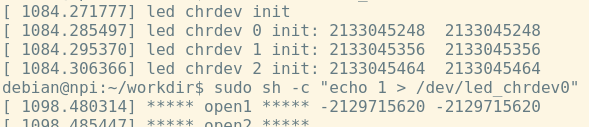

# linux驱动学习笔记

[TOC]


## 2024.03.24

### 设置虚拟机与嵌入式设备网络

​		使用windows中的虚拟机ping通连接到windows电脑的嵌入式设备。

​		虚拟机使用nat模式，为了保证虚拟机能够联网，其需要通过VMnet8虚拟网卡与windows电脑的wifi网卡保持在一个网段。然后为了让linux虚拟机能够通过scp指令直接给嵌入式设备上传驱动程序，则需要windows电脑VMnet8网卡出来的网络数据包转发到与嵌入式设备连接的网卡上，即需要设置一道路由，对次按如下设置：

```C++
// windows的WiFi网段为192.168.1.0的网络，所以VMnet8和虚拟机也需要设置为这个网段的。
// 然后嵌入式设备那个局域网不能设置为这个网段，不然路由有混乱产生一些错误（这个后面可以研究一下，感觉可以设置路由来解决）
// 设置嵌入式设备eth1网卡的ip为 192.168.20.20，则与它连接的主机网卡ip设置为 192.168.20.3
// 然后在windows电脑设置路由
// 后面加 -p 应该是永久设置
route add 192.168.1.0 mask 255.255.255.0 192.168.20.1	// 192.168.1.0网段的转发给192.168.20.1的网关
// 然后在虚拟机中就可以ping通嵌入式设备了
 
```


## 2024.03.25

​		解决了驱动编译的问题，使用[GitHub - Embedfire/ebf_linux_kernel at ebf_4.19_imx](https://github.com/Embedfire/ebf_linux_kernel/tree/ebf_4.19_imx)的内核版本，然后对内核进行编译，最后编译的驱动可以在嵌入式设备上运行。


## 2024.04.01

### 结构体封装cdev时的bug

​		测试完了前几个设备驱动的demo，但是发现把`struct cdev`结构体再封装一层的结构体的方法，目前存在问题，感觉和使用`container_of`函数通过`cdev`成员变量找到结构体的首地址的方法有关系，因为后面使用该结构体和内核进行操作就会报错。如下所示：

```c
struct led_chrdev {
    struct cdev dev;
    unsigned int __iomem *va_dr;
    unsigned int __iomem *va_gdir;
    unsigned int __iomem *va_iomuxc_mux;
    unsigned int __iomem *va_ccm_ccgrx;
    unsigned int __iomem *va_iomux_pad;

    unsigned long pa_dr;
    unsigned long pa_gdir;
    unsigned long pa_iomuxc_mux;
    unsigned long pa_ccm_ccgrx;
    unsigned long pa_iomux_pad;

    unsigned int led_pin;
    unsigned int clock_offset;
};
static int led_chrdev_open(struct inode *inode, struct file *filp)
{
    unsigned int val = 0;
    /* 下面为具体的操作代码 */
    struct led_chrdev *led_cdev = (struct led_chrdev *)container_of(inode->i_cdev, struct led_chrdev, dev);
    // 将物理地址转换成虚拟地址
    led_cdev->va_dr = ioremap(led_cdev->pa_dr, 4);		
    ioread32(led_cdev->va_ccm_ccgrx);		// 这里就会报错
}
```

## 2024.04.02

### 结构体封装cdev时的bug

​		通过打印地址，发现是`file_operations`是中传递的`inode`中的`cdev`地址有问题，如下所示：



## 2024.04.07

### 测试open函数中inode参数

​		今天使用普通字符设备的驱动测试，发现open函数中的inode参数中的cdev变量的地址是有问题的，inode本身应该没有问题，因为使用inode->i_rdev打印设备号是正常的，但是通过inode->i_cdev->count打印cdev中的设备数量的变量就会出段错误。

## 2024.04.08

​		查看内核源码，在`char_dev.c`文件中的`static int chrdev_open(struct inode *inode, struct file *filp)`函数将`cdev`结构体记录到文件节点`inode`中的`i_cdev`中了。而`chrdev_open`函数是默认的open函数（在主动调用open函数之后，才会被替换为设备驱动注册的open函数），正常运行后`inode->i_cdev`不会为空指针。

​		至于==这个`chrdev_open`函数是被谁调用、什么时候被调用的，目前还不清楚，感觉应该是`mknod`命令中会调用这个函数==。这个问题想不管了。


## 2024.04.09

​		设备驱动中一些常见的结构体：

```C
// 字符设备结构体
struct cdev {
    struct kobject kobj;
	struct module *owner;
	const struct file_operations *ops;
	struct list_head list;
	dev_t dev;
	unsigned int count;
} 
```

