# linux内核0.12

[TOC]


## Linux内核体系结构

​		linux内核主要由5个模块组成：进程调度、内存管理、文件系统、进程间通信、网络接口模块。

​		进程调度模块用来负责控制进程对 CPU 资源的使用。所采取的调度策略是各进程能够公平合理地访问 CPU，同时保证内核能及时地执行硬件操作。内存管理模块用于确保所有进程能够安全地共享机器主内存区，内存管理模块还支持虚拟内存管理方式，使得Linux支持进程使用比实际内存空间更多 的内存容量。并可以利用文件系统把暂时不用的内存数据块交换到外部存储设备上去，当需要时再交换回来。文件系统模块用于支持对外部设备的驱动和存储。虚拟文件系统模块通过向所有的外部存储设备 提供一个通用的文件接口，隐藏了各种硬件设备的不同细节。从而提供并支持与其他操作系统兼容的多 种文件系统格式。进程间通信模块子系统用于支持多种进程间的信息交换方式。网络接口模块提供对多 种网络通信标准的访问并支持许多网络硬件。


### 内存管理


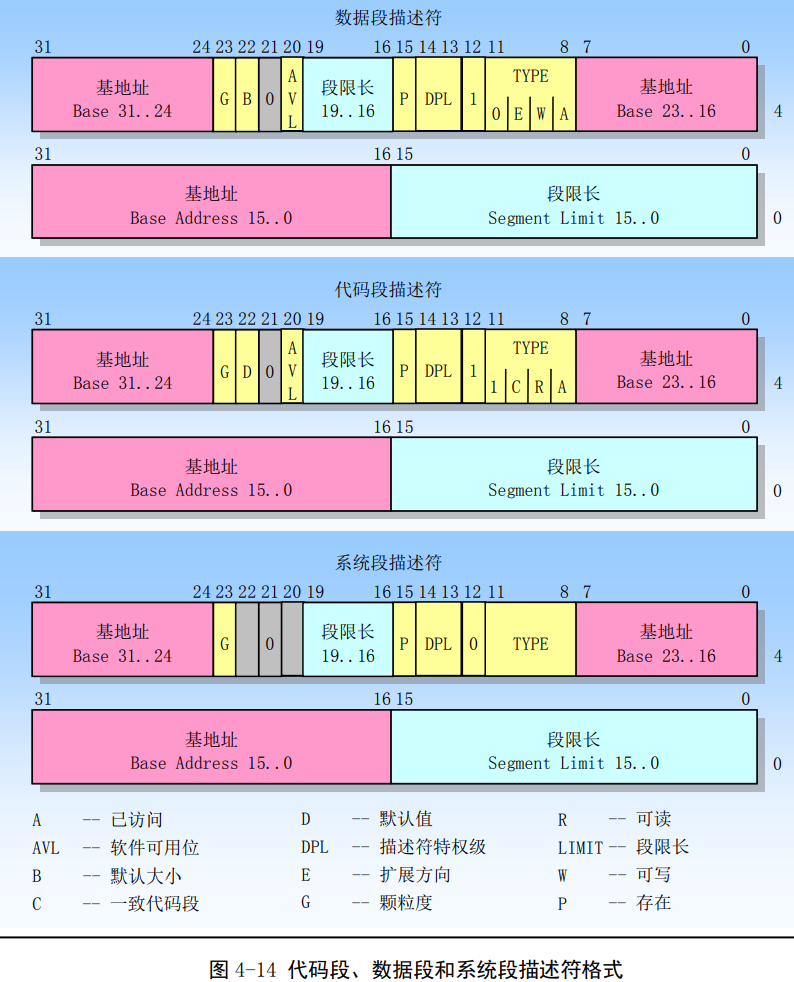


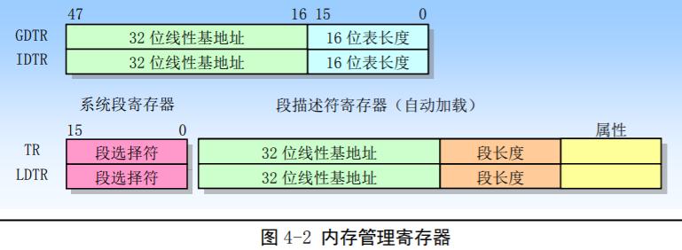


​		LDTR 寄存器中用于存放局部描述符表 LDT 的 32 位线性基地址、16 位段限长和描述符属性值。指令 LLDT 和 SLDT 分别用于加载和保存 LDTR 寄存器的段描述符部分。包含 LDT 表的段必须在 GDT 表中有 一个段描述符项。**当使用 LLDT 指令把含有 LDT 表段的选择符加载进 LDTR 时，LDT 段描述符的段基地址、段限长度以及描述符属性会被自动地加载到 LDTR 中**。==当进行任务切换时，处理器会把新任务 LDT 的段选择符和段描述符自动地加载进 LDTR 中（这里是怎么考虑新任务的代码段的还是数据段？）==。在机器加电或处理器复位后，段选择符和基地址被默认地设置为 0，而段长度被设置成 0xFFFF。


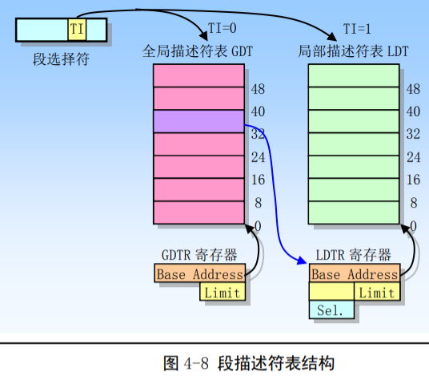


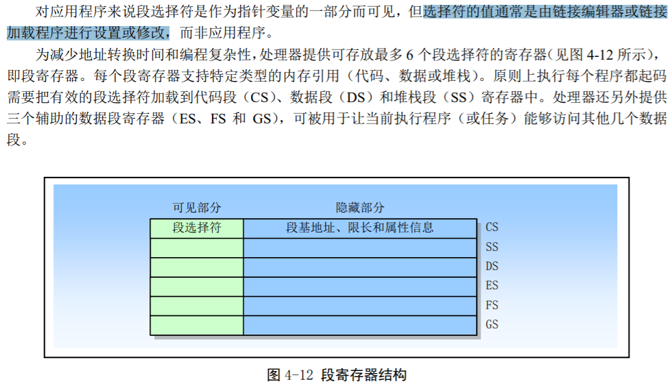


#### 问题

1. 目前没有完全弄明白段选择符的概念，它存放在哪里（PCB中吗）？它如何映射到对应LDT表中段描述符的（选择符->GDT->LDT吗）？
2. 在不切换任务的情况下，LDTR中的段选择符是不是在代码段与数据段之间不断变化？
3. CS:EIP中存放的是什么？
4. CS等段寄存器多大？

### 进程控制

```C
// 大约占 1536 个字节
struct task_struct {
	long state;		// 任务的运行状态，就绪态、可中断睡眠态、不可中断睡眠态、僵死态、停止态
	long counter;	// 任务的运行时间片，初值为priority
	long priority;	// 任务的优先级，越大优先级越高
	long signal;	// 信号位图，每个比特代表一种信号（32位）
	struct sigaction sigaction[32];	// 信号执行属性结构，对应信号将要执行的操作和标志信息
	long blocked;	// 进程信号屏蔽码

	int exit_code;	// 退出码，其父进程来取
	unsigned long start_code;	// 代码段地址
    unsigned long end_code;		// 代码段长度（字节数）
    unsigned long end_data;		// 代码段 + 数据段长度
    unsigned long brk;			// 总长度，代码段 + 数据段 + bss段
    unsigned long start_stack;	// 堆栈段地址
	long pid;		// 进程标识号
    long pgrp;		// 进程组号
    long session;	// 会话号
    long leader;	// 会话首领号
	int	groups[NGROUPS];	// 进程所属组号，一个进程可以属于多个组 

	struct task_struct	*p_pptr;	// 指向父进程的指针
    struct task_struct *p_cptr;		// 指向最新子进程的指针
    struct task_struct *p_ysptr;	// 指向比自己后创建的相邻进程的指针
    struct task_struct *p_osptr;	// 指向比自己早创建的相邻进程的指针
	unsigned short uid;		// 用户识别号
    unsigned short euid;	// 有效用户id
    unsigned short suid;	// 保存的用户id
	unsigned short gid;		// 组识别号id
    unsigned short egid;	// 有效组id
    unsigned short sgid;	// 保护的组id
	unsigned long timeout;	// 内核定时器超时值
    unsigned long alarm;	// 报警定时值（滴答数）
	long utime;		// 用户态运行时间
    long stime;		// 系统态运行时间
    long cutime;	// 子进程用户态运行时间
    long cstime;	// 子进程系统态运行时间
    long start_time;	// 进程开始运行时刻
	struct rlimit rlim[RLIM_NLIMITS]; 	// 进程资源使用统计数组
	unsigned int flags;		// 各进程标志（未使用）
	unsigned short used_math;	// 是否使用了协处理器
/* file system info */	
	int tty;	// 进程使用tty终端的子设备号
	unsigned short umask;	// 文件创建属性屏蔽位
	struct m_inode * pwd;	// 当前工作目录i节点结构指针
	struct m_inode * root;	// 根目录i节点结构指针
	struct m_inode * executable;	// 执行文件i节点结构指针
	struct m_inode * library;		// 被加载库文件i节点结构指针
	unsigned long close_on_exec;	// 执行时关闭句柄位图标志
	struct file * filp[NR_OPEN];	// 文件结构指针表，最多32项
/* ldt for this task 0 - zero 1 - cs 2 - ds&ss */
	struct desc_struct ldt[3];		// 局部描述符表，0-空，1-代码段cs，2- &ss
/* tss for this task */
	struct tss_struct tss;		// 进程的任务状态段信息结构
};
```

​	进程指针间的关系：


## kernel

### main.c


​	可变参数的函数使用方法：

```C

/*
定义一个可变参数函数，至少要有一个固定参数（即 last 参数）。
声明一个 va_list 变量，用于存储可变参数列表的信息。
使用 va_start 宏初始化 va_list 变量。
使用 va_arg 宏依次获取每个可变参数。
使用 va_end 宏清理 va_list 变量。
*/

#include <stdio.h>
#include <stdarg.h>

// 可变参数函数，计算参数的总和
int sum(int count, ...) {
    int total = 0;
    va_list args;

    // 初始化 args 以访问可变参数
    va_start(args, count);

    // 逐个获取可变参数，并累加到 total
    for (int i = 0; i < count; i++) {
        total += va_arg(args, int);
    }

    // 清理 args
    va_end(args);

    return total;
}

int main() {
    printf("Sum of 1, 2, 3: %d\n", sum(3, 1, 2, 3));  // 输出 6
    printf("Sum of 4, 5, 6, 7: %d\n", sum(4, 4, 5, 6, 7));  // 输出 22
    return 0;
}
```


#### 问题

1. printf函数的实现
2. dup函数的具体作用和实现
3. 为什么init()函数中，在setup()之后就能使用open函数打开对应文件路径的文件了？这个地方文件系统就加载好了吗？是如何加载的？
4. open、execve函数的实现？


### asm.s

​	没有很懂这个中断的操作


​	如此压栈的作用和意义？


### sched.c

​	sched.h中的任务结构体

```C

struct task_struct {
	long state;		// 任务的运行状态，就绪态、可中断睡眠态、不可中断睡眠态、僵死态、停止态
	long counter;	// 任务的运行时间片，初值为priority
	long priority;	// 任务的优先级，越大优先级越高
	long signal;	// 信号位图，每个比特代表一种信号（32位）
	struct sigaction sigaction[32];	// 信号执行属性结构，对应信号将要执行的操作和标志信息
	long blocked;	// 进程信号屏蔽码

	int exit_code;	// 退出码，其父进程来取
	unsigned long start_code;	// 代码段地址
    unsigned long end_code;		// 代码段长度（字节数）
    unsigned long end_data;		// 代码段 + 数据段长度
    unsigned long brk;			// 总长度，代码段 + 数据段 + bss段
    unsigned long start_stack;	// 堆栈段地址
	long pid;		// 进程标识号
    long pgrp;		// 进程组号
    long session;	// 会话号
    long leader;	// 会话首领号
	int	groups[NGROUPS];	// 进程所属组号，一个进程可以属于多个组 

	struct task_struct	*p_pptr;	// 指向父进程的指针
    struct task_struct *p_cptr;		// 指向最新子进程的指针
    struct task_struct *p_ysptr;	// 指向比自己后创建的相邻进程的指针
    struct task_struct *p_osptr;	// 指向比自己早创建的相邻进程的指针
	unsigned short uid;		// 用户识别号
    unsigned short euid;	// 有效用户id
    unsigned short suid;	// 保存的用户id
	unsigned short gid;		// 组识别号id
    unsigned short egid;	// 有效组id
    unsigned short sgid;	// 保护的组id
	unsigned long timeout;	// 内核定时器超时值
    unsigned long alarm;	// 报警定时值（滴答数）
	long utime;		// 用户态运行时间
    long stime;		// 系统态运行时间
    long cutime;	// 子进程用户态运行时间
    long cstime;	// 子进程系统态运行时间
    long start_time;	// 进程开始运行时刻
	struct rlimit rlim[RLIM_NLIMITS]; 	// 进程资源使用统计数组
	unsigned int flags;		// 各进程标志（未使用）
	unsigned short used_math;	// 是否使用了协处理器
/* file system info */	
	int tty;	// 进程使用tty终端的子设备号
	unsigned short umask;	// 文件创建属性屏蔽位
	struct m_inode * pwd;	// 当前工作目录i节点结构指针
	struct m_inode * root;	// 根目录i节点结构指针
	struct m_inode * executable;	// 执行文件i节点结构指针
	struct m_inode * library;		// 被加载库文件i节点结构指针
	unsigned long close_on_exec;	// 执行时关闭句柄位图标志
	struct file * filp[NR_OPEN];	// 文件结构指针表，最多32项
/* ldt for this task 0 - zero 1 - cs 2 - ds&ss */
	struct desc_struct ldt[3];		// 局部描述符表，0-空，1-代码段cs，2-数据和堆栈段ds&ss
/* tss for this task */
	struct tss_struct tss;		// 进程的任务状态段信息结构
};
```


### signal.c

```C
// signal 是一个函数-- 该函数有两个参数（一个是int型变量 sig  一个是指向函数(该函数以int作为入参，返回值为空 )的指针）
// signal 的返回值是一个指向函数（入参为int 返回值为空）的指针
void (*signal(int _sig, void (*_func)(int)))(int);
// 类似于如下定义
typedef void sigfunc(int);
sigfunc *signal(int _sig, sigfunc *handler);

```


### exit.c


### fork.c


## 块设备驱动程序

### blk.h


### hd.c

​		hd.c中定义了sys_setup()，hd_init()，hd_out()，do_hd_request()，read_intr()，write_intr()等函数。

​		里面定义了对硬盘控制器的操作。

```C
// 该函数为init函数中调用，最终完成了根文件系统的安装
// 输入为第一个硬盘参数16字节 + 第二个硬盘参数16字节
int sys_setup(void * BIOS)
{
	static int callable = 1;
	int i,drive;
	unsigned char cmos_disks;
	struct partition *p;
	struct buffer_head * bh;
	if (!callable)
		return -1;
	callable = 0;
#ifndef HD_TYPE
	for (drive=0 ; drive<2 ; drive++) {
		hd_info[drive].cyl = *(unsigned short *) BIOS;			// 柱面数
		hd_info[drive].head = *(unsigned char *) (2+BIOS);		// 磁头数
		hd_info[drive].wpcom = *(unsigned short *) (5+BIOS);	// 写前预补偿柱面号
		hd_info[drive].ctl = *(unsigned char *) (8+BIOS);		// 控制字节
		hd_info[drive].lzone = *(unsigned short *) (12+BIOS);	// 磁头着陆区柱面号
		hd_info[drive].sect = *(unsigned char *) (14+BIOS);		// 每磁道扇区数
		BIOS += 16;
	}
	if (hd_info[1].cyl)
		NR_HD=2;
	else
		NR_HD=1;
#endif
	// 计算总扇区数
	// 项 0 和 5 分别标志两个硬盘的整体参数
	// 项1-4和6-9分别表示两个硬盘的4个分区
	for (i=0 ; i<NR_HD ; i++) {
		hd[i*5].start_sect = 0;
		hd[i*5].nr_sects = hd_info[i].head*
				hd_info[i].sect*hd_info[i].cyl;		// cyl个柱面，每个柱面head个磁道，每个磁道sect个扇区
	}
	// 从CMOS存储器0x12的地址上中读取磁盘类型
	if ((cmos_disks = CMOS_READ(0x12)) & 0xf0)
		if (cmos_disks & 0x0f)
			NR_HD = 2;
		else
			NR_HD = 1;
	else
		NR_HD = 0;
	for (i = NR_HD ; i < 2 ; i++) {
		hd[i*5].start_sect = 0;
		hd[i*5].nr_sects = 0;
	}
	for (drive=0 ; drive<NR_HD ; drive++) {
		// sdlm 为什么硬盘1和2的设备号为0x300和0x305
		if (!(bh = bread(0x300 + drive*5,0))) {
			printk("Unable to read partition table of drive %d\n\r",
				drive);
			panic("");
		}
		// 硬盘一个扇区 512 字节
		// 判断硬盘尾部标志位0xAA55
		if (bh->b_data[510] != 0x55 || (unsigned char)
		    bh->b_data[511] != 0xAA) {
			printk("Bad partition table on drive %d\n\r",drive);
			panic("");
		}
		// 分区表位于第一个扇区0x1BE处
		p = 0x1BE + (void *)bh->b_data;
		
		for (i=1;i<5;i++,p++) {
			hd[i+5*drive].start_sect = p->start_sect;
			hd[i+5*drive].nr_sects = p->nr_sects;
		}
		brelse(bh);
	}
	// sdlm 为什么要除以2？
	for (i=0 ; i<5*MAX_HD ; i++)
		hd_sizes[i] = hd[i].nr_sects>>1 ;
	// 设备数据块总数指针
	blk_size[MAJOR_NR] = hd_sizes;
	if (NR_HD)
		printk("Partition table%s ok.\n\r",(NR_HD>1)?"s":"");
	// 尝试在系统内存虚拟盘中加载启动盘中包含的根文件系统映像
	rd_load();
	// 对交换设备进行初始化
	init_swapping();
	// 安装根文件系统
	mount_root();	
	return (0);
}
```

​		硬盘的第一个扇区为主引导扇区MBR（Master Boot Record），且这个扇区首先被读取到内存0x7c00开始处，==那它和bootsect.s的关系是什么==。

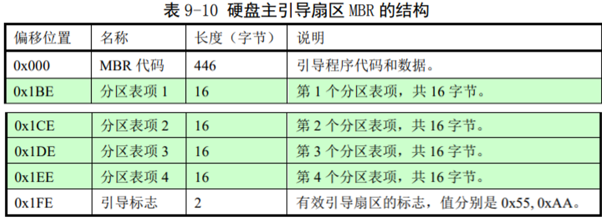

​		除了扇区开始的 446 字节引导执行代码以外，MBR 中还包含一张硬盘分区表，共含有 4 个表项。分区表存放在硬盘的 0 柱面 0 头第 1 个扇区的 0x1BE--0x1FD 偏移位置处。

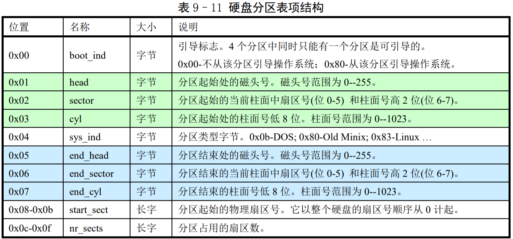


### ll_rw_blk.c

​		该程序主要用于执行低层块设备读/写操作，是本章所有块设备（硬盘、软盘和 RAM虚拟盘）与系统其他部分之间的接口程序。通过调用该程序的低级块读写函数 ll_rw_block()，系统中的其他程序可以异步地读写块设备中的数据。**该函数的主要功能是为其他程序创建块设备读写请求项，并插入到指定块设备请求队列中**。实际的读写操作则是由设备的请求项处理函数 request_fn()完成。**对于硬盘操作，该 函数是 do_hd_request()；对于软盘操作，该函数是 do_fd_request()；对于虚拟盘则是 do_rd_request()**。

​		若 ll_rw_block()针对一个块设备建立起一个请求项，并通过测试块设备的当前请求项指针为空而确定设备空闲时，就会设置该新建的请求项为当前请求项，并直接调用 request_fn()对该请求项进行操作。 否则就会使用电梯算法将新建的请求项插入到该设备的请求项链表中等待处理。而当 request_fn()结束对 一个请求项的处理，就会把该请求项从链表中删除。

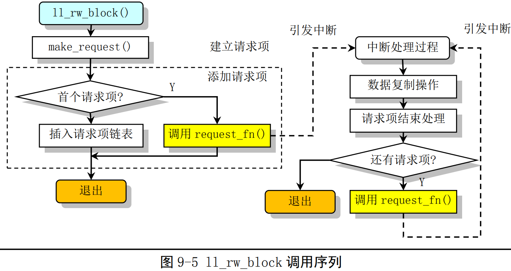

## 字符设备驱动程序

​		该部分共有7个源代码文件：

```C
console.c
keyboard.S
pty.c
rs_io.s
serial.c
tty_io.c
tty_ioctl.c
```

​		程序可分成三部分。第一部分是关于 RS-232 串行线路驱动程序，包括程序 rs_io.s 和 serial.c；第二部分是涉及控制台驱动程序，这包括键盘中断驱动程序 keyboard.S 和控制台显示驱动程序 console.c； 第三部分是终端驱动程序与上层程序之间的接口部分，包括终端输入输出程序 tty_io.c 和终端控制程序 tty_ioctl.c。


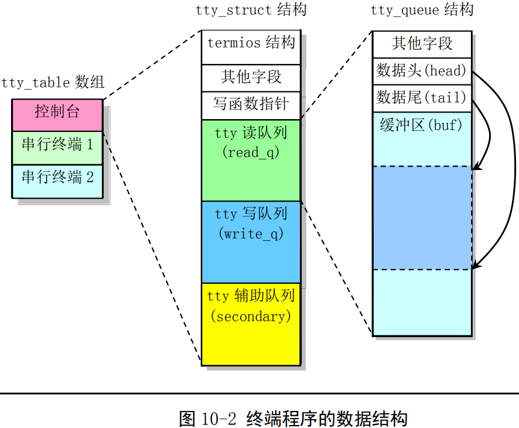


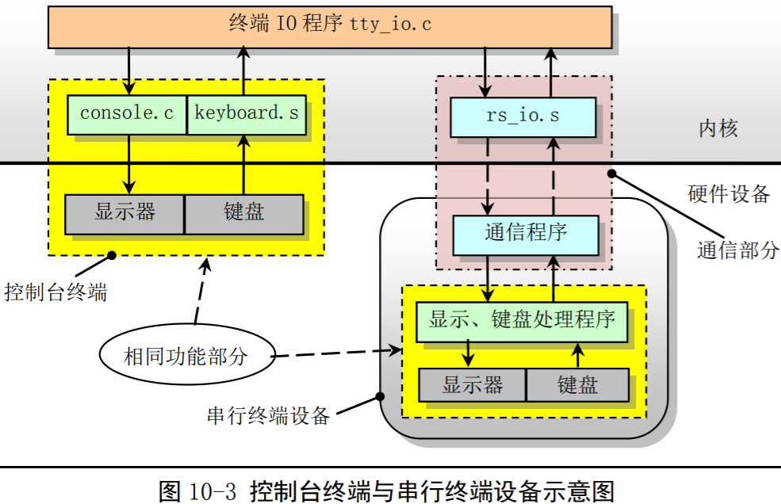


## 文件系统


### MINIX 文件系统

​		MINIX 文件系统与标准 UNIX 的文件系统基本相同，它由 6 个部分组成：引导块；超级块；i节点位图；逻辑块位图；i节点；数据块。在 MINIX 1.0 文件系统中，其磁盘块大小与逻辑块大小正好是一样的，都是 1KB 字节。

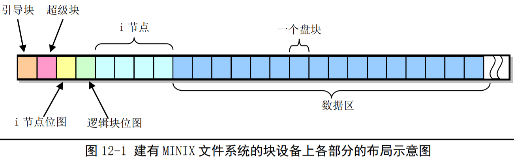

​		在 Linux 0.12 系统中，被加载的文件系统超级块保存在超级块表（数组）super_block[]中。该表共有 8 项，因此 Linux 0.12 系统中同时最多加载 8 个文件系统。**超级块表将在 super.c 程序的 mount_root()函数中被初始化**，在 read_super()函数中会为新加载的文件系统在表中设置一个超级块项，并在 put_super() 函数中释放超级块表中指定的超级块项。

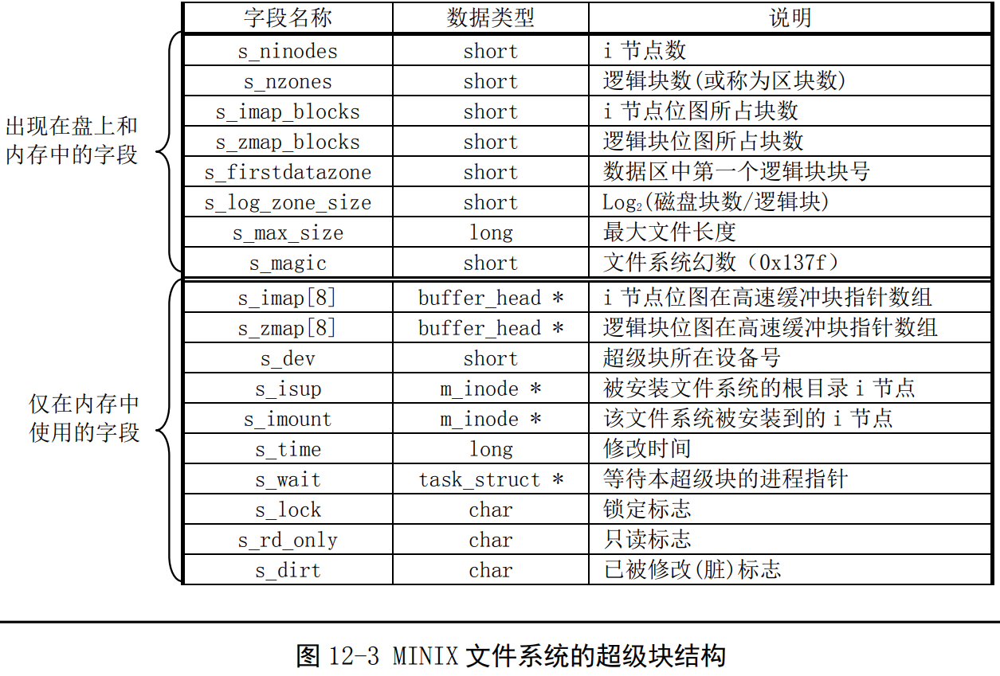

​		超级块用于存放盘设备上文件系统的结构信息，并说明各部分的大小。超级块的结构体：

```C
struct super_block {
	unsigned short s_ninodes;		// 文件的类型和属性（rwx 位）
	unsigned short s_nzones;		// 逻辑块数(或称为区块数)
	unsigned short s_imap_blocks;	// i 节点位图所占块数
	unsigned short s_zmap_blocks;	// 逻辑块位图所占块数
	unsigned short s_firstdatazone;	// 数据区中第一个逻辑块块号
	unsigned short s_log_zone_size;	// Log2(磁盘块数/逻辑块)
	unsigned long s_max_size;		// 最大文件长度
	unsigned short s_magic;			// 文件系统幻数（0x137f）
	/* 仅在内存上使用的字段 */
	struct buffer_head * s_imap[8];	// i 节点位图在高速缓冲块指针数组
	// 一个缓冲块1kb，每个比特表示一个盘块的占用状态，一个缓冲块可代表8192个盘块
	// 8个缓冲块可表示65536个盘块，即该文件系统所能支持的最大块设备容量是 64MB。
	struct buffer_head * s_zmap[8];	// 逻辑块位图在高速缓冲块指针数组
	unsigned short s_dev;			// 超级块所在设备号
	struct m_inode * s_isup;		// 被安装文件系统的根目录 i 节点
	struct m_inode * s_imount;		// 该文件系统被安装到的 i 节点
	unsigned long s_time;			// 修改时间
	struct task_struct * s_wait;	// 等待本超级块的进程指针
	unsigned char s_lock;			// 锁定标志
	unsigned char s_rd_only;		// 只读标志	
	unsigned char s_dirt;			// 已被修改(脏)标志
};
```

​		i 节点用于存放盘设备上每个文件和目录名的索引信息。i 节点位图用于说明 i 节点是否被使用，同样是每个比特位代表一个 i 节点。在创建文件系统时会预 先将 i 节点 0 对应比特位图中的比特位置为 1。因此第一个 i 节点位图块中只能表示 8191 个 i 节点的状况。

```C
struct m_inode {
	unsigned short i_mode;		// 文件的类型和属性（rwx 位）
	unsigned short i_uid;		// 文件宿主的用户 id
	unsigned long i_size;		// 文件长度（字节）
	unsigned long i_mtime;		// 修改时间（从 1970.1.1:0 时算起，秒）
	unsigned char i_gid;		// 文件宿主的组 id
	unsigned char i_nlinks;		// 链接数（有多少个文件目录项指向该 i 节点）
	unsigned short i_zone[9];	// 文件所占用的盘上逻辑块号数组
	/* 仅在内存上使用的字段 */
	struct task_struct * i_wait;	// 等待该 i 节点的进程
	struct task_struct * i_wait2;	/* for pipes */
	unsigned long i_atime;			// 最后访问时间
	unsigned long i_ctime;			// i 节点自身被修改时间
	unsigned short i_dev;			// i 节点所在的设备号
	unsigned short i_num;			// i 节点号
	unsigned short i_count;			// i 节点被引用的次数，0 表示空闲
	unsigned char i_lock;			// i 节点被锁定标志
	unsigned char i_dirt;			// i 节点已被修改（脏）标志
	unsigned char i_pipe;			// i 节点用作管道标志
	unsigned char i_mount;			// i 节点安装了其他文件系统标志
	unsigned char i_seek;			// 搜索标志（lseek 操作时）
	unsigned char i_update;			// i 节点已更新标志。
};
```

​		m_inode 字段用来保存文件的类型和访问权限属性。其比特位 15-12 用于保存文件类型，位 11-9 保存执行文件时设置的信息，位 8-0 表示文件的访问权限。

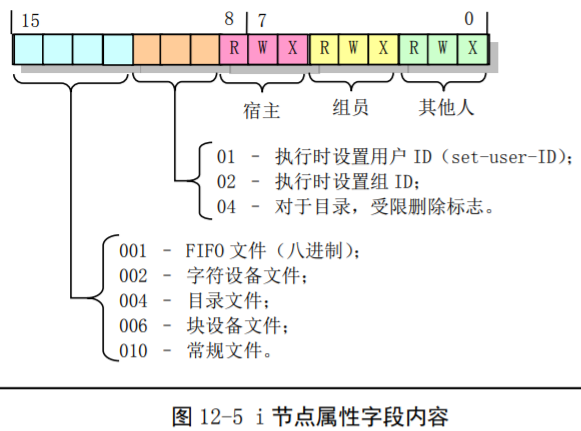

​		文件中的数据存放在磁盘块的数据区中，而一个文件名则通过对应的 i 节点与这些数据磁盘块相联系，这些盘块的号码就存放在 i 节点的逻辑块数组 i_zone[]中。zone[0]-zone[6]是直接块号；zone[7]是一次间接块号；zone[8]是二次（双重）间接块号。一个盘块可以存放512个盘块号，则所以对于 MINIX 文件系统 1.0 版来说，一个文件的最大长度为（7 + 512 + 512*512）= 262,663KB。

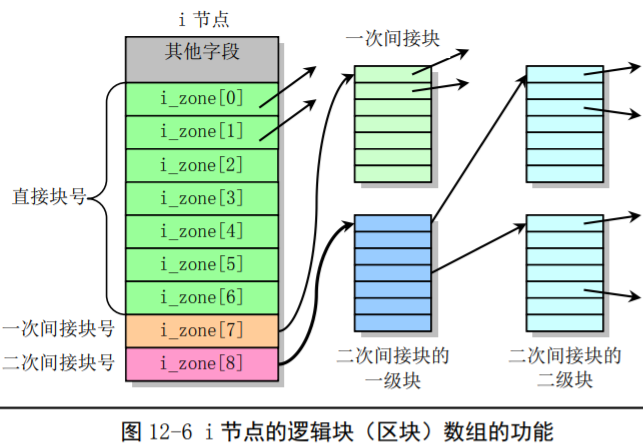

​		另外，对于/dev/目录下的设备文件来说，它们并不占用磁盘数据区中的数据盘块，即它们文件的长度是 0。设备文件名的 i 节点仅用于保存其所定义设备的属性和设备号。设备号被存放在设备文件 i 节点的 zone[0]中。

#### 文件类型、属性和目录项

​		UNIX 类操作系统中的文件通常可分为 6 类：正规文件；目录名；符号链接文件；命名管道文件；字符设备文件；块设备文件。

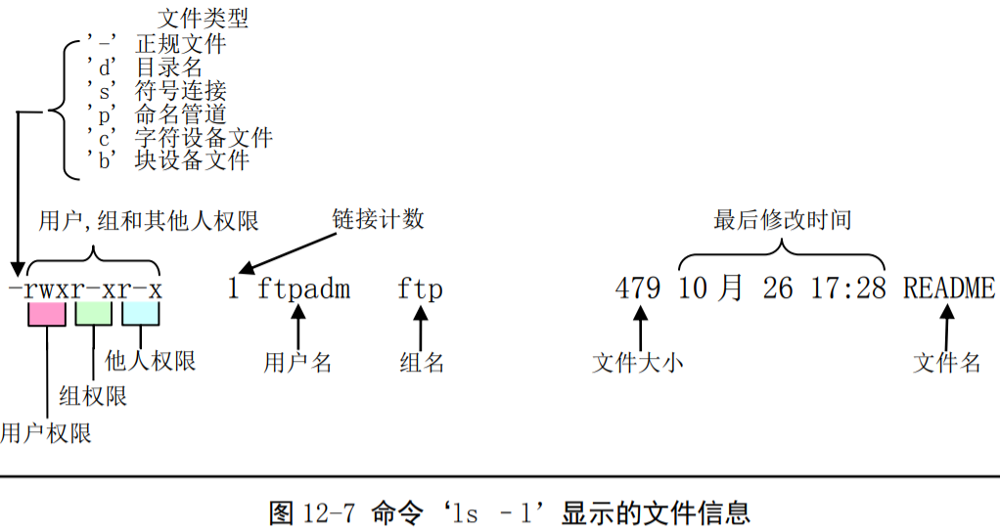

​		在文件系统的一个目录中，其中所有文件名的目录项存储在该目录文件的数据块中。例如，目录名 root/下的所有文件名的目录项就保存在 root/目录名文件的数据块中。目录结构：

```C
#define NAME_LEN 14
#define ROOT_INO 1

struct dir_entry {
	unsigned short inode;		// i节点号，对应i节点位图中的第几位
	char name[NAME_LEN];
};
```

​		每个文件目录项只包括一个长度为 14 字节的文件名字符串和该文件名对应的 2 字节的 i 节点号。因此一个逻辑磁盘块可以存放 1024/16=64 个目录项。

​		在打开一个文件时，文件系统会根据给定的文件名找到其 i 节点号，从而通过其对应 i 节点信息找到文件所在的磁盘块位置。

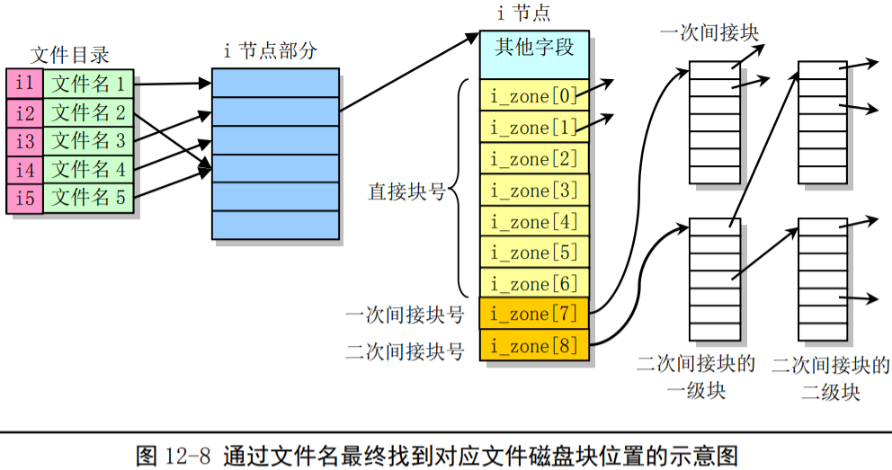

​		如果从一个文件在磁盘上的分布来看，对于某个文件数据块信息的寻找过程可用图 12-9 表示（其中未画出引导块、超级块、i 节点和逻辑块位图）。

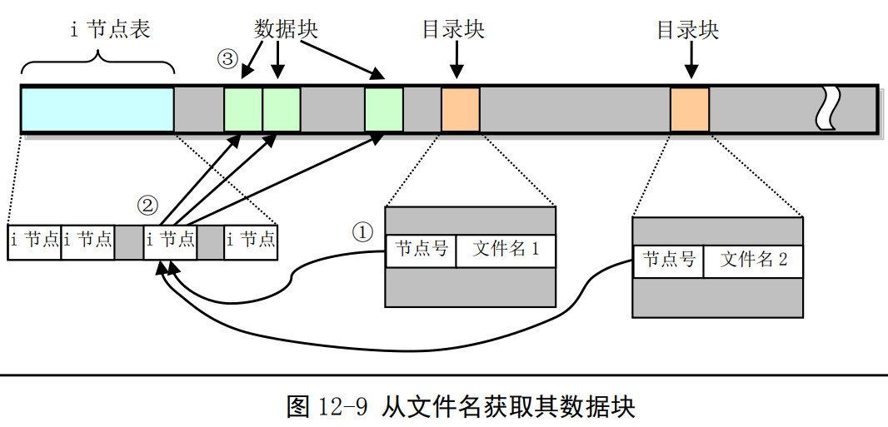

​		通过用户程序指定的文件名，我们可以找到对应目录项。根据目录项中的 i 节点号就可以找到 i 节点表中相应的 i 节点结构。i 节点结构中包含着该文件数据的块号信息，因此最终可以得到文件名对应的数据信息。上图中有两个目录项指向了同一个 i 节点，因此根据这两个文件名都可以得到磁盘上相同的数据。每个 i 节点结构中都有一个链接计数字段 i_nlinks 记录着指向该 i 节点的目录项数，即文件的硬链 接计数值。本例中该字段值为 2。在执行删除文件操作时，只有当 i 节点链接计数值等于 0 时内核才会真正删除磁盘上该文件的数据。另外，**由于目录项中 i 节点号仅能用于当前文件系统中，因此不能使用 一个文件系统的目录项来指向另一个文件系统中的 i 节点，即硬链接不能跨越文件系统**。

​		与硬链接不同，符号链接类型（软链接）的文件名目录项并不直接指向对应的 i 节点。**符号链接目录项会在对应文件的数据块中存放某一文件的路径名字符串**。当访问符号链接目录项时，内核就会读取该文件中的内容，然后根据其中的路径名字符串来访问指定的文件。因此**符号链接可以不局限在一个文件系统中**， 我们可以在一个文件系统中建立一个指向另一个文件系统中文件名的符号链接。

​		在每个目录中还包含两个特殊的文件目录项，它们的名称分别固定是 '.' 和 '..'；'.'目录项中给出了当前目录的 i 节点号，而'..'目录项中给出了当前目录父目录的 i 节点号。如下图所示。

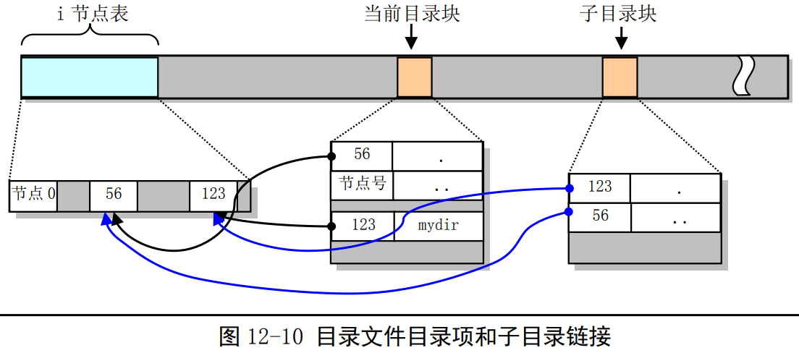

​		可以使用使用 hexdump 命令察 看当前文件的数据块内容，可以看出当前目录包含的各个目录项内容。

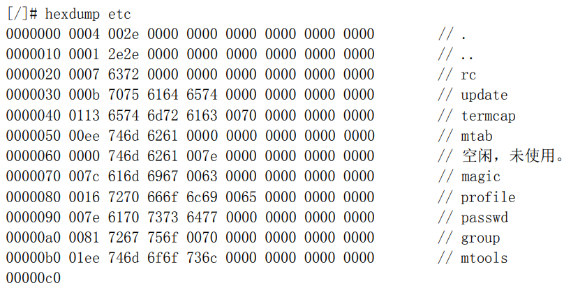

#### 高速缓冲区

​		高速缓冲区是文件系统访问块设备中数据的必经要道。为了访问块设备上文件系统中的数据，内核可以每次都访问块设备，进行读或写操作。但是每次 I/O 操作的时间与内存和 CPU 的处理速度相比是非常慢的。为了提高系统的性能，内核就在内存中开辟了一个高速数据缓冲区（buffer cache），并将其划分成一个个与磁盘数据块大小相等的缓冲块来使用和管理，以期减少访问块设备的次数。


​		Linux 内核实现高速缓冲区的程序是 buffer.c。文件系统中其他程序通过指定需要访问的设备号和数据逻辑块号来调用它的块读写函数。这些接口函数有：块读取函数 bread()、块提前预读函数 breada()和 页块读取函数 bread_page()。页块读取函数一次读取一页内存所能容纳的缓冲块数（4 块）。

#### 文件系统底层函数

​		文件系统的底层处理函数包含在以下 5 个文件中： 

-  bitmap.c 程序包括对 i 节点位图和逻辑块位图进行释放和占用处理函数。操作 i 节点位图的函数是 free_inode()和 new_inode()，操作逻辑块位图的函数是 free_block()和 new_block()。 
- truncate.c 程序包括对数据文件长度截断为 0 的函数 truncate()。它将 i 节点指定的设备上文件长度截为 0，并释放文件数据占用的设备逻辑块。 
- inode.c 程序包括分配 i 节点函数 iget()和放回对内存 i 节点存取函数 iput()以及根据 i 节点信息取文件数据块在设备上对应的逻辑块号函数 bmap()。 
- namei.c 程序主要包括函数 namei()。该函数使用 iget()、iput()和 bmap()将给定的文件路径名映射到其 i 节点。 
- super.c 程序专门用于处理文件系统超级块，包括函数 get_super()、put_super()和 free_super()等。 还包括几个文件系统加载/卸载处理函数和系统调用，如 sys_mount()等。

#### 文件中数据的访问操作

​		关于文件中数据的访问操作代码，主要涉及 5 个文件：block_dev.c、file_dev.c、 char_dev.c、pipe.c 和 read_write.c。前 4 个文件可以认为是块设备、字符设备、管道设备和普通文件与文件读写系统调用的接口程序，它们共同实现了 read_write.c 中的 read()和 write()系统调用。通过对被操作文件属性的判断，这两个系统调用会分别调用这些文件中的相关处理函数进行操作。

​		内核使用文件结构 file、文件表 file_table[]和内存中的 i 节点表 inode_table[]来管理对文件的操作访问。

```C
#define NR_FILE 64

struct file {
    unsigned short f_mode;		// 文件操作模式（RW 位）
    unsigned short f_flags; 	// 文件打开和控制的标志。
    unsigned short f_count;		// 对应文件句柄引用计数。
    struct m_inode * f_inode;	// 指向对应内存 i 节点，即现在系统中的 v 节点。
    off_t f_pos; 				// 文件当前读写指针位置。
};

struct file file_table[NR_FILE];

```

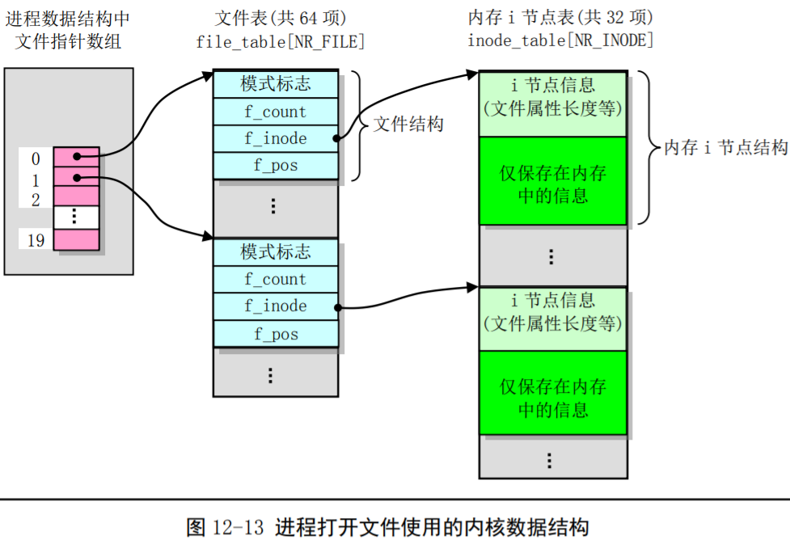

### buffer.c

​		buffer.c 程序用于对高速缓冲区(池)进行操作和管理。高速缓冲区位于内核代码块和主内存区之间。高速缓冲区在块设备与内核其他程序之间起着一个桥梁作用。除了块设备驱动程序以外，内核程序如果需要访问块设备中的数据，就都需要经过高速缓冲区来间接地操作。

​		整个高速缓冲区被划分成 1024 字节大小的缓冲块，这正好与块设备上的磁盘逻辑块大小相同。高速缓冲采用 hash 表和包含所有缓冲块的链表进行操作管理。在缓冲区初始化过程中，初始化程序从整个缓冲区的两端开始，分别同时设置缓冲块头结构和划分出对应的缓冲块。缓冲区的高端 被划分成一个个 1024 字节的缓冲块，低端则分别建立起对应各缓冲块的缓冲头结构 buffer_head。

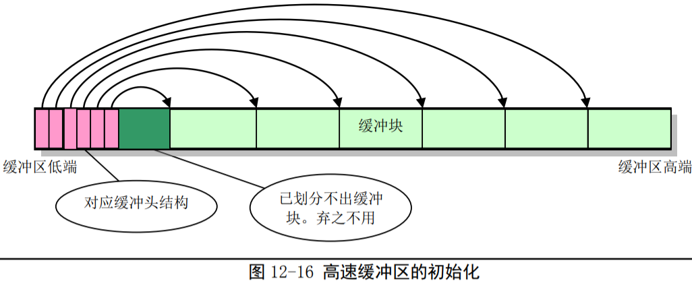

​		所有缓冲块的 buffer_head 被链接成一个双向链表结构，称为空闲链表。

```C
struct buffer_head {
    char * b_data;				// 指向该缓冲块中数据区（1024 字节)的指针。
    unsigned long b_blocknr;	// 块号。
    unsigned short b_dev;		// 数据源的设备号(0 = free)。
    unsigned char b_uptodate;	// 更新标志：表示数据是否已更新。
    unsigned char b_dirt;		// 修改标志: 0- 未修改(clean)，1- 已修改(dirty)。
    unsigned char b_count;		// 使用该块的用户数。
    unsigned char b_lock;		// 缓冲区是否被锁定。0- ok, 1- locked
    struct task_struct * b_wait;	// 指向等待该缓冲区解锁的任务。
    struct buffer_head * b_prev; 	// hash 队列上前一块（这四个指针用于缓冲区管理）。
    struct buffer_head * b_next; 	// hash 队列上下一块。
    struct buffer_head * b_prev_free; 	// 空闲表上前一块。
    struct buffer_head * b_next_free; 	// 空闲表上下一块。
};
```

​		图中 free_list 指针是该链表的头指针，指向空闲块链表中第一个“最为空闲的”缓冲块，即近期最少使用的缓冲块。 而该缓冲块的反向指针 b_prev_free 则指向缓冲块链表中最后一个缓冲块，即最近刚使用的缓冲块。缓冲块的缓冲头数据结构为：

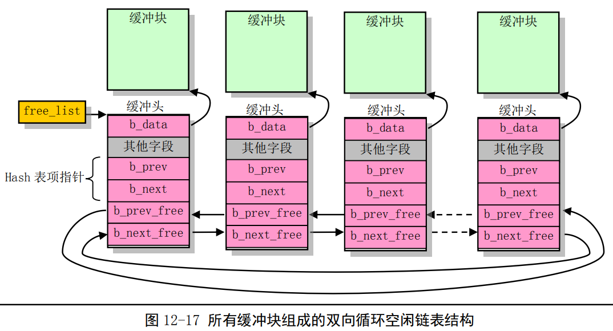

​		内核程序在使用高速缓冲区中的缓冲块时，是指定设备号（dev）和所要访问设备数据的逻辑块号 （block），通过调用缓冲块读取函数 bread()、bread_page()或 breada()进行操作。这几个函数都使用缓冲区搜索管理函数 getblk()，用于在所有缓冲块中寻找匹配或最为空闲的缓冲块。 在系统释放缓冲块时，需要调用 brelse()函数。所有这些缓冲块数据存取和管理函数的调用。

​		为了能够快速而有效地在缓冲区中寻找判断出请求的数据块是否已经被读入到缓冲区中，buffer.c 程序使用了具有 307 个 buffer_head 指针项的 hash（散列、杂凑）数组表结构。Hash 表所使用的散列函数 由设备号和逻辑块号组合而成。程序中使用的具体 hash 函数是：(设备号^逻辑块号) Mod 307。下图中指针 b_prev、b_next 就是用于 hash 表中散列在同一项上多个缓冲块之间的双向链接，即把 hash 函数 计算出的具有相同散列值的缓冲块链接在散列数组同一项链表上。

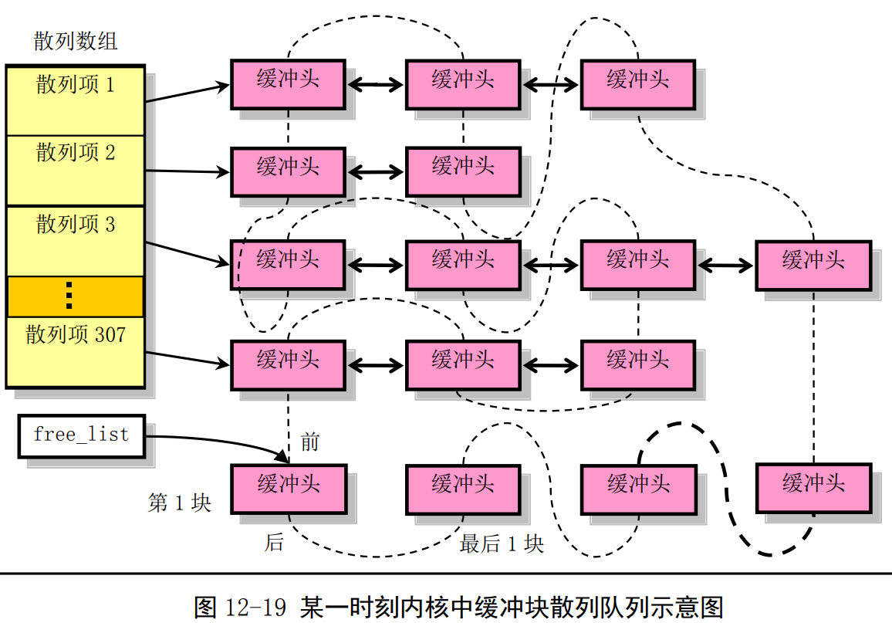


```C


// 磁盘同步函数
sync_dev() -> sync_inodes()
    	   -> ll_rw_block()
    			->make_request()
    				->add_request()
```


#### 问题

1. brelse 这里只对b_count进行操作了，在什么地方对buffer_head进行释放呢？


### bitmap.c

​		bitmap.c 程序的功能和作用即简单又清晰，主要用于根据文件系统中逻辑数据块和 i 节点结构的使用情况，对逻辑块位图和 i 节点位图分别进行比特位的占用/释放设置操作。逻辑块位图的操作函数是 free_block()和 new_block()；i 节点位图的操作函数是 free_inode()和 new_inode()。


#### 问题

​	1. 超级块中的所有内容是一直都存放在内存上吗？是在什么时候放在内存的？包括i节点和逻辑块位图的bufferHead。

### truncate.c

​		本程序用于释放指定 i 节点在设备上占用的所有逻辑块，包括直接块、一次间接块和二次间接块。 从而将文件的节点对应的文件长度截为 0，并释放占用的设备空间。

### inode.c

​		该程序主要包括处理 i 节点的函数 iget()、iput()和块映射函数 bmap()，以及其他一些辅助函数。iget()、 iput()和 bmap()函数主要用于 namei.c 程序的映射函数 namei()中，用于由文件路径名查找对应 i 节点。

​		iget()：该函数用于从设备 dev 上读取指定节点号 nr 的 i 节点，并且把节点的引用计数字段值 i_count 增 1。

​		iput()：所完成的功能正好与 iget()相反。它主要用于把 i 节点引用计数值递减 1，并且若是管道 i 节点，则唤醒等待的进程。

​		bmap()：函数用于把一个文件数据块映射到对应的盘块上。

​		目前理解，i节点使用的时候都是存放在i节点表inode_table中，它想磁盘同步，首先需要想磁盘块的高速缓冲区进行同步，然后在由高速缓冲区向磁盘同步。


#### 问题

1. 里面对于块设备的特殊操作是什么意思？


### super.c

​		该文件描述了对文件系统中超级块操作的函数，这些函数属于文件系统低层函数，供上层的文件名和目录操作函数使用，主要有 get_super()、put_super()和 read_super()函数。另外还有有关文件系统加载/卸载的系统调用 sys_umount()和 sys_mount()，以及根文件系统加载函数 mount_root()。其他一些辅助函数与 buffer.c 中的辅助函数的作用类似。

​		


### namei.c

​		本文件主要实现了根据目录名或文件名寻找到对应 i 节点的函数 namei()，以及一些关于目录的建立和删除、目录项的建立和删除等操作函数和系统调用。

​		在文件系统的一个目录中，其中所有文件名对应的目录项存储在该目录文件名的数据块中。例如，目录名 root/下的所有文件名的目录项就保存在 root/目录名文件的数据块中；而文件系统根目录下的所有文件名信息则保存在指定 i 节点（即 1 号节点）的数据块中。每个 目录项只包括一个长度为 14 字节的文件名字符串和该文件名对应的 2 字节的 i 节点号。

​		有关文件的其它信息则被保存在该 i 节点号指定的 i 节点结构中，该结构中主要包括文件访问属性、宿主、长度、访问保存时间以及所在磁盘块等信息。每个 i 节点号的 i 节点都位于磁盘上的固定位置处。

```C

// 检测一个文件的读/写/执行权限
static int permission(struct m_inode * inode,int mask)


// 指定长度的字符串比较函数
// 内核中不能使用strncmp
static int match(int len,const char * name,struct dir_entry * de)

// 在指定目录中查找指定文件名的目录项
// 即在文件夹中找到指定文件名的文件
// dir - 指定目录i节点的指针；name - 文件名；namelen - 文件名长度 res_dir - 返回找到的文件的目录项指针
// 返回值为存放着res_dir目录项的缓冲块指针
// dir为"/home/sdlm"的i节点指针，在里面找hello.c的文件
static struct buffer_head * find_entry(struct m_inode ** dir, const char * name, int namelen, struct dir_entry ** res_dir)

// 根据指定的目录和文件名添加目录项
// 将新文件的目录项写到文件夹目录项对应的数据块中了，但是新文件的inode号默认设置为0
// 参数：dir - 指定目录的 i 节点；name - 文件名；namelen - 文件名长度；
// 返回：高速缓冲区指针；res_dir - 返回的目录项结构指针；
static struct buffer_head * add_entry(struct m_inode * dir, const char * name, int namelen, struct dir_entry ** res_dir)

// 查找符号链接的 i 节点
// sdlm 还没有细看，硬链接、软链接
// 参数：dir - 目录 i 节点；inode - 目录项 i 节点
// 返回：返回符号链接到文件的 i 节点指针。出错返回 NULL
// 其为 符号链接，在他的数据区中存放的是它链接的文件的路径名称，可以跨文件系统
static struct m_inode * follow_link(struct m_inode * dir, struct m_inode * inode)

// 从指定目录开始搜寻给定路径名的顶端目录名的 i 节点。
// pathname = "/root/home/hello.c"
// 则最终返回的是home的inode节点指针
// 参数：pathname - 路径名；inode - 指定起始目录的 i 节点。
// 返回：目录的 i 节点指针。失败时返回 NULL。
static struct m_inode * get_dir(const char * pathname, struct m_inode * inode)

// 返回指定目录名的i节点指针，以及在最顶层目录的名称
// 参数：pathname - 路径名；namelen - 路径名长度；name - 返回的最顶层目录名；base - 搜索起始目录的 i 节点
// pathname = "/home/sdlm/hello.c" -> namelen = 7, name = "hello.c", 返回sdlm的i节点指针
// pathname = "/home/sdlm/" -> namelen = 0, name = NULL, 返回sdlm的i节点指针
static struct m_inode * dir_namei(const char * pathname, int * namelen, const char ** name, struct m_inode * base)

// 取指定路径名的 i 节点内部函数
// 参数：pathname - 路径名；base - 搜索起点目录 i 节点；follow_links - 是否跟随符号链接的标志，1 - 是，0 不是
// 返回：对应的 i 节点
// pathname = "/home/sdlm/hello.c"
struct m_inode * _namei(const char * pathname, struct m_inode * base, int follow_links)

// 取指定路径名的 i 节点，不跟随符号链接。
// 参数：pathname - 路径名。
// 返回：对应的 i 节点
struct m_inode * lnamei(const char * pathname)
{
	return _namei(pathname, NULL, 0);
}

// 取指定路径名的 i 节点，跟随符号链接。
// 参数：pathname - 路径名。
// 返回：对应的 i 节点。
struct m_inode * namei(const char * pathname)
{
	return _namei(pathname,NULL,1);
}

// open()函数使用的 namei 函数 - 这其实几乎是完整的打开文件程序
// 参数 filename 是文件路径名，flag 是打开文件标志，mode 就用于指定文件的许可属性
// 返回：成功返回 0，否则返回出错码；res_inode - 返回对应文件路径名的 i 节点指针
int open_namei(const char * pathname, int flag, int mode, struct m_inode ** res_inode)


// 创建一个设备特殊文件或普通文件节点（node）
// 该函数创建名称为 filename，由 mode 和 dev 指定的文件系统节点（普通文件、设备特殊文件或命名管道）
// 参数：filename - 路径名；mode - 指定使用许可以及所创建节点的类型；dev - 设备号
// 返回：成功则返回 0，否则返回出错码
int sys_mknod(const char * filename, int mode, int dev)

// 创建一个目录。
// 参数：pathname - 路径名；mode - 目录使用的权限属性
// 返回：成功则返回 0，否则返回出错码
int sys_mkdir(const char * pathname, int mode)

static int empty_dir(struct m_inode * inode)

int sys_rmdir(const char * name)

int sys_unlink(const char * name)

// 建立符号链接。
// 为一个已存在文件创建一个符号链接（也称为软连接 - soft link
// 参数：oldname - 原路径名；newname - 新的路径名
// 返回：若成功则返回 0，否则返回出错号
int sys_symlink(const char * oldname, const char * newname)

// 为文件建立一个文件名目录项。
// 为一个已存在的文件创建一个新链接（也称为硬连接 - hard link）
// 参数：oldname - 原路径名；newname - 新的路径名
// 返回：若成功则返回 0，否则返回出错号
int sys_link(const char * oldname, const char * newname)

```


### block_dev.c

​		从这里开始是文件系统程序的第 3 部分。包括 5 个程序：block_dev.c、char_dev.c、pipe.c、file_dev.c 和 read_write.c。前 4 个程序为 read_write.c 提供服务，主要实现了文件系统的数据访问操作。read_write.c 程序主要实现了系统调用 sys_write()和 sys_read()。这 5 个程序可以看作是系统调用与块设备、字符设备、 管道“设备”和文件系统“设备”的接口驱动程序。它们之间的关系可以用图 12-26 表示。系统调用 sys_write() 或 sys_read()会根据参数所提供文件描述符的属性，判断出是哪种类型的文件，然后分别调用相应设备接 口程序中的读/写函数，而这些函数随后会执行相应的驱动程序。

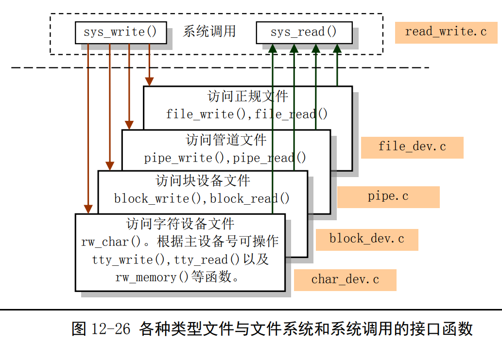

​		block_dev.c 程序属于块设备文件数据访问操作类程序。该文件包括 block_read()和 block_write()两个块设备读写函数,分别用来直接读写块设备上的原始数据。这两个函数是供系统调用函数 read()和 write() 调用，其他地方没有引用。