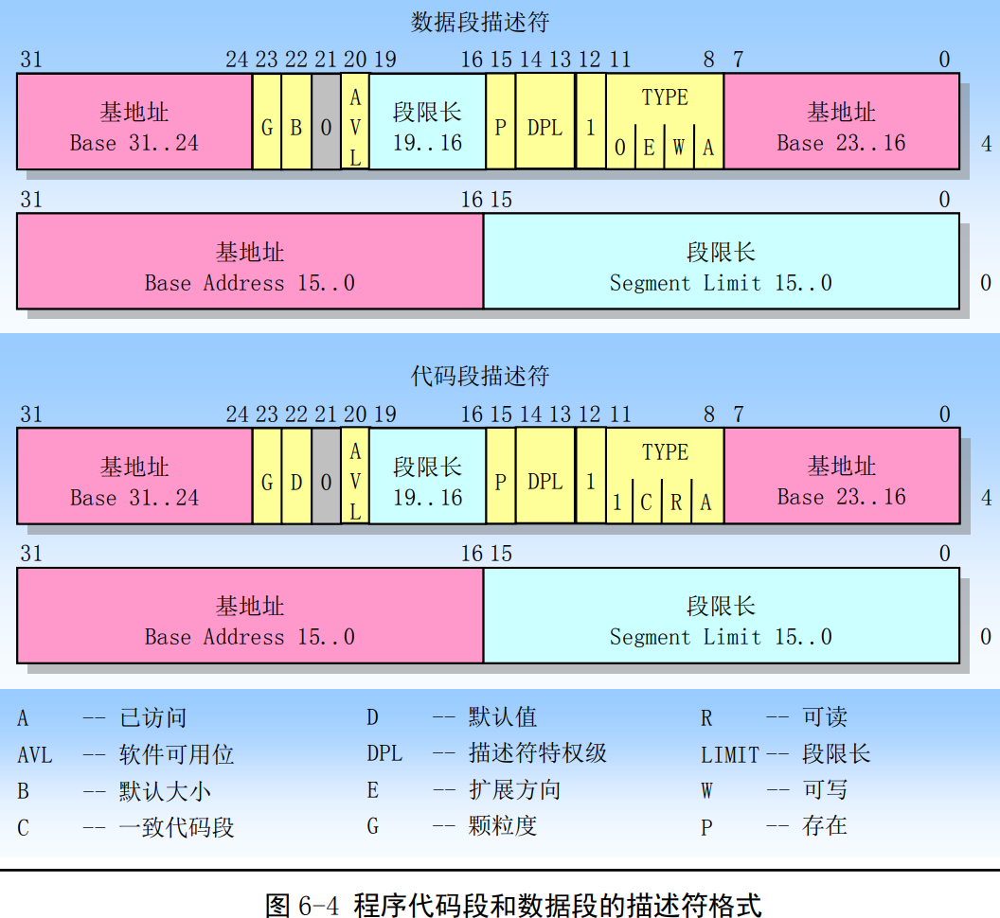
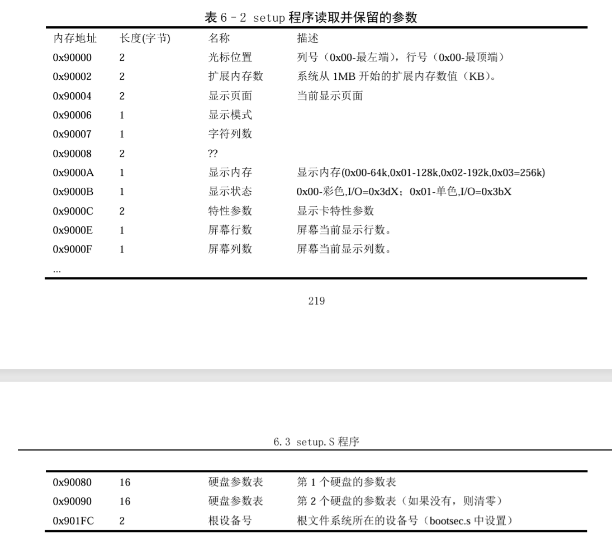

# linux内核0.12

[TOC]


## Linux内核体系结构

​		linux内核主要由5个模块组成：进程调度、内存管理、文件系统、进程间通信、网络接口模块。

​		进程调度模块用来负责控制进程对 CPU 资源的使用。所采取的调度策略是各进程能够公平合理地访问 CPU，同时保证内核能及时地执行硬件操作。内存管理模块用于确保所有进程能够安全地共享机器主内存区，内存管理模块还支持虚拟内存管理方式，使得Linux支持进程使用比实际内存空间更多 的内存容量。并可以利用文件系统把暂时不用的内存数据块交换到外部存储设备上去，当需要时再交换回来。文件系统模块用于支持对外部设备的驱动和存储。虚拟文件系统模块通过向所有的外部存储设备 提供一个通用的文件接口，隐藏了各种硬件设备的不同细节。从而提供并支持与其他操作系统兼容的多 种文件系统格式。进程间通信模块子系统用于支持多种进程间的信息交换方式。网络接口模块提供对多 种网络通信标准的访问并支持许多网络硬件。


### 内存管理





### 进程控制

```C
struct task_struct {
	long state;		// 任务的运行状态，就绪态、可中断睡眠态、不可中断睡眠态、僵死态、停止态
	long counter;	// 任务的运行时间片，初值为priority
	long priority;	// 任务的优先级，越大优先级越高
	long signal;	// 信号位图，每个比特代表一种信号（32位）
	struct sigaction sigaction[32];	// 信号执行属性结构，对应信号将要执行的操作和标志信息
	long blocked;	// 进程信号屏蔽码

	int exit_code;	// 退出码，其父进程来取
	unsigned long start_code;	// 代码段地址
    unsigned long end_code;		// 代码段长度（字节数）
    unsigned long end_data;		// 代码段 + 数据段长度
    unsigned long brk;			// 总长度，代码段 + 数据段 + bss段
    unsigned long start_stack;	// 堆栈段地址
	long pid;		// 进程标识号
    long pgrp;		// 进程组号
    long session;	// 会话号
    long leader;	// 会话首领号
	int	groups[NGROUPS];	// 进程所属组号，一个进程可以属于多个组 

	struct task_struct	*p_pptr;	// 指向父进程的指针
    struct task_struct *p_cptr;		// 指向最新子进程的指针
    struct task_struct *p_ysptr;	// 指向比自己后创建的相邻进程的指针
    struct task_struct *p_osptr;	// 指向比自己早创建的相邻进程的指针
	unsigned short uid;		// 用户识别号
    unsigned short euid;	// 有效用户id
    unsigned short suid;	// 保存的用户id
	unsigned short gid;		// 组识别号id
    unsigned short egid;	// 有效组id
    unsigned short sgid;	// 保护的组id
	unsigned long timeout;	// 内核定时器超时值
    unsigned long alarm;	// 报警定时值（滴答数）
	long utime;		// 用户态运行时间
    long stime;		// 系统态运行时间
    long cutime;	// 子进程用户态运行时间
    long cstime;	// 子进程系统态运行时间
    long start_time;	// 进程开始运行时刻
	struct rlimit rlim[RLIM_NLIMITS]; 	// 进程资源使用统计数组
	unsigned int flags;		// 各进程标志（未使用）
	unsigned short used_math;	// 是否使用了协处理器
/* file system info */	
	int tty;	// 进程使用tty终端的子设备号
	unsigned short umask;	// 文件创建属性屏蔽位
	struct m_inode * pwd;	// 当前工作目录i节点结构指针
	struct m_inode * root;	// 根目录i节点结构指针
	struct m_inode * executable;	// 执行文件i节点结构指针
	struct m_inode * library;		// 被加载库文件i节点结构指针
	unsigned long close_on_exec;	// 执行时关闭句柄位图标志
	struct file * filp[NR_OPEN];	// 文件结构指针表，最多32项
/* ldt for this task 0 - zero 1 - cs 2 - ds&ss */
	struct desc_struct ldt[3];		// 局部描述符表，0-空，1-代码段cs，2-数据和堆栈段ds&ss
/* tss for this task */
	struct tss_struct tss;		// 进程的任务状态段信息结构
};
```

​	进程指针间的关系：


## kernel

### main.c





​	可变参数的函数使用方法：

```C

/*
定义一个可变参数函数，至少要有一个固定参数（即 last 参数）。
声明一个 va_list 变量，用于存储可变参数列表的信息。
使用 va_start 宏初始化 va_list 变量。
使用 va_arg 宏依次获取每个可变参数。
使用 va_end 宏清理 va_list 变量。
*/

#include <stdio.h>
#include <stdarg.h>

// 可变参数函数，计算参数的总和
int sum(int count, ...) {
    int total = 0;
    va_list args;

    // 初始化 args 以访问可变参数
    va_start(args, count);

    // 逐个获取可变参数，并累加到 total
    for (int i = 0; i < count; i++) {
        total += va_arg(args, int);
    }

    // 清理 args
    va_end(args);

    return total;
}

int main() {
    printf("Sum of 1, 2, 3: %d\n", sum(3, 1, 2, 3));  // 输出 6
    printf("Sum of 4, 5, 6, 7: %d\n", sum(4, 4, 5, 6, 7));  // 输出 22
    return 0;
}
```


#### 问题

1. printf函数的实现
2. dup函数的具体作用和实现
3. 为什么init()函数中，在setup()之后就能使用open函数打开对应文件路径的文件了？这个地方文件系统就加载好了吗？是如何加载的？
4. open、execve函数的实现？


### asm.s

​	没有很懂这个中断的操作


​	如此压栈的作用和意义？


### sched.c

​	sched.h中的任务结构体

```C

struct task_struct {
	long state;		// 任务的运行状态，就绪态、可中断睡眠态、不可中断睡眠态、僵死态、停止态
	long counter;	// 任务的运行时间片，初值为priority
	long priority;	// 任务的优先级，越大优先级越高
	long signal;	// 信号位图，每个比特代表一种信号（32位）
	struct sigaction sigaction[32];	// 信号执行属性结构，对应信号将要执行的操作和标志信息
	long blocked;	// 进程信号屏蔽码

	int exit_code;	// 退出码，其父进程来取
	unsigned long start_code;	// 代码段地址
    unsigned long end_code;		// 代码段长度（字节数）
    unsigned long end_data;		// 代码段 + 数据段长度
    unsigned long brk;			// 总长度，代码段 + 数据段 + bss段
    unsigned long start_stack;	// 堆栈段地址
	long pid;		// 进程标识号
    long pgrp;		// 进程组号
    long session;	// 会话号
    long leader;	// 会话首领号
	int	groups[NGROUPS];	// 进程所属组号，一个进程可以属于多个组 

	struct task_struct	*p_pptr;	// 指向父进程的指针
    struct task_struct *p_cptr;		// 指向最新子进程的指针
    struct task_struct *p_ysptr;	// 指向比自己后创建的相邻进程的指针
    struct task_struct *p_osptr;	// 指向比自己早创建的相邻进程的指针
	unsigned short uid;		// 用户识别号
    unsigned short euid;	// 有效用户id
    unsigned short suid;	// 保存的用户id
	unsigned short gid;		// 组识别号id
    unsigned short egid;	// 有效组id
    unsigned short sgid;	// 保护的组id
	unsigned long timeout;	// 内核定时器超时值
    unsigned long alarm;	// 报警定时值（滴答数）
	long utime;		// 用户态运行时间
    long stime;		// 系统态运行时间
    long cutime;	// 子进程用户态运行时间
    long cstime;	// 子进程系统态运行时间
    long start_time;	// 进程开始运行时刻
	struct rlimit rlim[RLIM_NLIMITS]; 	// 进程资源使用统计数组
	unsigned int flags;		// 各进程标志（未使用）
	unsigned short used_math;	// 是否使用了协处理器
/* file system info */	
	int tty;	// 进程使用tty终端的子设备号
	unsigned short umask;	// 文件创建属性屏蔽位
	struct m_inode * pwd;	// 当前工作目录i节点结构指针
	struct m_inode * root;	// 根目录i节点结构指针
	struct m_inode * executable;	// 执行文件i节点结构指针
	struct m_inode * library;		// 被加载库文件i节点结构指针
	unsigned long close_on_exec;	// 执行时关闭句柄位图标志
	struct file * filp[NR_OPEN];	// 文件结构指针表，最多32项
/* ldt for this task 0 - zero 1 - cs 2 - ds&ss */
	struct desc_struct ldt[3];		// 局部描述符表，0-空，1-代码段cs，2-数据和堆栈段ds&ss
/* tss for this task */
	struct tss_struct tss;		// 进程的任务状态段信息结构
};
```


### signal.c

```C
// signal 是一个函数-- 该函数有两个参数（一个是int型变量 sig  一个是指向函数(该函数以int作为入参，返回值为空 )的指针）
// signal 的返回值是一个指向函数（入参为int 返回值为空）的指针
void (*signal(int _sig, void (*_func)(int)))(int);
// 类似于如下定义
typedef void sigfunc(int);
sigfunc *signal(int _sig, sigfunc *handler);

```


### exit.c


### fork.c


1. 