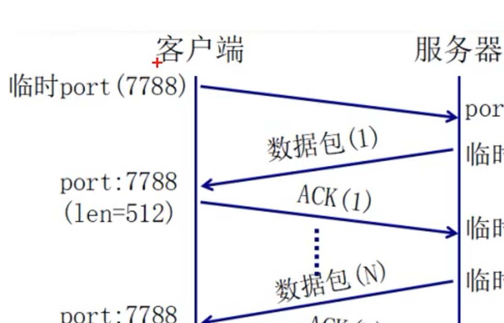
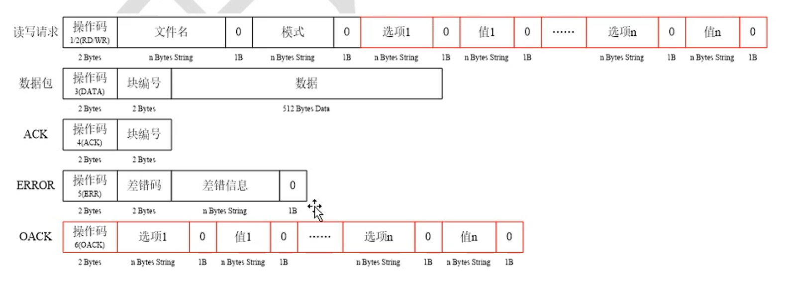
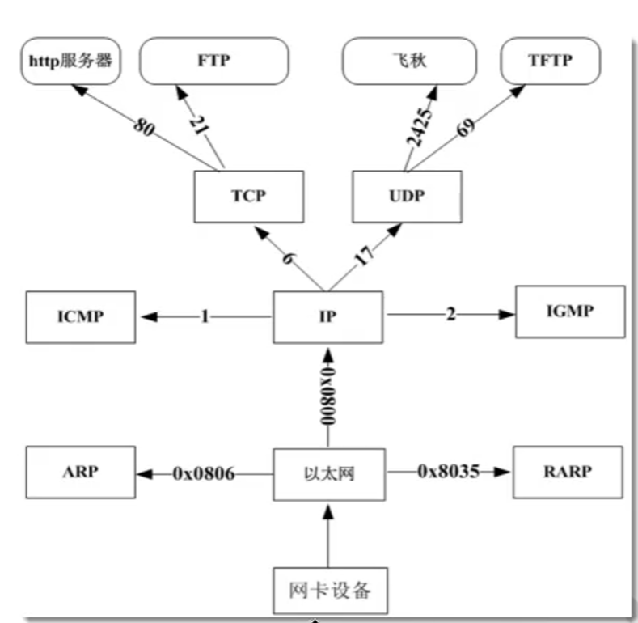
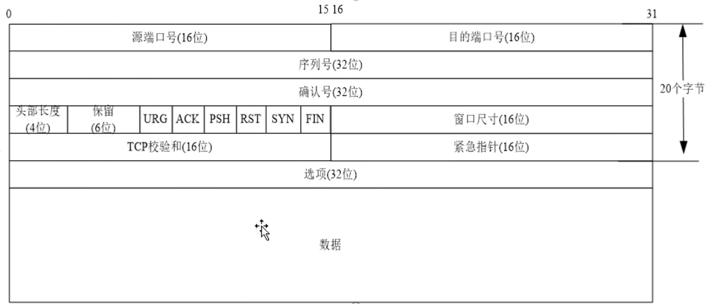
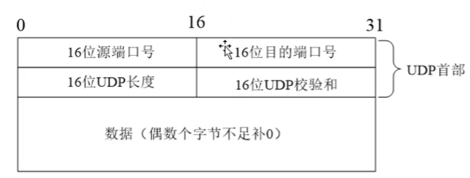
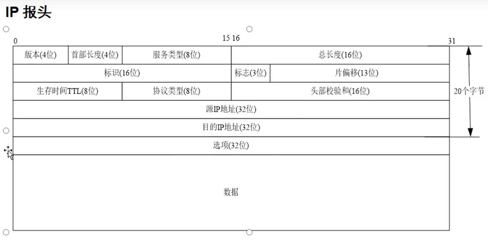
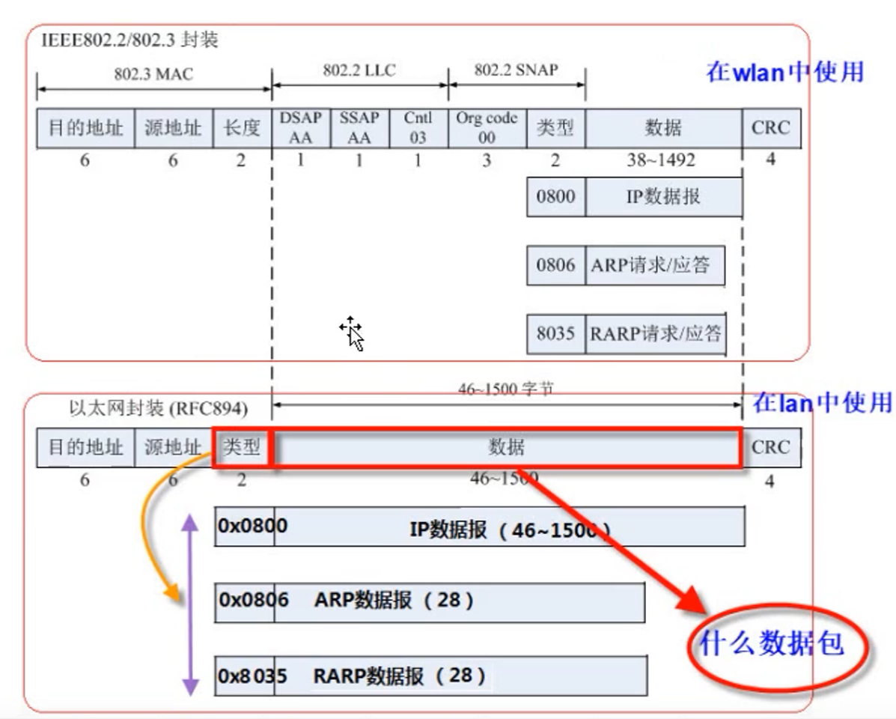
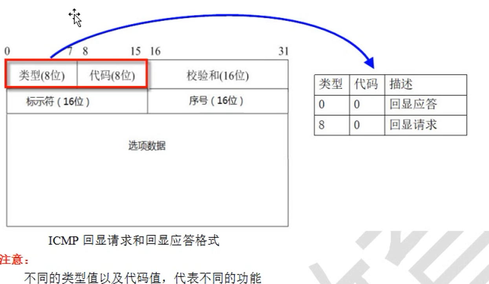

# 网络编程

[TOC]

## TCP

### TCP客户端

```C
#include <stdio.h>
#include <stdlib.h>     // exit
#include <sys/types.h>
#include <sys/socket.h> // socket
#include <netinet/in.h> // sockaddr_in
#include <arpa/inet.h>  // htons inet_addr
#include <unistd.h>     // close
#include <string.h>

#define N       128

#define ERR_LOG(errmsg) do{perror(errmsg); exit(1);}while(0)

int main(int argc, char const *argv[])
{
    if(argc < 3) {
        fprintf(stderr, "Usage: %s [server_ip] [server_port]\n", argv[0]);
        exit(1);
    }
    int sockfd;
    // 第一步：创建套接字
    if((sockfd = socket(AF_INET, SOCK_STREAM, 0)) < 0) {
        ERR_LOG("fail to create socket");
    }
    printf("client socket = %d\n", sockfd);
    // 第二步：填充服务器网络信息结构体
    struct sockaddr_in serverAddr;
    socklen_t addrLen = sizeof(serverAddr);
    serverAddr.sin_family = AF_INET;
    serverAddr.sin_addr.s_addr = inet_addr(argv[1]);
    serverAddr.sin_port = htons(atoi(argv[2]));
    // 与服务器建立连接
    if(connect(sockfd, (struct sockaddr *)&serverAddr, addrLen) < 0) {
        ERR_LOG("fail to connect");
    }

    while(1) {
        // 第三步：发送数据
        char buf[N] = "";
        fgets(buf, N ,stdin);
        buf[strlen(buf) - 1] = '\0';
        if(send(sockfd, buf, N, 0) == -1) {
            ERR_LOG("fail to sendto");
        }

        // 接收数据
        char text[N] = "";
        if(recv(sockfd, text, N, 0) == -1) {
            ERR_LOG("fail to recv");
        }
        printf("from server: %s\n", text);
    }

    close(sockfd);
    return 0;
}

```

### 多进程服务端

```C
#include <stdio.h>
#include <stdlib.h>     // exit
#include <sys/types.h>
#include <sys/socket.h> // socket
#include <netinet/in.h> // sockaddr_in
#include <arpa/inet.h>  // htons inet_addr
#include <unistd.h>     // close
#include <string.h>
#include <signal.h>
#include <sys/wait.h>

#define N       128

#define ERR_LOG(errmsg) do{perror(errmsg); exit(1);}while(0)

void handler(int sig)
{
    wait(NULL);
}

int main(int argc, char const *argv[])
{
    if(argc < 3) {
        fprintf(stderr, "Usage: %s [server_ip] [server_port]\n", argv[0]);
        exit(1);
    }
    int sockfd, acceptfd;
    struct sockaddr_in serverAddr, clientAddr;
    socklen_t addrLen = sizeof(serverAddr);

    // 第一步：创建套接字
    if((sockfd = socket(AF_INET, SOCK_STREAM, 0)) < 0) {
        ERR_LOG("fail to create socket");
    }
    printf("server listen socket = %d\n", sockfd);

    // 将套接字设置为允许重复使用本机地质或者设置为端口复用
    int on = 1;
    if(setsockopt(sockfd, SOL_SOCKET, SO_REUSEADDR, &on, sizeof(on)) < 0) {
        ERR_LOG("fail to setsockopt");
    }

    // 第二步：填充服务器网络信息结构体
    serverAddr.sin_family = AF_INET;
    serverAddr.sin_addr.s_addr = inet_addr(argv[1]);
    serverAddr.sin_port = htons(atoi(argv[2]));

    // 第三步：将套接字与服务器网络信息结构体绑定
    if(bind(sockfd, (struct sockaddr *)&serverAddr, addrLen) < 0) {
        ERR_LOG("fail to bind");
    }

    // 第四步：将套接字设置为被动监听状态
    if(listen(sockfd, 5) < 0) {
        ERR_LOG("fail to listen");
    }
    
    // 使用信号，异步处理僵尸进程
    signal(SIGCHLD, handler);

    while(1) {
        // 第五步：阻塞等待客户端的连接请求
        if((acceptfd = accept(sockfd, (struct sockaddr *)&clientAddr, &addrLen)) < 0) {
            ERR_LOG("fail to accept");
        }
        // 打印客户端信息
        printf("%s -- %d\n", inet_ntoa(clientAddr.sin_addr), ntohs(clientAddr.sin_port));

        // 使用fork函数创建子进程，父进程继续负责连接，子进程负责与客户端通讯
        pid_t pid;
        if((pid = fork()) < 0) {
            ERR_LOG("fail to fork");
        }
        else if(pid > 0) {  // 父进程

        }
        else {
            char buf[N] = "";
            ssize_t bytes;
            while(1) {
                if((bytes = recv(acceptfd, buf, N, 0)) < 0) {
                    ERR_LOG("fail to recv");
                }
                else if(bytes == 0) {
                    printf("The client quited\n");
                    // 是否需要close
                    exit(0);
                }
                if(strncmp(buf, "quit", 4) == 0) {
                    exit(0);
                }
                printf("from client: %s\n", buf);
                strcat(buf, " ^_^ ");
                if(send(acceptfd, buf, N, 0) < 0) {
                    ERR_LOG("fail to send");
                }
            }
        }
    }

    close(sockfd);
    return 0;
}
```

### 多线程服务器

```C
#include <stdio.h>
#include <stdlib.h>     // exit
#include <sys/types.h>
#include <sys/socket.h> // socket
#include <netinet/in.h> // sockaddr_in
#include <arpa/inet.h>  // htons inet_addr
#include <unistd.h>     // close
#include <string.h>
#include <pthread.h>

#define N       128

#define ERR_LOG(errmsg) do{perror(errmsg); exit(1);}while(0)

typedef struct _MSG {
    struct sockaddr_in addr;
    int acceptfd;
}MSG;

void *pthread_fun(void *arg) 
{
    char buf[N] = "";
    ssize_t bytes;
    MSG msg = *(MSG *)arg;
    while(1) {
        if((bytes = recv(msg.acceptfd, buf, N, 0)) < 0) {
            ERR_LOG("fail to recv");
        }
        else if(bytes == 0) {
            printf("The client quited\n");
            // 是否需要close
            return 0;
        }
        if(strncmp(buf, "quit", 4) == 0) {
            return 0;
        }
        printf("%s -- %d\n", inet_ntoa(msg.addr.sin_addr), ntohs(msg.addr.sin_port));
        printf("from client: %s\n", buf);
        strcat(buf, " ^_^ ");
        if(send(msg.acceptfd, buf, N, 0) < 0) {
            ERR_LOG("fail to send");
        }

    }
}

int main(int argc, char const *argv[])
{
    if(argc < 3) {
        fprintf(stderr, "Usage: %s [server_ip] [server_port]\n", argv[0]);
        exit(1);
    }
    int sockfd, acceptfd;
    struct sockaddr_in serverAddr, clientAddr;
    socklen_t addrLen = sizeof(serverAddr);

    // 第一步：创建套接字
    if((sockfd = socket(AF_INET, SOCK_STREAM, 0)) < 0) {
        ERR_LOG("fail to create socket");
    }

    printf("server listen socket = %d\n", sockfd);

    // 将套接字设置为允许重复使用本机地质或者设置为端口复用
    int on = 1;
    if(setsockopt(sockfd, SOL_SOCKET, SO_REUSEADDR, &on, sizeof(on)) < 0) {
        ERR_LOG("fail to setsockopt");
    }

    // 第二步：填充服务器网络信息结构体
    serverAddr.sin_family = AF_INET;
    serverAddr.sin_addr.s_addr = inet_addr(argv[1]);
    serverAddr.sin_port = htons(atoi(argv[2]));

    // 第三步：将套接字与服务器网络信息结构体绑定
    if(bind(sockfd, (struct sockaddr *)&serverAddr, addrLen) < 0) {
        ERR_LOG("fail to bind");
    }

    // 第四步：将套接字设置为被动监听状态
    if(listen(sockfd, 5) < 0) {
        ERR_LOG("fail to listen");
    }
    

    while(1) {
        // 第五步：阻塞等待客户端的连接请求
        if((acceptfd = accept(sockfd, (struct sockaddr *)&clientAddr, &addrLen)) < 0) {
            ERR_LOG("fail to accept");
        }
        // 打印客户端信息
        printf("%s -- %d\n", inet_ntoa(clientAddr.sin_addr), ntohs(clientAddr.sin_port));

        // 创建子进程
        MSG msg;
        msg.addr = clientAddr;
        msg.acceptfd = acceptfd;
        pthread_t thread;
        if(pthread_create(&thread, NULL, pthread_fun, &msg) != 0) {
            ERR_LOG("fail to pthread_create");
        } 
        pthread_detach(thread);

    }

    close(sockfd);
    return 0;
}

```


## UDP

### UDP客户端与服务端

```c++
## 客户端
#include <stdio.h>
#include <stdlib.h>     // exit
#include <sys/types.h>
#include <sys/socket.h> // socket
#include <netinet/in.h> // sockaddr_in
#include <arpa/inet.h>  // htons inet_addr
#include <unistd.h>     // close
#include <string.h>

#define N       128

int main(int argc, char const *argv[])
{
    if(argc < 3) {
        fprintf(stderr, "Usage: %s [ip] [port]\n", argv[0]);
        exit(1);
    }
    int sockfd;
    if((sockfd = socket(AF_INET, SOCK_DGRAM, 0)) == -1) {
        perror("fail to create socket");
        exit(1);
    }
    printf("socket = %d\n", sockfd);

    // 填充服务器网络信息结构体 sockaddr_in
    struct sockaddr_in serverAdd;
    serverAdd.sin_family = AF_INET;
    serverAdd.sin_addr.s_addr = inet_addr(argv[1]);
    serverAdd.sin_port = htons(atoi(argv[2]));

    // 发送数据
    char buf[N] = "";
    while(1) {

        fgets(buf, N ,stdin);
        buf[strlen(buf) - 1] = '\0';
        if(sendto(sockfd, buf, N, 0, (struct sockaddr *)&serverAdd, sizeof(serverAdd)) == -1) {
            perror("fail to sendto");
            exit(1);
        }
    }

    close(sockfd);
    return 0;
}
```


```c
### 服务端
#include <stdio.h>
#include <stdlib.h>     // exit
#include <sys/types.h>
#include <sys/socket.h> // socket
#include <netinet/in.h> // sockaddr_in
#include <arpa/inet.h>  // htons inet_addr
#include <unistd.h>     // close
#include <string.h>

#define N       128

int main(int argc, char const *argv[])
{
    if(argc < 3) {
        fprintf(stderr, "Usage: %s [ip] [port]\n", argv[0]);
        exit(1);
    }
    int sockfd;
    if((sockfd = socket(AF_INET, SOCK_DGRAM, 0)) == -1) {
        perror("fail to create socket");
        exit(1);
    }
    printf("socket = %d\n", sockfd);

    // 填充服务器网络信息结构体 sockaddr_in
    struct sockaddr_in serverAdd;
    serverAdd.sin_family = AF_INET;
    serverAdd.sin_addr.s_addr = inet_addr(argv[1]);
    serverAdd.sin_port = htons(atoi(argv[2]));

    // 将服务器的网络信息结构体与套接字绑定
    if(bind(sockfd, (struct sockaddr *)&serverAdd, sizeof(serverAdd)) == -1) {
        perror("fail to bind");
        exit(1);
    }

    // 发送数据
    char buf[N] = "";
    while(1) {
        struct sockaddr_in clientAddr;
        socklen_t addrLen = sizeof(struct sockaddr_in);
        if(recvfrom(sockfd, buf, N, 0, (struct sockaddr *)&clientAddr, &addrLen) == -1) {
            perror("fail to recvfrom");
            exit(1);
        }
        // 打印数据
        printf("ip: %s, port: %d\n", inet_ntoa(clientAddr.sin_addr), ntohs(clientAddr.sin_port));
        printf("recvData: %s\n", buf);
    }

    close(sockfd);
    return 0;
}
```


### UDP组播

```C
### 客户端
#include <stdio.h>
#include <stdlib.h>     // exit
#include <sys/types.h>
#include <sys/socket.h> // socket
#include <netinet/in.h> // sockaddr_in
#include <arpa/inet.h>  // htons inet_addr
#include <unistd.h>     // close
#include <string.h>

#define N       128

int main(int argc, char const *argv[])
{
    if(argc < 3) {
        fprintf(stderr, "Usage: %s [ip] [port]\n", argv[0]);
        exit(1);
    }

    // 创建套接字
    int sockfd;
    if((sockfd = socket(AF_INET, SOCK_DGRAM, 0)) == -1) {
        perror("fail to create socket");
        exit(1);
    }
    printf("socket = %d\n", sockfd);

    // 填充多播信息结构体
    struct sockaddr_in broadcastAdd;
    broadcastAdd.sin_family = AF_INET;
    broadcastAdd.sin_addr.s_addr = inet_addr(argv[1]);  // 主机的地址为255，如 192.168.16.255
    broadcastAdd.sin_port = htons(atoi(argv[2]));

    // 发送数据
    char buf[N] = "";
    while(1) {

        fgets(buf, N ,stdin);
        buf[strlen(buf) - 1] = '\0';
        if(sendto(sockfd, buf, N, 0, (struct sockaddr *)&broadcastAdd, sizeof(broadcastAdd)) == -1) {
            perror("fail to sendto");
            exit(1);
        }
    }

    close(sockfd);
    return 0;
}
```


```C
#include <stdio.h>
#include <stdlib.h>     // exit
#include <sys/types.h>
#include <sys/socket.h> // socket
#include <netinet/in.h> // sockaddr_in
#include <arpa/inet.h>  // htons inet_addr
#include <unistd.h>     // close
#include <string.h>


#define N       128

int main(int argc, char const *argv[])
{
    if(argc < 3) {
        fprintf(stderr, "Usage: %s [ip] [port]\n", argv[0]);
        exit(1);
    }

    // 创建套接字
    int sockfd;
    if((sockfd = socket(AF_INET, SOCK_DGRAM, 0)) == -1) {
        perror("fail to create socket");
        exit(1);
    }
    printf("socket = %d\n", sockfd);

    // 设置加入多播组
    struct ip_mreq mreq;
    mreq.imr_multiaddr.s_addr = inet_addr(argv[1]); // 多播组IP 224.0.0.0到239.255.255.255
    mreq.imr_interface.s_addr = htonl(INADDR_ANY);  // 将要添加到多播组的IP

    if(setsockopt(sockfd, IPPROTO_IP, IP_ADD_MEMBERSHIP, &mreq, sizeof(mreq)) < 0) {
        perror("fail to setsockopt to broadcast");
        exit(1);
    }
    
    // 填充组播信息结构体
    struct sockaddr_in broadcastAdd;
    broadcastAdd.sin_family = AF_INET;
    broadcastAdd.sin_addr.s_addr = inet_addr(argv[1]);  // 224.0.0.0 ~ 239.255.255.255
    broadcastAdd.sin_port = htons(atoi(argv[2]));

    // 将服务器的网络信息结构体与套接字绑定
    if(bind(sockfd, (struct sockaddr *)&broadcastAdd, sizeof(broadcastAdd)) == -1) {
        perror("fail to bind");
        exit(1);
    }

    // 发送数据
    char buf[N] = "";
    while(1) {
        struct sockaddr_in clientAddr;
        socklen_t addrLen = sizeof(struct sockaddr_in);
        if(recvfrom(sockfd, buf, N, 0, (struct sockaddr *)&clientAddr, &addrLen) == -1) {
            perror("fail to recvfrom");
            exit(1);
        }
        // 打印数据
        printf("ip: %s, port: %d\n", inet_ntoa(clientAddr.sin_addr), ntohs(clientAddr.sin_port));
        printf("recvData: %s\n", buf);
    }

    close(sockfd);
    return 0;
}
```


### UDP广播

```C
### 客户端
#include <stdio.h>
#include <stdlib.h>     // exit
#include <sys/types.h>
#include <sys/socket.h> // socket
#include <netinet/in.h> // sockaddr_in
#include <arpa/inet.h>  // htons inet_addr
#include <unistd.h>     // close
#include <string.h>

#define N       128

int main(int argc, char const *argv[])
{
    if(argc < 3) {
        fprintf(stderr, "Usage: %s [ip] [port]\n", argv[0]);
        exit(1);
    }

    // 创建套接字
    int sockfd;
    if((sockfd = socket(AF_INET, SOCK_DGRAM, 0)) == -1) {
        perror("fail to create socket");
        exit(1);
    }
    printf("socket = %d\n", sockfd);

    // 设置为允许发送广播权限
    int on = 1;
    if(setsockopt(sockfd, SOL_SOCKET, SO_BROADCAST, &on, sizeof(on)) < 0) {
        perror("fail to setsockopt to broadcast");
        exit(1);
    }
    // 填充广播信息结构体
    struct sockaddr_in broadcastAdd;
    broadcastAdd.sin_family = AF_INET;
    broadcastAdd.sin_addr.s_addr = inet_addr(argv[1]);  // 主机的地址为255，如 192.168.16.255
    broadcastAdd.sin_port = htons(atoi(argv[2]));

    // 发送数据
    char buf[N] = "";
    while(1) {

        fgets(buf, N ,stdin);
        buf[strlen(buf) - 1] = '\0';
        if(sendto(sockfd, buf, N, 0, (struct sockaddr *)&broadcastAdd, sizeof(broadcastAdd)) == -1) {
            perror("fail to sendto");
            exit(1);
        }
    }

    close(sockfd);
    return 0;
}
```


```C
### 服务器
#include <stdio.h>
#include <stdlib.h>     // exit
#include <sys/types.h>
#include <sys/socket.h> // socket
#include <netinet/in.h> // sockaddr_in
#include <arpa/inet.h>  // htons inet_addr
#include <unistd.h>     // close
#include <string.h>

#define N       128

int main(int argc, char const *argv[])
{
    if(argc < 3) {
        fprintf(stderr, "Usage: %s [ip] [port]\n", argv[0]);
        exit(1);
    }

    // 创建套接字
    int sockfd;
    if((sockfd = socket(AF_INET, SOCK_DGRAM, 0)) == -1) {
        perror("fail to create socket");
        exit(1);
    }
    printf("socket = %d\n", sockfd);

    // 填充广播信息结构体 sockaddr_in
    struct sockaddr_in broadcastAdd;
    broadcastAdd.sin_family = AF_INET;
    broadcastAdd.sin_addr.s_addr = inet_addr(argv[1]);  // 主机的地址为255，如 192.168.16.255
    broadcastAdd.sin_port = htons(atoi(argv[2]));

    // 将服务器的网络信息结构体与套接字绑定
    if(bind(sockfd, (struct sockaddr *)&broadcastAdd, sizeof(broadcastAdd)) == -1) {
        perror("fail to bind");
        exit(1);
    }

    // 发送数据
    char buf[N] = "";
    while(1) {
        struct sockaddr_in clientAddr;
        socklen_t addrLen = sizeof(struct sockaddr_in);
        if(recvfrom(sockfd, buf, N, 0, (struct sockaddr *)&clientAddr, &addrLen) == -1) {
            perror("fail to recvfrom");
            exit(1);
        }
        // 打印数据
        printf("ip: %s, port: %d\n", inet_ntoa(clientAddr.sin_addr), ntohs(clientAddr.sin_port));
        printf("recvData: %s\n", buf);
    }

    close(sockfd);
    return 0;
}
```


### TFTP客户端

​	TFTP的通讯过程：



​	

​	TFTP通讯过程总结：

1. 服务器在 69 号端口等待客户端的请求
2. 服务器若批准此请求,则使用临时端口与客户端进行通信
3. 每个数据包的编号都有变化(从1开始)
4. 每个数据包都要得到 ACK 的确认如果出现超时,则需要重新发送最后的包(数据或ACK)
5. 数据的长度以 512Byte 传输
6. 小于 512Byte 的数据意味着传输结束


​	TFTP协议分析：




## 原始套接字

### 网络协议的封包格式



#### TCP封包格式




1. 源端口号：发送方端口号
2. 目的端口号：接收方端口号
3. 序列号：本报文段的数据的第一个字节的序号
4. 确认序号：期望收到对方下一个报文段的第一个数据字节的序号
5. 首部长度(数据偏移)：TCP报文段的数据起始处距离TCP报文段的起始处有多远，即首部长度。!单位:32位，即以4字节为计算单位。
6. 保留：占6位，保留为今后使用，目前应置为0
7. 紧急URG：此位置1，表明紧急指针字段有效，它告诉系统此报文段中有紧急数据，应尽快传送
8. 确认ACK：仅当ACK=1时确认号字段才有效，TCP规定，在连接建立后所有传达的报文段都必须把ACK置1
9. 推送PSH：当两个应用进程进行交石式的通信时，有时在一端的应用进程希望在键入一个命令后立即就能够收到对方的响应。在这种情况下，TCP就可以使用推送(push) 操作，这时，发送方TCP把PSH置1，并立即创建一个报文段发送出去，接收方收到PSH=1的报文段，就尽快地(即“推送”向前)交付给接收应用进程，而不再等到整个缓存都填满后再向上交付
10. 复位RST：用于复位相应的TCP连接
11. 同步SYN：仅在三次握手建立TCP连接时有效。当SYN=1而ACK=O时，表明这是一个连接请求报文段,对方若同意建立连接，则应在相应的报文段中使用SYN=和ACK=1。因此，SIN置1就表示这是一个连接请求或连接接受报文
12. 终止FIN：用来释放一个连接。当FIN=1时，表明此报文段的发送方的数据已经发送完毕，并要求释放运输连接。
13. 窗口：指发送本报文段的一方的接收窗口(而不是自己的发送窗口)
14. 校验和：校验和字段检验的范围包括首部和数据两部分，在计算校验和时需要加上12字节的伪头部
15. 紧急指针：仅在URG=1时才有意义，它指出本报文段中的紧急数据的字节数(紧急数据结束后就是普通数据)，即指出了紧急数据的末尾在报文中的位置，注意:即使窗口为零时也可发送紧急数据
16. 选项：长度可变，最长可达40字节，当没有使用选项时，TCP首部长度是20字节


#### UDP封包格式



1. 源端口号：发送方端口号
2. 目的端口号：接收方端口号
3. 长度：UDP用户数据报的长度，最小值是8(仅有首部)
4. 校验和：检测UDP用户数据报在传输中是否有错，有错就丢弃

#### IP封包格式



1. 版本：IP协议的版本。通信双方使用过的IP协议的版本必须一致，目前最广泛使用的IP协议版本号为4(即IPv4)
2. 首部长度：单位是32位(4字节)
3. 服务类型：一般不适用，取值为0。前3位: 优先级，第4-7位: 延时，吞吐量，可靠性，花费。第8位保留
4. 总长度：指首部加上数据的总长度，单位为字节。最大长度为65535字节。
5. 标识(identification)：用来标识主机发送的每一份数据报。IP软件在存储器中维持一个计数器，每产生一个数据报，计数器就加1，并将此值赋给标识字段。
6. 标志 (flag)：目前只有两位有意义。标志字段中的最低位记为MF。MF=1即表示后面“还有分片”的数据报。MF=0表示这已是若干数据报片中的最后一个。标志字段中间的一位记为DF，意思是“不能分片”，只有当DF=0时才允许分片。
7. 片偏移：指出较长的分组在分片后，某片在源分组中的相对位置，也就是说，相对于用户数据段的起点，该片从何处开始。片偏移以8字节为偏移单位。
8. 生存时间：TTL，表明是数据报在网络中的寿命，即为“跳数限制”，由发出数据报的源点设置这个字段。路由器在转发数据之前就把TTL值减一，当TTL值减为零时，就丢弃这个数据报。通常设置为32、64、128。
9. 协议：指出此数据报携带的数据时使用何种协议，以便使目的主机的I层知道应将数据部分上交给哪个处理过程，常用的ICMP(1)，IGMP(2)，TCP(6)，UDP(17)，IPv6 (41)
10. 首部校验和：只校验数据报的首部，不包括数据部分。
11. 源地址：发送方IP地址
12. 目的地址：接收方IP地址
13. 选项：用来定义一些任选项；如记录路径、时间戳等。这些选项很少被使用，同时并不是所有主机和路由器都支持这些选项。一般忽略不计。


#### Ethernet 封包格式



​	有线网络都是使用下面的格式，下面就对以太网封装的格式进行介绍。

#### ICMP封包格式

