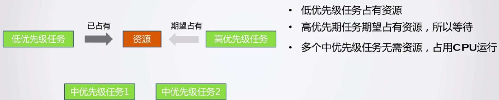

# TinyOS笔记

​	用于记录编写TinyOS中的一些笔记和知识点。

[TOC]


## C1

### 内存地址和内存存放的数据

​	STM32是小端模式，然后有以下代码。

```c
typedef struct _BlockType_t
{
	unsigned long *stackPtr;
}BlockType_t;

BlockType_t *blockPtr;
unsigned long stackBuffer[1024];
BlockType_t block;

block.stackPtr = &stackBuffer[1024];
blockPtr = &block;
```

​	下图为代码运行起来时的变量值和实际内存中的数据。


​	可以看出，存放`block`的地址为`0x20000008`，里面存放的数据为`0x20001010`，而它就是`stackPtr`的值，即`stackBuffer[1024]`对应的地址值（虽然1024本身已经超出了`stackBuffer`的索引范围，最大为`stackBuffer[1023]`，但是他相当于`stackBuffer[0]`再偏移1024个`long`的长度）。

​	而`blockPtr`为指向`block`的指针，所以它里面存放的值为`0x20000008`，而`blockPtr`又存放在哪里呢？从内存数据可以看出，实际`blockPtr`是存放在`0x20000000`中。

​	**理解这个问题的关键还是需要很清楚的理解地址和地址中存放的数的问题。上述问题中甚至还涉及到存放地址的存储空间的地址值，二级指针的问题**。

### ARM中访存指令

​	LDR指令为把数据从内存加载到寄存器；STR指令为把数据从寄存器保存到内存，

```assembly
ldr r1, [r0]		; r1 = *r0
str r1, [r0]		; *r0 = r1 
str r1, [r0, #4]	; *(r0+4) = r1 
```

​	LDM和STM为上述两个批量操作的指令。多寄存器的Load和Store指令分为2组：一组用于数据的存储与读取，对应于IA、IB、DA、DB，一组用于堆栈操作，对应于FD、ED、FA、EA，两组中对应的指令含义相同。有：STMIB（地址先增而后完成操作）、STMFA（满递增堆栈）；STMIA（完成操作而后地址递增）、STMEA（空递增堆栈）；STMDB（地址先减而后完成操作）、STMFD（满递减堆栈）；STMDA（完成操作而后地址递减）、STMED（空递减堆栈）。地址的增减都会以4字节为单位

​	上述各组2个指令含义相同只是适用场合不同，同理有：LDMIB、LDMED；LDMIA、LDMFD；LDMDB、LDMEA；LDMDA、LDMFA。

​	由于指令有点多，这里只介绍**STMDB和IDMIA指令**，STMDB用于将寄存器压栈，LDMIA用于将寄存器弹出栈，作用是保存使用到的寄存器。

```assembly
STMDB R0!, {R4-R11}	; 将R0减4后对应的内存单元，压入R11寄存器的值，然后依次操作，注意顺序为从后到前
LDMIA R0!, {R4-R11}	; 将R0对应的内存单元弹出，存入R4，然后R0加4，然后依次操作，顺序为从前到后
```

​	注意`!`的作用就是R0的值在STM或者LDM过程中发生的增加或者减少最后写回到R0去，也就是说STM或者LDM时会改变R0的值。如果不加`!`，压栈和弹栈的操作还是正常的，但是R0的值不会改变。

​	还有`^`的作用，先记录一下

```assembly
ldmfd sp!, {r0 - r6, pc}

;^的作用：在目标寄存器中有pc时，会同时将spsr写入到cpsr，一般用于从异常模式返回。
ldmfd sp!, {r0 - r6, pc}^
```


## C2 任务切换与时间片

### C2.02	

实现任务切换

#### MSR和MRS指令

​	MRS/MSR 就是专门用于读/写特殊功能寄存器的。包括程序状态寄存器、中断屏蔽寄存器和控制寄存器，它们只能被专用的 MSR 和 MRS 指令访问，而且它们也没有存储器地址。看代码似乎PSP和MSP寄存器也是只能被MRS/MSR，但是在《Cortex-M3权威指南》中没找到相应的说法。

#### PSP与MSP

​	典型的OS环境中，MSP和PSP的用法如下：MSP用于OS内核和异常处理，PSP用于应用任务。

​	就类似于PSP是用户级的堆栈指针，MSP为内核级的堆栈指针。

​	它们对应的都是R13（SP）的值，就类似于OS内核和异常处理时R13 = MSP，应用任务是R13 = PSP。

#### LR寄存器


​	LR（R14）寄存器作用主要有两个：

- 用来保存子程序的返回地址； 当使用BL或BLX指令调用子程序时，硬件自动将子程序返回地址保存在R14寄存器中。子程序返回时，把R14的值复制到程序计数器PC，即可实现子程序返回，一般使用指令`BX LR`或者`MOV PC, LR`，它们是等价的。

- 当异常发生时，R14中保存的值等于异常发生时程序计数器PC的值减4（因为cortex-m3采用3级指令流水线）。因此在异常模式下，可以根据R14的值返回到异常发生前的相应位置，继续执行。

### C2.03 时间片运行原理


### C2.04 任务延时与空闲任务

#### ORR LR, LR, #0x04 的问题

```C
    // 不是很懂这个操作？？？
    // 感觉这个解释有点类似于linux中CS的当前特权级CPL，但是还没有找到官方的解释
    ORR LR, LR, #0x04       // 标记下返回标记，指明在退出LR时，切换到PSP堆栈中(PendSV使用的是MSP) 
```

​	以及R0-R3是怎么存的问题。

#### 任务上下文切换的理解

​	首先对于裸板程序，在mian函数和异常中使用的是MSP，而在实际的任务函数（tTask1和tTask2）中使用的PSP，感觉main函数和异常就类似于是内核级的函数。

​	一开始运行是R13 = MSP，包括在PendSV_Handler函数中，我们需要自己对PSP进行初始化和手动赋值操作。我们的上下文切换的流程图如下所示。


​	图中所示为任务切换函数需要完成的事情。相应的代码如下所示：

```C
__asm void PendSV_Handler(void)
{
    IMPORT currentTask
    IMPORT nextTask
    // 对当前任务保存现场
    
    MRS R0, PSP             // 读取PSP的值，即当前任务的栈顶
    CBZ R0, PendSVHander_nosave
    
    STMDB R0!, {R4-R11}     // 压栈

    LDR R1, =currentTask
    LDR R1, [R1]
    STR R0, [R1]            // 将R0赋值给tTask的stack
    // 这个最后PSP的没有被写入，也就是说PSP这个时候并没有指向该任务的栈顶
    // 但是好像也没有这个必要，因为马上就要切换到另外一个任务了

    // 对下一个任务还原现场
PendSVHander_nosave
    
    LDR R0, =currentTask
    LDR R1, =nextTask
    LDR R2, [R1]
    STR R2, [R0]            // 将currentTask的值置为nextTask。
    // 这段操作结束，nextTask的值还是没有变，nextTask的值是是由tTaskSched函数改变的
        
    LDR R0, [R2]            // 获取当前任务的栈顶

    LDMIA R0!, {R4-R11}     // 出栈
    MSR PSP, R0             // 将R0(栈顶指针)写入PSP
    // 感觉这个解释有点类似于linux中CS的当前特权级CPL，但是还没有找到官方的解释
    ORR LR, LR, #0x04       // 标记下返回标记，指明在退出LR时，切换到PSP堆栈中(PendSV使用的是MSP) 
    BX LR
}
```

​	首先看任务刚刚初始化的时候，则PSP为0，会直接进入恢复现场的操作，这个地方恢复就是我们初始化的压栈的东西（个人觉得初始化除了函数入口和参数的之外压栈的数值可以随便），例如R4 = 0x4、R11 = 0x11，如下所示：

```c
void tTaskInit(tTask *task, void (*entry)(void *), void *param, tTaskStack *stack)
{
    *(--stack) = (unsigned long)(1 << 24);
    *(--stack) = (unsigned long)entry;
    *(--stack) = (unsigned long)0x14;
    *(--stack) = (unsigned long)0x12;
    *(--stack) = (unsigned long)0x3;
    *(--stack) = (unsigned long)0x2;
    *(--stack) = (unsigned long)0x1;
    *(--stack) = (unsigned long)param;
    *(--stack) = (unsigned long)0x11;
    *(--stack) = (unsigned long)0x10;
    *(--stack) = (unsigned long)0x9;
    *(--stack) = (unsigned long)0x8;
    *(--stack) = (unsigned long)0x7;
    *(--stack) = (unsigned long)0x6;
    *(--stack) = (unsigned long)0x5;
    *(--stack) = (unsigned long)0x4;
    task->stack = stack;
    task->delayTicks = 0;
}
```

然后注意`MSR PSP, R0`的操作，PSP就指向的当前任务的栈顶了，然后需要注意`ORR LR, LR, #0x04`指令就是将标记下返回标记，指明在退出LR时，切换到PSP堆栈中（==这个目前还没有找到官方说明，大概类似于linux0.1中的CS的当前特权级CPL==）。然后系统就切换到使用PSP了，同时每次进入PendSV中断，系统应该会自动切换到MSP。然后就是`BX LR`指令，这里的LR寄存器的值并非当前任务函数的入口，==我觉得是中断函数返回硬件会自动对R13（PSP）进行弹栈操作，而我们任务初始化压栈的`entry`才是最后会赋值给PC的值，这个地方还需要进一步求证，还不是很清楚==。同时我最开始在思考为什么这个地方没有给tTask1->stack给赋值，因为这个时候它就不是指向栈顶了，后来发现没有必要，因为不进行任务切换时一直是再对PSP操作，而在任务切换的保存现场时，才会对tTask1->stack进行赋值操作。

​	之后就是tTask1进入阻塞态，需要切换到tTask2，==在进入PendSV中断前，似乎硬件会对当前任务进行压栈操作，代码中PSP直接从0x20002024变成0x20002000了，具体压了什么还不是很清楚。==在这个PendSV_Handler函数中`CBZ R0, PendSVHander_nosave`判断就会失效，进行任务保护现场操作，压栈操作后，把当前栈顶赋值给tTask1->stack。同样的，最开始我在思考为什么这个地方不需要把栈顶的值赋值给PSP，其实就很愚蠢，因为这是在做任务切换，马上PSP就要指向下一个任务的栈顶了，所以要弄明白PSP和tTask->stack使用的时候。

​	之后就是tTask2的现场还原了。

​	==这个地方最大的问题是进入中断和出中断硬件直接压栈和出栈的内容。==

#### 对于函数调用的理解

​	函数调用和任务切换不一样，在不考虑中断的情况下，函数是整个的运行整体，而任务虽然本质也是一个函数，但是它可能运行到一半就被打断而去运行另外一个任务了，所以任务的切换就涉及比较复杂的保护现场和还原现场的问题。但是函数调用也涉及函数参数传递的问题。

​	ARM中当一个函数调用使用少量参数时，参数是通过r0,r1,r2,r3寄存器进行传值，而当参数多于4个时，会将多出的参数压入栈中进行传递。具体来说，对于少于等于4的情况就比较简单，没有什么多余的操作，直接把参数分别存入r0-r3中即可，返回使用`BX LR`返回原来的地方。

​	当多余4个参数时，假设5个参数，会使用`STR r0,[sp,#0X00]`将第五个参数压栈，注意这个地方没有对栈顶操作，我观察STM32里面是在编译的时候就会根据你里面的函数的所需要的最大的堆栈数，一开始就分配对应的栈空间，比如

```C
// 假设栈向低地址增长
int main()
{
    // 其对应栈顶假设为0x2004
    return 0;
}

int main()
{
    // 此处编译的时候栈顶就为0x2000，对于一个地方预留给参数5的。
    test(1, 2, 3, 4, 5);
    return 0;
}
```

​	有两个问题：

- ==观察函数调用里面，如果有用到R4及以上的寄存器时，都有进行保护现场，但是为什么R0~R3就不需要保护？==
- ==LR的值是硬件主动完成的修改的吗？==

## C3 内核核心实现

### C3.01 临界区保护 

​	由于共享资源的访问存在于任务与任务之间、任务与中断ISR之间；那么，只需要防止任务在访问共享资源时，切换至其它任务或防止中断发生。

​	使用关中断的方法实现临界区保护问题，注意关中断嵌套的问题，通过第二种方法保存中断使能配置的方法，实现嵌套。


​	代码如下所示。

```C
// 使用关中断的方法实现临界区
// 我印象中关中断对于多核CPU无效吧？
uint32_t tTaskEnterCritical(void)
{
    uint32_t primask = __get_PRIMASK();
    __disable_irq();
    return primask;
}

void tTaskExitCritical(uint32_t status)
{
    __set_PRIMASK(status);
}
```

​	这种方法不太好，关中断的时间太长会导致一些事件无法得到及时的处理

### C3.02 调度锁保护

​	调度锁，上锁后禁止任务调度，主要用于任务之间的数据共享的线程安全。同时调度锁中要有一个自增计数器，来解决调度锁的嵌套问题。

​	这里面还是保留的关中断保证原子性操作的方式，但是对于任务与任务之间的共享数据采用调度锁禁止任务切换。

​	==在这个课程中，我不是很懂`tTaskSchedEnable`函数中为什么完全解锁后要调用调度函数，一般不是只有时间片轮转和任务进入阻塞态才会调度吗？==

### C3.03 位图数据结构

​	位图的数据结构，包括实现初始化、对指定位置位、对指定位清零和查找最近1的位置的功能。

### C3.04 多优先级任务

​	实现多优先级任务，==需要详细记录一下实现的思路==。


​	这个地方就需要首先定义一个位图（就绪位图）`taskPrioBitmap`和一个任务数组`taskTable`，其中位图的索引和任务数组的索引是对应，也就是说高优先级任务的索引值就越小。

- 把任务加入任务数组需要根据任务的优先级把任务加入就绪表，同时把就绪位图对应的位置1；
- 当任务加入阻塞态，比如因为调用了延时函数，只把任务移除只需要把就绪位图对应的位置0即可；

​	同时需要实现一个找到高优先级就绪任务的函数，这个就可以使用位图中查找最近1的函数高效实现；在SysTick中断定时器中，就需要遍历任务数组，对所有延时大于0的任务进行减一操作。

```c
// 获取当前最高优先级且可运行的任务
tTask * tTaskHighestReady(void)
{
    uint32_t highestPrio = tBitmapGetFirstSet(&taskPrioBitmap);
    return taskTable[highestPrio];
}
```

​	这个tTaskHighestReady函数在系统调度器tTaskSched中调用，用于寻找一下个任务。

```C
void tTaskSched(void)
{
    tTask * tempTask;
    // 进入临界区，以保护在整个任务调度与切换期间，不会因为发生中断导致currentTask和nextTask可能更改
    uint32_t status = tTaskEnterCritical();
    // 调度锁
    if(schedLockCount > 0){
        tTaskExitCritical(status);
        return;
    }
	// 寻找下一个任务
    tempTask = tTaskHighestReady();
    if(tempTask != currentTask){
        nextTask = tempTask;
        tTaskSwitch();
    }
    // 退出临界区
    tTaskExitCritical(status); 
}
```


### C3.05 双向链表数据结构

​	双向链表的实现，这个链表和我之前想的有点不一样，它是有专门的头结点的，第一个结点的`PreNode`和最后一结点的`NextNode`都指向头结点，而并非指向空结点，难道双向链表一般都会这样实现的吗？

​	这个就是双向链表的结构图示，而且它是一个纯的链表结构，里面有没有任何其他数据。


​	双向链表的结构体：

```C
// 链表的结点类型
typedef struct _tNode
{
    struct _tNode *preNode;
    struct _tNode *nextNode;
}tNode;

// 目前感觉这个nodeCount有点冗余，只有头结点有用
typedef struct _tList
{
    tNode headNode;
    uint32_t nodeCount;
}tList;
```

​	对于这个双向链表需要实现基本的查询功能、头插、尾插、删除头结点、删除尾结点、在指定的结点后插入结点等功能。	

​	在后期会在任务结构体中放入这个链表的结点，而我们需要如何通过链表结点访问到该任务结构体，下图就展示了计算方法。就是在0内存定义一个结构体，然后它的里面的变量的地址就刚好就它相对结构体头部的偏移量。

```c
// 获取结点所在的父struct结构首地址
// node为实际结点的地址 
// parent为放入tNode的结构体名
// name为parent中tNode对应的变量名
#define tNodeParent(node, parent, name) (parent *)((uint32_t)node - (uint32_t)&((parent *) 0)->name)
```


### C3.06 任务延时队列

​	使用双链表实现任务延时队列，这样在SysTick中断定时器中，只需要对延时队列进行操作，不需要对整个任务数组进行遍历。如下所示。


​	首先之前的就绪位图表和任务数组在这里可以看做是就绪的队列，使用双向链表来构建延时队列。

- 当任务延时时，需要将任务加入延时队列，同时将其的就绪位图表对应的位置置0，并且把任务数组的对应位置清除，指向0地址。
- 当任务延时结束后，将任务移除延时队列，同时加入就绪队列中，即根据任务的优先级把任务加入就绪表，同时把就绪位图对应的位置1。

```C
// 延时队列
tList tTaskDelayedList;
// 任务阻塞
void tTimeTaskWiat(tTask *task, uint32_t ticks)
{
    task->delayTicks = ticks;
    task->state = TINYOS_TASK_STATE_DELAYED;
    tListAddFirst(&tTaskDelayedList, &(task->delayNode));
}
// 任务唤醒
void tTimeTaskWakeUp(tTask *task)
{
    task->state = TINYOS_TASK_STATE_RDY;
    tListRemove(&tTaskDelayedList, &(task->delayNode));
}
```

​	所以在定时中断中，只需要对延时队列进行操作。同时我们需要根据结点找到对应任务的地址，具体的遍历过程如下所示。


```c
typedef struct _tTask
{
	// 任务所用堆栈的当前堆栈指针。每个任务都有他自己的堆栈，用于在运行过程中存储临时变量等一些环境参数
    tTaskStack * stack;
	// 任务延时计数器
	uint32_t delayTicks;
	// 延时结点：通过delayNode就可以将tTask放置到延时队列中
	tNode delayNode;
	// 任务当前状态
	uint32_t state;
	// 任务优先级
	uint32_t prio;
}tTask;

for(node = tTaskDelayedList.headNode.nextNode; node != &(tTaskDelayedList.headNode); node = node->nextNode)
{
    tTask *task = tNodeParent(node, tTask, delayNode);
    if(--task->delayTicks == 0){
        // 将任务从延时队列中移除
        tTimeTaskWakeUp(task);
        // 将任务恢复到就绪状态
        tTaskSchedRdy(task);  
    }
}
```

​	同时还有递增的延时队列的方法，其中任务一延时1，任务二延时3，任务三延时103。


​	在systick定时中断时每次只需要对延时队列中第一个任务进行减一操作，但是在插入任务时，需要遍历链表找到它插入的位置，并且对后面的结点进行调整，比如在上述链表中插入一个延时为73的任务4，这它需要插入到任务2之后，然后延时时间改为73 - 1 - 2 = 70，然后将它后面的任务3的延时时间改为100 - 70 = 30,。

### C3.07 同优先级时间片运行

​	实现同一优先级任务时间片轮转调度。

​	具体的实现方法如下所示。


​	之前的`taskTable`任务表为tTask的数组，而为了实现上述功能，`taskTable`需要是一个tList的数组，每一个都是一个双向链表，`taskTable`中存放的是每个链表的链表头，用来存放同一优先级的任务。

​	首先一定要分清楚任务结构体和它里面的链表结点的关系，所以放在`taskTable`中的结点就应该在`tTask`中新设置一个变量`linkNode`。同时每个任务的`tTask`中还需要一个变量存放剩余的时间片长度。

```c
// 所有任务的指针数组
tList taskTable[TINYOS_PRO_COUNT];

typedef struct _tTask {
	// stack保存了最后保存环境参数的地址位置，用于后续恢复
    tTaskStack * stack;
    // 连接结点
    tNode linkNode;
    // 任务延时计数器
    uint32_t delayTicks;
    // 延时结点：通过delayNode就可以将tTask放置到延时队列中
    tNode delayNode;
    // 任务的优先级
    uint32_t prio;
    // 任务当前状态
    uint32_t state;
    // 当前剩余的时间片
    uint32_t slice;
 }tTask;
```

​	需要注意它的运行逻辑：

- 当任务的进入就绪态时，需要将它移出延时队列（使用tTimeTaskWait函数对delayNode操作），同时需要根据它的优先级放入到对应的就绪任务表的链表中（使用tTaskSchedUnRdy函数对linkNode操作），这里使用尾插法。
- 当任务进入延时时，需要将其从就绪任务表中的链表中移出，然后将其插入延时队列。

```C
// 注意删除和插入操作，都是需要知道对应的链表的头节点的
// 对于就绪队列的插入，需要根据优先级插入对应的就绪队列中
// 在tTask结构体中linkNode代表了任务的结点
// prio恰好代表该任务在taskTable中对应的索引
// 利用tTask中的linkNode和prio就可以实现就绪队列的插入和移出

// 将任务设置为就绪状态
void tTaskSchedRdy(tTask *task)
{
    tListAddLast(&taskTable[task->prio], &(task->linkNode));
    tBitmapSet(&taskPrioBitmap, task->prio);
}
// 将任务从就绪列表中移除
void tTaskSchedUnRdy(tTask *task)
{
    tListRemove(&taskTable[task->prio], &(task->linkNode));
    if(taskTable[task->prio].nodeCount == 0){
        tBitmapClear(&taskPrioBitmap, task->prio);
    }
}
```

- 对于时间片轮转的实现，需要在定时中断中判断当前任务的时间片是否到时，如果到时，这需要将当前任务移出就绪链表，然后尾插入这个就绪链表，即有一个轮转的过程。然后在`tTaskSched`函数中每次去优先级最高的链表的首结点即可。

```C
void tTaskSystemTickHandler()
{
    tNode *node;
    // 对延时队列进行遍历，对延时进行自减
    //... 省略
        
    // 检查下当前任务的时间片是否已经到了
    if(--currentTask->slice == 0){
        // 这个判断似乎不多余，有可能currentTask刚好被移出就绪队列，然后就进入了定时中断
        if(taskTable[currentTask->prio].nodeCount > 0){
            tListRemoveFirst(&taskTable[currentTask->prio]);
            tListAddLast(&taskTable[currentTask->prio], &(currentTask->linkNode));
            currentTask->slice = TINYOS_SLICE_MAX;
        }
    }
    // 这个过程中可能有任务延时完毕(delayTicks = 0)，进行一次调度。
    tTaskSched();
}

// 任务调度接口。tinyOS通过它来选择下一个具体的任务，然后切换至该任务运行。
void tTaskSched(void)
{
    tTask * tempTask;
    // 进入临界区，以保护在整个任务调度与切换期间，不会因为发生中断导致currentTask和nextTask可能更改
    // ...省略
 
    // 获取最高优先级的就绪队列的第一个任务
    tempTask = tTaskHighestReady();
    if(tempTask != currentTask){
        nextTask = tempTask;
        tTaskSwitch();
    }
    // 退出临界区
    tTaskExitCritical(status); 
}

// 获取当前最高优先级且可运行的任务
// 获取最高优先级的任务链表中的第一个结点对应的任务，注意不是头结点，是头结点的下一个节点
tTask * tTaskHighestReady(void)
{
    uint32_t highestPrio = tBitmapGetFirstSet(&taskPrioBitmap);
    tNode *node = (taskTable[highestPrio].headNode.nextNode);
    return tNodeParent(node, tTask, linkNode);
}
```

​	在之后这些操作，获取父结构体的地址值的宏定义`tNodeParent`就有很大的作用了。编写时一定要注意变量和变量的指针的问题，不要混淆了。


## C4 任务的挂起与唤醒

### C4.01 任务的挂起与唤醒

​	实现任务的挂起与唤醒。


​	下面为任务状态变化图


​	具体实现代码如下所示：

```C
// 在tTask中增加被挂起的次数的变量
typedef struct _tTask
{
    // ...
	uint32_t suspendCount;
    // ...
}tTask;

void tTaskSuspend(tTask *task)
{
    // 进入临界区
    uint32_t status = tTaskEnterCritical();
    // 如果对于已经在DELAYED状态的任务，将无法挂起，但确实存在这种需求，还需要改进
    if(!(task->state & TINYOS_TASK_STATE_DELAYED))
    {
        // 任务只能被挂起一次
        // 单纯改变任务状态，并将其移除就绪队列，没有用链表对挂起任务进行管理
        if(++task->suspendCount <= 1)
        {
            task->state |= TINYOS_TASK_STATE_SUSPEND;
            tTaskSchedUnRdy(task);
            // 自己挂起自己需要引起调度，调用tTaskSched函数
            if(task == currentTask){
                tTaskSched();
            }
        }
    }
    // 退出临界区
    tTaskExitCritical(status);
}
```

​		注意如果出现自己挂起自己的情况的话，需要调用`tTaskSched`函数。

### C4.02 任务的删除

​	实现任务删除的功能。


### C4.03 任务的状态查询

​	实现任务状态的查询。专门定义了一个结构体用来存放用来查询的任务状态，这样可以一下获取全部的任务状态。


## C5 事件控制块

### C5.01 事件控制块的原理与创建

​	这里实现事件控制块的功能，为后期方便实现信号量、消息队列和事件标志等做准备，用来解决下面这些问题。


​	它的工作过程如下图所示：


​	它的结构和核心功能如下所示：


​	目前事件控制块的结构体如下所示：

```C
// Event控制结构
typedef struct _tEvent {
    tEventType type;						// Event类型，比如信号量和消息队列为不同的类型
    tList waitList;							// 任务等待列表
}tEvent;

void tEventInit (tEvent *event, tEventType type)
{
    event->type = type;
    tListInit(&event->waitList);
}
```

### C5.02 事件的等待与通知

​	加入了等待事件的任务切换图：


​	具体的操作流程：


​	在tTask结构体中新增一些变量：

```C
typedef struct _tTask
{
    // ... 省略
    
    // 任务被删除时调用的清理函数
    void (*clean)(void *param);
    // 传递给清理函数的参数
    void *cleanParam;
    
    // 事件控制块相关
    // 请求删除标志，非0表示请求删除
    uint8_t requestDeleteFlag;
    // 任务正在等待的事件类型
    struct _tEvent *waitEvent;
    // 等待事件的消息存储位置
    void *eventMsg;
    // 等待事件的结果
    uint32_t waitEventResult;
}tTask;
```

​	事件控制块的相关操作：

```C
// 让指定在事件控制块上等待事件发生
void tEventWait (tEvent *event, tTask *task, void *msg, uint32_t state, uint32_t timeout)
{
    // 进入临界区
    uint32_t status = tTaskEnterCritical();
    task->state |= state;           // 标记任务处于等待某种事件的状态
    task->waitEvent = event;        // 设置任务等待的事件结构
    task->eventMsg = msg;           // 设置任务等待事件的消息存储位置 
                                    // 因有时候需要接受消息，所以需要接受区
    task->waitEventResult = tErrorNoError;  // 清空事件的等待结果
    // 将任务从就绪队列中移除
    tTaskSchedUnRdy(task);
    // 将任务插入到等待队列中
    tListAddLast(&event->waitList, &task->linkNode);
    // 如果发现有设置超时，在同时插入到延时队列中
    // 当时间到达时，由延时处理机制负责将任务从延时列表中移除，同时从事件列表中移除
    if (timeout) {
        tTimeTaskWait(task, timeout);
    }
  // 退出临界区
    tTaskExitCritical(status); 
}

// 从事件控制块中唤醒首个等待的任务
tTask *tEventWakeUp (tEvent *event, void *msg, uint32_t result)
{
    tNode *node;
    tTask *task = (tTask *)0;
    // 进入临界区
    uint32_t status = tTaskEnterCritical();
    // 取出等待队列中的第一个结点
    if((node = tListRemoveFirst(&event->waitList)) != (tNode *)0){
        // 转换为相应的任务结构                                          
        task = (tTask *)tNodeParent(node, tTask, linkNode);
        // 设置收到的消息、结构，清除相应的等待标志位
        task->waitEvent = (tEvent *)0;
        task->eventMsg = msg;
        task->waitEventResult = result;
        task->state &= ~TINYOS_TASK_WAIT_MASK;
        // 任务申请了超时等待，这里检查下，将其从延时队列中移除
        if (task->delayTicks != 0){ 
            tTimeTaskWakeUp(task);
        }
        // 将任务加入就绪队列
        tTaskSchedRdy(task);        
    }  
    // 退出临界区
    tTaskExitCritical(status); 
    return task;         
}

// 将任务从其等待队列中强制移除
// 移除后任务就单出来了，不属于任何一个队列
// 但是之后会调用其他函数，把队列加入对应的就绪队列中
void tEventRemoveTask (tTask *task, void *msg, uint32_t result)
{     
 	// 进入临界区
    uint32_t status = tTaskEnterCritical();
	 // 将任务从所在的等待队列中移除
	 // 注意，这里没有检查waitEvent是否为空。既然是从事件中移除，那么认为就不可能为空
	 tListRemove(&task->waitEvent->waitList, &task->linkNode);
  	// 设置收到的消息、结构，清除相应的等待标志位
    task->waitEvent = (tEvent *)0;
    task->eventMsg = msg;
   	task->waitEventResult = result;
	task->state &= ~TINYOS_TASK_WAIT_MASK;
	// 退出临界区
    tTaskExitCritical(status); 
}
```

​	其他部分的主要修改：

```C
void tTaskSystemTickHandler()
{
    tNode *node;

    for(node = tTaskDelayedList.headNode.nextNode; node != &(tTaskDelayedList.headNode); node = node->nextNode){
        tTask *task = tNodeParent(node, tTask, delayNode);
        if(--task->delayTicks == 0){
            // 如果任务还处于等待事件的状态，则将其从事件等待队列中移除
            if (task->waitEvent) {
                // 此时，消息为空，等待结果为超时
                tEventRemoveTask(task, (void *)0, tErrorTimeout);
            }
            // 将任务从延时队列中移除
            tTimeTaskWakeUp(task);
            // 将任务恢复到就绪状态
            tTaskSchedRdy(task);  
        }
    }
    // 检查下当前任务的时间片是否已经到了
    // ... 省略

    // 这个过程中可能有任务延时完毕(delayTicks = 0)，进行一次调度。
    tTaskSched();
}
```

### C5.03 事件控制块的清空

​	清除事件控制块


## C6 信号量

#### C6.01 信号量的原理与创建	

​	信号量是操作系统提供给用户使用的一种机制，帮助用户进程协调使用资源，用于实现实现任务的同步或者资源共享功能。实现信号量，信号量的操作主要包括初始化、信号量获取、信号量释放、信号量删除和查询信号量状态。

​	信号量的结构：


​	代码如下：

```C
// 信号量类型
typedef struct _tSem 
{
    // 事件控制块
    // 该结构被特意放到起始处，以实现tSem同时是一个tEvent的目的
    tEvent event;
    // 当前的计数
    uint32_t count;
    // 最大计数
    uint32_t maxCount;
}tSem;

void tSemInit(tSem *sem, uint32_t startCount, uint32_t maxCount) 
{
    tEventInit(&sem->event, tEventTypeSem);
    sem->maxCount = maxCount;
    // 代表计数值没有限制
    if (maxCount == 0){
        sem->count = startCount;
    } 
    else{
        sem->count = (startCount > maxCount) ? maxCount : startCount;
    }
}
```

#### C6.02 信号量的获取与释放

​	信号量简而言之就是一个带事件控制的计数器，在其上定义了三个操作：

- 可以被初始化一个非负数
- wait操作：若该值为0，则执行操作的任务等待；否则将计数值减1
- notify操作：将信号量的值增1后，若该值为非正，则执行操作的任务唤醒


​	wait操作相当于信号量的获取，相当于消费者；Notify操作相当于信号量的释放，相当于生产者。

```C
// 等待信号量
// 相当于消费者
uint32_t tSemWait (tSem *sem, uint32_t waitTicks)
{
    uint32_t status = tTaskEnterCritical();
    // 首先检查信号量计数是否大于0
    if (sem->count > 0){
        // 如果大于0的话，消耗掉一个，然后正常退出
        --sem->count;
    	tTaskExitCritical(status); 
    	return tErrorNoError;
    }
    else{ 
        // 然后将任务插入事件队列中
        // TODO:没有很懂传入的state和最后赋值的currentTask->waitEventResult的值
        tEventWait(&sem->event, currentTask, (void *)0,  tEventTypeSem, waitTicks);                         		tTaskExitCritical(status);
        // 最后再执行一次事件调度，以便于切换到其它任务
        tTaskSched();
        // 当由于等待超时或者计数可用时，执行会返回到这里，然后取出等待结构
        return currentTask->waitEventResult;
    }
}
// 获取信号量，如果信号量计数不可用，则立即退回
// 无等待的消费者
uint32_t tSemNoWaitGet(tSem *sem)
{
    uint32_t status = tTaskEnterCritical();
    // 首先检查信号量计数是否大于0
    if (sem->count > 0) {              
        // 如果大于0的话，消耗掉一个，然后正常退出
        --sem->count; 
        tTaskExitCritical(status);
        return tErrorNoError;
    } else {
        // 否则，返回资源不可用
        tTaskExitCritical(status);
        return tErrorResourceUnavaliable;
    }    
}
// 通知信号量可用，唤醒等待队列中的一个任务，或者将计数+1
// 相当于生产者
void tSemNotify (tSem *sem)
{
    uint32_t status = tTaskEnterCritical();        
    // 检查是否有任务等待
    if (tEventWaitCount(&sem->event) > 0){
        // 如果有的话，则直接唤醒位于队列首部（最先等待）的任务
        tTask *task = tEventWakeUp(&sem->event, (void *)0, tErrorNoError);
        // 如果这个任务的优先级更高，就执行调度，切换过去
        if (task->prio < currentTask->prio){
            tTaskSched(); 
        }
    }
    else{
        // 如果没有任务等待的话，增加计数
        ++sem->count;
        // 如果这个计数超过了最大允许的计数，则递减
        if ((sem->maxCount != 0) && (sem->count > sem->maxCount)){	
            sem->count = sem->maxCount;
        }
    }
    tTaskExitCritical(status);
}
```

​	目前信号量的实现方式，是优先唤醒事件控制队列中首个任务，即最先放入事件控制块的，然后插入到对应就绪队列的末尾，等待调度。如果唤醒的是高优先级的任务，则直接调度到刚刚唤醒的高优先级任务，因为这时候高优先级就绪队列中只可能有刚刚唤醒的任务。

#### C6.03 信号量的删除与状态查询


## C7 邮箱

#### C7.01 邮箱的原理和创建

​	邮箱就类似于消息队列，它的功能如下所示：


- 如果邮箱中没消息的话，则请求任务可以在邮箱中形成等待队列
- 如果有消息的话，可以在邮箱中实现消息的缓存

它的实现原理如下所示：


```C
// 邮箱类型
typedef struct _tMbox
{
    // 事件控制块
    // 该结构被特意放到起始处，以实现tSem同时是一个tEvent的目的
    tEvent event;
    // 当前的消息数量
    uint32_t count;
    // 读取消息的索引
    uint32_t read;
    // 写消息的索引
    uint32_t write;
    // 最大允许容纳的消息数量
    uint32_t maxCount;
    // 消息存储缓冲区
    void ** msgBuffer;
}tMbox;

// 初始化邮箱
void tMboxInit (tMbox *mbox, void **msgBuffer, uint32_t maxCount) 
{
    tEventInit(&mbox->event, tEventTypeMbox);
    mbox->msgBuffer = msgBuffer;
    mbox->maxCount = maxCount;
    mbox->read = 0;
    mbox->write = 0;
    mbox->count = 0;
}

// 初始化案例
void *mbox1MsgBuffer[20];
tMboxInit(&mbox1, mbox1MsgBuffer, 20);
```

#### C7.02 邮箱的获取与释放

​	邮箱的获取和释放：


```C
// 等待邮箱, 获取一则消息
uint32_t tMboxWait(tMbox *mbox, void **msg, uint32_t waitTicks) 
{
    uint32_t status = tTaskEnterCritical();
    // 首先检查消息计数是否大于0
    if (mbox->count > 0){
    	// 如果大于0的话，取出一个
        --mbox->count;
        *msg = mbox->msgBuffer[mbox->read++];
        // 同时读取索引前移，如果超出边界则回绕
        if (mbox->read >= mbox->maxCount){
        	mbox->read = 0;
        }
    	tTaskExitCritical(status); 
    	return tErrorNoError;
    }
    else{ 
         // 然后将任务插入事件队列中
        tEventWait(&mbox->event, currentTask, (void *)0,  tEventTypeMbox, waitTicks);
        tTaskExitCritical(status);
        // 最后再执行一次事件调度，以便于切换到其它任务
        tTaskSched();
        // 当切换回来时，从tTask中取出获得的消息
        *msg = currentTask->eventMsg;
        // 取出等待结果
        return currentTask->waitEventResult;
    }
}

// 获取一则消息，如果没有消息，则立即退回
uint32_t tMboxNoWaitGet(tMbox *mbox, void **msg)
{
    uint32_t status = tTaskEnterCritical();
    // 首先检查消息计数是否大于0
    if (mbox->count > 0){
        // 如果大于0的话，取出一个
        --mbox->count;
        *msg = mbox->msgBuffer[mbox->read++];
        // 同时读取索引前移，如果超出边界则回绕
        if (mbox->read >= mbox->maxCount){
            mbox->read = 0;
        }
        tTaskExitCritical(status); 
        return tErrorNoError;
    }
    else{
        // 否则，返回资源不可用
        tTaskExitCritical(status);
        return tErrorResourceUnavaliable;
    }    
}

// 通知消息可用，唤醒等待队列中的一个任务，或者将消息插入到邮箱中
uint32_t tMboxNotify(tMbox *mbox, void *msg, uint32_t notifyOption)
{
    uint32_t status = tTaskEnterCritical();        
    // 检查是否有任务等待
    if (tEventWaitCount(&mbox->event) > 0){
        // 如果有的话，则直接唤醒位于队列首部（最先等待）的任务
        tTask *task = tEventWakeUp(&mbox->event, (void *)msg, tErrorNoError );
        // 如果这个任务的优先级更高，就执行调度，切换过去
        if (task->prio < currentTask->prio){
            tTaskSched(); 
        }
    }
    else{
        // 如果没有任务等待的话，将消息插入到缓冲区中
        if (mbox->count >= mbox->maxCount){
            tTaskExitCritical(status);
            return tErrorResourceFull;
        }
        // 可以选择将消息插入到头，这样后面任务获取的消息的时候，优先获取该消息
        // 开放这个功能，使得高优先级任务存入消息时可以放在队列前面，优先被获取
        if (notifyOption & tMBOXSendFront){
            if (mbox->read <= 0){
                mbox->read = mbox->maxCount - 1;
            } 
            else{
                --mbox->read;
            }
            mbox->msgBuffer[mbox->read] = msg;
        }
        else{
            mbox->msgBuffer[mbox->write++] = msg;
            if (mbox->write >= mbox->maxCount){
                mbox->write = 0;
            }
        }
        // 增加消息计数
        mbox->count++;
    }
    tTaskExitCritical(status);
    return tErrorNoError;
}
```

## C8 存储块

​	实现存储块的功能。


​	其中存储块的头部红色区域为存放链表结点的位置，所以每个存储块的大小一定要大于`tNode`的大小。


## C9 事件标志组

​	实现事件标志组。


​	在C9.01中的`tFlagGroupCheckAndConsume()`中判断置零位的操作没有看明白，之后有时间再来看看。

​	现在搞明白了，要清楚`srcFlags`值的含义，srcFlags并不代表实际的标志组，而是其中哪位为1，就代表哪位为isSet的值。


## C10 互斥信号量

#### C10.01 互斥信号量的原理与创建

互斥信号量是来保证共享数据操作的完整性。每个对象都对应于一个可称为" 互斥锁" 的标记，这个标记用来保证在任一时刻，只能有一个线程访问该对象。单纯使用资源为1的信号量模拟互斥信号量时，会出现如下这些问题：

- 不支持嵌套调用；内部有嵌套的话，嵌套部分也无法访问资源
- 不支持所有者，任意任务都能发送notify；其他任务能对信号量进行释放
- 无法解决优先级反转问题

​	优先级反转问题：



​	如果不存在中优先级的任务则优先级反转问题影响不大；但是存在中优先级任务的话，当低优先级任务在占有资源的时候，会被其他不需要该资源的中优先级任务抢占，而此时需要该资源的高优先级任务由于低优先级任务的占有，而被阻塞。如果不解决优先级翻转的问题，则中优先级任务可能会长期占有CPU，导致紧急的高优先级任务无法得到及时的响应。所以如果此时将低优先级的任务的优先级占时提高至于高优先级一致，则中优先级任务就无法抢占了，原来低优先级任务就可以占有CPU使用权快速将资源释放，然后使高优先级任务及时得到响应。

​	互斥信号量的设计原理：


- 用于嵌套调用的锁定次数计数器，释放后判断事件控制块中是否有任务


- 增加拥有者字段，指向当前已经获取信号量的任务
- 支持优先级继承的原始优先级；当高优先级访问资源时，发现低优先级任务已经占有资源，则会将低优先级任务的优先级暂时提升至于自己相同，低优先级加速运行，使得可以尽快释放资源给高优先级任务，中优先级任务没有机会运行，当低优先级任务释放资源后，它将恢复到原来的优先级。

​	互斥量的结构体：

```C
// 互斥信号量类型
typedef struct _tMutex
{
    // 事件控制块
    tEvent event;
    // 已被锁定的次数
    uint32_t lockedCount;
    // 拥有者
    tTask *owner;
    // 拥有者原始的优先级
    uint32_t ownerOriginalPrio;
}tMutex;

// 初始化互斥信号量
void tMutexInit(tMutex *mutex)
{
    tEventInit(&mutex->event, tEventTypeMutex); 
    mutex->lockedCount = 0;
    mutex->owner = (tTask *)0;
    mutex->ownerOriginalPrio = TINYOS_PRO_COUNT;
}
```

#### C10.02 互斥信号量的等待与通知


```C
// 等待信号量
uint32_t tMutexWait(tMutex *mutex, uint32_t waitTicks)
{
    uint32_t status = tTaskEnterCritical();
    if (mutex->lockedCount <= 0){
        // 如果没有锁定，则使用当前任务锁定
        mutex->owner = currentTask;
        mutex->ownerOriginalPrio = currentTask->prio;
        mutex->lockedCount++;
        tTaskExitCritical(status);
        return tErrorNoError;
    }
    else{
        // 信号量已经被锁定
        if (mutex->owner == currentTask){
            // 如果是信号量的拥有者再次wait，简单增加计数
            mutex->lockedCount++;
            tTaskExitCritical(status);
            return tErrorNoError;
        }
        else{
            // 如果是信号量拥有者之外的任务wait，则要检查下是否需要使用
            // 优先级继承方式处理
            // 数值越小，优先级越高
            if (currentTask->prio < mutex->owner->prio){
                tTask * owner = mutex->owner;
                // 如果当前任务的优先级比拥有者优先级更高，则使用优先级继承
                // 提升原拥有者的优先
                if (owner->state == TINYOS_TASK_STATE_RDY){
                    // 任务处于就绪状态时，更改任务在就绪表中的位置
                    tTaskSchedUnRdy(owner);
                    owner->prio = currentTask->prio;
                    tTaskSchedRdy(owner);
                }
                else{
                    // 其它状态，只需要修改优先级
                    owner->prio = currentTask->prio;
                }
            }
            // 当前任务进入等待队列中
            tEventWait(&mutex->event, currentTask, (void *)0, tEventTypeMutex, waitTicks);
            tTaskExitCritical(status);
            // 执行调度， 切换至其它任务
            tTaskSched();
            return currentTask->waitEventResult;
        }
    }
}

// 获取信号量，如果已经被锁定，立即返回
uint32_t tMutexNoWaitGet(tMutex *mutex)
{
    uint32_t status = tTaskEnterCritical();
    if (mutex->lockedCount <= 0){
        // 如果没有锁定，则使用当前任务锁定
        mutex->owner = currentTask;
        mutex->ownerOriginalPrio = currentTask->prio;
        mutex->lockedCount++;
        tTaskExitCritical(status);
        return tErrorNoError;
    }
    else{
        // 信号量已经被锁定
        if (mutex->owner == currentTask){
            // 如果是信号量的拥有者再次wait，简单增加计数
            mutex->lockedCount++;
            tTaskExitCritical(status);
            return tErrorNoError;
        }
        tTaskExitCritical(status);
        return tErrorResourceUnavaliable;
    }
}

// 通知互斥信号量可用
uint32_t tMutexNotify(tMutex *mutex)
{
    uint32_t status = tTaskEnterCritical();
    if (mutex->lockedCount <= 0){
        // 锁定计数为0，信号量未被锁定，直接退出
        tTaskExitCritical(status);
        return tErrorNoError;
    }
    if (mutex->owner != currentTask){
        // 不是拥有者释放，认为是非法
        tTaskExitCritical(status);
        return tErrorOwner;
    }
    if (--mutex->lockedCount > 0){
        // 减1后计数仍不为0, 直接退出，不需要唤醒等待的任务
        tTaskExitCritical(status);
        return tErrorNoError;
    }
    // 是否有发生优先级继承
    if (mutex->ownerOriginalPrio != mutex->owner->prio){
        // 有发生优先级继承，恢复拥有者的优先级
        if (mutex->owner->state == TINYOS_TASK_STATE_RDY){
            // 任务处于就绪状态时，更改任务在就绪表中的位置
            tTaskSchedUnRdy(mutex->owner);
            currentTask->prio = mutex->ownerOriginalPrio;
            tTaskSchedRdy(mutex->owner);
        }
        else{
            // 其它状态，只需要修改优先级
            currentTask->prio = mutex->ownerOriginalPrio;
        }
    }
    // 检查是否有任务等待
    if (tEventWaitCount(&mutex->event) > 0){
        // 如果有的话，则直接唤醒位于队列首部（最先等待）的任务
        // 有点小问题
        tTask * task = tEventWakeUp(&mutex->event, (void *)0, tErrorNoError);
        mutex->owner = task;
        mutex->ownerOriginalPrio = task->prio;
        mutex->lockedCount++;
        // 如果这个任务的优先级更高，就执行调度，切换过去
        if (task->prio < currentTask->prio){
            tTaskSched();
        }
    }
    tTaskExitCritical(status);
    return tErrorNoError;
}
```

​	==在唤醒的过程，如果事件控制块的队列中有中优先级任务和高优先级任务，中优先级任务在队首，那么还是唤醒中优先级任务，而我认为应该唤醒高优先级任务呀？==

## C11 软件定时器

​	==目前关于软件定时器的具体实现代码还没有看==


## C12 RTOS性能测试


## 问题

### 1. 编辑器生成注释模板


### 2.运算符优先级问题

​	&和->


