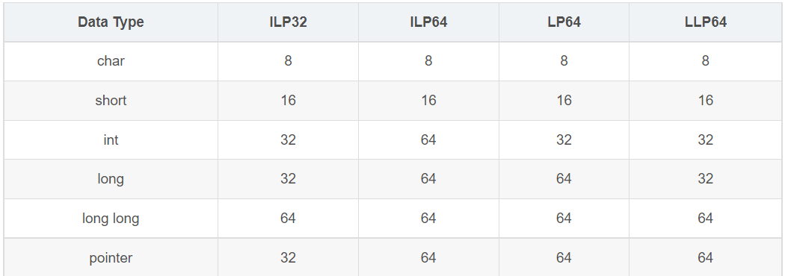
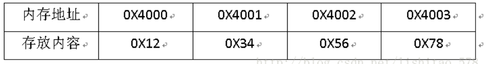
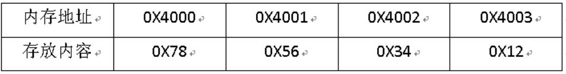
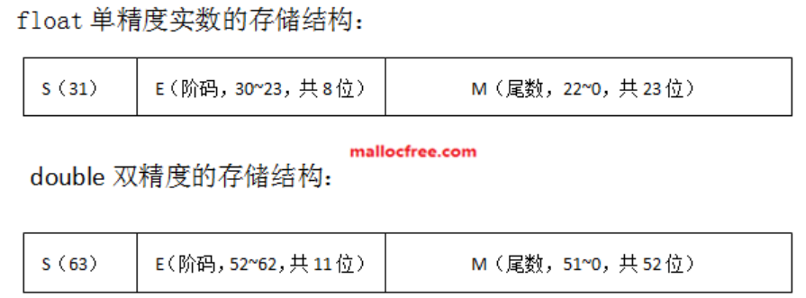
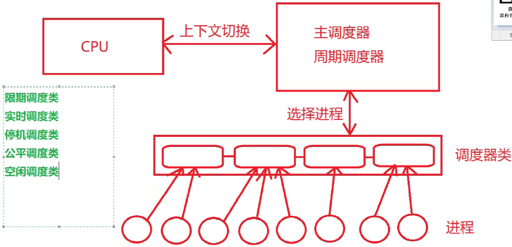
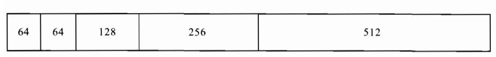
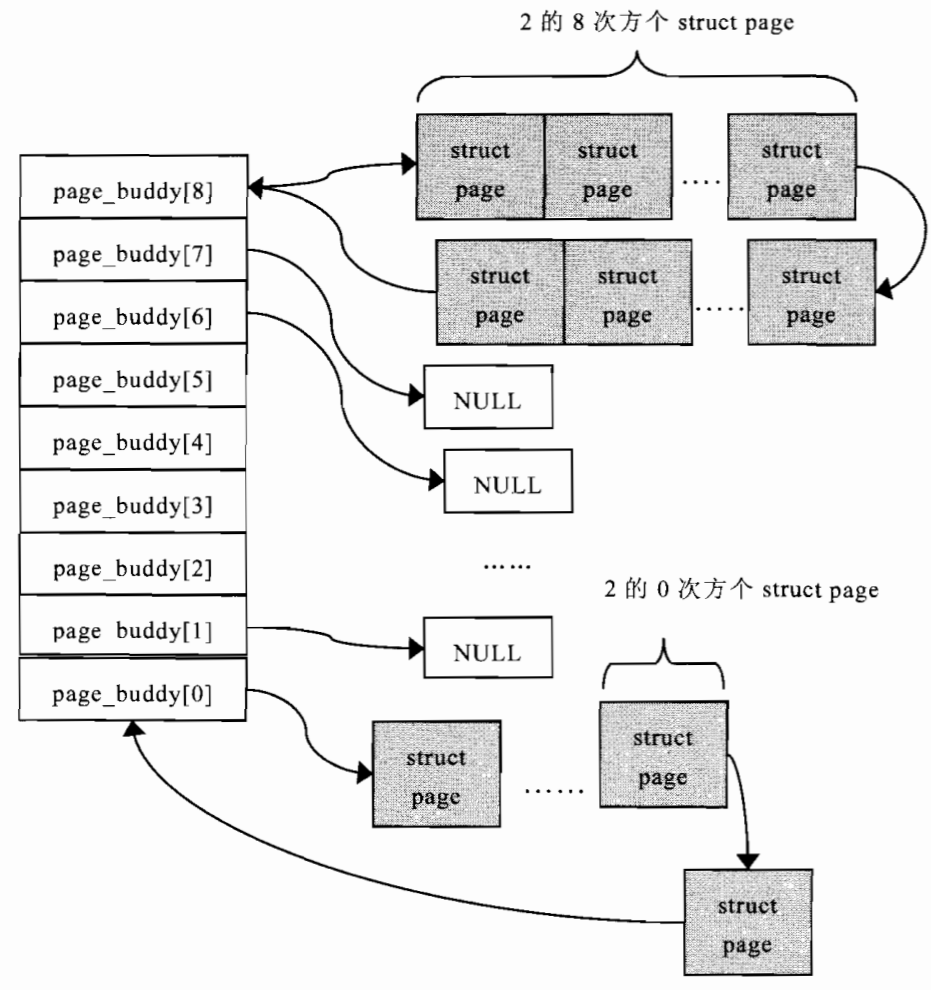

# 刷题笔记

​	用于记录一些笔试面试的错题和相关知识点

[TOC]

## C/C++相关

### 常对象与常成员函数 

​	如果希望某个对象的值初始化以后就再也不被改变，则定义该对象时可以在前面加 const 关键字，使之成为常量对象（简称“常对象”）。常量对象一旦初始化后，其数据成员的值就再也不能更改。因此，**不能通过常量对象调用普通成员函数**，因为普通成员函数在执行过程中有可能修改对象的数据成员的值。但是可以通过常量对象调用常量成员函数。

​	所谓常量成员函数，就是在定义时加了const关键字的成员函数（声明和定义都需要加，注意是**函数的()后加const**）。其不能更新对象的数据成员（但是当成员变量被mutable修饰时，可以在常量成员函数中修改）。同时常成员函数的const关键字可以被用于参与对重载函数的区分。（注意：加在函数前的const为返回值为一个常量，它（返回值）无法作为重载的条件）

```C++
class Sample
{
    public:
    void GetValue() const;	// 常成员函数
    void GetValue();
    void SetValue();
}
void Sample::GetValue() const
{}
void Sample::GetValue()
{}
void Sample::SetValue()
{}
int main()
{
    const Sample 0bj1;
    Sample Obj2;
    Obj1.GetVlaue();		// 常量对象上可以执行常量成员函数
    // Obj1.SetValue();		// 不管该函数中是否修改数据成员，编译器是无法通过的
    Obj2.GetVlaue();		// 它调用的是非常成员函数的重载
}
```

​	这里需要注意对于类中的静态成员变量，它存放在全局区，它属于类的全局变量，不属于某一个对象，所以常成员函数是可以修改对象中的静态成员变量的。

### C/C++的编译

​	C/C++的编译过程包括预编译、编译、汇编和链接

​	1、预编译：预处理器对c程序进行一些预处理工作，例如对宏定义的变量进行替换；
​		1）将所有的#define删除，并展开所有的宏定义；
​		2）处理所有的预编译指令，例如：#if,#elif,#else,#endif;
​		3）处理#include预编译指令，将被包含的文件插入到预编译指令的位置；
​		4）添加行号信息文件名信息，便于调试；
​		5）删除所有的注释：// /**/;
​		6）保留所有的#pragma编译指令，因为在编写程序的时候，我们经常要用到#pragma指令来设定编译器的状态或者是指示编译器完成一些特定的动作；
​		7）最后生成.i文件；
​		总的来说，包括（1）去注释 （2）宏替换 （3）头文件展开 （4）条件编译

​	2、编译：编译器将c语言程序翻译成汇编语言程序；
​		1）扫描，语法分析，语义分析，源代码优化，目标代码生成，目标代码优化；
​		2）生成汇编代码；
​		3）汇总符号；
​		4）生成.s文件；

​	3、汇编：汇编语言通过汇编器编译成可重定位目标程序.o，与之相反称为反汇编；
​		1）根据汇编指令和特定平台，把汇编指令翻译成二进制形式；
​		2）合并各个section，合并符号表；
​		3）生成.o文件；

​	4、链接：将目标文件和所需的库函数用链接器进行链接；
​		1）合并各个.obj文件的section，合并符号表，进行符号解析；
​		2）符号地址重定位；
​		3）生成可执行文件；

### sizeof

​	获取某个数据类型所占用空间的字节数。需要注意其获取指针的问题，对于32位机，指针返回值为4，64位机返回值为8。（一般来说32位机的地址总线长度为32位，64位机地址总线长度为64位）。

### 结构体的字节对齐

​		不同系统下的C语言类型长度



​	绝大部分64位的Unix，linux都是使用的LP64模型；32位Linux系统是ILP32模型；64位的Windows使用的是LLP64(long long and point 64)模型。

​	**自身对齐值：**数据类型本身的对齐值，例如char类型的是1，short类型是2；结构体或者类的自身对齐值为其成员中自身对齐值最大的那个值；
​	**指定对齐值：**编译器或程序员指定的结构体对齐值，32位单片机的指定对齐值默认是4，VS默认值是8；
​	**有效对齐值：**自身对齐值和指定对齐值中较小的那个。

对齐有两个规则：

​	1、对于结构体或者类，要将其补齐为其有效对齐值的整数倍。
​	2、存放成员的起始地址必须是该成员有效对齐值的整数倍。

```C++
// 默认字节对齐值为4
// 4字节
typedef struct A{
    char a;
    char b;
    char c;
    char d;}structA;

// 12字节，结构体的有效对齐值为4字节，
// 0x0 0x1 0x2 0x3 0x4 0x5 0x6 0x7 0x8 0x9 0xA 0xB
//  a   x   b   b   c   c   c   c   d   x   x   x
typedef struct B{
    char a;
    short b;
    int c;
	char d;}structB;

// 12字节，结构体的有效对齐值为4字节，
// 0x0 0x1 0x2 0x3 0x4 0x5 0x6 0x7 0x8 0x9 0xA 0xB
//  a   x   x   x   b   b   b   b   c   d   x   x  
typedef struct C{
    char a;
    int b;
    char c;
    char d;}structC;

// 20字节，结构体的有效对齐值为4字节
// 0x0 0x1 0x2 0x3 0x4 0x5 0x6 0x7 0x8 0x9 0xA 0xB 0xC 0xD 0xE 0xF 0x10 0x11 0x12 0x13
//  a   x   x   x   b   b   b   b   b   b   b   b   c   c   c   c   d    x    x    x
// 若指定对齐值为8，则占24字节
typedef struct D{
    char a;
    double b;
    int c;
    char d;}structD;
```

### volatile 关键字

​	volatile 关键字提醒编译器定义的变量是易变的，编译后的程序每次需要存储或读取该变量时，会直接从变量地址读取数据。在中断或多线程中使用volatile关键字可以避免不同优化等级时程序出错，提高程序的鲁棒性。

### 内存分区

​	C++程序在执行时，将内存大方向划分为**4个区域**

- 代码区：存放函数体的二进制代码，由操作系统进行管理的
- 全局区：存放全局变量和静态变量以及常量
- 栈区：由编译器自动分配释放, 存放函数的参数值,局部变量等
- 堆区：由程序员分配和释放,若程序员不释放,程序结束时由操作系统回收

​	栈区和堆区的区别：从申请方式，申请大小，申请效率简单比较；Stack的空间由操作系统自动分配/释放，Heap上的空间手动分配/释放。Stack空间有限，Heap是很大的自由存储区。Stack申请效率高，Heap申请效率低。

### 大端小端

​	大端存储格式就是自数据的高字节存放在低地址中，低字节存放在高地址中。例如0x12345678



而小端存储格式即高地址存放字数据的高地址数据，低字节就存放字数据的低地址数据。



比如x86的是小端模式，KEIL C51是大端模式。

```C++
union Student{
     int  i;
     unsigned char ch[2];
}
int main()
{
    Student student;
    student.i=0x1420;
    // 假设起始地址为0x00
    // 小端模式，输出为 32 20
    // 地址 0x00 0x01 0x02 0x03
    // 数据 0x20 0x14 0x00 0x00
    // 大端模式，输出为 0 0
    // 地址 0x00 0x01 0x02 0x03
    // 数据 0x00 0x00 0x14 0x20
    printf("%d %d",student.ch[0],ch[1]);
    return 0;
}
```

### 浮点数格式

​	绝大多数现代的计算机系统采纳了所谓的浮点数表达方式。计算机对浮点数的表示规范遵循电气和电子工程师协会（IEEE）推出的 IEEE754 标准， 这种表达方式利用科学计数法来表达实数，即用一个尾数（Mantissa ）， 一个基数（Base），一个指数(也叫阶码)（Exponent）以及一个表示正负的符号(Sign)来表达实数。 比如 123.45 用十进制科学计数法可以表达为 1.2345 × 10^2 ，其中 1.2345 为尾数，10 为基数，2 为指数。 浮点数利用指数达到了浮动小数点的效果，从而可以灵活地表达更大范围的实数。 又对于一个二进制的数比如1011.01，用科学计数法也可以表示为：1.01101*2^3，其中 1.1101为尾数，2为基数，3为指数。

​	**注意**，IEE754 规定浮点数阶码 E 采用"**指数ｅ的移码-1**"来表示，请记住这一点。为什么指数移码要减去 1，这是 IEEE754 对阶码的特殊要求，以满足特殊情况，比如对正无穷的表示。移码（又叫增码）是对真值**补码**的**符号位**取反，一般用作浮点数的阶码，引入的目的是便于浮点数运算时的对阶操作。
$$
[X]_移 = 2^{n - 1} + X
$$


​	IEEE754 标准中，32位浮点数的阶码为8位，一个规格化的32位浮点数 x 的真值表示为：
$$
x = (-1)^S \times (1.M) \times 2^e \\
[e]_移 = E + 1 \\
[e]_移 = 2^{8 - 1} + e \\
e = E - 127
$$
​	64位浮点数的阶码为11位，一个规格化的64位浮点数 x 的真值表示为：
$$
x = (-1)^S \times (1.M) \times 2^e \\
[e]_移 = E + 1 \\
[e]_移 = 2^{11 - 1} + e \\
e = E - 1023
$$
**十进制到机器码**

​	$1.5 = [1.1]_2$，符号位为0，指数$e = 0$，规格化后尾数为1.1。

​	尾数域Ｍ右侧以0补全，得尾数域：
$$
M = [100 0000 0000 0000 0000 0000]_2
$$
​	阶码E：
$$
E = [0]_移 - 1 = [1000 0000]_2 - 1 = [0111 1111]_2
$$
​	得1.5的机器码：
$$
1.5 = [0011 1111 1100 0000 0000 0000 0000 0000]_2 = 0x3FC00000
$$
**取值范围**

​	float的最大正数：
$$
PosMax = (−1)^S  × 1.M × 2^e = +(1.11111111111111111111111) × 2^{127}  ≈ 3.402823e+38
$$
​	最小正数：
$$
PosMin = (−1)^S  × 1.M × 2^e = +(1.0) × 2^{-126}  ≈ 1.175494e−38
$$
​	最大负数：
$$
NegMax = (−1)^S  × 1.M × 2^e = -(1.0) × 2^{-126}  ≈ −1.175494e−38
$$
​	最小负数：
$$
NegMin = (−1)^S  × 1.M × 2^e = -(1.11111111111111111111111) × 2^{127}  ≈ -3.402823e+38
$$
**特殊情况**

（1）0 的表示

​	对于阶码为 0 或 255 的情况，IEEE754 标准有特别的规定：如果 阶码 E=0 并且尾数 M 是 0，则这个数的真值为 ±0（正负号和数符位有关）。因此 +0 的机器码为：0 00000000 000 0000 0000 0000 0000 0000。-0 的机器码为：1 00000000 000 0000 0000 0000 0000 0000。需要注意一点，浮点数不能精确表示 0，而是以很小的数来近似表示 0，因为浮点数的真值等于（以32bits单精度浮点数为例）$±1.0 \times 2^{-127}$

（2）$+\infty$和$-\infty$ 的表示
	如果阶码 E=255 并且尾数 M 全是0，则这个数的真值为 $±\infty$（同样和符号位有关）。

（3）NaN（Not a Number）
	如果 E = 255 并且 M 不是0，则这不是一个数（NaN）。

### 只能使用new创建的对象

​	将析构函数设为私有，则无法静态创建对象，因为静态创建是由编译器管理对象的生命周期，而将析构函数设为私有，则类外部无法调用它，编译器在为类对象分配栈空间时，会先检查类的析构函数的访问性，其实不光是析构函数，只要是非静态的函数，编译器都会进行检查。如果类的析构函数是私有的，则编译器不会在栈空间上为类对象分配内存。因此，将析构函数设为私有，类对象就无法建立在栈上了。

​	只能通过new来创建，但是类中必须提供一个destory函数来进行内存空间的释放，因为delete函数默认会调用析构函数释放空间，而析构函数为私有，无法调用。

​	这个[博客](https://www.cnblogs.com/ahuangliang/archive/2004/07/17/5309279.html)里面有使用友元类包装实现静态创建的方法。

### do{...}while(0)

​	1.**辅助定义复杂的宏，避免引用的时候出错**：使用do{...}while(0)把它包裹起来，成为一个独立的语法单元，从而不会与上下文发生混淆。同时因为绝大多数的编译器都能够识别do{...}while(0)这种无用的循环并进行优化，所以使用这种方法也不会导致程序的性能降低。

​	2.**避免使用goto对程序流进行统一的控制**：有些函数中，在函数return之前我们经常会进行一些收尾的工作，比如free掉一块函数开始malloc的内存，goto一直都是一个比较简便的方法。由于goto不符合软件工程的结构化，而且有可能使得代码难懂，所以很多人都不倡导使用，那这个时候就可以用do{}while(0)来进行统一的管理.

```C++
// goto
int foo()
{
    somestruct* ptr = malloc(...);
    dosomething...;
    if(error){
        goto END;
    }
    dosomething...;
    if(error){
        goto END;
    }
    dosomething...;
END:
    free(ptr);
    return 0;
}

// do{}while(0)
int foo()
{
    somestruct* ptr = malloc(...);
    do{
        dosomething...;
        if(error){
            break;
        }
        dosomething...;
        if(error){
            break;
        }
        dosomething...;
    }while(0);
    free(ptr);
    return 0;
}
```

​	3.**避免空宏引起的warning**：内核中由于不同架构的限制，很多时候会用到空宏，在编译的时候，空宏会给出warning，为了避免这样的warning，就可以使用do{}while(0)来定义空宏，如`#define EMPTYMICRO do{}while(0)`。


### static作用

​	隐藏与隔离的作用，保持变量内容的持久性（局部的static变量），默认初始化为0。

c/c++共有

1）：修饰全局变量时，表明一个全局变量只对定义在同一文件中的函数可见。          

2）：修饰局部变量时，表明该变量的值不会因为函数终止而丢失。              

3）：修饰函数时，表明该函数只在同一文件中调用。      

c++独有：

 4）：修饰类的数据成员，表明对该类所有对象这个数据成员都只有一个实例。即该实例归所有对象共有。

 5）：用static修饰不访问非静态数据成员的类成员函数。这意味着一个静态成员函数只能访问它的参数、类的静态数据成员和全局变量


### C++中小知识点

1. 只有非静态成员变量占对象空间；静态成员变量不占对象空间，其为类所用；非静态和静态成员函数都不占对象空间，所有函数共享一个函数实例。
2. 子类和父类中的同名函数，默认使用子类的，可以通过加作用域的方法为使用父类的函数。
3. 函数重载和运算符重载属于静态多态，派生类和虚函数实现运行时多态属于动态多态；多态满足条件为有继承关系、子类重写父类中的虚函数；多态使用为父类指针或引用指向子类对象。
4. 虚函数和纯虚函数都可以有具体的实现，纯虚函数在声明后，可以在类外定义具体的实现。同时也类似于同名函数，都可以通过添加作用域的方法调用父类中的（纯）虚函数。 


### set和map

​	目前感觉刷题用的比较多的还是unordered_set、unordered_multiset、unordered_map、unordered_multimap，他们的主要的操作是插入（insert 或者 unordered_map可以通过[]来插入）、删除（erase）、查找（find）和统计数量（count），具体的描述详见[set/map的test案例](D:\ADATA\work\my_cpp\devc++_test)

### strncpy和memcpy

​	strncpy的实现：

```c++
char *strncpy(char* strDest, const char* strSrc, size_t n)
{
    if(strDest == NULL || strSrc == NULL) return NULL;
    char *address = strDest;
    while ( n-- && (*strDest++ = *strSrc++) != '\0');
    return address;
}
```

​	memcpy的实现：

```c++
//模拟memcpy的实现
void * mymemcpy(void *dest, const void *src, size_t n)
{
    if (dest == NULL || src == NULL)
          return NULL;
    char *pDest = (char *)dest;
    const char *pSrc  = (char *)(src);
    if (pDest > pSrc && pDest < pSrc+n)	// 内存重叠的情况
    {
        for (size_t i=n-1; i != -1; --i) pDest[i] = pSrc[i];
    }
    else
    {
        for (size_t i= 0; i < n; i++) pDest[i] = pSrc[i];
    }
    return dest;
}
```


### vector和list的区别

​	区别：
1）vector底层实现是数组；list是双向链表。

2）vector支持随机访问，list不支持。

3）vector是顺序内存，list不是。

4）vector在中间节点进行插入删除会导致内存拷贝，list不会。

5）vector一次性分配好内存，不够时才进行2倍扩容；list每次插入新节点都会进行内存申请。

6）vector随机访问性能好，插入删除性能差；list随机访问性能差，插入删除性能好。

​	应用：

- vector拥有一段连续的内存空间，因此支持随机访问，如果需要高效的随即访问，而不在乎插入和删除的效率，使用vector。
- list拥有一段不连续的内存空间，如果需要高效的插入和删除，而不关心随机访问，则应使用list。
  


## 操作系统相关

### 进程间通信的方式

​	**管道**：匿名管道和命名管道，都是单向的，前者只能在父子进程之间通信

​	**信号量**：不能用来传递复杂消息，只能用来同步。它维护了一个许可集,我们在初始化时需要传一个许可集数量,该数量值代表同一时间能访问共享资源的线程数量。 

​	**消息队列**：一种从一个进程向另一个进程发送一个数据块的方法。 每个数据块都被认为含有一个类型，接收进程可以独立地接收含有不同类型的数据结构。 我们可以通过发送消息来避免命名管道的同步和阻塞问题。

​	**信号**：操作系统通过信号来通知进程系统中发生了某种预先规定好的事件（一组事件中的一个），它也是用户进程之间通信和同步的一种原始机制。

​	**共享内存**：利用内存缓冲区直接交换信息，无须复制，快捷、信息量大是其优点。共享内存块提供了在任意数量的进程之间进行高效双向通信的机制。每个使用者都可以读取写入数据，但是所有程序之间必须达成并遵守一定的协议，以防止诸如在读取信息之前覆写内存空间等竞争状态的出现。

​	**套接字**：

### 进程与线程

​	进程是资源分配的最小单位，线程是CPU执行程序的最小单位。

​	进程切换是切换PCB，线程切换是切换TCB。进程切换和线程切换最主要的一个区别在于进程切换涉及虚拟地址空间的切换而线程不会。

### 进程调度算法

​	目前理解linux2.6前应该还是单纯的多级反馈调度算法或者是它的改进版本，之后就变的比较复杂了	

​	在现在的 Linux 内核中 , sched_class 调度器 分为以下 5 种类型 :

- stop_sched_class : 停机调度类 
- dl_sched_class : 限期调度类 
- rt_sched_class : 实时调度类，对于实时进程使用的调度类，使用FIFO或者时间片轮转算法
- fair_sched_class : 公平调度类，对于普通进程使用的调度类，也是使用的最多的，使用完全公平调度算法（CFS）
- idle_sched_class : 空闲调度类 

​	上述每种 " 调度类 " 都有自己的 调度策略 ;

​	**调度类 优先级 由高到低排列为 :**

​	停机调度类 > 限期调度类 > 实时调度类 > 公平调度类 > 空闲调度类



​	完全公平调度算法中，任何进程所获得的处理器时间是由它自己和其他所有可运行进程nice值的相对差值决定的。任何nice值对应的绝对时间不再是一个绝对值，而是处理器的使用比。CFS称为公平调度器是因为它确保给每个进程公平的处理器使用比。CFS不是完美的公平，它只是近乎完美的多任务。但是它确实在多进程环境下，降低了调度延迟带来的不公平性。

### 硬软链接的区别

​	硬链接是有着相同 inode 号仅文件名不同的文件，软链接就是一个普通文件它数据块内容是另一文件的路径名的指向。

### 死锁

​	产生死锁的主要原因是：

1) 系统资源不足；

2) 进程运行推进的次序不合适；

3) 资源分配不当。

​	产生死锁的四个必要条件：

1) 互斥条件：一个资源一次只能被一个进程访问。

2) 请求与保持： 一个进程因请求资源而阻塞时，对已获得的资源保持不放。

3) 不可剥夺：进程已获得的资源，在未使用完之前，不得强行剥夺。

4) 循环等待：若干进程之间形成一种头尾相接的循环等待资源关系。

​	死锁的处理方式主要从**预防死锁**、**避免死锁**、**检测死锁**和**解除死锁**这四个方面来进行处理。

​	**预防**：通过设置某些限制条件，以破坏产生死锁的四个条件中的一个或者几个，来防止发生死锁。比如一次性分配所有资源、使用可剥夺资源
​    **避免**：系统在分配资源时根据资源的使用情况提前作出预测，从而避免死锁的发生。比如使用银行家算法
​    **检测**：允许系统在运行的过程中产生死锁，但是，系统中有相应的管理模块可以及时检测出已经产生的死锁，并且精确地确定与死锁有关的进程和资源，然后采取适当措施，清除系统中已经产生的死锁。
​    **解除**：与检测死锁相配套的一种措施，用于将进程从死锁状态下解脱出来。比如剥夺资源、撤销进程

### 中断和异常

#### 中断

​	中断是一种由设备使用的硬件资源异步向处理器发信号。实际上，中断就是由硬件来打断操作系统。大多数现代硬件都通过中断与操作系统通信。对给定硬件进行管理的驱动程序注册中断处理程序，是为了响应并处理来自相关硬件的中断。中断过程所做的工作包括应答并重新设置硬件，从设备拷贝数据到内存以及反之，处理硬件请求，并发送新的硬件请求。内核提供的接口包括注册和注销中断处理程序、禁止中断、屏蔽中断线以及检查中断系统的状态。

​	因为中断打断了其他代码的执行（进程，内核本身，甚至其他中断处理程序），它们必须赶快执行完。但通常是还有很多工作要做。为了在大量的工作与必须快速执行之间求得一种平衡，内核把处理中断的工作分为两半。中断处理程序为上半部，下半部为后续的一些处理函数。

#### 中断和异常的区别

​	外中断——就是我们指的中断——是指由于外部设备事件所引起的中断，如通常的磁盘中断、打印机中断等；

​	内中断——就是异常——是指由于 CPU 内部事件所引起的中断，如程序出错(非法指令、地址越界)。内中断(trap)也被译为“捕获”或“陷入”。
​	异常是由于执行了现行指令所引起的。由于系统调用引起的中断属于异常。
​	中断则是由于系统中某事件引起的，该事件与现行指令无关。


### 信号

​	信号（signal，又简称为信号）用来通知进程发生了事件。进程之间可以通过调用kill库函数发送软中断信号。Linux内核也可能给进程发送信号，通知进程发生了某个事件（例如内存越界）。

​	注意，信号只是用来通知某进程发生了什么事件，无法给进程传递任何数据，进程对信号的处理方法有三种：

1）第一种方法是，忽略某个信号，对该信号不做任何处理，就像未发生过一样。

2）第二种是设置中断的处理函数，收到信号后，由该函数来处理。

3）第三种方法是，对该信号的处理采用系统的默认操作，大部分的信号的默认操作是终止进程。

​	信号总共有62个，1~64，其中没有32和33号信号，我们比较常用有：

- 2号的**SIGINT**信号，即ctrl+c触发的信号，键盘中断，这将中断给定的进程并停止该进程。
- 9号的**SIGKILL**信号，强制杀死程序，它和19号的SIGSTOP信号都不可捕捉、阻塞和忽略。
- 11号的**SIGSEGV**信号，无效的内存引用
- 15号的**SIGTERM**信号，采用“kill  进程编号”或“killall 程序名”指令是发送的信号，用于终止进程
- 17号的**SIGCHLD**信号，子进程停止、结束或在被跟踪时发出的信号，可以用于父进程为子进程回收资源，wait阻塞等待的就是这个信号，不处理的话，就会产生僵尸进程

​	其中常规信号为1-31号信号，后34-64号信号为实时信号。常规信号为不可靠信号，即同时接收到多个相同的信号时，他们可能会被合并为一个信号；而实时信号为可靠信号，接收到多少个就是多少个，挨个阻塞运行。

​	我们可以使用**signal()**函数来忽略信号或者指定信号的处理函数（9和19号不能），当指定处理函数时，如果在处理函数运行中又接受到新的信号，则存在两种情况：

1. 当是相同的信号时，则处理函数不会被中断，等到运行结束再处理新的信号，如果是不可靠信号的话，可能就合并忽略了。
2. 如果是不同的信号时，则处理函数会被中断，去执行新信号的处理函数，等新的执行结束后在执行原来的处理函数。

​	当然也有办法让处理函数阻塞，即接收到新的信号不发生中断。

```c
signal(SIGINT, func1);
signal(SIGTERM, func2);

void func1(void)
{
    // 比如2号和15号信号
    // 当2号信号发生时，接收到15号信号而不中断，将15号信号阻塞
    sigset_t set;
    sigemptyset (&set);
    sigaddset (&set,15);
    sigprocmask (SIG_BLOCK,&set,NULL);

    /*此处为func1的业务代码...*/    

    // 等到2号信号处理函数执行结束后
    sigprocmask (SIG_UNBLOCK,&set,NULL);	// 之后就会执行15号的处理函数 
}

```

​	除此之外还有功能更强的**sigaction()**函数，它也可以实现阻塞功能，如下所示：

```c
struct sigaction stact;
memset (&stact,0,sizeof (stact));	// 初始化。
stact.sa_handler=hdfunc;			// 指定信号处理函数
sigaddset (&stact.sa_mask,15);		// 指定需要阻塞的信号。
sigaction (2,&stact,NULL);			// 设置信号2的处理行为。
sigaction (15,&stact,NULL)			// 设置信号15的处理行为。
```

​	当然它还要更多的功能和使用场景，同时网课老师说多进程中可以使用signal，也可以使用sigaction，但是在多线程中只能使用sigaciton了，==具体为什么我还不清楚，之后可以多了解一下。==

### 内存管理相关

#### malloc、kmalloc和vmalloc的区别

1. kmalloc和vmalloc是分配的是内核的内存，malloc分配的是用户的内存。
2. kmalloc保证分配的内存在物理上是连续的（自然在虚拟内存也是连续的），内存只有在要被DMA访问的时候才需要物理上连续，malloc和vmalloc保证的是在虚拟地址空间上的连续；
3. kmalloc能分配的大小有限，通常以字节作为单位，vmalloc和malloc能分配的大小相对较大；
4. vmalloc比kmalloc要慢。 **尽管在某些情况下才需要物理上连续的内存块，但是很多内核代码都用kmalloc来获得内存，而不是vmalloc**。这主要是出于性能的考虑。**vmalloc函数可能睡眠，因此不能从中断上下文中调用**，也不能从其他不允许阻塞的情况下进行调用。

#### 伙伴算法

​	伙伴算法就是**将内存分成若干小块，然后尽可能以最适合的方式满足程序内存需求的一种内存管理算法。伙伴算法的
一大优势是它能完全避免外部碎片的产生**。

​	根据伙伴算法的经典理论，这些内存块的大小必须是2的整数次方。例如，一块1M的内存可以按照64K、128K、256K和512K等的数值分成若干块。其实按照什么数值分块还是有一定原则的。通常我们选择比可用内存数小的2的整数次方的最大值。例如，对于一个8M的内存，最大的内存块可以为4M，而余下的4M内存用来划分小于4M的块。这样可以最大限度地保证程序能够从系统中申请到尽可能多的内存。



​	在内存块划分完成后，系统就可以对内存进行分配和释放了。在分配内存时，首先从空闲的内存中搜索比申请的内存大的最小的内存块。如果这样的内存块存在，则将这块内存标记为“已用”，同时将该内存分配给应用程序。如果这样的内存不存在，则操作系统将寻找更大块的空闲内存，然后将这块内存平分成两部分，一部分返回给程序使用，另一部分作为空闲的内存块等待下一次被分配。

​	当程序释放内存时，操作系统首先将该内存回收，然后检查与该内存相邻的内存是否是同样大小并且同样处于空闲的状态。如果是，则将这两块内存合并，然后程序递归进行同样的检查。

​	下图为一个不足7M的内存空间的buddy初始化，假设一个页4K，page_buddy[i]为2^i个页，则最大的内存块为256个页，即1M大小，页与页之间通过一个双向链表连接，最开始初始化为6个最大页和若干个最小页。就遍历这个至于怎么区分内存块，可能需要根据内存块大小找自己边界吧。

​	每次申请的时候，首先需要计算出对应的阶数，比如3个页需要2^2个页的内存块，这去看page_buddy[2]的链表头即可，然后根据伙伴算法去操作。具体操作详见《一步一步写嵌入式操作系统--ARM编程的方法与实践》



​	**malloc底层使用伙伴算法实现。**

#### slab算法

​	slab算法原理其实很简单。**它专门为某一模块预先一次性申请一定数量的内存备用，当这个模块想要使用内存的时候，就不再需要从系统中分配内存了（因为从系统中申请内存的时间开销相对来说比较大)，而是直接从预申请的内存中拿出一部分来使用，这样就提高了这个模块的内存申请速度**。

​	比如结构体A大小为120Byte，而在程序中我们会频繁的申请释放A，则预先在内存中申请10个128Byte的内存块，创建A就可以直接在预先申请的内存块中取一个空闲的空间给A，而释放A只需要把那块内存又放入空闲队列即可。这样每次浪费的空间都比较小，而且频繁创建和释放A时，并不需要频繁申请空间，通过对空闲队列操作即可，只需要在初始化内存块时申请一次。

​	所以使用slab算法前提条件：

- 当某一子系统需要频繁地申请和释放内存时，使用slab才会合理一些。
- 使用slab的另外一个条件是，利用slab申请的内存必须是大小固定的。只有固定内存大小才有可能实现内存的高速申请和释放。

​	而在linux中，对于**进程结构体和文件结构体**等正好符合上述条件，所以slab算法非常有用。

​	目前我的理解是slab算法底层使用了buddy算法在物理内存中预先上次大小相同内存块，所以通常slab中的每个内存块大小为2次幂的，且比较小，如果内存块太大的话，提前申请就会比较浪费。

​	kmalloc底层就是通过slab算法实现，所以它分配的内存比较小。==目前理解，内核中应该首先会调用类似于kmalloc_init的函数，用slab算法将一些常用的内存块大小初始化好，然后kmalloc申请空间的话就是在slab算法预先申请好的空间中去寻找合适的大小的内存块。==具体操作详见《一步一步写嵌入式操作系统--ARM编程的方法与实践》，但是实际的linux和嵌入式操作系统还是有一定区别的。

#### vmalloc机制

​	vmalloc函数为了把物理内存上不连续的页转换为虚拟地址空间上连续的页，必须专门建立页表项。而通过vmalloc获得的页必须一个个地进行映射，因为它们物理上是不连续的，这就会导致比直接内存映射大得多的TLB抖动，导致它执行起来比较慢。所以vmalloc一般在获得大块内存时使用。

​	vmalloc机制使得内核通过连续的线性虚拟地址来访问非连续的物理页框，这样可以最大限度的使用高端物理内存。

#### 问题

​	linux中对于物理内存是分页管理的，一般认为最小页为4k，如果我malloc(sizeof(int))，那这个4Byte的int类型数据在物理内存中也占一个4k的页吗？kmalloc也类似有这样的疑问。


## 嵌入式相关

### STM32的启动流程

1. 初始化堆栈指针 SP=_initial_sp
2. 初始化 PC 指针 =Reset_Handler
3. 初始化中断向量表
4. 配置系统时钟
5. 调用 C 库函数 _main 初始化用户堆栈，从而最终调用 main 函数去到 C 的世界

​	==目前问题是什么时候完成全局变量、静态变量的初始化，因为他们需要从FLASH中移动到SRAM中==


### 四种通信协议

​	**UART**：异步 全双工 串行 一对一

​	**SPI**：同步 全双工 串行 一对多 无应答机制（与iic比较）极性和时钟相位可变（与iic比较）

​	**IIC**：同步 半双工 串行 一对多 有应答机制（与spi比较）极性和时钟相位固定（与spi比较）。理论上IIC主机最多可以挂载127个设备，但是由于IIC的驱动能力有限，一般挂载设备在8个以下。

​	**CAN**：异步 半双工 串行 一对多 且总线上任意设备都可以作为主机主动发送数据 有应答机制 


## 算法相关

### 二进制数中1的个数

```c++
int function(x)  {
    int flag = 0;
    while(x)  {
          x = x&(x-1);
          flag ++;
     }
    return flag ;
}
```


## 硬件相关


## 计算机网络相关


## 计算机组成相关


## 汇编相关


