# 刷题笔记

​	用于记录一些笔试面试的错题和相关知识点

[TOC]

## C/C++相关

### 常对象与常成员函数 

​	如果希望某个对象的值初始化以后就再也不被改变，则定义该对象时可以在前面加 const 关键字，使之成为常量对象（简称“常对象”）。常量对象一旦初始化后，其数据成员的值就再也不能更改。因此，**不能通过常量对象调用普通成员函数**，因为普通成员函数在执行过程中有可能修改对象的数据成员的值。但是可以通过常量对象调用常量成员函数。

​	所谓常量成员函数，就是在定义时加了const关键字的成员函数（声明和定义都需要加，注意是**函数的()后加const**）。其不能更新对象的数据成员（但是当成员变量被mutable修饰时，可以在常量成员函数中修改）。同时常成员函数的const关键字可以被用于参与对重载函数的区分。（注意：加在函数前的const为返回值为一个常量，它（返回值）无法作为重载的条件）

```C++
class Sample
{
    public:
    void GetValue() const;	// 常成员函数
    void GetValue();
    void SetValue();
}
void Sample::GetValue() const
{}
void Sample::GetValue()
{}
void Sample::SetValue()
{}
int main()
{
    const Sample 0bj1;
    Sample Obj2;
    Obj1.GetVlaue();		// 常量对象上可以执行常量成员函数
    // Obj1.SetValue();		// 不管该函数中是否修改数据成员，编译器是无法通过的
    Obj2.GetVlaue();		// 它调用的是非常成员函数的重载
}
```

​	这里需要注意对于类中的静态成员变量，它存放在全局区，它属于类的全局变量，不属于某一个对象，所以常成员函数是可以修改对象中的静态成员变量的。

### C/C++的编译

​	C/C++的编译过程包括预编译、编译、汇编和链接

​	1、预编译：预处理器对c程序进行一些预处理工作，例如对宏定义的变量进行替换；
​		1）将所有的#define删除，并展开所有的宏定义；
​		2）处理所有的预编译指令，例如：#if,#elif,#else,#endif;
​		3）处理#include预编译指令，将被包含的文件插入到预编译指令的位置；
​		4）添加行号信息文件名信息，便于调试；
​		5）删除所有的注释：// /**/;
​		6）保留所有的#pragma编译指令，因为在编写程序的时候，我们经常要用到#pragma指令来设定编译器的状态或者是指示编译器完成一些特定的动作；
​		7）最后生成.i文件；
​		总的来说，包括（1）去注释 （2）宏替换 （3）头文件展开 （4）条件编译

​	2、编译：编译器将c语言程序翻译成汇编语言程序；
​		1）扫描，语法分析，语义分析，源代码优化，目标代码生成，目标代码优化；
​		2）生成汇编代码；
​		3）汇总符号；
​		4）生成.s文件；

​	3、汇编：汇编语言通过汇编器编译成可重定位目标程序.o，与之相反称为反汇编；
​		1）根据汇编指令和特定平台，把汇编指令翻译成二进制形式；
​		2）合并各个section，合并符号表；
​		3）生成.o文件；

​	4、链接：将目标文件和所需的库函数用链接器进行链接；
​		1）合并各个.obj文件的section，合并符号表，进行符号解析；
​		2）符号地址重定位；
​		3）生成可执行文件；

### sizeof

​	获取某个数据类型所占用空间的字节数。需要注意其获取指针的问题，对于32位机，指针返回值为4，64位机返回值为8。（一般来说32位机的地址总线长度为32位，64位机地址总线长度为64位）。sizeof(数组名) 返回的数组长度，同时如果函数传参为指针，就算输入时为数组名，在函数内部sizeof返回的是指针长度，但是如果用引用传递数组名的话，就是返回数组长度。

### 结构体的字节对齐

​		不同系统下的C语言类型长度


​	绝大部分64位的Unix，linux都是使用的LP64模型；32位Linux系统是ILP32模型；64位的Windows使用的是LLP64(long long and point 64)模型。

​	**自身对齐值：**数据类型本身的对齐值，例如char类型的是1，short类型是2；结构体或者类的自身对齐值为其成员中自身对齐值最大的那个值；
​	**指定对齐值：**编译器或程序员指定的结构体对齐值，32位单片机的指定对齐值默认是4，VS默认值是8；
​	**有效对齐值：**自身对齐值和指定对齐值中较小的那个。

对齐有两个规则：

​	1、对于结构体或者类，要将其补齐为其有效对齐值的整数倍。
​	2、存放成员的起始地址必须是该成员有效对齐值的整数倍。

```C++
// 默认字节对齐值为4
// 4字节
typedef struct A{
    char a;
    char b;
    char c;
    char d;}structA;

// 12字节，结构体的有效对齐值为4字节，
// 0x0 0x1 0x2 0x3 0x4 0x5 0x6 0x7 0x8 0x9 0xA 0xB
//  a   x   b   b   c   c   c   c   d   x   x   x
typedef struct B{
    char a;
    short b;
    int c;
	char d;}structB;

// 12字节，结构体的有效对齐值为4字节，
// 0x0 0x1 0x2 0x3 0x4 0x5 0x6 0x7 0x8 0x9 0xA 0xB
//  a   x   x   x   b   b   b   b   c   d   x   x  
typedef struct C{
    char a;
    int b;
    char c;
    char d;}structC;

// 20字节，结构体的有效对齐值为4字节
// 0x0 0x1 0x2 0x3 0x4 0x5 0x6 0x7 0x8 0x9 0xA 0xB 0xC 0xD 0xE 0xF 0x10 0x11 0x12 0x13
//  a   x   x   x   b   b   b   b   b   b   b   b   c   c   c   c   d    x    x    x
// 若指定对齐值为8，则占24字节
typedef struct D{
    char a;
    double b;
    int c;
    char d;}structD;
```

​	`__attribute__((packed))`可以取消对齐

​	然后需要注意**位域**的概念，在结构体定义时，我们可以指定某个成员变量所占用的二进制位数（Bit），如下所示

```C
// m、n、p 的位宽之和为 6 + 12 + 4 = 22bit，小于32bit
// 结构体大小为32bit，即4Byte
struct bs{
    unsigned m: 6;
    unsigned n: 12;
    unsigned p: 4;
};

// m的位宽为6bit，但是需要字节对齐，实际还是占32bit
// 结构体大小为12Byte
typedef struct C{
    int m: 6;
    int a;
    int n: 12;
}structC;
```


### volatile 关键字

​	volatile 关键字提醒编译器定义的变量是易变的，编译后的程序每次需要存储或读取该变量时，会直接从变量地址读取数据。在中断或多线程中使用volatile关键字可以避免不同优化等级时程序出错，提高程序的鲁棒性。

### 内存分区

​	C++程序在执行时，将内存大方向划分为**4个区域**

- 代码区：存放函数体的二进制代码，由操作系统进行管理的
- 全局区：存放全局变量和静态变量以及常量（对于常量存在一些小疑问，可能和stm32中的处理方式不一样）
- 栈区：由编译器自动分配释放, 存放函数的参数值,局部变量等
- 堆区：由程序员分配和释放,若程序员不释放,程序结束时由操作系统回收

​	栈区和堆区的区别：从申请方式，申请大小，申请效率简单比较；Stack的空间由操作系统自动分配/释放，Heap上的空间手动分配/释放。Stack空间有限，Heap是很大的自由存储区。Stack申请效率高，Heap申请效率低。

​	目前理解在stm32中除了栈区和堆区外，存在code、RW、ZI、RO的概念，RW和RI就对应于正常的.data段和.bss段，最后都是在RAM中，而在stm32中RO（常量）是和code一样存放在ROM（flash）中。所以这个地方存在一定的区别

### 大端小端

​	大端存储格式就是自数据的**高字节存放在低地址**中，低字节存放在高地址中。例如0x12345678


而小端存储格式即高地址存放字数据的高地址数据，低字节就存放字数据的低地址数据。


比如x86的是小端模式，KEIL C51是大端模式，网络字节序是大端模式。

```C++
union Student{
     int  i;
     unsigned char ch;
}
int main()
{
    Student student;
    student.i=0x1420;
    // 假设起始地址为0x00
    // 小端模式，输出为 32 20（十进制）
    // 地址 0x00 0x01 0x02 0x03
    // 数据 0x20 0x14 0x00 0x00
    // 大端模式，输出为 0 0
    // 地址 0x00 0x01 0x02 0x03
    // 数据 0x00 0x00 0x14 0x20
    printf("%d",student.ch);
    return 0;
}
```

​	注意对于**0x0102030405060708这个long long类型的数**，在小端的64位存放的方式是 0807060504030201，而在32位的小端机上也是 0807060504030201。和CPU位数没有关系。

### 浮点数格式

​	绝大多数现代的计算机系统采纳了所谓的浮点数表达方式。计算机对浮点数的表示规范遵循电气和电子工程师协会（IEEE）推出的 IEEE754 标准， 这种表达方式利用科学计数法来表达实数，即用一个尾数（Mantissa ）， 一个基数（Base），一个指数(也叫阶码)（Exponent）以及一个表示正负的符号(Sign)来表达实数。 比如 123.45 用十进制科学计数法可以表达为 1.2345 × 10^2 ，其中 1.2345 为尾数，10 为基数，2 为指数。 浮点数利用指数达到了浮动小数点的效果，从而可以灵活地表达更大范围的实数。 又对于一个二进制的数比如1011.01，用科学计数法也可以表示为：1.01101*2^3，其中 1.1101为尾数，2为基数，3为指数。

​	**注意**，IEE754 规定浮点数阶码 E 采用"**指数ｅ的移码-1**"来表示，请记住这一点。为什么指数移码要减去 1，这是 IEEE754 对阶码的特殊要求，以满足特殊情况，比如对正无穷的表示。移码（又叫增码）是对真值**补码**的**符号位**取反，一般用作浮点数的阶码，引入的目的是便于浮点数运算时的对阶操作。
$$
[X]_移 = 2^{n - 1} + X
$$


​	IEEE754 标准中，32位浮点数的阶码为8位，一个规格化的32位浮点数 x 的真值表示为：
$$
x = (-1)^S \times (1.M) \times 2^e \\
[e]_移 = E + 1 \\
[e]_移 = 2^{8 - 1} + e \\
e = E - 127
$$
​	64位浮点数的阶码为11位，一个规格化的64位浮点数 x 的真值表示为：
$$
x = (-1)^S \times (1.M) \times 2^e \\
[e]_移 = E + 1 \\
[e]_移 = 2^{11 - 1} + e \\
e = E - 1023
$$
**十进制到机器码**

​	$1.5 = [1.1]_2$，符号位为0，指数$e = 0$，规格化后尾数为1.1。

​	尾数域Ｍ右侧以0补全，得尾数域：
$$
M = [100 0000 0000 0000 0000 0000]_2
$$
​	阶码E：
$$
E = [0]_移 - 1 = [1000 0000]_2 - 1 = [0111 1111]_2
$$
​	得1.5的机器码：
$$
1.5 = [0011 1111 1100 0000 0000 0000 0000 0000]_2 = 0x3FC00000
$$
**取值范围**

​	float的最大正数：
$$
PosMax = (−1)^S  × 1.M × 2^e = +(1.11111111111111111111111) × 2^{127}  ≈ 3.402823e+38
$$
​	最小正数：
$$
PosMin = (−1)^S  × 1.M × 2^e = +(1.0) × 2^{-126}  ≈ 1.175494e−38
$$
​	最大负数：
$$
NegMax = (−1)^S  × 1.M × 2^e = -(1.0) × 2^{-126}  ≈ −1.175494e−38
$$
​	最小负数：
$$
NegMin = (−1)^S  × 1.M × 2^e = -(1.11111111111111111111111) × 2^{127}  ≈ -3.402823e+38
$$
**特殊情况**

（1）0 的表示

​	对于阶码为 0 或 255 的情况，IEEE754 标准有特别的规定：如果 阶码 E=0 并且尾数 M 是 0，则这个数的真值为 ±0（正负号和数符位有关）。因此 +0 的机器码为：0 00000000 000 0000 0000 0000 0000 0000。-0 的机器码为：1 00000000 000 0000 0000 0000 0000 0000。需要注意一点，浮点数不能精确表示 0，而是以很小的数来近似表示 0，因为浮点数的真值等于（以32bits单精度浮点数为例）$±1.0 \times 2^{-127}$

（2）$+\infty$和$-\infty$ 的表示
	如果阶码 E=255 并且尾数 M 全是0，则这个数的真值为 $±\infty$（同样和符号位有关）。

（3）NaN（Not a Number）
	如果 E = 255 并且 M 不是0，则这不是一个数（NaN）。

### 只能使用new创建的对象

​	将析构函数设为私有，则无法静态创建对象，因为静态创建是由编译器管理对象的生命周期，而将析构函数设为私有，则类外部无法调用它，编译器在为类对象分配栈空间时，会先检查类的析构函数的访问性，其实不光是析构函数，只要是非静态的函数，编译器都会进行检查。如果类的析构函数是私有的，则编译器不会在栈空间上为类对象分配内存。因此，将析构函数设为私有，类对象就无法建立在栈上了。

​	只能通过new来创建，但是类中必须提供一个destory函数来进行内存空间的释放，因为delete函数默认会调用析构函数释放空间，而析构函数为私有，无法调用。

​	这个[博客](https://www.cnblogs.com/ahuangliang/archive/2004/07/17/5309279.html)里面有使用友元类包装实现静态创建的方法。

### new和malloc区别

​	在C++中，struct和class没啥两样，只是struct默认是public，class默认是private. struct内数据默认是public类型的，class内数据默认是private类型的。而C++中结构体本身也是有默认的构造函数和析构函数的。而C中结构体是没有构造函数和析构函数，所以对于本问题是在C++中讨论的，而且C中也没有new。

1、new 是c++中的操作符，malloc是c 中的一个函数

2、new 不止是分配内存，而且会调用类的构造函数，同理delete会调用类的析构函数，而malloc则只分配内存，不会进行初始化类成员的工作，同样free也不会调用析构函数

3、new出来的指针是直接带类型信息的，而malloc返回的都是void指针。


### do{...}while(0)

​	1.**辅助定义复杂的宏，避免引用的时候出错**：使用do{...}while(0)把它包裹起来，成为一个独立的语法单元，从而不会与上下文发生混淆。同时因为绝大多数的编译器都能够识别do{...}while(0)这种无用的循环并进行优化，所以使用这种方法也不会导致程序的性能降低。

​	2.**避免使用goto对程序流进行统一的控制**：有些函数中，在函数return之前我们经常会进行一些收尾的工作，比如free掉一块函数开始malloc的内存，goto一直都是一个比较简便的方法。由于goto不符合软件工程的结构化，而且有可能使得代码难懂，所以很多人都不倡导使用，那这个时候就可以用do{}while(0)来进行统一的管理.

```C++
// goto
int foo()
{
    somestruct* ptr = malloc(...);
    dosomething...;
    if(error){
        goto END;
    }
    dosomething...;
    if(error){
        goto END;
    }
    dosomething...;
END:
    free(ptr);
    return 0;
}

// do{}while(0)
int foo()
{
        somestruct* ptr = malloc(...);
    do{
        dosomething...;
        if(error){
            break;
        }
        dosomething...;
        if(error){
            break;
        }
        dosomething...;
    }while(0);
    free(ptr);
    return 0;
}
```

​	3.**避免空宏引起的warning**：内核中由于不同架构的限制，很多时候会用到空宏，在编译的时候，空宏会给出warning，为了避免这样的warning，就可以使用do{}while(0)来定义空宏，如`#define EMPTYMICRO do{}while(0)`。

### static作用

​	隐藏与隔离的作用，保持变量内容的持久性（局部的static变量），默认初始化为0。

c/c++共有

1）：修饰全局变量时，表明一个全局变量只对定义在同一文件中的函数可见。          

2）：修饰局部变量时，表明该变量的值不会因为函数终止而丢失。              

3）：修饰函数时，表明该函数只在同一文件中调用。      

c++独有：

 4）：修饰类的数据成员，表明对该类所有对象这个数据成员都只有一个实例。即该实例归所有对象共有。

 5）：用static修饰不访问非静态数据成员的类成员函数。这意味着一个静态成员函数只能访问它的参数、类的静态数据成员和全局变量

### C++中小知识点

1. 友元的目的就是让一个函数或者类 访问另一个类中私有成员。有三种实现方式，全局函数做友元、类做友元、成员函数做友元。
2. 只有非静态成员变量占对象空间；静态成员变量不占对象空间，其为类所用；非静态和静态成员函数都不占对象空间，所有函数共享一个函数实例。
3. 继承方式一共有三种：公共继承、保护继承、私有继承。
4. 菱形继承带来的主要问题是子类继承两份相同的数据，导致资源浪费以及毫无意义，利用虚继承可以解决菱形继承问题。
5. 子类和父类中的同名函数，默认使用子类的，可以通过加作用域的方法为使用父类的函数。
6. 函数重载和运算符重载属于静态多态，编译阶段确定函数地址；派生类和虚函数实现运行时多态属于动态多态，运行阶段确定函数地址；多态满足条件为有继承关系、子类重写父类中的虚函数；多态使用为父类指针或引用指向子类对象。
7. 多态的优点：代码组织结构清晰、可读性强、利于前期和后期的扩展以及维护。

8. 虚函数和纯虚函数都可以有具体的实现，纯虚函数在声明后，可以在类外定义具体的实现。同时也类似于同名函数，都可以通过添加作用域的方法调用父类中的（纯）虚函数。 当类中有了纯虚函数，这个类也称为**抽象类**，无法实例化，子类必须重写抽象类中的纯虚函数，否则也属于抽象类。
9. 多态使用时，如果子类中有属性开辟到堆区，那么父类指针在释放时无法调用到子类的析构代码，解决方式是将父类中的析构函数改为**虚析构**或者**纯虚析构**，可以解决父类指针释放子类对象，都需要子类中具体的代码实现。如果是纯虚析构，该类属于抽象类，无法实例化对象。
10. `template<typename T>`或者是`template<class T>`，使用函数模板有两种方式：自动类型推导、显示指定类型（`myAdd02<int>(a, c)`）；模板的目的是为了提高复用性，将类型参数化。T必须是一致的类型。
11. 函数模板调用时，如果利用自动类型推导，不会发生隐式类型转换；如果利用显示指定类型的方式，可以发生隐式类型转换。
12. 普通函数与函数模板的调用规则调用规则如下：

    1. 如果函数模板和普通函数都可以实现，优先调用普通函数
    2. 可以通过空模板参数列表来强制调用函数模板
    3. 函数模板也可以发生重载
    4. 如果函数模板可以产生更好的匹配，优先调用函数模板
13. 类模板作用：建立一个通用类，类中的成员 数据类型可以不具体制定，用一个**虚拟的类型**来代表。
14. 类模板与函数模板区别主要有两点：类模板没有自动类型推导的使用方式，类模板在模板参数列表中可以有默认参数。
15. 类模板中成员函数和普通类中成员函数创建时机是有区别的：普通类中的成员函数一开始就可以创建，类模板中的成员函数在调用时才创建。
16. 类模板实例化出的对象，向函数传参的三种方式：指定传入的类型 --- 直接显示对象的数据类型，参数模板化--- 将对象中的参数变为模板进行传递，整个类模板化--- 将这个对象类型 模板化进行传递。
17. 当类模板碰到继承时，需要注意一下几点：当子类继承的父类是一个类模板时，子类在声明的时候，要指定出父类中T的类型；如果不指定，编译器无法给子类分配内存；如果想灵活指定出父类中T的类型，子类也需变为类模板。
18. 类模板中成员函数创建时机是在调用阶段，导致分文件编写时链接不到，有两种解决方法：直接包含.cpp源文件；将声明和实现写到同一个文件中，并更改后缀名为.hpp，hpp是约定的名称，并不是强制。

### vector和list的区别

​	区别：
1）vector底层实现是数组；list是双向链表。

2）vector支持随机访问，list不支持。

3）vector是顺序内存，list不是。

4）vector在中间节点进行插入删除会导致内存拷贝，list不会。

5）vector一次性分配好内存，不够时才进行2倍扩容；list每次插入新节点都会进行内存申请。

6）vector随机访问性能好，插入删除性能差；list随机访问性能差，插入删除性能好。

​	应用：

- vector拥有一段连续的内存空间，因此支持随机访问，如果需要高效的随即访问，而不在乎插入和删除的效率，使用vector。
- list拥有一段不连续的内存空间，如果需要高效的插入和删除，而不关心随机访问，则应使用list。

### gcc编译指令

​	这里只对编译单个文件进行说明。

`gcc test.c`：将test.c预处理、汇编、编译并链接形成可执行文件。这里未指定输出文件，默认输出为a.out。

`gcc test.c -o test`：将test.c预处理、汇编、编译并链接形成可执行文件test。-o选项用来指定输出文件的文件名。

`gcc -E test.c -o test.i`：将test.c预处理输出test.i文件。

`gcc -S test.i`：将预处理输出文件test.i汇编成test.s文件。

`gcc -c test.s`：将汇编输出文件test.s编译输出test.o文件。

`gcc test.o -o test`：将编译输出文件test.o链接成最终可执行文件test。

### 运算符优先级

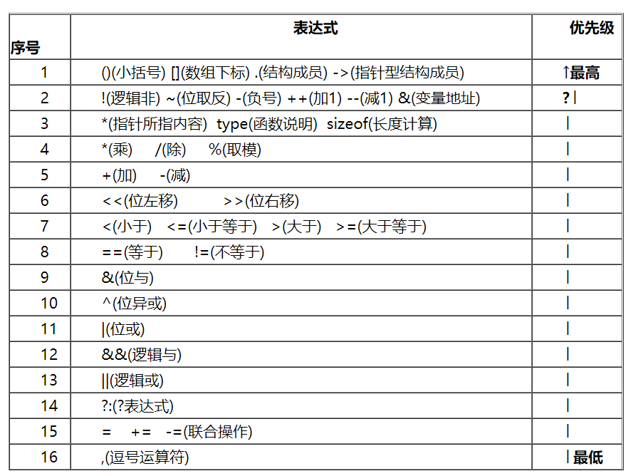

​	大概就这些了，注意优先级是5的移位操作，对于 r - l >> 2，就是想进行减法运算，再位移操作。还有与或操作优先级偏低，同时都是与高于或。

​	注意**`*p++`和`*(p++)`都是先取地址，再进行++操作**。

### inline和宏函数

​	inline关键字是C99标准的型关键字，内联函数，其作用是将函数展开，把函数的代码复制到每一个调用处。这样调用函数的过程就可以直接执行函数代码，而不发生跳转、压栈等一般性函数操作。可以节省时间，也会提高程序的执行速度。

​	宏函数的优点：宏函数在预处理期间会进行宏替换，没有函数压栈开销，运行效率高。
​	宏函数的缺点：不安全（不会进行类型检测）；代码复用率不高；不停的进行替换，增长代码长度；不能调试

​	两者的对比：

1. 内联函数采用的是值传递，而宏定义采用的是对等替换.

2. 宏是由预处理器对宏进行替代，在预编译时展开，而内联函数是通过编译器控制来实现的，在编译时展开。而且内联函数是真正的函数，在需要用到的时候，内联函数像宏一样的展开，所以取消了函数的参数压栈，减少了调用的开销
3. 编译器在调用一个内联函数时，会首先检查它的参数的类型，保证调用正确。然后进行一系列的相关检查，就像对待任何一个真正的函数一样。这样就消除了它的隐患和局限性。

​	在C++中，强制建议使用const代替宏常量，使用内联函数代替宏函数，const和内联函数在进行编译时不仅进行替换，而且还会进行参数类型检测，提高了程序的安全性。内联函数可以是普通函数，也可以是类的成员函数；函数式宏不能作为类的成员函数.

### 内存泄漏问题

​	可以在malloc和free的地方通过打log（分配内存地址消息等）的消息进行统计，也可以直接封装malloc和free，内部添加计数值进行统计。

​	也可以使用valgrind工具来定位检测。Valgrind是一款用于内存调试、内存泄漏检测以及性能分析、检测线程错误的软件开发工具。

​	在开发过程中遵守下面的规则，基本能90+%避免内存泄漏：

- 良好的编程习惯，只有有malloc/new，就得有free/delete
- 尽可能的使用智能指针，智能指针就是为了解决内存泄漏而产生
- 使用log进行记录
- 也是最重要的一点，谁申请，谁释放

### C++中lambda函数

​	lambda函数也叫匿名函数。

​	具体可以参考[C++中的Lambda函数](https://blog.csdn.net/weixin_42887343/article/details/122099296)。

### __ attribute __((at))

​	__ attribute __( at(绝对地址) )的作用：

（1）绝对定位到 Flash；

（2）绝对定位到 RAM。

​	__ attribute __ ：用来指定变量或结构位域的特殊属性，关键字后的双括弧中的内容是属性说明；

​	at：用来设置变量的绝对地址，指定某个变量处于内存或 FLASH 里面的某个给定的地址。


## 操作系统相关

### 进程间通信的方式

​	一个之前的认识误区，全局变量是不能在进程之间传递信息的，每个进程都有自己的虚拟内存空间，就算父进程定义了一个全局变量，在子进程中，也访问不到，它是会将在写时复制的时候拷贝一份。而全局变量是可以在同一个进程中的多线程之间传递信息的。在之前的嵌入式开发中，其实就相当于是单进程的系统，就算是FreeRTOS的多任务系统也就相当于多线程，所以可以使用全局变量。	

​	**管道**：匿名管道和命名管道，都是单向的，前者只能在父子进程之间通信。

​	**信号量**：不能用来传递复杂消息，只能用来同步。它维护了一个许可集，我们在初始化时需要传一个许可集数量，该数量值代表同一时间能访问共享资源的线程数量。 它的使用需要一块共享内存在不同进程之间传递。

​	**消息队列**：一种从一个进程向另一个进程发送一个数据块的方法。 每个数据块都被认为含有一个类型，接收进程可以独立地接收含有不同类型的数据结构。 我们可以通过发送消息来避免命名管道的同步和阻塞问题。它不适合大量数据的传输，而且频繁进入内核拷贝数据，效率比较低。

​	**信号**：操作系统通过信号来通知进程系统中发生了某种预先规定好的事件（一组事件中的一个），它也是用户进程之间通信和同步的一种原始机制。

​	**共享内存**：利用内存缓冲区直接交换信息，无须复制，快捷、信息量大是其优点。共享内存块提供了在任意数量的进程之间进行高效双向通信的机制。每个使用者都可以读取写入数据，但是所有程序之间必须达成并遵守一定的协议，以防止诸如在读取信息之前覆写内存空间等竞争状态的出现。速度最快，相当于在不同进程之间取了一块虚拟内存直接都映射到一块物理内存上，直接对内存操作，而不像管道读写实际相当于对文件的操作，读写操作都需要进入内核。

​	**套接字**：

### 进程与线程

​	进程是资源分配的最小单位，线程是CPU执行程序的最小单位。

​	进程切换是切换PCB，线程切换是切换TCB。进程切换和线程切换最主要的一个区别在于进程切换涉及虚拟地址空间的切换而线程不会。

#### PCB内容

​		操作系统为了执行进程间的切换，会维护一张表格，这张表就是进程表(process table)。每一个进程都会占用一个进程表项。这个表项就是进程控制块。进程控制块中包含了进程状态的重要信息。包括程序计数器、堆栈指针、内存分配状况、所打开的文件列表、账号与调度信息，以及其他在进程由运行太转换到就绪态或阻塞态时所必须要保存的信息，从而保证了该进程随后能再次启动还能从上次执行的地方继续执行。

​	PCB中主要有以下内容：

- 进程id。
- 进程的状态，有就绪、运行、挂起、停止等状态。
- 进程切换时需要保存和恢复的一些CPU寄存器。
- 描述虚拟地址空间的信息。包括由段表首地址和页目录首地址
- 描述控制终端的信息。
- 当前工作目录
- umask掩码。
- 文件描述符表，包含很多指向file结构体的指针。
- 和信号相关的信息。
- 用户id和组id。
- 会话(Session)和进程组。
- 进程可以使用的资源上限(Resource Limit)。

#### 进程组与会话

​	目前理解父进程创建子进程，则子进程和父进程就属于一个进程组，该父进程创建的所有子进程都属于该进程组，一般最初那个父进程就是组长进程，其PID==PGID，PGID代表进程组ID。如图所示，前三个数分别代表PPID、PID、PGID，其中第一个为父进程创建了10个子进程，则他们都属于27036的进程组。同时也可以使用setpgid函数来设置进程组

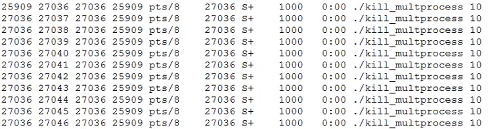

​	会话相当于多个进程组的集合，创建会话时有以下一个注意事项：

1. 调用进程不能是进程组组长，该进程变成新会话首进程(session header)该进程成为一个新进程组的组长进程。
2. 新会话丢弃原有的控制终端，该会话没有控制终端
3. 该调用进程是组长进程，则出错返回
4. 建立新会话时，先调用fork，父进程终止，子进程调用setsid

#### 守护进程

​	Daemon(精灵)进程，是Linux中的后台服务进程，通常独立于控制终端并且周期性地执行某种任务或等待处理某些发生的事件。一般采用以d结尾的名字。Linux后台的一些系统服务进程，没有控制终端，不能直接和用户交互。不受用户登录、注销的影响，一直在运行着，他们都是守护进程。如：预读入缓输出机制的实现；ftp服务器；nfs服务器等。创建守护进程，最关键的一步是调用setsid函数创建一个新的Session,并成为Session Leader。

### 父进程和子进程

​	使用fork()函数的本质是将父进程的内容复制一份，子进程与父进程一致的内容：

- 进程的地址空间。
- 进程上下文、代码段。
- 进程堆空间、栈空间，内存信息。
- 进程的环境变量。
- 标准 IO 的缓冲区。
- 打开的文件描述符。
- 信号响应函数。
- 当前工作路径。

子进程独有的内容：

- 进程号 PID。 PID 是身份证号码，是进程的唯一标识符。
- 记录锁。父进程对某文件加了把锁，子进程不会继承这把锁。
- 挂起的信号。这些信号是已经响应但尚未处理的信号，也就是”悬挂”的信号， 子进程也不会继承这些信号。

​	同时在Linux中引入一种写时复制技术（Copy On Write，简称COW）， 写时复制是一种可以推迟甚至避免复制数据的技术。 内核此时并不复制整个进程的地址空间，而是让父子进程共享同一个地址物理空间（页面），即子进程的虚拟内存也指向父进程的物理内存空间， 操作虚拟地址明显比直接操作物理内存更加简便快捷，但是对于子进程来说，页面是写保护的，当子进程操作时就会产生写保护错误，然后系统再为子进程分配实际的物理内存空间，并重新做虚拟内存的映射。

​	父进程通过wait等函数，接收子进程结束发来的SIGCHLD信号，来释放它的PCB，不然就会产生僵尸进程。每个进程结束之后，都会释放自己地址空间中的用户区数据，内核区的PCB没有办法自己释放掉，需要父进程去释放。

### 进程调度算法

​	目前理解linux2.6前应该还是单纯的多级反馈队列调度算法或者是它的改进版本，之后就变的比较复杂了	

​	在现在的 Linux 内核中 , sched_class 调度器 分为以下 5 种类型 :

- stop_sched_class : 停机调度类 
- dl_sched_class : 限期调度类 
- rt_sched_class : 实时调度类，对于实时进程使用的调度类，使用FIFO或者时间片轮转算法
- fair_sched_class : 公平调度类，对于普通进程使用的调度类，也是使用的最多的，使用完全公平调度算法（CFS）
- idle_sched_class : 空闲调度类 

​	上述每种 " 调度类 " 都有自己的 调度策略 ;

​	**调度类 优先级 由高到低排列为 :**

​	停机调度类 > 限期调度类 > 实时调度类 > 公平调度类 > 空闲调度类


​	完全公平调度算法中，任何进程所获得的处理器时间是由它自己和其他所有可运行进程nice值的相对差值决定的。任何nice值对应的绝对时间不再是一个绝对值，而是处理器的使用比。CFS称为公平调度器是因为它确保给每个进程公平的处理器使用比。CFS不是完美的公平，它只是近乎完美的多任务。但是它确实在多进程环境下，降低了调度延迟带来的不公平性。

### 用户级线程和内核级线程

​	在用户级线程中，有关线程管理的所有工作都由应用程序完成，用户级线程仅存在于用户空间，**内核意识不到线程的存在**。应用程序可以通过使用线程库设计成多线程程序。

​	在内核级线程中，线程管理的所有工作都由内核完成，应用程序没有进行线程管理的代码，只有一个到内核级线程的编程接口。内核为进程（PCB）及内部的每个内核线程维护上下文信息（TCB），调度也在内核基于线程架构的基础上完成。

### 硬软链接的区别

​	硬链接是有着相同 inode 号仅文件名不同的文件，不能跨越磁盘分区；软链接就是一个普通文件它数据块内容是另一文件的路径名的指向。

### dup和dup2函数

```c
int dup(int filedes);	// 返回复制出来的新文件描述符
int dup2 (int old,int new);	// 将old复制给new，返回第一个不小于new的整数值，一般都直接返回new
```

​	由up返回的新文件描述符一定是当前可用文件描述符中的最小数值；dup2则可以new参数指定新描述符的数值。如果new已经打开，则先将其关闭，再进行拷贝。如若old等于new，则dup2返回new，而不关闭它。

### 死锁

​	产生死锁的主要原因是：

1) 系统资源不足；

2) 进程运行推进的次序不合适；

3) 资源分配不当。

​	产生死锁的四个必要条件：

1) 互斥条件：一个资源一次只能被一个进程访问。

2) 请求与保持： 一个进程因请求资源而阻塞时，对已获得的资源保持不放。

3) 不可剥夺：进程已获得的资源，在未使用完之前，不得强行剥夺。

4) 循环等待：若干进程之间形成一种头尾相接的循环等待资源关系。

​	死锁的处理方式主要从**预防死锁**、**避免死锁**、**检测死锁**和**解除死锁**这四个方面来进行处理。

​	**预防**：通过设置某些限制条件，以破坏产生死锁的四个条件中的一个或者几个，来防止发生死锁。比如一次性分配所有资源、使用可剥夺资源
​    **避免**：系统在分配资源时根据资源的使用情况提前作出预测，从而避免死锁的发生。比如使用银行家算法
​    **检测**：允许系统在运行的过程中产生死锁，但是，系统中有相应的管理模块可以及时检测出已经产生的死锁，并且精确地确定与死锁有关的进程和资源，然后采取适当措施，清除系统中已经产生的死锁。
​    **解除**：与检测死锁相配套的一种措施，用于将进程从死锁状态下解脱出来。比如剥夺资源、撤销进程

### 中断和异常的区别

​	面试可能会问

​	外中断——就是我们指的中断——是指由于外部设备事件所引起的中断，如通常的磁盘中断、打印机中断等；

​	内中断——就是异常——是指由于 CPU 内部事件所引起的中断，如程序出错(非法指令、地址越界)。内中断(trap)也被译为“捕获”或“陷入”。
​	异常是由于执行了现行指令所引起的。由于系统调用引起的中断属于异常。
​	中断则是由于系统中某事件引起的，该事件与现行指令无关。


​	对于INT 0x80的理解，它其实就是系统调用system_call陷入内核的方式，内核执行了INT 0x80，会把system_call绑定为它的处理函数，才能进入内核中的。所以系统调用则是属于软中断（需要与后面的软中断概念区分开）中的一个特例，int指令（软中断还有其他指令，如yield，这个地方应该大概就是上面异常的一个子集）是程序用来显式声明软中断的，故而所谓的”基于int指令的系统调用”便是来源于此。软中断int指令发出后，显然需要同时传递一个中断类型的ID，用来告知内核启动相应的中断处理程序(缺页、硬件驱动、系统调用等），在内核中，系统调用即申请内核提供系统资源调配服务system_call对应的便是0x80中断号，内核中通过中断向量表(IVT, interrupt vector table)，存放中断号和中断处理程序入口地址对应关系。


### 中断

​	中断（这个地方指**外中断，硬件中断**）是一种由设备使用的硬件资源异步向处理器发信号。实际上，中断就是由硬件来打断操作系统。大多数现代硬件都通过中断与操作系统通信。对给定硬件进行管理的驱动程序注册中断处理程序，是为了响应并处理来自相关硬件的中断。中断过程所做的工作包括应答并重新设置硬件，从设备拷贝数据到内存以及反之，处理硬件请求，并发送新的硬件请求。内核提供的接口包括注册和注销中断处理程序、禁止中断、屏蔽中断线以及检查中断系统的状态。

​	因为中断打断了其他代码的执行（进程，内核本身，甚至其他中断处理程序），它们必须赶快执行完。但通常是还有很多工作要做。为了在大量的工作与必须快速执行之间求得一种平衡，内核把处理中断的工作分为两半。中断处理程序为上半部，下半部为后续的一些处理函数。现在内核提供三种下半部的实现机制：软中断、tasklets和工作队列。

#### 1. 软中断和tasklet

​	软中断是Linux内核很早引入的机制，最早可以追溯到Linux2.3开发期间。软中断是预留给系统中对时间要求最严格和最重要的下半部使用的，而且目前驱动中只有块设备和网络子系统使用了软中断。系统静态定义了若干软中断类型，总共10个，并且Linu内核开发者不希望用户再扩充新的软中断类型，如有需要，建议使用tasklet机制。已经定义好的软中断类型如下。

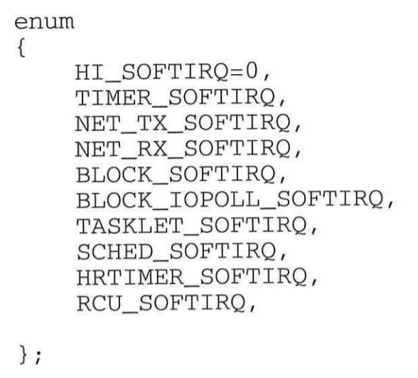

​	软中断是Liux内核中最常见的一种下半部机制，适合系统对性能和实时响应要求很高的场合，例如网络子系统、块设备、高精度定时器、RCU等。

- 软中断的回调函数在开中断的环境下执行。
- 软中断的回调函数不能睡眠。
- 软中断的执行时间点是在硬件中断返回前，即退出硬中断上下文时，首先检查是否有等待的软中断，然后才检查是否需要抢占当前进程。因此，软中断上下文总是抢占进程上下文。==后面会继续讨论关于中断上下文的问题==

​	tasklet是利用软中断实现的一种下半部机制，本质上是软中断的变种，运行在软中断上下文中。

#### 2. 工作队列

​	工作队列机制是除了软中断和tasklet以外最常用的下半部机制之一。工作队列的基本原理是把work（需要推迟执行的函数）交由一个内核线程执行，并且总是在进程上下文中执行。工作队列的优点是利用进程上下文来执行中断下半部操作，因此工作队列允许重新调度和睡眠，是异步执行的进程上下文，另外还能解决因软中断和tasklet执行时间过长而导致系统实时性下降等问题。

### 进程上下文与中断上下文

1.进程上下文：

（1）进程上文：其是指进程由用户态切换到内核态是需要保存用户态时cpu寄存器中的值，进程状态以及堆栈上的内容，即保存当前进程的进程上下文，以便再次执行该进程时，能够恢复切换时的状态，继续执行。

（2）进程下文：其是指切换到内核态后执行的程序，即进程运行在内核空间的部分。

​	在进程上下文中是可以发生睡眠的。==至于为什么可以，虽然感觉就很显而易见，但是我目前对于进程上下文和切换过程不是很清楚，所以对里面的一些细节并不是，以后有机会再细看。==

2.中断上下文：

（1）中断上文：硬件通过中断触发信号，导致内核调用中断处理程序，进入内核空间。这个过程中，硬件的一些变量和参数也要传递给内核，内核通过这些参数进行中断处理。中断上文可以看作就是硬件传递过来的这些参数和内核需要保存的一些其他环境（主要是当前被中断的进程环境。

（2）中断下文：执行在内核空间的中断服务程序。

​	在中断上下文中是不能睡眠的，目前我理解的解释是，进入中断上下文时，它是直接在内核系统上运行，它是不属于任何进程的，它也没有PCB的概念，睡眠后不能调用schedule函数去把CPU的运行权交给另外一个进程，内核就会BUG。

​	根据之前所介绍的，一些中断分上半部和下半部，下半部主要通过软中断等实现，所以在中断处理函数执行完，就会触发对应的软中断，然后又会进入软中断上下文，目前不是很理解这个软中断执行的过程，前面有相应的介绍，==我目前认为前面提到的软中断回调函数应该也是软中断上下文的一部分，所以在软中断中处理的时候，也不能睡眠，那这个时候软中断也是在独自占有CPU，那这个和全部在上半部的中断处理函数执行有什么区别？==

​	在《奔跑吧linux内核-入门篇》中还有一段描述：

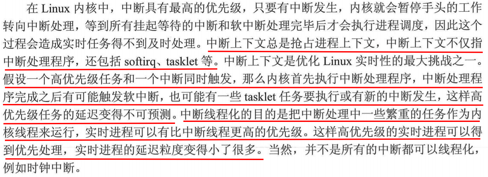

​	在[软中断处理函数do_softirq()的执行时机](https://www.bilibili.com/video/BV17q4y1x7Rb?spm_id_from=333.880.my_history.page.click&vd_source=cf57095da4fd93d87311b5182349bbc9)中提到一个ksoftirqd线程，它是内核专门用来执行软中断处理函数的线程。

​	==目前按我的知识储备，感觉在《奔跑吧linux内核-入门篇》书里面关于中断上下文和软中断这部分有点前后矛盾。所以实际软中断处理的过程是可以被抢占的？比如被优先级更高的实时进程？我觉得这样更合理吧，如果下半部也是不能睡眠的话，那么这样设计的意义何在？==

### 信号

​	信号（signal，又简称为信号）用来通知进程发生了事件。进程之间可以通过调用kill库函数发送软中断信号（这个软中断和上面的不是一个东西）。Linux内核也可能给进程发送信号，通知进程发生了某个事件（例如内存越界）。

​	注意，信号只是用来通知某进程发生了什么事件，无法给进程传递任何数据，进程对信号的处理方法有三种：

1）第一种方法是，忽略某个信号，对该信号不做任何处理，就像未发生过一样。

2）第二种是设置中断的处理函数，收到信号后，由该函数来处理。

3）第三种方法是，对该信号的处理采用系统的默认操作，大部分的信号的默认操作是终止进程。

​	信号总共有62个，1~64，其中没有32和33号信号，我们比较常用有：

- 2号的**SIGINT**信号，即ctrl+c触发的信号，键盘中断，这将中断给定的进程并停止该进程。
- 9号的**SIGKILL**信号，强制杀死程序，它和19号的SIGSTOP信号都不可捕捉、阻塞和忽略。
- 11号的**SIGSEGV**信号，无效的内存引用
- 15号的**SIGTERM**信号，采用“kill  进程编号”或“killall 程序名”指令是发送的信号，用于终止进程
- 17号的**SIGCHLD**信号，子进程停止、结束或在被跟踪时发出的信号，可以用于父进程为子进程回收资源，wait阻塞等待的就是这个信号，不处理的话，就会产生僵尸进程

​	其中常规信号为1-31号信号，后34-64号信号为实时信号。常规信号为不可靠信号，即同时接收到多个相同的信号时，他们可能会被合并为一个信号；而实时信号为可靠信号，接收到多少个就是多少个，挨个阻塞运行。

​	我们可以使用**signal()**函数来忽略信号或者指定信号的处理函数（9和19号不能），当指定处理函数时，如果在处理函数运行中又接受到新的信号，则存在两种情况：

1. 当是相同的信号时，则处理函数不会被中断，等到运行结束再处理新的信号，如果是不可靠信号的话，可能就合并忽略了。
2. 如果是不同的信号时，则处理函数会被中断，去执行新信号的处理函数，等新的执行结束后在执行原来的处理函数。

​	当然也有办法让处理函数阻塞，即接收到新的信号不发生中断。

```c
signal(SIGINT, func1);
signal(SIGTERM, func2);

void func1(void)
{
    // 比如2号和15号信号
    // 当2号信号发生时，接收到15号信号而不中断，将15号信号阻塞
    sigset_t set;
    sigemptyset (&set);
    sigaddset (&set,15);
    sigprocmask (SIG_BLOCK,&set,NULL);

    /*此处为func1的业务代码...*/    

    // 等到2号信号处理函数执行结束后
    sigprocmask (SIG_UNBLOCK,&set,NULL);	// 之后就会执行15号的处理函数 
}

```

​	除此之外还有功能更强的**sigaction()**函数，它也可以实现阻塞功能，如下所示：

```c
struct sigaction stact;
memset (&stact,0,sizeof (stact));	// 初始化。
stact.sa_handler=hdfunc;			// 指定信号处理函数
sigaddset (&stact.sa_mask,15);		// 指定需要阻塞的信号。
sigaction (2,&stact,NULL);			// 设置信号2的处理行为。
sigaction (15,&stact,NULL)			// 设置信号15的处理行为。
```

​	当然它还要更多的功能和使用场景，同时网课老师说多进程中可以使用signal，也可以使用sigaction，但是在多线程中只能使用sigaciton了，==具体为什么我还不清楚，之后可以多了解一下。==

### 内存管理相关

#### malloc、kmalloc和vmalloc的区别

1. kmalloc和vmalloc是分配的是内核的内存，malloc分配的是用户的内存。
2. kmalloc保证分配的内存在物理上是连续的（自然在虚拟内存也是连续的），内存只有在要被DMA访问的时候才需要物理上连续，malloc和vmalloc保证的是在虚拟地址空间上的连续；
3. kmalloc能分配的大小有限，通常以字节作为单位，vmalloc和malloc能分配的大小相对较大；
4. vmalloc比kmalloc要慢。 **尽管在某些情况下才需要物理上连续的内存块，但是很多内核代码都用kmalloc来获得内存，而不是vmalloc**。这主要是出于性能的考虑。**vmalloc函数可能睡眠，因此不能从中断上下文中调用**，也不能从其他不允许阻塞的情况下进行调用。

#### 伙伴算法

​	伙伴算法就是**将内存分成若干小块，然后尽可能以最适合的方式满足程序内存需求的一种内存管理算法。伙伴算法的
一大优势是它能完全避免外部碎片的产生**。

​	根据伙伴算法的经典理论，这些内存块的大小必须是2的整数次方。例如，一块1M的内存可以按照64K、128K、256K和512K等的数值分成若干块。其实按照什么数值分块还是有一定原则的。通常我们选择比可用内存数小的2的整数次方的最大值。例如，对于一个8M的内存，最大的内存块可以为4M，而余下的4M内存用来划分小于4M的块。这样可以最大限度地保证程序能够从系统中申请到尽可能多的内存。


​	在内存块划分完成后，系统就可以对内存进行分配和释放了。在分配内存时，首先从空闲的内存中搜索比申请的内存大的最小的内存块。如果这样的内存块存在，则将这块内存标记为“已用”，同时将该内存分配给应用程序。如果这样的内存不存在，则操作系统将寻找更大块的空闲内存，然后将这块内存平分成两部分，一部分返回给程序使用，另一部分作为空闲的内存块等待下一次被分配。

​	当程序释放内存时，操作系统首先将该内存回收，然后检查与该内存相邻的内存是否是同样大小并且同样处于空闲的状态。如果是，则将这两块内存合并，然后程序递归进行同样的检查。

​	下图为一个不足7M的内存空间的buddy初始化，假设一个页4K，page_buddy[i]为$2^i$个页对应的链表头，则最大的内存块为256个页，即1M大小，页与页之间通过一个双向链表连接，最开始初始化为6个最大页和若干个最小页，即page_buddy[8]后面连接了$6*2^8$个page结构体。就遍历这个至于怎么区分内存块，可能需要根据内存块大小找自己边界吧。。

​	每次申请的时候，首先需要计算出对应的阶数，比如3个页需要2^2个页的内存块，这去看page_buddy[2]的链表头即可，然后根据伙伴算法去操作。具体操作详见《一步一步写嵌入式操作系统--ARM编程的方法与实践》


​	**malloc底层使用伙伴算法实现。**

#### slab算法

​	slab算法原理其实很简单。**它专门为某一模块预先一次性申请一定数量的内存备用，当这个模块想要使用内存的时候，就不再需要从系统中分配内存了（因为从系统中申请内存的时间开销相对来说比较大)，而是直接从预申请的内存中拿出一部分来使用，这样就提高了这个模块的内存申请速度**。

​	比如结构体A大小为120Byte，而在程序中我们会频繁的申请释放A，则预先在内存中申请10个128Byte的内存块，创建A就可以直接在预先申请的内存块中取一个空闲的空间给A，而释放A只需要把那块内存又放入空闲队列即可。这样每次浪费的空间都比较小，而且频繁创建和释放A时，并不需要频繁申请空间，通过对空闲队列操作即可，只需要在初始化内存块时申请一次。

​	所以使用slab算法前提条件：

- 当某一子系统需要频繁地申请和释放内存时，使用slab才会合理一些。
- 使用slab的另外一个条件是，利用slab申请的内存必须是大小固定的。只有固定内存大小才有可能实现内存的高速申请和释放。

​	而在linux中，对于**进程结构体和文件结构体**等正好符合上述条件，所以slab算法非常有用。

​	目前我的理解是slab算法底层使用了buddy算法在**物理内存**中预先上次大小相同内存块（物理内存上连续，则虚拟内存自然也连续），所以通常slab中的每个内存块大小为2次幂的，且比较小，如果内存块太大的话，提前申请就会比较浪费。

​	kmalloc底层就是通过slab算法实现，所以它分配的内存比较小。==目前理解，内核中应该首先会调用类似于kmalloc_init的函数，用slab算法将一些常用的内存块大小初始化好，然后kmalloc申请空间的话就是在slab算法预先申请好的空间中去寻找合适的大小的内存块。==具体操作详见《一步一步写嵌入式操作系统--ARM编程的方法与实践》，但是实际的linux和嵌入式操作系统还是有一定区别的。

#### vmalloc机制

​	vmalloc函数为了把物理内存上不连续的页转换为虚拟地址空间上连续的页，必须专门建立页表项。而通过vmalloc获得的页必须一个个地进行映射，因为它们物理上是不连续的，这就会导致比直接内存映射大得多的TLB抖动，导致它执行起来比较慢。所以vmalloc一般在获得大块内存时使用。

​	vmalloc机制使得内核通过连续的线性虚拟地址来访问非连续的物理页框，这样可以最大限度的使用物理内存。

#### 问题

​	linux中对于物理内存是分页管理的，一般认为最小页为4k，如果我malloc(sizeof(int))，那这个4Byte的int类型数据在物理内存中也占一个4k的页吗？kmalloc也类似有这样的疑问。

​	现在大概懂了，malloc是在虚拟内存中分配空间，使用的时候再通过缺页中断，分配物理内存空间，然后再次分配malloc小内存的话，如果虚拟内存连续的话，就可以映射到一个物理内存页上，则只有第一次会通过缺页中断分配物理内存空间。

​	另外一个问题是，malloc中buddy最小内存岂不是要为4Byte？


### 进程同步

#### 互斥锁

​	互斥锁基本机制是使用一个可以被锁定和解锁的互斥量来保护每个临界区。一个线程如果想要进入临界区，它首先尝试锁住相关的互斥量。如果互斥量没有加锁，那么这个线程可以立即进入，并且该互斥量被自动锁定以防止其他线程进入。如果互斥量已经被加锁，则调用线程被阻塞，直到该互斥量被解锁。如果多个线程在等待同一个互斥量，当它被解锁时，这些等待的线程中只有一个被允许运行并将互斥量重新锁定，这个和互斥锁初始化的属性相关。

```C
// 互斥锁的初始化
int pthread_mutex_init(pthread_mutex_t *mutex,const pthread_mutex_attr_t *mutexattr);
```

​	其中参数 mutexattr 用于指定锁的属性（见下），如果为NULL则使用缺省属性。

​	互斥锁的属性在创建锁的时候指定，当资源被某线程锁住的时候，其它的线程在试图加锁时表现将不同。当前有四个值可供选择：

​	1）PTHREAD_MUTEX_TIMED_NP，这是缺省值，也就是普通锁。当一个线程加锁以后，其余请求锁的线程将形成一个等待队列，并在解锁后按优先级获得锁，即优先唤醒。这种锁策略保证了资源分配的公平性。

​	2）PTHREAD_MUTEX_RECURSIVE_NP，嵌套锁，允许同一个线程对同一个锁成功获得多次，并通过多次unlock解锁。

​	3）PTHREAD_MUTEX_ERRORCHECK_NP，检错锁，如果同一个线程请求同一个锁，则返回EDEADLK，否则与PTHREAD_MUTEX_TIMED_NP类型动作相同。

​	4）PTHREAD_MUTEX_ADAPTIVE_NP，适应锁，动作最简单的锁类型，等待解锁后重新竞争。

```C
// 阻塞加锁，如果锁已经被占据，本线程将排队等待，直到成功的获取锁。
int pthread_mutex_lock(pthread_mutex *mutex);
// 非阻塞加锁，如果锁已经被占据时立即返回 EBUSY，不是挂起等待。
int pthread_mutex_trylock( pthread_mutex_t *mutex);
```

​	需要注意的是，如果进程A先占有互斥锁资源，当进程B再去申请时就会被挂起等待，当锁资源被进程A释放后，**被挂起的进程B并不是立即获得锁资源**，而是要等释放锁的进程A放弃CPU的使用权（主动或者被动被调度器切换），然后等到被挂起的进程B再次运行，然后再次去申请锁资源，才能获取到锁资源，目前理解普通锁的话，**如果多个进程请求一个锁资源，则在锁释放后，先被调度的进程可以获取到锁资源**。

​	如下面这个例子：

```c
// 如果多开几个这样的线程
// 最后的usleep(100)就很关键，usleep会将线程挂起
void *pthfun (void *arg)
{
    while(1)
    {
        pthread_mutex_lock (&mutex);	// 加锁
        printf("%d:%ld:lock ok.\n",time(0),(long)arg);
        // 操作共享的全局变量
        sprintf(buffer,"%d:%ld,%d",time(0),pthread_self(),ii);
        sleep (5):
        pthread_mutex_unlock(&mutex);	// 解锁
        printf("%d:%ld:unlock...\n",time (0),(long)arg);
        // usleep(100);
    }
}
```

​	如果最后有usleep(100)的话，多个线程之间就可以正常的互斥进入临界区进程操作，因为第一个占有锁的线程释放锁后，会因为usleep而挂起，其他线程可以正常运行来申请锁资源；如果去掉usleep(100)，则只会由第一个进程一直占有锁资源，因为它释放锁后，并不会主动放弃cpu使用权，所以它又会很快执行到申请锁资源的地方，就再次获取到锁资源了。

#### 自旋锁

​	自旋锁的功能和互斥锁类似，但是当锁资源被占用的时候，它并不会将进程挂起等待，而且一直占有CPU资源在循环等待。减少了进程/线程从睡眠到唤醒的资源消耗。自旋锁在用户态使用的比较少，在内核使用的比较多，使用场景：**资源的锁被持有的时间短或者说小于2次上下文切换的时间，而又不希望在线程的唤醒上花费太多资源的情况，以及锁内操作远小于2次上下文切换的时间**。

​	目前理解**自旋锁在多处理的系统中才能发挥作用**，在单处理器系统中，如果使用自旋锁，则还是需要切换到另外一个线程中去释放自旋锁资源，还是会发生上下文切换，而且自旋锁如果不可抢占的话，感觉就会一直在空操作，我感觉就死锁了。而多处理的话，可以由另外一个处理器中的线程去释放锁资源，这样自旋锁就可以在轮巡的过程中等到锁资源。==目前还不是特别的明确，下面是《深入理解linux内核(第三版中文)》中的说法==

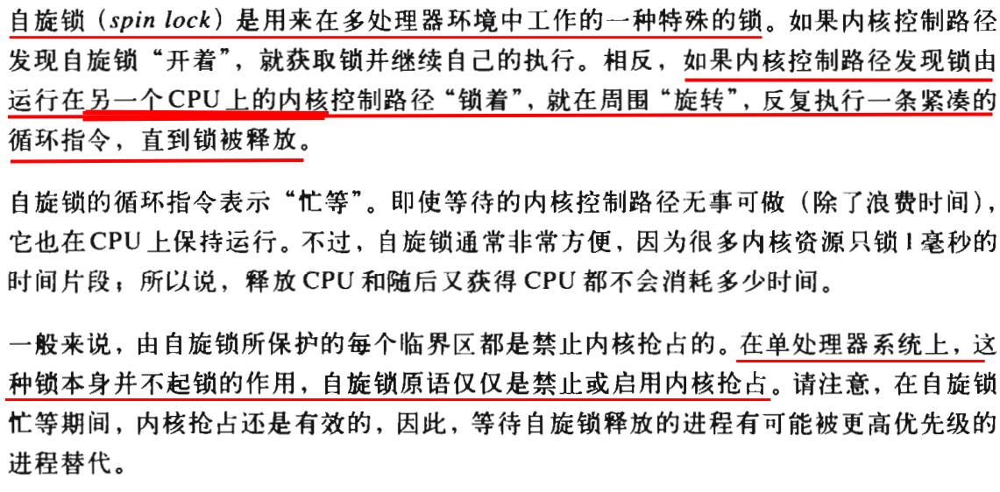

​	自旋锁不会主动挂起进程，所以它可以用于任何上下文（包括中断上下文），但是我觉得还是得在多处理的系统中使用。

#### 条件变量

​	条件变量用来阻塞一个线程，直到其它的线程通知它条件已满足为止。通常条件变量和互斥锁同时使用。条件变量使我们可以睡眠等待某条件出现。条件变量是利用线程间共享的全局变量进行同步的一种机制，主要包括两个动作：
1）一个线程因 “条件不成立” 而挂起等待
2）另一个线程使 “条件成立”, 并发出信号

​	常用的操作：

```C
// 初始化条件变量
int pthread_cond_init(pthread_cond_t *cond,pthread_condattr_t *cond_attr);
// 阻塞等待
int pthread_cond_wait(pthread_cond_t *cond,pthread_mutex_t *mutex);
// 超时等待
int pthread_cond_timewait(pthread_cond_t *cond,pthread_mutex *mutex,const timespec *abstime):
 // 唤醒一个等待该条件的线程
int pthread_cond_signal(pthread_cond_t *cond);
// 唤醒全部等待该条件的所有线程
int pthread_cond_broadcast(pthread_cond_t *cond);
// 销毁条件变量
int pthread_cond_destroy(pthread_cond_t *cond);
```

​	一个简单的生产者消费者模型：

```c
// 消费者、出队线程主函数。
void *outcache(void *arg)
{
  struct st_message stmesg;
  while (true){
    pthread_mutex_lock(&mutex);  // 加锁。
    // 如果缓存为空，等待。 // 条件变量虚假唤醒。
    while (vcache.size() == 0) pthread_cond_wait(&cond,&mutex);
    // 从缓存中获取第一条记录，然后删除该记录。
    memcpy(&stmesg,&vcache[0],sizeof(struct st_message)); // 内存拷贝。
    vcache.erase(vcache.begin());
    pthread_mutex_unlock(&mutex);  // 解锁
    // 以下是处理业务的代码。
    printf("phid=%ld,mesgid=%d\n",pthread_self(),stmesg.mesgid);
    usleep(100);	// 这个usleep很关键
  }
}
// 生产者、把生产的数据存入缓存。
void *incache(void *arg)
{
  struct st_message stmesg;
  while(true)
  {
      memset(&stmesg,0,sizeof(struct st_message));
      pthread_mutex_lock(&mutex);  // 加锁。
      // 生产数据，放入缓存。
      stmesg.mesgid=mesgid++; vcache.push_back(stmesg);   // 内存拷贝。
      pthread_mutex_unlock(&mutex); // 解锁。
      pthread_cond_broadcast(&cond);  // 触发条件，激活全部的线程。
      usleep(100);	// 这个usleep很关键
  }
}

```

​	需要注意条件变量的使用，一般先个互斥锁加锁，然后再等待条件变量。而在`pthread_cond_wait`中进行了以下操作：

1) 释放了互斥锁
2) 等待条件
3) 条件被触发，互斥锁加锁（这是一个原子操作）

​	所以就算消费者线程加锁后，在条件变量处还是会解锁等待条件变量，所以最后所有消费者线程都阻塞在条件变量上了。	

​	目前测试，**pthread_cond_broadcast(&cond)发送信号后，并不会直接引起调度，与互斥锁释放资源类似，还是要等到等待条件变量信号的线程运行后，才能获取到条件变量**。所以示例中的`incache`是一个while(true)循环，而在`pthread_cond_broadcast`后如果不加usleep，实际情况可能是生产者在它的时间片中多次循环，包括多次加锁、解锁、触发条件的操作，然后等到系统调度器将它挂起后，消费者线程才能捕捉到条件变量，然后进行获取数据的操作，这样就比较低效。

​	==好像可以在生产者也加条件变量，等消费者操作完激活条件变量，来解决无usleep就会让生产者多次获得锁资源，导致资源浪费的问题==

​	下面看看单纯使用互斥量的实现方式，明显不太行，如果生产者不生产的话，消费者会反复上锁和解锁。

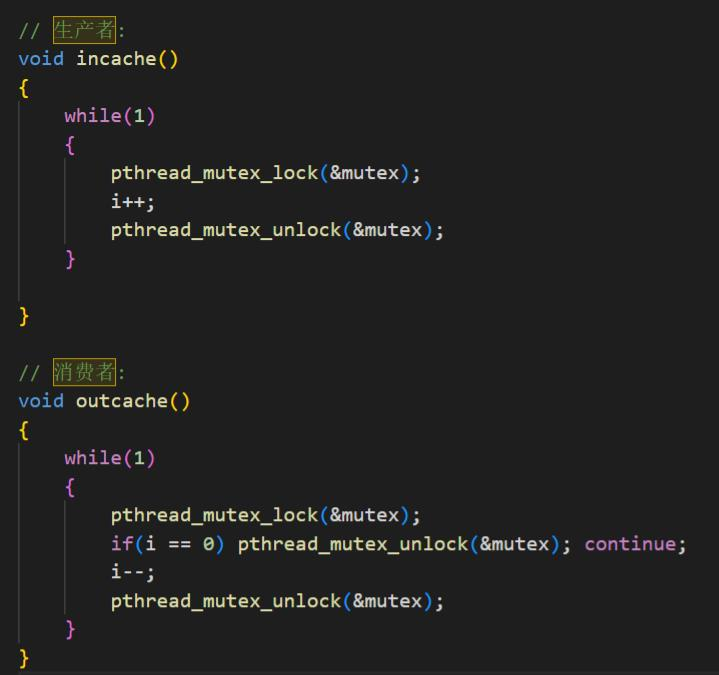

#### 信号量

​	信号量是一个整数计数器，其数值可以用于表示空闲临界资源的数量。当有进程释放资源时，信号量增加，表示可用资源数增加；当有进程申请到资源时，信号量减少，表示可用资源数减少。

​	关于信号量的实现有POSIX、System V，好像还有pthread库中，下面为POSIX信号量的基本操作函数：

```C++
// 初始化信号量。
int sem_init(sem_t *sem,int pshared,unsigned int value);
// 等待信号量，如果信号量的值为0则等待，如果信号量大于0则返回，同时对值做减1操作。
int sem_wait(sem_t *sem);
int sem_trywait(sem_t *sem);
int sem_timedwait(sem_t *sem,const struct timespec *abs timeout);
// 释放信号量，信号量加1操作。
int sem_post(sem_t *sem);
// 获取信号量的值。
int sem_getvalue(sem_t *sem,int *sval);
// 销毁信号量，释放资源。
int sem_destroy(sem_t *sem);
```

​	下面是信号量实现的生产者和消费者模型。

```C++
// 消费者、出队线程主函数。
void *outcache(void *arg)
{
  struct st_message stmesg;
  while (true)
  {
    while (vcache.size() == 0){
      sem_wait(&sem);  // 如果缓存中没有数据，等待信号。
      printf("%ld wait ok.\n",pthread_self());
    }
    pthread_mutex_lock(&mutex);  // 加锁。
    // 判断缓存中是否有数据。
    if (vcache.size() == 0) pthread_mutex_unlock(&mutex);  continue;  // 解锁，continue。
    // 从缓存中获取第一条记录，然后删除该记录。
    memcpy(&stmesg,&vcache[0],sizeof(struct st_message)); 
    vcache.erase(vcache.begin());
    pthread_mutex_unlock(&mutex);  // 解锁。
    // 以下是处理业务的代码。
    printf("phid=%ld,mesgid=%d\n",pthread_self(),stmesg.mesgid);
    usleep(100);
  }
}
// 生产者、把生产的数据存入缓存。
void incache(int sig)
{
  struct st_message stmesg;
  while(true){
      memset(&stmesg,0,sizeof(struct st_message));
      pthread_mutex_lock(&mutex);  // 加锁。
      // 生产数据，放入缓存。 
      stmesg.mesgid=mesgid++; vcache.push_back(stmesg);   
      stmesg.mesgid=mesgid++; vcache.push_back(stmesg); 
      stmesg.mesgid=mesgid++; vcache.push_back(stmesg);   
      pthread_mutex_unlock(&mutex); // 解锁。
      sem_post(&sem);  // 信号加1。
      sem_post(&sem);  // 信号加1。
      sem_post(&sem);  // 信号加1。 
      usleep(100);
  }
} 
```

​	对于内部细节，类似于互斥锁释放信号的情况，都是需要到进程运行的时候才能检查信号量是否可以获得。所以usleep也很关键。

​	然后参考这种使用两个信号量的实现。

```C++
sem_t fill, empty;
void producer() {
  while (1) {
    P(&empty);
    printf("(");
    V(&fill);
  }
}
void consumer() {
  while (1) {
    P(&fill);
    printf(")");
    V(&empty);
  }
}
```

### Linux的启动过程

​	在计算机加电以后，硬件电路会初始化设置PC(程序计数器，即程序指令的当前执行位置)寄存器的值。对于IBMPC而言，IBM公司的硬件工程师用电路将这个寄存器的初值设置为0xFFFF0。按IBM PC的寻址方式，PC=0xFFFF0的物理实现是设置CS和IP这两个寄存器的值，即CS=0xFFFF，IP=0x0000。在IBM PC刚一启动时，计算机会首先工作在实模式下，实模式下取出指令的具体物理实现是首先将段寄存器CS中的数值左移4位再和段内偏移寄存器P中的值相加后形成一个地址，然后将这个地址放到地址总线上去以取出内存中存放的指令，此处要从内存地址PC=CS<<4+IP，即0xFFFF0处取出第一条指令开始执行。

​	在只读存储器(read-only memory，ROM)中开辟一块空间，IBM PC的0xFFFF0就指向这个区域。在IBM PC中，这段ROM被称为BIOS(basic input/output system，基本输入输出系统)，其中放置的代码是对基本硬件的测试代码，如对主板、内存等硬件的测试，同时还提供一些让用户调用硬件基本输入输出功能的子程序，如后面要看到的INT 0x10。如果硬件测试正常，就利用BIOS的输入功能将启动磁盘上启动扇区中的内容读入到内存的0x7C00地址处，并设置寄存器CS=0x07C0，IP=0x0000。这段代码就是bootsect.s。

​	然后依次将setup.s、head.s等文件读入内存中，完成这个操作系统的初始化。

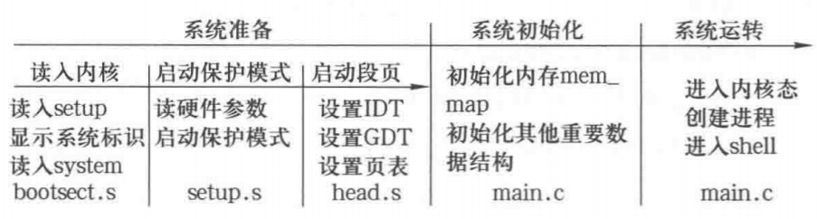

​	具体可以参考这篇[操作系统启动过程](https://blog.csdn.net/weixin_43591948/article/details/118659344)。

### ELF文件加载

在 Linux 系统中，一个 ELF 文件主要用来表示 3 种类型的文件：

1. 可执行文件：被操作系统中的加载器从硬盘上读取，载入到内存中去执行;
2. 目标文件：被链接器读取，用来产生一个可执行文件或者共享库文件;
3. 共享库文件：在动态链接的时候，由 ld-linux.so 来读取;

​	宏观上整个链接过程如下图所示，其中.o文件是目标文件，.axf文件是可执行文件：

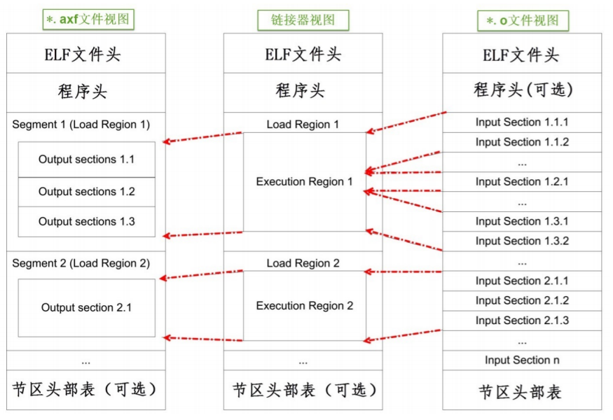

​	由于都使用 ELF 文件格式，*.o* 与.axf 文件的结构是类似的，它们包含 ELF 文件头、程序头、节区 (section) 以及节区头部表。各个部分的功能说明如下：

- ELF 文件头用来描述整个文件的组织，例如数据的大小端格式，系统字大小、程序头、节区头在文件中的位置等。

- 程序头告诉系统如何加载程序，例如程序主体存储在本文件的哪个位置，程序的大小，程序要加载到内存什么地址等等。STM32中MDK 的可重定位文件 *.o 不包含这部分内容，因为它还不是可执行文件，而 armlink 输出的 *.axf 文件就包含该内容了。

- 节区是 *.o 文件的独立数据区域，它包含提供给链接视图使用的大量信息，如指令 (Code)、数据 (RO、RW、ZI-data)、符号表 (函数、变量名等)、重定位信息等，例如每个由 C 语言定义的函数在 *.o 文件中都会有一个独立的节区；

- 存储在最后的节区头则包含了本文件节区的信息，如节区名称、大小等等。

​	总的来说，链接器把各个 *.o 文件的节区归类、排列，根据目标器件的情况编排地址生成输出汇总到可执行文件中。

​	假设LED_GPIO_Config函数，而它内部调用了“stm32f4xx_gpio.c”的GPIO_Init函数，这些指令在*.o文件都没有指定地址，仅包含了内容、大小以及调用的链接信息，而经过链接器后，链接器给它们都分配了特定的地址，并且把地址根据调用指向链接起来，如下图所示。

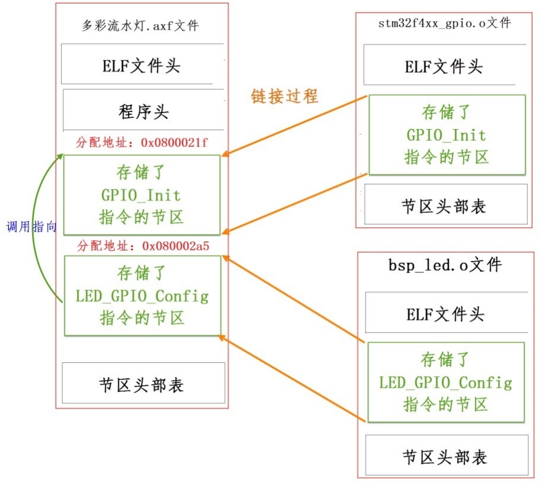

​	elf文件加载过程：

1. 填充并且检查目标程序ELF头部
2. load_elf_phdrs加载目标程序的程序头表
3. 如果需要动态链接, 则寻找和处理解释器段
4. 检查并读取解释器的程序表头
5. 装入目标程序的段segment
6. 填写程序的入口地址
7. create_elf_tables填写目标文件的参数环境变量等必要信息
8. start_thread 准备进入新的程序入口

## 嵌入式相关

### STM32的启动流程

1.  上电复位，硬件设置 SP、PC 的值
2.  找到了 Reset_Handler 的地址后，CPU 就从这里开始取指令运行程序；
3. 调用 SystemInit 函数，设置系统时钟；
4. 调用 __main 函数，软件对 SP 寄存器赋值，完成数据段的重定位、清除 bss 段，初始化栈空间等工作；
5. 最终 __main 函数会调用用户的 main 函数，进入到用户程序。

​	具体参考这篇[STM32启动过程分析](https://blog.csdn.net/luobeihai/article/details/117595762)。

​	之前一直在纠结RWdata是如何移动到SRAM中的，这里有解释，应该就是_main()调用了`__scatterload `，==这里应该和分散加载文件相关，目前还没有看==，然后它又调用了`_scatterload_copy`完成了初始化数据段和`__scatterload_zeroinit `完成未初始化数据段的加载。

​	然后还可以参考这篇[STM32的完整启动流程分析](https://blog.csdn.net/setul/article/details/121685929)，它关于STM32中启动方式、ISP、IAP相关都有一个总体性的总结。

​	下图为实际STM32中Flash中的数据，类似于startup_ARMCM3.s这种启动文件就是flash启动模式下的BootLoader，flash模式将0x00000000映射到0x08000000上，可以这么理解访问0x00000000和访问0x08000000是等价的。


​	下面是实际STM32flash中启动代码startup_ARMCM3.s在内存中的形式，第一行就是**0x00000000存放的是主堆栈指针的地址**，之后是中断向量表，**0x00000004刚好是复位中断处理函数Reset_Handler的地址**，对于这个部分，是一开始烧录进去就固定了的，==是通过启动文件startup_ARMCM3.s中DCD指令分配的，具体是怎么分配的选择还不了解，现在也不用了解==；**STM32在上电的时候会通过硬件自动将SP初始化为0x00000000地址中的数据，将PC指针初始化为0x00000004地址中的数据**，所以STM32上电启动执行的**首先执行的代码应该是Reset_Handler**。下面是startup_ARMCM3.s文件的一部分：

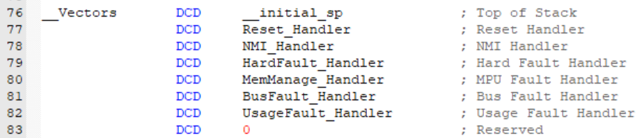

​	之后才是代码段区域，代码段的开始还是启动文件中的内容，可以看出来先调用SystemInit，然后调用__main。

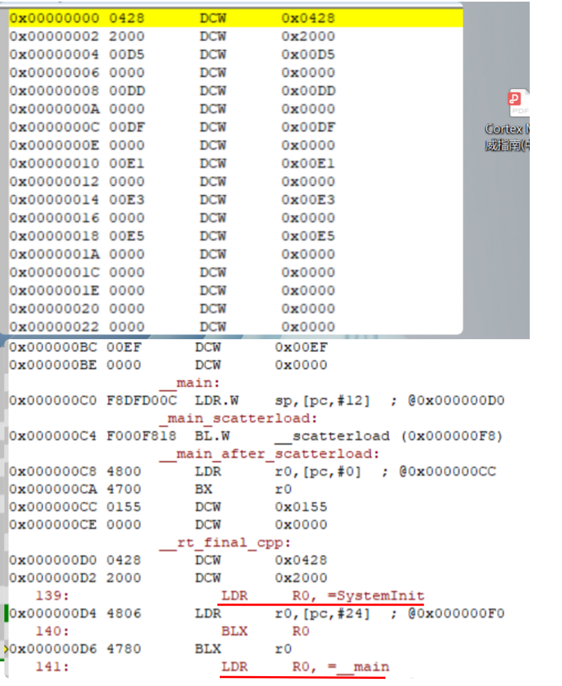


### 四种通信协议

​	**UART**：异步 全双工 串行 一对一

​	**SPI**：同步 全双工 串行 一对多 无应答机制（与iic比较）极性和时钟相位可变（与iic比较）

​	**IIC**：同步 半双工 串行 一对多 有应答机制（与spi比较）极性和时钟相位固定（与spi比较）。理论上IIC主机最多可以挂载127个设备，但是由于IIC的驱动能力有限，一般挂载设备在8个以下。

​	**CAN**：异步 半双工 串行 一对多 且总线上任意设备都可以作为主机主动发送数据 有应答机制 

### FreeRTOS

​	FreeRTOS是一个可裁减的小型RTOS系统。FreeRTOS的内核支持抢占式、合作式和时间片调度。一般常用的是抢占式和时间片调度。具体可以看tinyOS_note.md中的笔记记录。

#### 实时和分时的理解

​	首先内核不可抢占的意思大概是，即便高优先级的任务就绪了，也不能马上中断低优先级任务而得到执行，必须要等到低优先级任务主动挂起(sleep)或者时间片结束才能得到执行。

​	通常的通用操作系统Windows和Linux都叫分时操作系统，虽然linux内核也是支持抢占的，但是它一般采用公平调度算法，线程/进程一多就得分享CPU时间，Linux下有针对“实时进程“的调度，调度算法和普通进程不一样，但也只是相对的响应时间降低而已。

​	然后可以可以阅读一下这篇博客[Linux和实时操作系统的疑问及解答](https://zhuanlan.zhihu.com/p/410529021)。

​	大概可以说抢占式内核不一定实时操作系统，但是实时操作系统内核一定是抢占式的，是否为RTOS具体还要看操作系统的调度算法以及一些关于优先级的优化。

### 波特率

​	1波特即指每秒传输1个**码元**符号(通过不同的调制方式，可以在一个码元符号上负载多个bit位信息)，1比特每秒是指每秒传输1比特(bit)。

​	用实际使用中，最常用的串口通讯协议举例，注意前置条件为：1 个起始位，8 个数据位，0 个校验位，1 个停止位，也就是我们常说的：8，N，1；8 个数据位，一个停止位，无校验位。

### Cortex内核

​	Cortex-A：即A-Profile，基于ARMv7A，面向尖端的基于虚拟内存的操作系统和用户应用
​	Cortex-R：即R-Profile，基于ARMv7R，针对实时系统
​	Cortex-M：即M-Profile，基于ARMv7M，针对微控制器单片机方面的场合

### Qt中connect函数

```C
QObject::connect(const QObject *sender, const char *signal, const QObject *receiver, const char *method, Qt::ConnectionType type = Qt::AutoConnection)
```

​	connect中有五个参数，第一个为参数发送者，第二个为信号，第三个为接收者，第四个为接收者的响应函数（槽函数）。槽函数也可以是另外一个信号。

​	对于第五个参数代表信号与槽的连接方式，一般可以不是设置，使用的是默认参数。它有五种设置参数。

- Qt::AutoConnection： 默认值，使用这个值则连接类型会在信号发送时决定。如果接收者和发送者在同一个线程，则自动使用Qt::DirectConnection：如果接收者和发送者不在一个线程，则自动使用Qt::QueuedConnection类型。
- Qt::DirectConnection：槽函数会在信号发送的时候直接被调用，槽函数运行于信号发送者所在线程。效果看上去就像是直接在信号发送位置调用了槽函数。这个在多线程环境下比较危险，可能会造成奔溃。
- Qt::QueuedConnection：槽函数在控制回到接收者所在线程的事件循环时被调用，槽函数运行于信号接收者所在线程。发送信号之后，槽函数不会立刻被调用，等到接收者的当前函数执行完，进入事件循环之后，槽函数才会被调用。多线程环境下一般用这个。
- Qt::BlockingQueuedConnection：槽函数的调用时机与Qt::QueuedConnection一致，不过发送完信号后发送者所在线程会阻塞，直到槽函数运行完。接收者和发送者绝对不能在一个线程，否则程序会死锁。在多线程间需要同步的场合可能需要这个。
- Qt::UniqueConnection：这个flag可以通过按位或（|）与以上四个结合在一起使用。当这个flag设置时，当某个信号和槽已经连接时，再进行重复的连接就会失败。不使用这个函数，同一个信号与槽可以多次connect，一次信号可以触发多次槽函数。

### nor flash和nand flash的区别

​	首先常见的SSD和U盘一般都是nand flash；而STM32中或者其他MCU中的flash为nor flash，一般大小都在16M以内。

​	两者性能比较：

- NOR的读速度比NAND稍快一些，但NOR的写入和擦除速度比NAND慢很多。 
- NAND Flash没有采取内存的随机读取技术，它的读取是以一次读取一块的形式来进行的，通常是一次读取512个字节；NOR flash带有SRAM接口，有足够的地址引脚来寻址，可以很容易地读取其内部的每一个字节。
- NOR和NAND flash都是按块擦除的，NAND的擦除单元更小，相应的擦除电路更少。 他们都必须先擦后写。

​	所以NOR作为STM32的flash更有优势，写速度慢对于STM32来说只是烧录过程相对慢，只要运行读取代码指令块就行，而且要有随机读取字节的能力。

​	这里在说一下关于EEPROM，它们一般通过SPI或者IIC进行操作，一般比较小，以K为单位，比如常见的AT24C02是通过IIC，大小为2Kbit，即256Byte，它们可以通过芯片寻址对任一个字节进行读/写操作，不需要先擦除再写，相对读写速度慢，价格贵，一般作为BOIS或者存放启动文件。


## 算法题相关

### C++编写相关

```c++
// C++的代码空模板
#include <iostream>
using namespace std;
int main(){
    return 0;
}
// 常用库函数
#include <cmath>
	sqrt()
#include <algorithm>
```

### 输入输出相关

​	C++中使用`cin >> string/char`或者`scanf("%s", char)`（scanf不支持string），都默认以**空格**或者**换行符**作为输入的结尾，对于字符串`hello nowcoder`，它们都只能获取到`hello`。如果想完全获取数据，有以下几种方法：

- 使用`while(cin >> string);`获取每个以空格分开的单词，需要自己拼接。注意`while(scanf("%s", char));`的形式不成立；
- 使用`getline(cin, str);`的方法获得整行数据；
- 使用`a = getchar();`接收每个字符，当遇到`\n`时停止接收输入；
- 使用`scanf("%[^\n]", word);`的方法获取整行数据。其中`^`表示任意字符串，只有在遇到字符`\n`时，输入才会截止。

​	其中第三种和第四种在C语言中也适用

### 引号问题

​	单引号 ‘a’  ‘A’ 用于指代字符a  A ,  一般用法if(word[i] == 'a') 判断是否为字符a ,  

​	双引号”a" “A” 则用于指代字符串、常量, 一般用法 const char * = "abdcd";

### 常见ASCII码

- '0'~'9' : 48~57
- 'A'~'Z' : 65~90
- 'a'~'z' : 97~122

### 常用函数

1. `tolower(char c)`：将单个字符转化小写，同理有`toupper(char c)`
2. 

### sort函数的使用

​	添加自定义的比较函数，如下所示：

```C++
const int N = 100010;
typedef struct _myPair
{
    int l;
    int r;
}myPair;
// 按结构体中r的数值从小到大排序
bool LLess(const myPair &R1, const myPair &R2)
{
    return R1.r < R2.r;
}
myPair R[N];

sort(R, R + N, LLess);
```

### 优先队列

​	C++中优先队列的使用：

```C++
#include <queue>

// 小根堆
priority_queue<int, vector<int>, greater<int>> heap1; // 升序
// 大根堆
priority_queue<int, vector<int>, less<int>> heap2;	// 降序

top()		// 访问队头元素
empty()		// 队列是否为空
size()		// 返回队列内元素个数
push()		// 插入元素到队尾 (并排序)
pop()		// 弹出队头元素
emplace()	// 原地构造一个元素并插入队列
swap()		// 交换内容
```

​	那么我们可以总结出关于大根堆和小根堆的结论：

（1）堆是一棵完全二叉树；
（2）小根堆的根节点是堆中最小值，大根堆的根节点是堆中最大值；
（3）堆适合采用顺序存储。

### 链表题目相关

​	有时候为了方便处理，可以new一个新的结点作为原链表的头结点：

```c++
ListNode* dummyHead = new ListNode(0);
dummyHead->next = head;
...
return dummyHead->next;
```

### set和map的常见用法

​	目前感觉刷题用的比较多的还是unordered_set、unordered_multiset、unordered_map、unordered_multimap，他们的主要的操作是插入（insert 或者 unordered_map可以通过[]来插入）、删除（erase）、查找（find）和统计数量（count），具体的描述详见[set/map的test案例](D:\ADATA\work\my_cpp\devc++_test)

### strncpy和memcpy的实现

​	strncpy的实现：

```c++
char *strncpy(char* strDest, const char* strSrc, size_t n)
{
    if(strDest == NULL || strSrc == NULL) return NULL;
    char *address = strDest;
    while ( n-- && (*strDest++ = *strSrc++) != '\0');
    return address;
}
```

​	memcpy的实现：

```c++
//模拟memcpy的实现
void * mymemcpy(void *dest, const void *src, size_t n)
{
    if (dest == NULL || src == NULL)
          return NULL;
    char *pDest = (char *)dest;
    const char *pSrc  = (char *)(src);
    if (pDest > pSrc && pDest < pSrc+n)	// 内存重叠的情况
    {
        for (size_t i=n-1; i != -1; --i) pDest[i] = pSrc[i];
    }
    else
    {
        for (size_t i= 0; i < n; i++) pDest[i] = pSrc[i];
    }
    return dest;
}
```


### 二进制数中1的个数

```c++
// emm，就自己手写吧，这个不理解呀
// 理解了，
int function(x)  {
    int flag = 0;
    while(x)  {
          x = x&(x-1);	// 将最近的1置零
          flag ++;
     }
    return flag ;
}
```

### 红黑树

​	二叉搜索树：一棵二叉树，可以为空；如果不为空，满足以下性质：

1.  非空左子树的所有键值小于其根结点的键值。
2.  非空右子树的所有键值大于其根结点的键值。
3.  左、右子树都是二叉搜索树。

​	二叉搜索树的时间复杂度介于O(logN)到O(n)之间，如果退化成单链表，时间复杂度就是顺序查找，为O(n)。

​	平衡二叉树为空树，或者任一结点左、右子树高度差的绝对值不超过1。

​	红黑树本质上可以看做一个**不完全平衡的二叉搜索树**，定义为：

1. 结点是红色或黑色。
2. 根结点是黑色。
3. 所有叶子都是黑色。（叶子是NULL结点）
4. 每个红色结点的两个子结点都是黑色。（从每个叶子到根的所有路径上不能有两个连续的红色结点）
5. 从任一节结点其每个叶子的所有路径都包含相同数目的黑色结点。

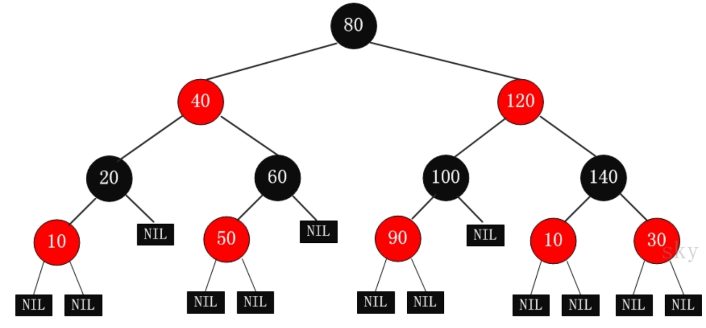

​	一个性质为从根到叶子的最长的可能路径不多于最短的可能路径的两倍长。

​	对于红黑树的插入和删除操作比较复杂，也是它的精髓之处和难点。

​	AVL（平衡二叉搜索树）和红黑树查找、插入和删除的时间复杂度其实都可以看做为log(N)。但是从AVL到红黑树，牺牲严格的平衡要求，以换取新增/删除节点时少量的旋转操作，平均性能优于AVL；通过红黑规则，保证在最坏的情况下，也能拥有O(logN)的时间复杂度。

​	**AVL树适合用于插入与删除次数比较少，但查找多的情况；**相对于要求严格的AVL树来说，红黑树的旋转次数少，所以**对于搜索、插入、删除操作较多的情况下，我们就用红黑树**。


### 排序算法对比

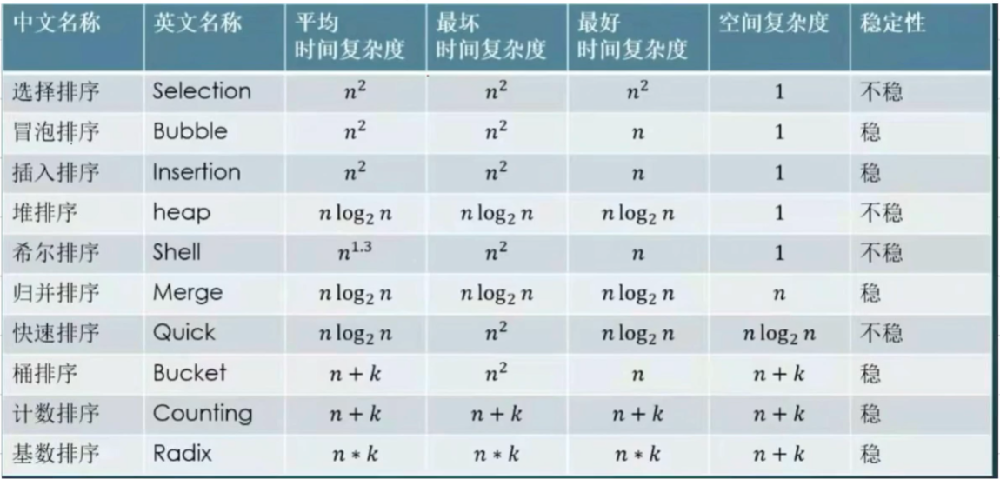


## 硬件相关

### 最小系统板

​	以dsp28335为例，其最小系统需要包括电源模块（5v和3.3v），晶振，reset按钮和JATG烧录接口这些部分，然后需要把需要使用到的IO接口引出。

### 数字地和模拟地

​	电路中分多钟地，包括数字地，模拟地，电源地，直流地，交流地，信号地和机壳地。

​	数字地，通常用于数字电路上。由于数字信号一般为矩形波，其抗干扰能力强，带有大量的谐波。如果电路板中的数字地与模拟地没有从接入点分开，数字信号中的谐波很容易会干扰到模拟信号的波形。

​	模拟地，通常用于模拟电路上。当模拟信号为高频或强电信号时，也会影响到数字电路的正常工作。

​	注意不同的地之间需要单独铺铜，然后再串接。

​	模拟地和数字地间的串接可以采用四种方式：

1、用磁珠连接；

2、用电容连接（利用电容隔直通交的原理）；

3、用电感连接（一般用几uH到数十uH）；

4、用0欧姆电阻连接

​	一般情况下，用0欧电阻是最佳选择，它可保证直流电位相等；**单点接地**，限制噪声；对所有频率的噪声都有衰减作用（0欧也有阻抗，而且电流路径狭窄，可以限制噪声电流通过）；

​	磁珠采用在高频段具有良好阻抗特性的铁氧体材料烧结面成，专用于抑制信号线、[电源](https://bbs.elecfans.com/zhuti_power_1.html)线上的高频噪声和尖峰干扰，还具有吸收静电脉冲的能力。

​	


## 计算机网络相关


## 计算机组成相关

### 哈佛结构和冯诺依曼结构的区别

​	哈佛结构(Harvard architecture)是一种将程序指令储存和数据储存分开的存储器结构。中央处理器首先到程序指令储存器中读取程序指令内容，解码后得到数据地址，再到相应的数据储存器中读取数据，并进行下一步的操作（通常是执行）。程序指令储存和数据储存分开，数据和指令的储存可以同时进行，可以使指令和数据有不同的数据宽度。哈佛结构的微处理器通常具有较高的执行效率。其程序指令和数据指令分开组织和储存的，执行时可以预先读取下一条指令。大多数ARM、DSP是哈佛结构。

​	冯.诺伊曼结构（von Neumann architecture）是一种将**程序指令存储器和数据存储器合并在一起**的存储器结构。大多数CPU和GPU是冯诺依曼结构的。

## 汇编相关


## 项目相关

### DMA和IRAM2

​	在实现串口的空闲中断+DMA接收的功能时，程序一直调不通，DMA一直没有接收到数据。最后询问师兄将问题定位到内存上，通过查阅stm32的芯片手册，如下图系统的总线架构，

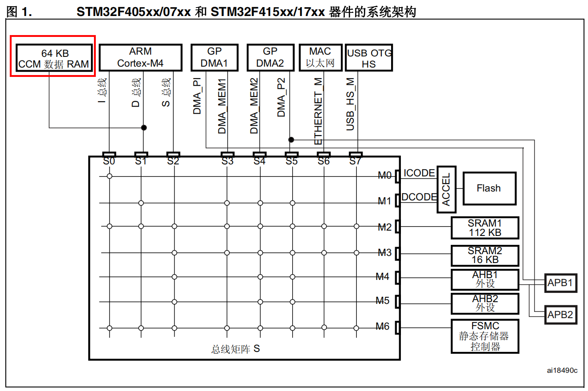

​	注意其中的CCM就是IRAM2，它直接和内核的数据总线相连接，而没有接入总线矩阵，只有CPU能够访问，而且速度相对会更快，在CPU要频繁读写内存中的数据的时候有作用，而DMA控制器不能访问到IRAM2。而我们的工程勾选了IRAM2，而代码运行的时候串口接收到的数据存放到IRAM2中，DMA访问就出现问题，取消勾选IRAM2解决了这个问题。

### eeprom

​	编写AT24C16的芯片驱动，AT24C16一个页有256字节，共8页，2048字节，即16K bit。通过查阅芯片手册，按芯片要求的IIC时序对它进行读写操作，读可以连续读，但是写操作，如果出现跨页的情况，不会自动跨页，而是需要手动去做跨页操作。

### MCU的IAP

​	使用QT发送指令给设备，完成设备的MCU固件的更新。

​	首先QT与Soc做好数据协议，设置MCU烧录的指令，Qt准备好烧录的bin文件，发送给Soc；

​	Soc在接收到烧录指令和固件后，首先会给MCU发送指令，让MCU进入接收固件的模式，然后使用ymodem文件传输协议传输固件包，在MCU中会将接收到的固件写入一块专门用于存放固件的flash空间，在接收完成后，可以重启设备；

​	重启后，MCU会进入它的boot阶段，首先会判断有没有升级固件（在通用的flash中有专门的标志位记录），如果没有，就直接跳转到APP应用程序上去运行；如果有升级固件，会将升级固件拷贝到APP应用程序的flash区，然后跳转到APP应用程序的首地址执行，完成整个MCU固件升级的过程。

​	其中对于APP应用程序的代码中需要修改中断向量表的偏移量，而且在keil编译中需要设置它的rom1地址。


