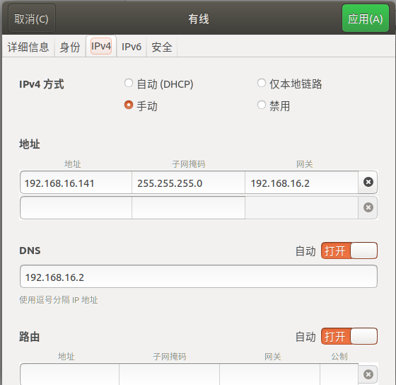
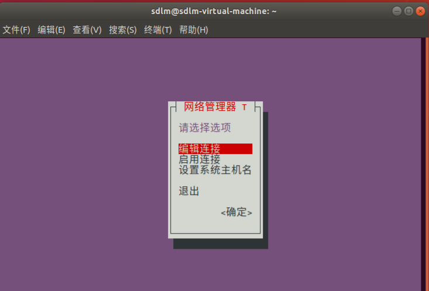
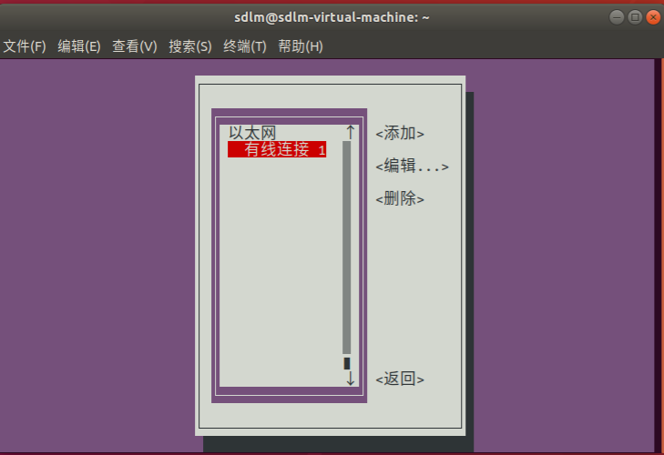
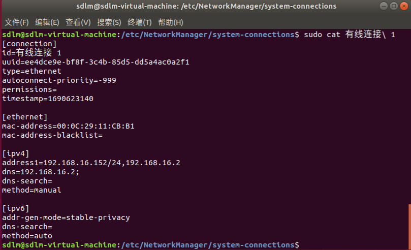
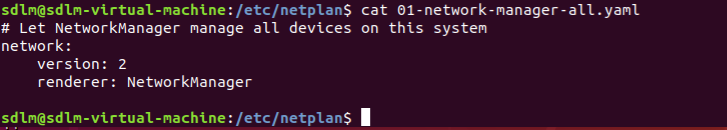

# 工作问题汇总

[TOC]


## MY_LOG

### 2023.07.29

#### linux发行版本的区别

​	Debian（或其衍生发行版如 ubunutu、kali） 和 Red Hat（或其衍生发行版如 CentOS、Fedora）都是常见的 Linux 发行版，它们之间有一些不同之处，包括软件包管理系统、配置文件位置和软件版本等。

1. 软件包管理系统：

   - Debian 使用 APT（Advanced Package Tool）作为主要的软件包管理工具，以 `.deb` 格式的软件包为主。
   - Red Hat 使用 RPM（Red Hat Package Manager）作为主要的软件包管理工具，以 `.rpm` 格式的软件包为主。

2. 配置文件位置：

   - Debian 系统的网络接口配置文件位于 `/etc/network/interfaces`。
   - Red Hat 系统的网络接口配置文件位于 `/etc/sysconfig/network-scripts/ifcfg-<interface>`。

3. 软件版本：

   - Debian 崇尚稳定性，因此在发布新版本之前会进行较长时间的测试。它倾向于使用较旧但更稳定的软件版本。
   - Red Hat 更加注重商业环境和企业级支持，并经过更严格的测试。它可能包含更新的软件版本和补丁。

   ​	值得注意的是，Debian 和 Red Hat 之间的区别并不限于上述几点，它们还可能在默认安装的软件包集合、默认配置选项和系统管理工具等方面有所不同。因此，在选择和使用这两种发行版时，最好根据自己的需求和偏好进行比较和评估。

#### 桌面环境gnome、mate等的区别

​	不同的桌面环境，一般安装的ubuntu系统都是默认gnome，但也有使用mate桌面环境的ubuntu系统；银河麒麟的系统使用的是mate。

​	从数据上来看，GNOME、KDE、Mate、Unity、Cinnamon堪称五大Linux桌面环境。它们各有优缺点。MATE的优势在于其本身对资源的消耗非常小。

#### Ubuntu修改静态IP、网关和DNS的方法总结

​	ubuntu系统（其他debian的衍生版本好像也可以）修改静态IP有以下几种方法：

##### 1. NetworkManager

​	Ubuntu等带有界面的linux操作系统默认安装了NetworkManager，正常可以直接通过 系统设置 操作NetworkManager的图形化界面修改网卡的静态IP、网关和DNS。如下为ubuntu的操作界面。



​	同时NetworkManager一般还提供`nmcil`和`nmtui`的命令，可以通过终端来修改。

- nmcil的基本操作流程

```shell
# 显示网卡连接信息
nmcli connection show
# 短格式
nmcli con show
# 例如会返回如下信息
NAME        UUID                                  TYPE      DEVICE 
有线连接 1  ee4dce9e-bf8f-3c4b-85d5-dd5a4ac0a2f1  ethernet  ens33  

# 显示网卡的具体信息
# NAME有中文的时候需要加''
# nmcli con show '有线连接 1'
nmcli con show [NAME]|[UUID]

# 修改都需要 sudo 权限
# 修改对应网卡的信息
# 修改网卡的模式，自动/手动
nmcli con modify [NAME]|[UUID] ipv4.method auto|manual
# 设置为自动获取IP
nmcli con modify '有线连接 1' ipv4.method auto
# 修改IP地址
nmcli con modify [NAME]|[UUID] ipv4.addresses [ip/mask]
# 修改网关
nmcli con modify [NAME]|[UUID] ipv4.gateway [gateway]
# 修改DNS
nmcli con modify [NAME]|[UUID] ipv4.dns [dns]

# 上述修改后需要重启开启网卡才能生效
nmcli con down [NAME]|[UUID]
nmcli con up [NAME]|[UUID]
# 未生效还可以尝试重启NetworkManager服务或者系统重启
sudo service network-manager restart

# 完整示例
# 设置‘有线网卡 1’的IP地址为192.168.16.140，子网掩码为 255.255.255.0，网关为 192.168.16.2，DNS为 192.168.16.2
sudo nmcli con modify '有线网卡 1' ipv4.method manual
sudo nmcli con modify '有线网卡 1' ipv4.addresses 192.168.16.140/24
sudo nmcli con modify '有线网卡 1' ipv4.gateway 192.168.16.2
sudo nmcli con modify '有线网卡 1' ipv4.dns 192.168.16.2
sudo nmcli con down '有线网卡 1'
sudo nmcli con up '有线网卡 1'
```

- nmtui的基本操作流程

  在终端中输入`nmtui`就会进入修改网卡信息的终端ui界面中，根据操作提示修改即可，注意修改后，需要重启网卡，启用连接 -> [选择对应的网卡] -> 禁用 -> 启用，修改才会生效。修改失败的话，就`sudo nmtui`再试试

<table frame=void>	<!--使用table标签，且frame=void消除外边框-->
	<tr>		   <!--<tr>一行的内容<\tr>，<td>一个格子的内容<\td>-->
    <td><center></center></td>	<!--<center>标签将图片居中-->
    <td><center></center></td>
    </tr>
</table>

​	通过图形化界面、nmcli指令和nmtui指令操作，最终的配置信息都保存在`/etc/NetworkManager`文件夹中，网卡的配置文件在`/etc/NetworkManager/system-connections`文件夹中，也可以直接修改网卡配置文件来修改IP等，注意修改前最好备份一下配置文件。



​	经过测试，修改后需要重启NetworkManager服务后，再重启网卡，修改才能生效。

```shell
# 修改配置文件
sudo vim /etc/NetworkManager/system-connections/[网卡NAME]

# 重启NetworkManager服务
sudo service network-manager restart
# 重启网卡
sudo nmcli con down [NAME]|[UUID]
sudo nmcli con up [NAME]|[UUID]
```

##### 2./etc/netplan

​	Ubuntu 18.04开始可以使用netplan配置网络，其也是默认安装的。配置文件位于`/etc/netplan/xxx.yaml`中，netplan默认是使用NetworkManager来配置网卡信息的。



```shell
# 可以将其修改为如下格式，来修改网卡信息
# 需要注意缩进关系，不然就会报错
network:
    version: 2
    ethernets:
        ens33:
            dhcp4: no
            addresses: [192.168.16.136/24]
            gateway4: 192.168.16.2
            nameservers:
                addresses: [192.168.16.2]
        [网卡2的设备名称]: 
            dhcp4: no
            addresses: [192.168.16.145/24]
            gateway4: 192.168.16.2
            nameservers:
                addresses: [192.168.16.2]
                
# 然后运行，即可生效
sudo netplan apply
```

- ethernets: 网卡数组-------------第二层
- ens33: 网卡名字-------------第三层
- dhcp4: 表示通过dhcp获取ip还是配置静态ip-------------第四层
- addresses:配置ip地址与子网掩码-------------第四层
- gateway4: 网关-------------第四层
- nameservers:  dns服务器-------------第四层
- ​        addresses：dns服务器的地址列表-------------第五层

​	这种方法修改也比较方便。

##### 3./etc/network/interface

​	可以通过修改/etc/network/interface来配置网络，由于我们默认是通过NetworkManager修改网卡信息的，所以一开始interface文件中没有其他网卡的信息。


​	可以在文件后面添加需要修改的网卡信息。

```shell
# /etc/network/interface文件后添加
auto [网卡名称]					#要设置的网卡设备名称，如 auto ens33
iface [网卡名称] inet static 	#设置静态IP；如果是使用自动IP用 dhcp
address xxx.xxx.xxx.xxx			#IP地址
netmask xxx.xxx.xxx.xxx 		#子网掩码
gateway xxx.xxx.xxx.xxx 		#网关

# 修改完成后，重启网络服务
service networking restart

```

​	经过测试，有时候**重启服务和重启网卡并不能生效**，需要**系统重启**后生效，同时这个时候系统设置中的NetworkManager 就不太正常了。


​	这种方法不能一起修改DNS，需要修改另外一个配置文件`/etc/resolv.conf`，具体详见这个博客[ubuntu修改ip](https://www.cnblogs.com/guangdelw/p/17302236.html)。但是我的ubuntu18.04的虚拟机中已经没有resolvconf这个服务了。具体见这个博客[Ubuntu 手动配置DNS](https://blog.csdn.net/challenglistic/article/details/127863817)。

​	==目前还不太会通过`/etc/resolv.conf`修改DNS，不建议使用这种方法修改DNS==。

##### 4.ifconfig临时修改IP

```shell
# 需要sudo权限
# 临时修改ip
ifconfig [网卡设备名称] [ip地址] netmask [子网掩码]
# ifcogfin ens33 192.168.16.139 netmask 255.255.255.0

# 启用\关闭网卡
ifconfig [网卡名称] up
ifconfig [网卡名称] down
```

​	设置网关使用其他的命令

```shell
# 设置网关，未测试
sudo route add default gw 192.168.2.254
```

​	设置DNS详见3。

##### 总结

- NetworkManager: NetworkManager是一个用于管理网络连接的守护进程。它在现代Linux发行版中广泛使用，并提供图形用户界面和命令行工具来管理网络设置。它可以动态管理网络配置，包括有线、无线和VPN连接等。Ubuntu系统是默认使用NetworkManager。
- /etc/netplan/: 这是Ubuntu 18.04及更高版本中使用的网络配置工具。Netplan允许您使用YAML格式定义网络配置，包括IP地址、网关、DNS等。Netplan会将配置转换为其他配置文件（如NetworkManager或systemd-networkd），从而应用新的网络设置。
- /etc/network/interfaces: 这是Debian和Ubuntu等一些Linux发行版中用于配置网络接口的文件。它定义了网络接口的基本设置，例如IP地址、网关和子网掩码等。	
- ifconfig 命令通过调用系统调用以及与内核的交互来实时获取网络接口的信息。它获取到的信息是当前内核中网络接口的实时状态，而不是从配置文件中读取的静态配置信息。在Ubuntu中，使用ifconfig命令修改网卡的IP地址是临时的，不会修改任何配置文件。ifconfig命令用于动态地配置网络接口，所做的更改只会在下次系统重启时失效。

​	前两个都操作起来更方便。==第三个修改DNS还不太会==，如果单纯修改IP地址和网关还行。第四个是临时修改。

​	对于前三者的优先级，在配置了`/etc/netplan`和`/etc/network/interfaces`的时候，系统重启后，NetworkManager好像就直接挂掉了，IP和网关是由`/etc/network/interfaces`设置决定，如果我再运行`sudo netplan apply`，`/etc/netplan`中的配置就会生效；但系统重启后还是由`/etc/network/interfaces`决定。


## MY_TIP

### 2023.12.03

```shell
git --no-pager log		# 不分页不分屏显示所有的log信息
grep -B 3 -A 3 [word]	# -B设置匹配前的行数，-A设置匹配后的行数
```


