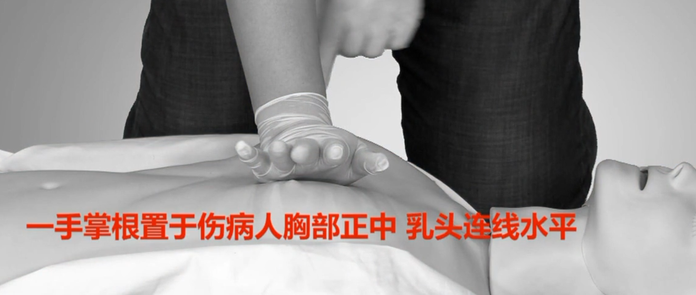

# 急救知识

## 现场救护

现场救护最基本要求是不要轻易去搬动病人，在固定好之前和有效评估之前，保持不动，避免造成二次损伤；但是遇到严重的情况，首先保存生命，首先要活着，而不是考虑二次损伤的问题。

​	五大原则：

- 环境安全或自身安全，保己救人。高速公路警示牌距离为150米
- 防止交叉感染。尽量防止接触伤员的体液
- 及时合理的救护，先救命再治伤
- 心理支持
- 集体协作

现场救助首先第一步评估环境；第二步检查患者的基本反应；第三步迅速拨打电话进行求助，明确地点，说明事故情况，伤病人数和基本情况，清楚告知求助人的电话，最后想对方确认是否能挂电话；第四步进一步检查伤员情况，首先检查呼吸，有呼吸就检查脉搏和血液循环，然后从上至下检查伤员的受伤情况，将伤员按严重程度区分。

## 心肺复苏

### 心肺复苏流程

- 实施评估环境安全，做好自我保护。环境安全的话，尽量不要移动伤员，同时要利用好身边的工具做好个人防护；

- 判断伤病员的意识和呼吸。双手轻拍伤病员双肩，观察面色和呼吸，判断有无意识，观察胸廓有无起伏判断有无呼吸，喘息同无呼吸

- 迅速呼救。让周边的人打120，同时询问是否有AED机，以及呼救周围是否有会救护的人，因为心肺复苏需要持续，一个人持续难以完成

- 进行心肺复苏，其分为胸外心脏按压、开放气道、人工呼吸。进行胸外心脏按压时尽量将伤病员的仰卧位置放置在坚硬的表面上，按压方法为双掌根按压。按压位置为胸骨下二分之一处，胸部正中乳头连线水平。

  + 按压细节如下图所示。

    

    

    

    

    

    

  + 以髋关节为轴，向下垂直按压30次，按压时观察伤员面色是否发生改变，按压频率为每分钟最少100次，每次下压使胸廓下陷5-6cm，解除按压过程中要保证胸壁完全回弹。

  + 按压要求：按压部位为胸部正中乳头连线水平；每分钟100-120次、深度5-6cm；解除按压时胸壁完全回弹；按压与解除按压两段时间相等；尽量减少按压中断

	+ 按压了30次之后，检查及清除口腔异物
	
	  
	
	  
	
	  
	
	+ 开放气道，使用仰头举颏法

- 人工呼吸，首先做好自我保护，尽量使用呼吸面膜，没有的话，纱布或者手绢进行基本的保护。在做的时候，使用两个手指捏住鼻子，用嘴包住伤者的嘴，进行通气，持续均匀的将气吹入，吹起时用眼睛余光观察胸廓是否隆起，要保证足够的通气量，通气量要是胸廓充分隆起，但不要过渡膨隆。然后松开伤员鼻子，进行换气后，再次吹气。
- 30次心脏按压 + 2次人工呼吸 = 1组心肺复苏（约2分钟），进行5组心肺复苏后，评估伤员情况，5-10秒，如呼吸循环恢复可终止，未恢复则继续进行心肺复苏。不论对技能掌握多少，都要尽早去做心肺复苏，然后才是要尽量提高心肺复苏的质量，如果不会人工呼吸，可以直接持续按压。

### 心肺复苏体位

​	心肺复苏体位为仰卧位，当伤员处于俯卧位需要将其翻身为仰卧位。如下图所示。

​	当伤病员呼吸恢复，心跳正常，将其改为复原体位，保持伤病员气道通畅，方便呼吸和呕吐：

​	对于脊柱受伤的伤员可以使用改良后的复原体位：

### 儿童和婴儿的心肺复苏

​	成人：一青春期以后；儿童：1岁至12岁；婴儿：一出生至1周岁

​	儿童和婴儿的心肺复苏的步骤与成人的基本一致，具体方法有所区别。儿童深度大约也是5cm，婴儿大约4-5cm；儿童可以使用单掌，也可以使用双掌，按压位置和成人一样，婴儿采用两指进行按压，具体位置如下图所示。同时对婴儿进行人工呼吸时用嘴包住婴儿的嘴和鼻。打开气道时，成人仰头角度为90°，儿童为60°，婴儿为30°

### 自动体外除颤仪（AED）

​	按照AED的语音提示和图示操作即可，注意婴儿有不同的仪器，尽量不要使用成人AED对婴儿进行除颤。

### 成人基础生命支持流程（BLS）

​	如下图所示。

​	首先观察，然后求助让人帮忙拨打报警电话和取AED，然后直接开始CPR，等到AED部署好后，进行一次除颤，然后检查心率，等AED机提示能接触病人后，进行五个循环的CPR（一个循环30次按压 + 2次人工呼吸），大约也就是2分钟，然后再进行一次除颤，如此循环，直至病人恢复心率和呼吸。

## 气道异物梗阻

​	气道异物梗阻的表现：

- 呼吸骤停
- 手不由自主的紧紧的贴到了颈的前部或者抓到自己的衣领子，表情痛苦，面色发青；
- 不完全的气道异物梗阻会拼命的咳嗽

​	气道异物梗阻的急救，如果患者意识清醒，首先询问情况：

- 对于不完全的气道异物梗阻，需要鼓励患者不断的咳嗽，然后拨打急救电话。
- 对于完全气道异物梗阻且患者未丧失意识，对成年人使用腹部冲击法（海姆力克法）。首先尝试下图的叩击，5次后，观察异物是否出来

​		然后使用海姆立克法，如下图所示，冲击五次，然后再换为5次叩击，如此循环。其实按我理解可以一直使用海姆立克法就行。注意海姆立克法力气可能会很大，甚至有可能伤害伤者的内脏。如果患者在施救过程中晕厥，需要注意安全，不能让患者摔倒到地上。如果双手不能包住腹部，则可以换做胸部冲击法。

- 如果患者已经丧失意识，这使用腹部按压法，和CPR的胸部按压法一样，期间需要观察异物是否出来，同时需要保证口腔异物被清除。如果判断患者已经失去了生命体征了，则换使用CPR进行施救，即需要同时进行人工呼吸。
- 对于婴儿，采用如下方法

- 自救时可以采用如下方法

  

  

  ## 创伤救护

  

  

