# 操作系统

​	主要参考[哈工大李治军老师的《操作系统》的慕课](https://www.bilibili.com/video/BV1d4411v7u7?p=1)。

[TOC]

## 0. 汇编基础知识

### 0.1 寄存器相关

​	8086CPU中寄存器总共有14个，都是16位的。即**AX，BX，CX，DX，SP，BP，SI，DI，IP，FLAG，CS，DS，SS，ES** 共 14 个。其中AX，BX，CX，DX，SP，BP，SI，DI都是通用寄存器。

​	**数据寄存器：**

​		AX (Accumulator)：累加寄存器，也称之为累加器；

​		BX (Base)：基地址寄存器；

​		CX (Count)：计数器寄存器；

​		DX (Data)：数据寄存器；

​	**指针寄存器：**

​		SP (Stack Pointer)：堆栈指针寄存器；

​		BP (Base Pointer)：基指针寄存器；

​	**变址寄存器：**

​		SI (Source Index)：源变址寄存器；

​		DI (Destination Index)：目的变址寄存器；

​	**控制寄存器：**

​		IP (Instruction Pointer)：指令指针寄存器；

​		FLAG：标志寄存器；

​	**段寄存器：**

​		CS (Code Segment)：代码段寄存器；

​		DS (Data Segment)：数据段寄存器；

​		SS (Stack Segment)：堆栈段寄存器；

​		ES (Extra Segment)：附加段寄存器；

#### 数据寄存器（AX，BX，CX，DX）

​	数据寄存器有 AX，BX，CX，DX 四个组成，由于在 8086 之前的 CPU 为 8 位 CPU，所以为了兼容以前的 8 位程序，在 8086 CPU 中，每一个数据寄存器都可以当做两个单独的寄存器来使用，由此，每一个 16 位寄存器就可以当做 2 个独立的 8 位寄存器来使用了 。 

​	**AX 寄存器可以分为两个独立的 8 位的 AH 和 AL 寄存器；**

​	**BX 寄存器可以分为两个独立的 8 位的 BH 和 BL 寄存器；**

​	**CX 寄存器可以分为两个独立的 8 位的 CH 和 CL 寄存器；**

​	**DX 寄存器可以分为两个独立的 8 位的 DH 和 DL 寄存器；**

​	AH 和 AL 作为 8 位寄存器使用时，可以看做它们是互不相关的，也就是看做两个完全没有联系的寄存器 X 和 Y 即可。

**AX寄存器**

​	AX 的另外一个名字叫做累加寄存器或者简称为累加器，是编程中用的最多、最频繁的寄存器。其可以作为普通的寄存器用来存放16位或者8位的数据。

​	AX 寄存器还具有的特殊用途是在使用 DIV 和 MUL 指令时使用。

​	DIV 在 8086 CPU 中是除法指令，而在使用除法的时候有两种情况，即除数可以是 8 位或者是 16 位的，而且除数可以存放在寄存器中或者是内存单元中，而至于**被除数**的话，由 AX 来存放了。如果被除数一定会是 16 位的，并且默认是放在 AX 寄存器中，被除数是 32 位时， DX 存放 32 位的被除数的高 16 位，而 AX 则存放 32 位的被除数的低 16 位；同时，AX 的作用存放除法的计算结果，则在 AL 中会保存此次除法操作的商，而在 AH 中则会保存此次除法操作的余数，当然，如果除数是 16 位的话，则 AX 中会保存本次除法操作的商，而 DX 则保存本次除法操作的余数。

​	当使用 MUL 做乘法运算时，两个相乘的数要么都是 8 位，要么都是 16 位，如果两个相乘的数都是 8 位的话，则一个默认是放在 AL 中，而另一个 8 位的乘数则位于其他的寄存器或者说是内存字节单元中；而如果两个相乘的数都是 16 位的话，则一个默认存放在 AX 中，另一个 16 位的则是位于 16 的寄存器中或者是某个内存字单元中。同时，当 MUL 指令执行完毕后，如果是 8 位的乘法运算，则默认乘法运算的结果是保存在 AX 中，而如果是 16 位的乘法运算的话，则默认乘法运算的结果有 32 位，其中，高位默认保存在 DX 中，而低位则默认保存在 AX 中。

**BX寄存器**

​	BX 作为数据寄存器，表明其是可以暂存一般的16位或者8位数据。其也称为**基址寄存器或基地址指针**，用来存放偏移地址，其默认的段地址为DS。

```assembly
MOV AH,[BX]		;设置 AH 的值为偏移地址为 DS:BX 中的值时所代表的内存单元
```

**CX寄存器**

​	CX寄存器除了存放数据外，还称为计数寄存器，在循环操作是做计数器用，用于控制循环程序的执行次数。

**DX寄存器**

​	DX寄存器可以作为普通寄存器来存放数据，在乘法、除法和I/O端口操作中有专门用途，关于乘除法操作在AX寄存器中有详细介绍。

#### 指针寄存器（BP，SP）

**BP寄存器**

​	BP（Base Pointer）也就是基指针寄存器，它和其他的几个用来进行寻址操作所使用的寄存器（还有 BX，SI，DI）没有太大的区别，首先，BP 寄存器作为通用寄存器的一种，说明其是可以暂存数据的，而后，BP 又不是数据寄存器，也就意味着其不能分割成 2 个独立的 8 位寄存器使用；其默认的段寄存器为SS。**在 8086 CPU 中，只有 4 个寄存器可以以 […] 的方式使用，这四个寄存器分别是 BX，SI，DI，BP。**

```assembly
MOV AX,[BP]         ;将 SS:[BP] 代表的内存单元移入 AX 中
MOV AX,CS:[BP]      ;将 CS:[BP] 代表的内存单元移入 AX 中
```

**SP寄存器**

​	SP（Stack Pointer）堆栈指针寄存器，其内容为栈顶的偏移地址。它也是通用寄存器的一种，与BP类似，是可以暂存数据的。==这里就有一个疑问，详细看后面关于SS的部分。==

#### 变址寄存器（SI，DI）

​	SI (Source Index) 是源变址寄存器，DI (Destination Index) 即是目的变址寄存器，8086 CPU 中的 SI 寄存器和 DI 寄存器其实和 BX 寄存器的功能是差不多的，只不过 SI 寄存器和 DI 寄存器均不是数据寄存器，所以它们不能够拆分为 2 个独立的 8 位寄存器，而这也就是 SI 寄存器和 DI 寄存器与BX 寄存器所不同的地方，既然，SI，DI 两个寄存器的功能和 BX 差不多，自然，SI 和 DI 中也是可以暂存一般性数据的，同时，通过使用 SI 和 DI 寄存器也是可以用来完成寻址操作的。**SI用作隐含的源串地址，默认在DS中；DI用做隐含的目的串地址，默认在ES中**。

```assembly
MOV AX,[SI]		;将段地址为 DS 偏移地址为 SI 的内存单元中的值移入 AX 中
MOV AX,SS:[SI]		;将段地址为 SS 偏移地址为 SI 的内存单元中的值移入 AX 中

MOV AX,[DI]		;将段地址为 DS 偏移地址为 DI 的内存单元中的值移入 AX 中
MOV AX,SS:[DI]		;将段地址为 SS 偏移地址为 DI 的内存单元中的值移入 AX 中
```

#### 其他寄存器

​	当 CPU 在访问内存时，其会使用一个 16 位的基地址，然后再使用一个 16 位的偏移地址，通过将基地址和偏移地址传入 8086 CPU 的地址加法器中进行合成即可以构造出 20 位的物理地址。在编程时，可以将一段内存定义成为一个段，而这里，我们又可以分为数据段，代码段，栈段这三种类型的段 。

**CS和IP寄存器**

​	CS:IP 两个寄存器指示了 CPU 当前将要读取的指令的地址，其中 CS 为代码段寄存器，而  IP 为指令指针寄存器 。指令地址为`CS << 4 + IP`。

**SS 和 SP 寄存器**

​	对于栈顶的段地址，其是存放在段寄存器 SS 中的，而对于栈顶的偏移地址，其则是存放在 SP 寄存器中的 ，**在任何时刻，SS:SP 都是指向栈顶元素 。**但是SP又是一个可以用来存放数据的通用寄存器，所以感觉很少会用它来暂存数据，如果需要用它暂存数据，那就不能操作栈了，应该只有一些特殊用途才会用它存放数据。

​	要注意的是 8086 CPU 并不会保证我们对栈的操作会不会越界 。

**DS寄存器和ES寄存器**

​	DS 寄存器和 ES 寄存器都属于段寄存器，其实它们和 CS 寄存器以及 SS 寄存器用起来区别不大。

​	DS（Data Segment）数据段寄存器用来存放数据段的段地址 。BX，SI，DI的默认段寄存器都是DS。

​	 ES（Extra Segment） 附加段寄存器，可以把它是个扩展，如果之前的段寄存器不够用的时候，你可以考虑使用  ES 段寄存器，在使用方式上，则和其他的段寄存器没什么区别。

**标志寄存器**

​	16位标志寄存器flags用来存放运算结果的特征。flag寄存器中存储的信息通常又被称作程序状态字（PSW）。

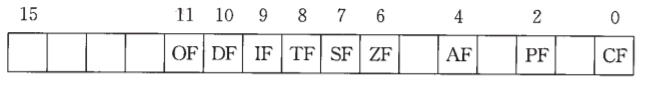

### 0.2 8086寻址方式

#### 立即寻址方式

​	在立即寻址(Immediate Addressing)方式下，操作数直接包含在指令中，它是一个8位或16位的常数，也叫立即数。这类指令翻译成机器码时，立即数作为指令的一部分，紧跟在操作码之后，存放在代码段内。如果立即数是16位数，则高字节存放在代码段的高地址单元中，低字节放在低地址单元中。立即寻址方式的指令常用来给寄存器赋初值。

```assembly
MOV	AL, 26H
MOV CX, 2A50H
```

#### 寄存器寻址方式

​	在寄存器寻址(Register Addressing)方式下，操作数包含在寄存器中，由指令指定寄存器的名称。对于16位操作数，寄存器可以是AX、BX、CX、DX、SI、DI、SP和BP等。对于8位操作数，则用寄存器AH、AL、BH、BL、CH、CL、DH和DL。源操作数的长度必须与目的操作数一致，否则会出错。

```assembly
MOV DX, AX
MOV CL, AH
```

#### 直接寻址方式

**直接寻址方式**

​	在PC机中，把操作数的偏移地址称为有效地址EA(Effective Address)。使用直接寻址(Direct Addressing)方式的指令时，存储单元的有效地址直接由指令给出，在它们的机器码中，有效地址存放在代码段中指令的操作码之后。当采用直接寻址指令时，如果指令中没有用前缀指明操作数存放在哪一段，则默认为使用的段寄存器为数据段寄存器DS。

```assembly
;操作数的物理地址 = DS << 4 + EA\
;指令中有效地址必须加一个方括号
MOV	AX, [2000H]	;若DS = 3000H，则物理地址为3000H << 4 + 2000H = 32000H，CPU将从32000H的内存中取出操作数
```

**段超越前缀**

​	如果要对代码段、堆栈段或附加段寄存器所指出的存储区进行直接寻址，应在指令中指
定段超越前缀。

```assembly
MOV AX, ES:[500H]
```

#### 寄存器间接寻址方式

​	指令中给出的寄存器中的值不是操作数本身，而是操作数的有效地址，这种寻址方式称为寄存器间接寻址(Register Indirect Addressing)。寄存器名称外面必须加方括号，以与寄存器寻址方式相区别。这类指令中使用的寄存器有基址寄存器BX、BP及变址寄存器SI、DI。

```assembly
MOV AX, [BX]	;从DS << 4 + BX的内存单元去操作数放入AX中
MOV CX, ES:[SI]	;从ES << 4 + SI的内存单元去操作数放入AX中
```

#### 寄存器相对寻址方式

​	操作数的有效地址是一个基址或变址寄存器的内容与指令中指定的8位或16位位移量(Displacement)之和。这种寄存器相对寻址(Register Relative Addressing)方式与寄存器间接寻址十分相似，主要区别是前者在有效地址上还要加一个位移量。

```assembly
MOV	BX, COUNT[SI]	;物理地址为 DS << 4 + SI + COUNT
```

#### 基址变址寻址方式

​	基址变址寻址(Based Indexed Addressing)方式的操作数的有效地址是一个基址寄存器（BX或BP）和一个变址寄存器(SI或DI)的内容之和，两个寄存器均由指令指定。

```assembly
MOV	AX, [BX][SI]	;物理地址为 DS << 4 + BX + SI
```

#### 相对基址变址寻址方式

​	相对基址变址寻址（Relative Based Indexed Addressing）方式的操作数的有效地址是一个基址寄存器和一个变址寄存器的内容，再加上指令中指定的8位或16位位移量之和。

```assembly
MOV	AX, 200H[BX][SI]	;物理地址为 DS << 4 + 200H + BX + SI
```


## 1.系统调用

### 用户态与内核态

​	内核态是操作系统代码执行时的状态，而用户态就是应用程序代码执行时的状态。CPU提供了一种被称为特权环的机制来实现这个特权级检查。由于很多指令在执行时都要进行这样的特权级检查，为了提高执行效率，应该用计算机硬件即CPU电路来实现这个权限检查，而不是用软件来完成这个检查。更具体地说，CPU在执行指令时如果发现需要进行特权级检查，例如要进行跨段的jmp跳转，就会取出两个重要数值：当前特权级（current privilege level，CPL）和描述符特权级（destination privilege level，DPL）进行比对，只有特权级满足要求，才允许这条指令被解释执行，否则出错。

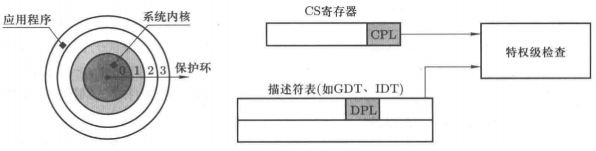

​	CPL位于CS寄存器的最后两位；描述符特权级(DPL)用来表示一个目标段的特权级。DPL是一个存放在描述符表（GDT、IDT就是这样的描述符表）中的两位二进制数。

### 系统调用的机理

​	在操作系统初始化GDT时，会将系统内核所处内存区域的DPL设置为0，而对在用户态执行的指令，操作系统会让其CPL=3。这两个关键设置保证了在用户态执行的程序指令不可以直接访问内核态内存。但是操作系统给上层应用提供了0x80号中断，应用程序可以通过 int 0x80 指令进入对应的中断处理程序，用这唯一的入口进入内核。操作系统利用这个中断处理程序来实施各种检查，让上层应用只能按照操作系统规定的格式来使用系统。

​	32位机器的中断工作过程如下：执行完每条指令都要查看一个称为INTR的CPU寄存器，如果发现其中某一位被设为1，就根据1所在的位去查IDT表中对应的表项。int 0x80 指令就是将INTR中的0x80位设置为1，所以当指令 int 0x80 执行完，CPU查看INTR寄存器以后就会接着去找IDT表中对应0x80那个表项。下图为IDT表的结构。可以看出来它是8字节，GDT表应该也是8个字节，这似乎也说明了为什么CS中后三位可以是状态位。

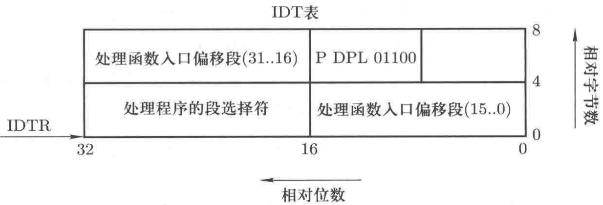

​	具体操作如下所示：

```c
#define set_system_gate(n,addr)		set_gate(&idt[n], 15, 3, addr);

// 操作系统初始化
// 将int 0x80的函数入口绑定为 system_call
void sched_init(void){set_system_gate(0x80, &system_call};
                 
// 设置IDT表的宏代码
// 将DPL设置为3
#define set_gate(gate_addr, type, dpl, addr)
__asm__("movw %%dx,%%ax""movw %0,%%dx"
"movl %eax,%1" "movl %%edx,%2"::"i" ((short)(0x8000+
(dpl<<13)+type<<8))),"o" (*((char*)(gate_addr))),
"o" (*(4+(char*)(gate_addr))), "d"
((char*)(addr), "a"(0x00080000))
```

​	用户态在调用 int 0x80 时，**因为0x80中断的IDT对应的DPL也是3，所以可以顺利通过特权级检查**，继续执行。中断处理是要跳到另一段程序去执行，即修改PC，具体是修改CS:EIP，**所以现在会从IDT表项中取出信息设置CS=0x0008，EIP=system_call函数的入口地址**。接下来继续“取指一执行”，现在要取出指令，通过GDT表获得基址，再加上system_call偏移，CPU跳到的地方正好就是操作系统内核代码中的system_call函数。**由于此时CS被设置为0x0008，最后两位是0，说明从此刻开始CPL=0，因此接下来执行的指令具有内核态特权**，任何内存区域都可以访问了，因为现在已经通过了系统接口进入了操作系统内核。==这个地方其实没很明白CS什么时候被修改为0x0008？？？==

​	现在大概懂了，就是中断程序自己改的，它应该算是另外一个过渡的处理，就是跳转到中断处理函数之前的处理，正是因为这个处理才能跳转到中断处理函数system_call，跳转到system_call之前就已经把CS修改为0x0008，这个时候system_call已经有了最高特权了，==感觉system_call本身就是内核的代码==。具体的关于它是如何修改的，可能需要看内核源码了，也可能是硬件修改了。

​	其中system_call里面会调用一个函数，它其实就是由所有系统调用函数指针组成的一个表，如下所示。

```c
typedef int (fn_ptr*)();
fn_ptr sys_call_table[]={sys_setup,sys_exit,sys_fork,
sys_read,sys_write,.....};
```

​	它就会根据不同的函数调用不同的系统调用函数，如write调用sys_write，fork调用sys_fork。


## 2. 进程与线程

​	进程、用户级线程和内核级线程


## 3.内存管理

​	对于内存管理部分，我目前的一个疑惑点在于不使用虚拟内存的MCU和使用虚拟内存的SOC之间的一个区别，还比较容易混淆。

### 程序的重定位

​	程序是在运行时重定位，即在指令执行时才将指令的逻辑地址转换成物理地址。如下图示：

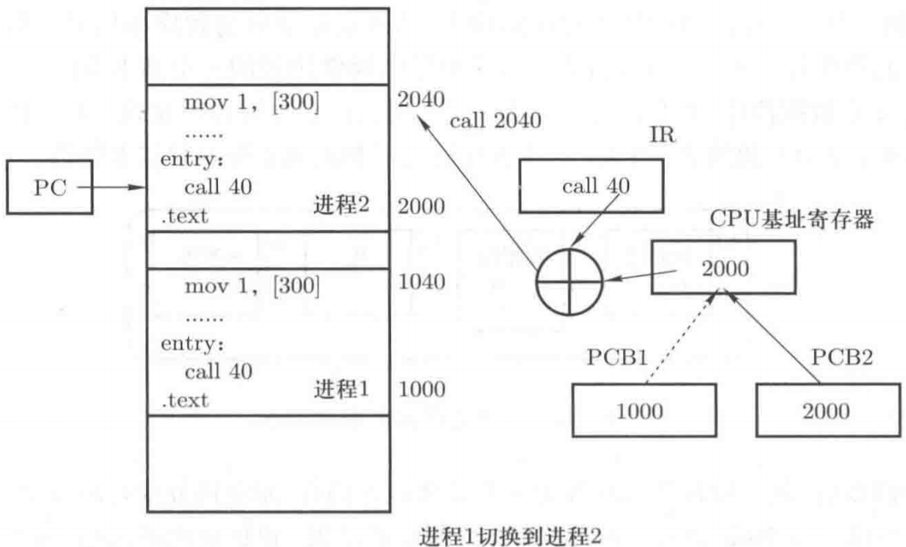

​	感觉这个模型还是太简单了，之后分段又是一个怎样的操作流程。

### 程序分段操作

​	程序由若干段组成，如代码段、数据段、栈段等。各段有各自的特点和用途，代码段是程序指令形成的段，代码段只读；数据段中存放程序使用的数据，数据段可读可写；栈段用来实现函数调用，栈通常只能向下增长等。分段后程序中的逻辑地址就会变成”段号：段内偏移“这样的基本格式。如下图所示：

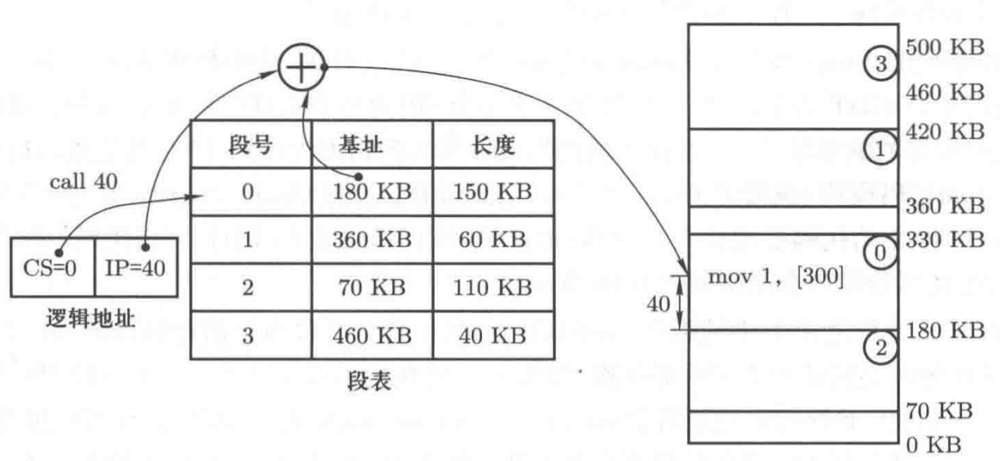

​	目前可以认为CS就对应为段号所在的地址值，如果为数据段的话，CS=1；然后取出基址，与IP求出实际的地址。==但是实际CS的值可能没有这么简单，之前似乎提到CS的最后两位代表进程的特权级，这个问题可以以后在探讨==

​	GDT表描述的是操作系统的代码段、数据段等，因为操作系统可以看出一个大的进程；LDT表才用来描述每个进程的代码段、数据段等。另外为了让操作系统找到每个进程的段信息，GDT表中还有指向各个进程LDT表的表项。

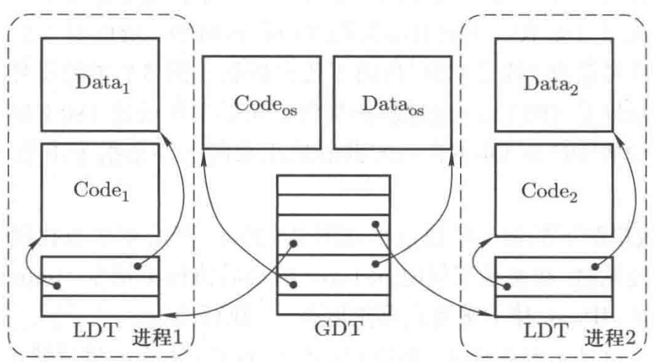

​	从上图可以看出，各个进程的LDT表的地址是存放在GDT表对应数据段之后的位置。对于GDT表存放的位置，目前可以理解为操作系统初始化会开辟一块位置，然后表项首地址存放在GDTR寄存器中。

​	切换到用户态就是将CS、DS等段寄存器的值设置为0x0f。只要是在用户态执行，CS=0x0f就一直没有变过。而内核态CS一直等于0x08。

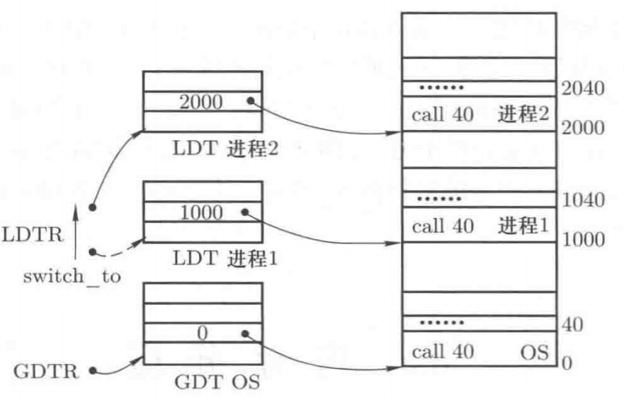

​	对于这个例子，大概能理解用户态CS=0x0f了，最后两位为11，这代表特权级为用户态，然后第三位为TI位，它为1表示要查找LDT表以找到CS对应的段（如果为0表示查找GDT表以找到CS对应的段）。在MMU的操作下，最终会在LDTR中取出LDT表的基址，而LTDR始终是指向当前正在运行的进程的LDT的地址。==目前不了解的是，如果CS不变的话，是如何区分代码段和数据段的？？而且在SETUP的时候，CS似乎并不是0x0f。==

### 内存分页

​	前请求放人物理内存的数据（比如代码段)也分割成同样大小的页，最后将所有页都映射到页框上，完成物理内存页框的使用。映射结果如图所示。

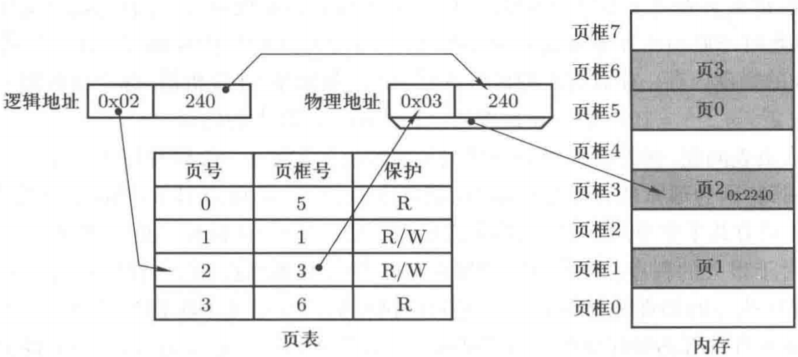

​	因为程序本身相对于内存空间一般都不会很大，如果去一一映射的话，对于4GB内存空间，则对于每个进程都需要需要1M空间去存放页表，同时页表里面很多都是无用的映射，如果不完全映射的话，这又会给查找带来麻烦。

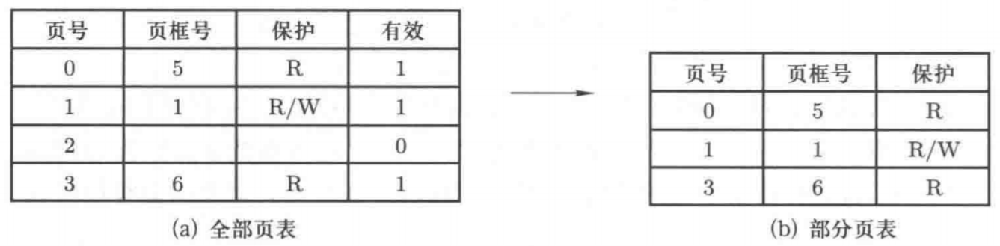

​	解决方法是使用多级页表，下图为二级页表的结构。

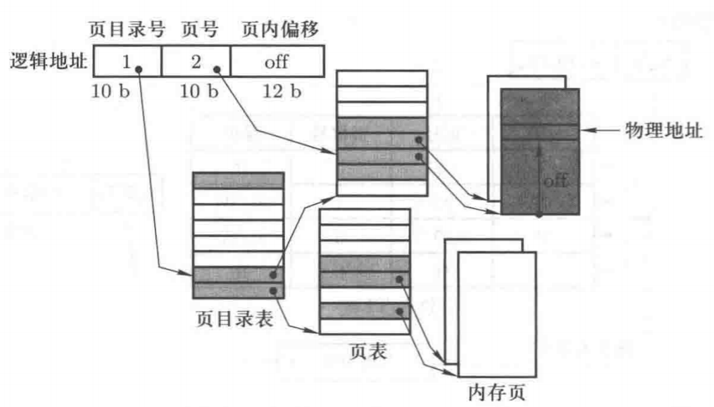

​	对于每个32位的逻辑地址，前十位为页目录号，中间十位为页号，最后12位为页内偏移。首先会根据逻辑地址的前十位查找到对应的页目录表，页目录表项中记录了对应的页表的首地址，然后根据中间十位对应的偏移得到对应的页表，而页表项中存放的是实际的物理地址的基址，最后使用逻辑地址的后12位得到页内偏移，实现逻辑地址到物理地址的转换。==页目录表的基址存放在哪里，CR3吗？==

​	根据上面的流程，可以知道对于每个进程来说，页目录表大小是固定的，共2^10个，而每个页目录表项的大小为4字节，所以页目录表的大小为4KB，里面是存在无用的页目录表项；而页表的数量是不确定，会根据进程的大小而分配，上图所示的进程就有三个页表，每个页表的大小也是4KB，所以该进程页表项占用的空间为16KB。==对于每个表项中内容是什么？对于linux0.1，好像只有高30位是地址，因为索引的位置都是以4B为单位，所以后两位没有用。现代的操作系统，似乎页表项除了地址外还有一些位用来表示权限等。==

### 段页式内存管理和虚拟内存

​	虚拟内存的提出可以将段表和页表的形式向结合，程序分段存放在虚拟内存中，然后虚拟内存中再分页映射到实际的物理内存上。

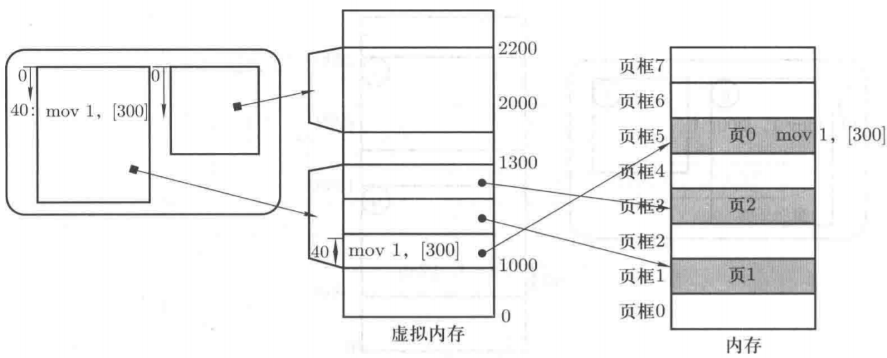

​	对于每个进程都会分配一个虚拟内存（在Linux0.1和现代操作系统大小好像有区别，这个书中提到的是每个进程不重叠的64M，现在好像都是每个进程默认4GB），首先进程会有一个段表，记录每个段在虚拟内存中的基址，然后再根据虚拟内存的地址，使用多级页表查找到对应的物理页。在初始化的过程，会查找物理内存的空闲页，然后建立好与虚拟内存的映射关系，然后放入物理内存中。==对于内核如何去查找空闲物理页并简历映射，有时间再去细究。==

​	这里需要注意的是，对于进程来说，段表首地址和页目录表首地址都暂存在进程的PCB中，所以对于进程间上下文切换中有一项重要工作就是让CPU中的寄存器LDTR指向下一个进程的段表首地址，将CR3指向下一个进程的页目录表首地址。

### 换入换出

#### 换入

​	物理内存是有限大小的，以4GB为例，而每个进程都有4GB的虚拟内存，实现这一点需要使用换入/换出技术，用一个小的物理内存来制造出一个大而规整的虚拟内存用户视图。对于每个进程来说，它们的页表项有一位代表是否在物理内存映射。

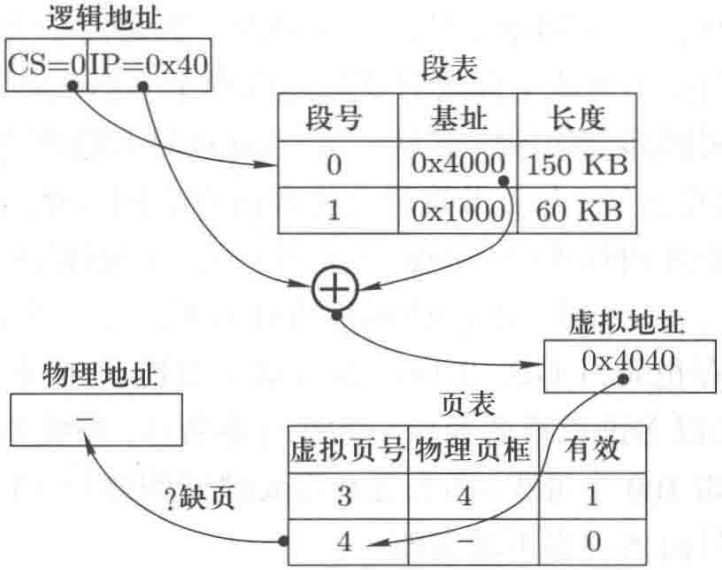

​	如果有效位为0，则会产生缺页中断；内存换入的核心就是在缺少虚拟页的时候请求调页，操作系统实现换入就是实现请求调页。大概流程如下图所示。

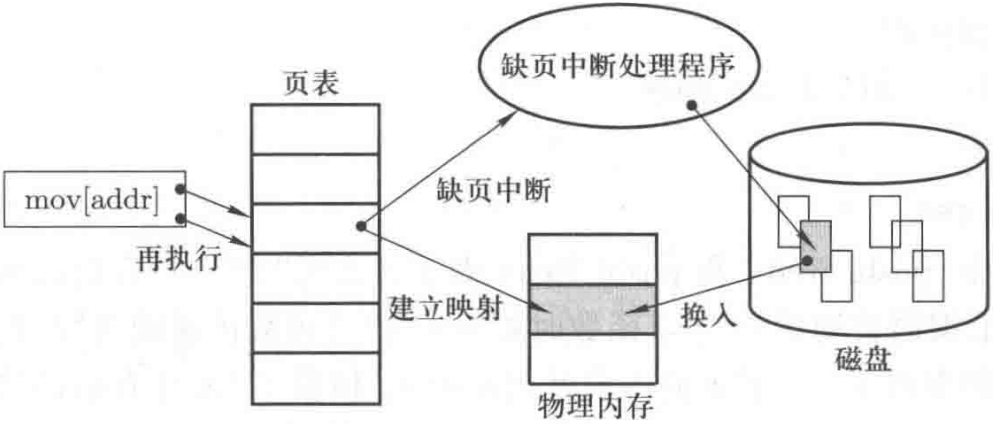

​	其中会涉及到CR2寄存器，它中存放着另一个非常重要的信息——出现内存读写错误的虚拟地址，如果是缺页，CR2中存放的就是发生缺页时的虚拟地址，进而知道到底缺了哪个虚拟页。在缺页中断会调用page_fault，它会判断是判断页面是没有映射还是越权读写，没有映射就是正常的缺页，==越权读写就对应写保护，如写时复制时就是这种情况。==页面换入其中调用bread_page函数，用来启动磁盘读写来读取虚拟页面的内容，==但是它是如何知道缺页内容的磁盘位置的，之后需要细究一下==。

#### 换出

​	页面换出要解决的基本问题就是选择哪个页面进行淘汰。常用的是LRU（least recently used，最近最少使用）页面置换算法，选择历史上最近很长时间没被访问的页面淘汰。LRU算法简单思路是使用时间戳算法，给每个页表项增加一个时间戳，然后对页表项遍历获取时间戳最小的页进行替换（说明它最近最少被使用），但是时间戳可能无限大，需要给页表项开辟多少的空间去存储，同时需要使用算法去求得时间戳的最小值，维护代价太大了，所以这种思路不合适。

​	还可以使用页面栈算法的方法来实现，栈顶是最近使用的页面，栈底是最近最少被使用的页面。

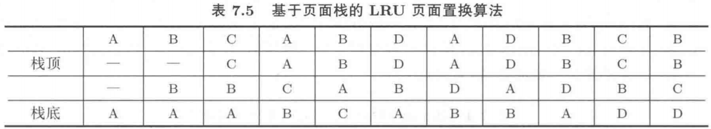

​	现在不需要时间戳了，而且页面栈可以采用指针链表数据结构，这样在页面栈修改时，只需要修改O(1)数量级的指针即可。但这个实现在实际操作系统中仍不可行，因为该实现在每次维护页面栈时仍然会造成几次指针读写，而每次页面访问（地址访问）都需要维护页面栈。所以每次地址访问都要额外伴随几次内存访问，内存的读写效率会降低很多，整个计算机系统的工作效率也会降低很多。

#### clock算法

​	分析总结上面给出的两种LRU算法的精确实现时间戳算法和页面栈算法，可以得出这样一些结论：

-  要实现LRU必须用信息来记录页面使用情况，这样才能找到最近最少使用的页面进行淘汰，相应地需要在每次地址访问时进行信息维护；

- 如果用软件方式来维护这个页面访问信息，造成每次地址访问又会额外增加多次地址访问的情况，严重降低内存使用效率。最好能用硬件实现来维护这一信息，这和采用MMU进行地址转换的想法是一致的；
- 在页表项中存放一个简单的数来实现对“最近最少使用”的近似表示，并且用硬件在访问页面时自动更新这个数。

​	clock算法有很多变形，但所有clock算法的基础都是页表项中一个近似时间戳的信息访问位：用一位二进制数0、1来近似表示时间戳，如果页面被访问了，就将这一位设置为1，所以这一位通常被称为访问位(R位)，基于R位可以构造出最基础的clock算法。

​	首先将分配给进程的所有页框组织成环形线性表，产生缺页时，就从当前的线性表指针（一直停在上一次缺页处理完以后的位置)处开始进行环形扫描，如果扫描到的虚拟页面其R位为1，则将R位修改为0，指针向后移动；如果发现扫描位置虚拟页面的R位为0，就将该页淘汰换出。由于访问过的页要从1修改为0后才会被换出，即针对访问过的页多给了一次不被换出的机会。

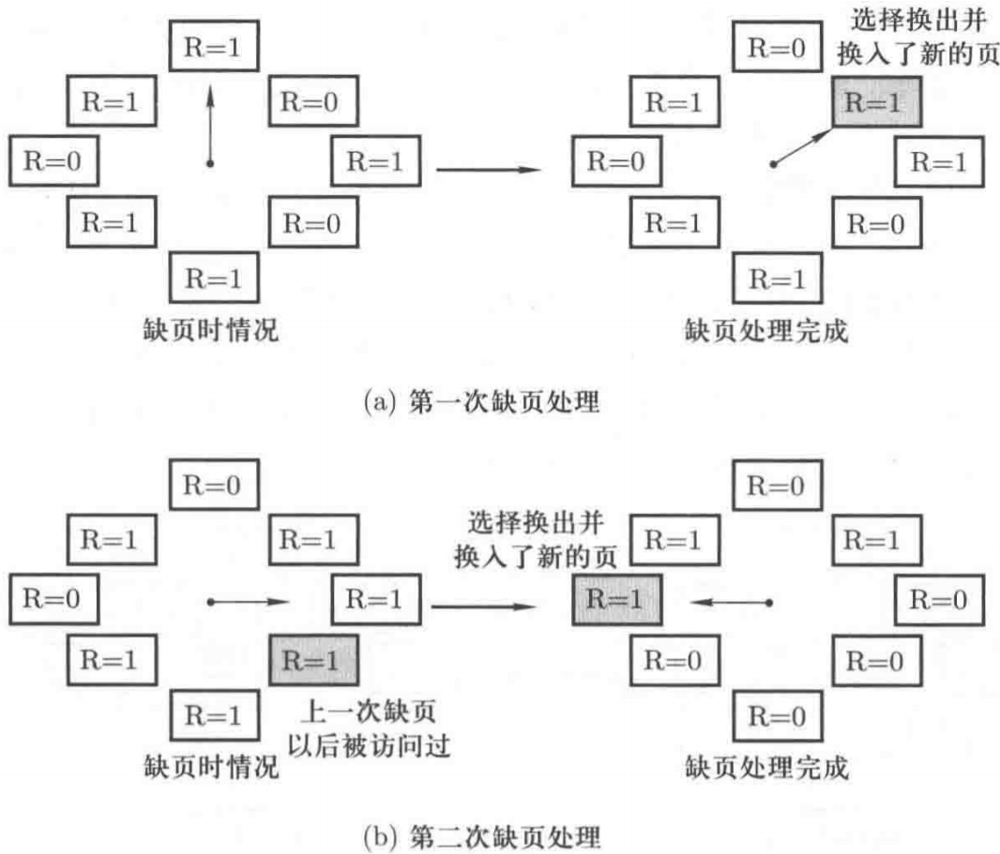

​	所以该算法也常被称为第二次机会置换（second chance replacement，SCR）算法。==目前没有懂这个线性表是如何构建的，又是如何通过硬件去访问遍历的。==

​	但是实际情况一般缺页中断并不常发生，在两次缺页中断之间，可能所有页面都被访问过了，都被置1，当再次发生缺页中断，则线性表指针会把全部的页面都置0，每次换出的就是发生中断的下一个页面了，相当于退化成了FIFO算法了。它没有对“最近”进行体现。

​	这就需要对“最近”有一个合适的估计，我们可以再引入一个扫描指针，该指针定期扫描所有页面，并将所有页面中的R位都清为0。当缺页发生时，用换出指针扫描页面，如果页面的R位仍然为0,就进行淘汰，此时换出指针只负责换出，不会对页面的R位清0。

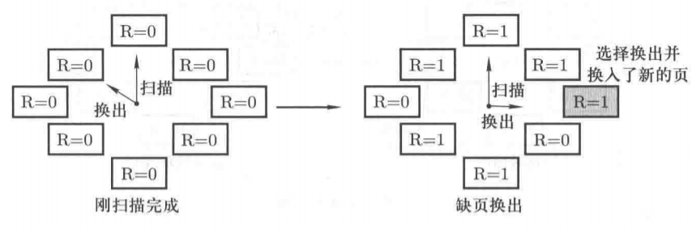

显然该算法对LRU的近似是：如果自从上一次定期扫描以来，页面一直没有被访问过，就认定该页最近没有被访问过，就将其淘汰。


## 4 磁盘管理和文件系统

### 磁盘管理

​	在磁盘驱动过程引入了五层抽象机制：

​	(1) 从扇区到磁盘块的抽象

​	(2) 从单个盘块请求到多个进程的磁盘请求队列

​	(3) 从磁盘请求到高速缓存

​	(4) 从盘块集合到文件的抽象

​	(5) 从多个文件到构建文件系统。


### 文件系统

​	linux使用的是ext系列的文件系统，ext4等文件系统在巨型文件在处理上需要考虑到性能问题，所以开始被xfs文件系统替代。但是下面的笔记应该主要按照ext文件系统分析。

​	Linux 的系统都是通过一个名为 Virtual Filesystem Switch（VFS）的核心功能去读取 filesystem 的。

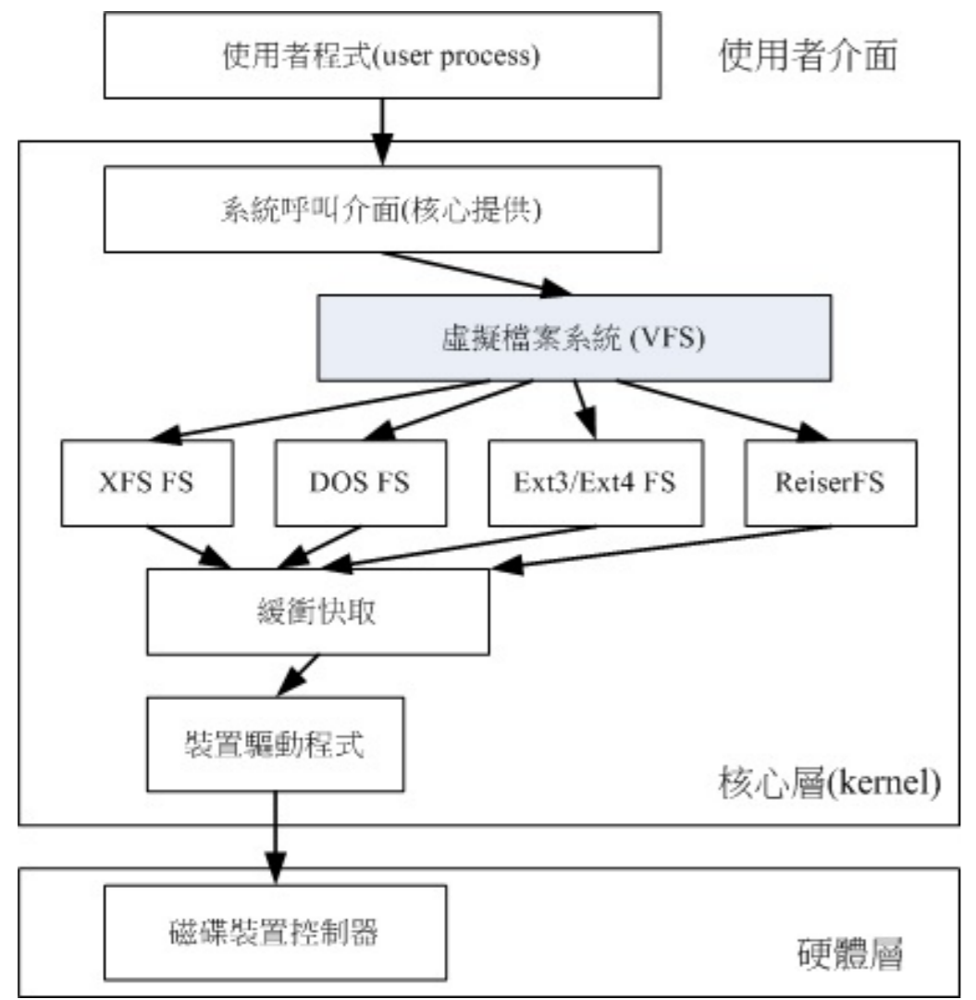

​	主引导记录（Master Boot Record）:又称主引导分区、主引导扇区。在0磁头Head、0柱面Cylinder（磁道Track）、1扇区Sector。每块硬盘，对，每块硬盘不是每个分区，都只有一个主引导扇区，即该硬盘0号柱面，0号磁头的第一个扇区，大小为512字节。主引导扇区包含的MBR（硬盘主引导记MBR占446bytes）、DPT（分区表DP占64bytes）、MN（硬盘有效标志Magic Numbe占2byte。AA和55被称为幻数(Magic Number),BOIS读取MBR的时候总是检查最后是不是有这两个幻数,如果没有就被认为是一个没有被分区的硬盘），**这3个区域是操作系统无关的，在每块硬盘上都存在；MBR是一段可执行程序，由各个操作系统写入不同的代码**。MBR的存储空间限制为446字节，MBR所做的唯一的事情就是装载第二引导装载程序。Windows产生的MBR装载运行PBR；GRUB产生的MBR装载运行grldr。

​	全局唯一标识分区表（GUID Partition Table，缩写：GPT）是指全局唯一标示磁盘分区表格式。它是可扩展固件接口（EFI）标准（被Intel用于替代个人计算机的BIOS）的一部分，被用于替代BIOS系统中的以32bits来存储逻辑块地址和大小信息的主引导记录（MBR）分区表。下面简单介绍一下他们的不同吧。

　　**MBR格式分区方案**

　　**1.**主分区数量不能超过4个;

　　**2.**分区大小无法超过2TB容量;

　　**3.**支持安装所有的Windows操作系统。

　　**GPT格式分区方案**

　　**1.**磁盘分区数量几乎无限制，但是Windows系统只允许最多128个分区;

　　**2.**支持2TB以上容量的硬盘;

　　**3.**仅支持安装64位操作系统，因为UEFI引导启动只支持64位操作系统，如果想要用EFI引导32位系统，貌似必须主板开启CSM兼容模块支持;

​	下图展示了一个文件系统的可能布局。

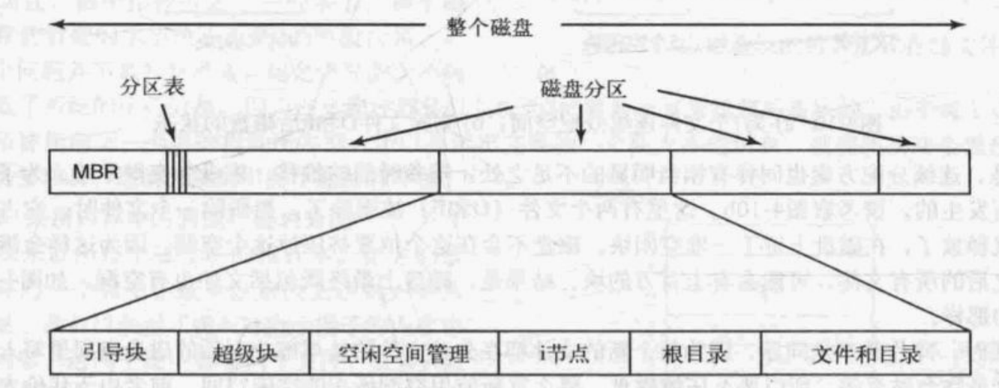

​	**引导块**：按我目前的理解就是MBR。导块中的程序将装载该分区中的操作系统。为统一起见，每个分区都从一个引导块开始，即使它不含有一个可启动的操作系统。不过，未来这个分区也许会有一个操作系统的（这个地方是来自《现代操作系统》中的解释）。在其他的一些书籍（《鸟哥私房菜》）中并不是每个分区都有引导块，只有磁盘第一个扇区有，它也并不算是每个分区包含的东西。

​	**超级块**：Superblock 是记录整个 filesystem 相关信息的地方。他记录的信息主要有：

- block 与 inode 的总量； 
- 未使用与已使用的 inode / block 数量； 
- block 与 inode 的大小 （block 为 1, 2, 4K，inode 为 128Bytes 或 256Bytes）；
-  filesystem 的挂载时间、最近一次写入数据的时间、最近一次检验磁盘 （fsck） 的时间等文件系统的相 关信息；
-  一个 valid bit 数值，若此文件系统已被挂载，则 valid bit 为 0 ，若未被挂载，则 valid bit 为 1 。

​	且在《鸟哥私房菜》中是这样描述的：”事实上除了第一个 block group 内会含有 superblock 之外，后续的 block group 不一定含有 superblock ， 而若含有 superblock 则该 superblock 主要是做为第一个 block group 内 superblock 的备份咯，这样可以进行 superblock 的救援呢！“

​	==综上，对于文件系统引导块和超级块还是有很多不清楚的地方，之后有时间再去了解。==


​	


## 问题

1.peterson算法从根本上需要上锁保护吗？

2.下面关于CS描述的例子，这个进程之前的特权级不就是内核态了吗？没有很懂这里的描述。

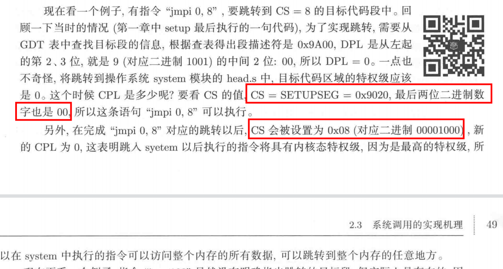

​	

