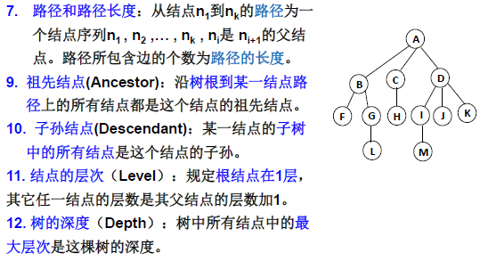
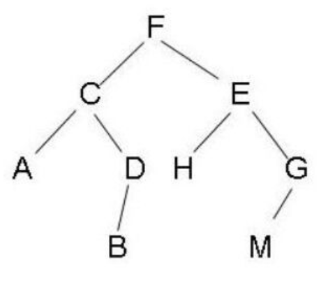

# 数据结构

​	主要参考[浙江大学的《数据结构》慕课](https://blog.csdn.net/liyuanyue2017/article/details/83688005)和严蔚敏的《数据结构（C语言版）》。

​	数据结构是相互之间存在一种或者多种特定关系的数据元素的集合。

[TOC]

## 线性表

​	由数据特性相同的元素构成的有限序列称为线性表。

### 线性表的顺序存储实现

​	利用数组的连续存储空间顺序存放线性表的各元素。

```c
#define MAXSIZE	100				// 顺序表的最大长度
typedef int ElementType;		// ElementType 可定义为任意类型
typedef struct LNode *List;
struct LNode{
    ElementType Data[MAXSIZE];	// 这里也可以用指针的方式，初始化时分配大小
    int Last;					// 最后一个数据的index 	
};
// 两种定义方式，第二种为顺序表的指针
struct LNode L;					
List PtrL;
```

​	主要操作的实现如下，我主要关注初始化和插入过程。

1. 初始化

```
List MakeEmpty(){
	List PtrL;
	PtrL = (List)malloc(sizeof(struct LNode));
	PtrL->Last = -1;
	return PtrL;	
}
```

2. 查找

```c
int Find(ElementType X, List L){
    int i = 0;
    while(i<=L->Last && L->Data[i]!=X)  
        i++;
    if(L->Last < i)			// 如果没找到，返回 -1
        return -1; 
    else					// 找到后返回下标 
        return i;
}
```

3. 插入（基本思路为先移动后插入）

```c
void Insert(ElementType X, int i, List Ptrl){
	int j;
	if(Ptrl->List==MAXSIZE-1){
		printf("表满");
		return;
	}
	if(i<1 || i>Ptrl->Last+2){
		printf("位置不合法");
		return;
	}
	for(int j=Ptrl->Last;j>=i-1;j--)
		Ptrl->Data[j+1] = Ptrl->Data[j];
	Ptrl->Data[i-1] = X;
	Ptrl->Last++;
	return;
}
```

4. 删除

```c
void Delete(int i,List L){
    if(i<0 || L->Last<i){		// 位置越界，而删除最多到 L->Data[L->Last]
        printf("L->Data[%d]不存在元素",i);
        return;
    }
    for(int j=i;j<=L->Last;j++)	// 从前往后依次向前挪一个，将 a[i] 覆盖了 
        L->Data[j-1] = L->Data[j];
    L->Last--;					// Last仍然指向最后元素
    return;
}
```

### 线性表的链式储存实现

​	不要求逻辑上相邻的两个元素物理上也相邻；通过“链”建立起数据元素之间的逻辑关系。这个就是用链表来实现。插入、删除不需要移动数据元素，只需要修改“链”。

```c
typedef int ElementType;		// ElementType 可定义为任意类型
typedef struct LNode *List;
struct LNode{
    ElementType Data;
    List Next;
};
struct LNode L;
List PtrL;
```

​	主要操作过程这里就不详细写了，对于链表的操作应该还是理解的比较清楚的，只是需要花时间去复习一下。

###广义表

​	广义表是线性表的推广。对于线性表而言， n个元素都是基本的单元素；广义表中，这些元素不仅可以是单元素也可以是另一个广义表。下面这个例子比较好理解。


```c
typedef int ElementType;		// ElementType 可定义为任意类型
typedef struct GNode *GList;
struct GNode{
    int Tag;	// 标志域：0表示结点是单元素，1表示结点是广义表
    union{		// 子表指针域Sublist与单元素数据域Data复用，即共用存储空间
        ElementType Data;
        GList Sublist;
    }URegion;	// 联合体 + 标记域
    GList Next;	// 指向后继结点
}
```


## 栈

​	具有一定操作约束的线性表，只在一端（栈顶，Top）做插入、删除。**后入先出（LIFO）**。

### 栈的顺序存储实现

​	栈的顺序存储结构通常由一个一维数组和一个记录栈顶元素位置的变量组成。

```c
#define MaxSize	500
typedef int ElementType;
typedef struct SNode *Stack;
struct SNode{
    ElementType Data[MaxSize];
    int Top;
}
```

​	主要操作的实现如下所示。

1. 创建栈

```C
Stack CreateStack()
{
    Stack S;
    S = (Stack)malloc(sizeof(struct SNode));
    S->Top = -1;
    return S;
}
```

2. 入栈

```c
void Push(Stack PtrS, ElementType item)
{
	if(PtrS->Top==MaxSize-1){
        printf("栈满")；
        return;
    }else{
        Ptrs->Data[++(PtrS->Top)] = item;
        return;
    }
}
```

3. 出栈

```C
ElementType Pop(Stack PtrS)
{
    if(PtrS->Top==-1){
        printf("栈空");
        return ERROR;		// ERROR是ElementType的特殊值，标志错误
    }else{
        return PtrS->Data[(PtrS->Top)--];
    }
}
```

​	在实际算法题中，就就可以简单的用一个数组和一个Top标志位来模拟栈，不用写的这么规范。

### 栈的链式存储实现

​	栈的链式存储结构实际上就是一个单链表，叫做链栈。插入和删除操作只能在链栈的栈顶进行。

```C
typedef int ElementType;
typedef struct SNode *Stack;
struct SNode{
    ElementType Data;
    struct SNode *Next;
};
```

​	主要操作如下所示。

1. 创建栈和判断栈是否为空

```c
Stack CreateStack()
{
    Stack S;
    S = (Stack)malloc(sizeof(struct SNode));
    S->Next = NULL;
    return S;
}

int IsEmpty(Stack S)
{
    return (S->Next==NULL);
}
```

2. 入栈

```c
void Push(ElementType item, Stack S)
{
    struct SNode *TmpCell;
    TmpCell = (Stack)malloc(sizeof(struct SNode));
    TmpCell->Data = item;
    TmpCell->Next = S->Next;
    S->Next = TmpCell;
}
```

3. 出栈

```c
ElementType Pop(Stack S)
{
    struct SNode *FirstCell;	
    int TopElem;
    ElementType TopElem;
    if(IsEmpty(S)){
        printf("栈空");
        return NULL;
    }else{
        FirstCell = S->Next;	// TODO: 为什么这个FirstCell不要申请内存
        S->Next = FirstCell->Next;
        TopElem = FirstCell->Data;
        free(FirstCell);
        return TopElem;
    }
}
```

​	该链表有一个空链表头，每次入栈和出栈都在表头进行操作。


## 队列

​	具有一定操作约束的线性表，只能在一端插入，而在另外一端删除。数据插入为入队，数据删除为出队，**先进先出（FIFO）**。

### 队列的顺序存储实现

​	队列的顺序存储结构通常由一个一维数组和一个记录队列头元素位置的变量front以及一个记录队列尾元素位置的变量rear组成。其中 front 指向整个队列的头一个元素的再前一个，rear 指向的是整个队列的最后一个元素，从 rear 入队，从 front 出队，且仅使用 **n-1 **个数组空间。

```c
#define MaxSize	10
typedef int ElementType;
typedef struct QNode *Queue;
struct QNode{
    ElementType Data[MaxSize];
    int rear;
    int front;
};
```

​	主要操作如下所示。

1. 创建队列、判断队列是否已满和是否已空

```c
Queue CreateQueue()
{
	Queue Q;
	Q = (Queue)malloc(sizeof(struct QNode));
	Q->front = 0;
	Q->rear = 0;
	return Q;
} 

int IsFull(Queue Q)
{
 	return ((Q->rear+1) % MaxSize == Q->front);	// 其为一个顺环队列
}

int IsEmpty(Queue Q)
{
    return (Q->rear == Q->front);
}
```

2. 入队

```c
void AddQ(Queue Q, ElementType item)
{
    if(IsFull){
        printf("队列满");
        return;
    }else{
        Q->rear = (Q->rear + 1) % MaxSize;
        Q->Data[Q->rear] = item;
    }
}
```

3. 出队

```c
ElementType DeleteQ(Queue Q){
    if(IsEmpty(Q)){
        printf("队列空");
        return ERROR;
    }else{
        Q->front = (Q->front + 1) % MaxSize;
        return Q->Data[Q->front];
    }
}
```

​	需要注意用数组实现队列的方法，其顺环结构，所以在出队和入队操作的时候都有对数组长度进行除余的操作，还有其队满和队空的判断，以及仅使用 **n-1 **个数组空间，不然的话就无法判断队满和队空了，除非再加一个标志位。

### 队列的链式存储实现

​	队列的链式存储结构也可以用一个单链表实现。插入和删除操作分别在链表的两头进行。

```c
typedef int ElementType;
typedef struct QNode *Queue;
struct Node{
    ElementType Data;
    struct Node *Next;
};
struct QNode{			// 链队列结构
    struct *rear;		// 指向队尾结点
    struct *front;		// 指向队头结点
}
```

​	主要操作如下所示。

1. 创建队列和队空的判断，链表形式的队列长度没有限制

```c
Queue CreateQueue(){
	Queue Q;
	Q = (Queue)malloc(sizeof(struct QNode));
	Q->front = NULL;
	Q->rear = NULL;
	return Q;
}

int IsEmpty(Queue Q){
	return (Q->front == NULL);
}
```

2. 入队

```c
void AddQ(Queue Q, ElementType item){
	struct Node *node;
	node = (struct Node *)malloc(sizeof(struct Node));
	node->Data = item;
	node->Next = NULL;
	if(Q->rear==NULL){			// 此时队列空 
		Q->rear = node;
		Q->front = node;
	}else{						// 不为空 
		Q->rear->Next = node;	// 将结点入队 
		Q->rear = node;			// rear仍然保持最后 
	}
}
```

3. 出队

```c
ElementType DeleteQ(Queue Q){
	struct Node *FrontCell;
	ElementType FrontElem;
	if(IsEmpty(Q)){
		printf("队列空");
		return 0;
	}
	FrontCell = Q->front;
	if(Q->front == Q->rear){	// 队列中只有一个元素 
		Q->front = Q->rear = NULL; 
	}else{
		Q->front = FrontCell->Next;
	}
	FrontElem = FrontCell->Data;
	free(FrontCell);			// TODO: 感觉这里面的FrontCell有点多余
	return FrontElem;
}
```


## 树

​	n（n≥0）个结点构成的有限集合。当n=0时，称为空树；对于任一棵非空树（n> 0），它具备以下性质：

1. 树中有一个称为“根（Root）”的特殊结点，用 r 表示；
2. 其余结点可分为m(m>0)个互不相交的有限集T1，T2，... ，Tm，其中每个集合本身又是一棵树，称为原来树的“子树（SubTree）”
3. 子树是不相交的；
4. 除了根结点外，每个结点有且仅有一个父结点；
5. 一棵N个结点的树有N-1条边。




### 二叉树

​	一个有穷的结点集合。这个集合可以为空若不为空，则它是由根结点和称为其左子树$T_L$和右子树$T_R$的两个不相交的二叉树组成。


​	对于二叉树常用的遍历方法有：先序遍历——根、左子树、右子树，中序遍历——左子树、根、右子树，后序遍历——左子树、右子树、根，层次遍历——从上到下、从左到右。

#### 二叉树的顺序存储

​	使用数组来存储二叉树。

​	对于完全二叉树，非根结点（数组下标$i>0$）的父结点的序号是$\lfloor i/2\rfloor$，结点（数组下标为$i$）的左孩子结点的序号是$2i+1$，结点的右孩子结点的序号是$2i+2$。

​	一般的二叉树也可以这样表示，使用空元素将其补充为完全二叉树即可，但是这样会造成空间浪费。

#### 二叉树的链式存储

```c
typedef int ElementType;
typedef struct TreeNode *BinTree;
struct TreeNode{
    ElementType Data;
    BinTree Left;
    BinTree Right;
};
```

​	常用的遍历方法如下。

1. 先序遍历

```c
// 递归方式
void PreOrderTraversal(BinTree BT)
{
    if(BT){
        printf("%d ", BT->Data);
        PreOrderTraversal(BT->Left);
        PreOrderTraversal(BT->Right);
    }
}

// 非递归方式
void PreOrderTraversal(BinTree BT){
	BinTree T = BT;
	Stack S = CreateStack();		// 创建并初始化堆栈 S
	while(T || !IsEmpty(S)){		// 当树不为空或堆栈不空 
		while(T){     
			Push(S,T);				// 压栈，第一次遇到该结点 
			printf("%d",T->Data);	// 访问结点
			T = T->Left;			// 遍历左子树 
		}
		if(!IsEmpty(S)){			// 当堆栈不空 
			T = Pop(S);				// 出栈，第二次遇到该结点 
			T = T->Right;			// 访问右结点 
		}
	} 
} 
```

2. 中序遍历

```c
// 递归方式
void InOrderTraversal(BinTree BT)
{
    if(BT){
        InOrderTraversal(BT->Left);
        printf("%d ", BT->Data);
        InOrderTraversal(BT->Right);        
    }
}

// 非递归方式
void InOrderTraversal(BinTree BT)
{
    BinTree T = BT;
    Stack S = CreateStack();
    while(T || IsEmpty(S)){
        while(T)
        {
            Push(S, T);
            T = T->Left;          
        }
        if(!IsEmpty(S)){
            T = Pop(S);
            printf("%d ", T->Data);
            T = T->Right;
        }
    }
}
```

3. 后序遍历

```c
// 递归方式
void PostOrderTraversal(BinTree BT)
{
    if(BT){
        PostOrderTraversal(BT->Left);
        PostOrderTraversal(BT->Right);
        printf("%d", BT->Data);
    }
}

// 非递归方式
void PostOrderTraversal(BinTree BT)
{
    BinTree T = BT;
    Stack S = CreateStack();
    while(T || IsEmpty(S)){
        while(T)
        {
            Push(S, T);
            T = T->Right;          
        }
        
    }
}
```

4. 层次遍历

```c
// 这个思路感觉还挺好的
void LevelOrderTraversal(BinTree BT)
{
    Queue Q;
    BinTree T;
    Q = CreateQueue(MaxSize);
    AddQ(Q, BT);
    while(!IsEmpty(Q)){
        T = DeleteQ(Q);
        printf("%d\n", T->Data);
        if(T->Left) AddQ(Q, T->Left);
        if(T->Right) AddQ(Q, T->Right);
    }
}
```

​	例子：



​	先序遍历：FCADBEHGM

​	中序遍历：ACBDFHEMG

​	后序遍历：ABDCHMGEF

### 二叉搜索树

​	二叉搜索树：一棵二叉树，可以为空；如果不为空，满足以下性质：

1.  非空左子树的所有键值小于其根结点的键值。
2.  非空右子树的所有键值大于其根结点的键值。
3.  左、右子树都是二叉搜索树。

### 平衡二叉树

​	空树，或者任一结点左、右子树高度差的绝对值不超过1


### 平衡二叉搜索树

​	字面意思的平衡的二叉搜索树


## 堆

​	堆是一种优先队列（Priority Queue），取出元素的顺序是依照元素的优先权（关键字）大小，而不是元素进入队列的先后顺序。


​		一般使用以**完全二叉树**存储。


```c
typedef int ElementType;
typedef struct HeapStruct *MaxHeap;
struct HeapStruct{
    ElementType *Elements;	// 存储堆元素的数组
    int Size;				// 堆的当前元素个数
    int Capacity;			// 堆的最大容量
};
```

​	主要操作如下所示。

1. 建堆

```c
MaxHeap Create(int MaxSize)
{
	MaxHeap H = (MaxHeap)malloc(sizeof(struct HeapStruct));
	// Elements[0] 作为哨兵，堆元素从  Elements[1] 开始存放 
	H->Elements = (ElementType *)malloc((MaxSize+1) * sizeof(ElementType));
	H->Size = 0;
	H->Capacity = MaxSize;
	// "哨兵"大于堆中所有可能的值 
	H->Elements[0] = MaxData;
	return H;
} 
```

2. 插入

```c
// 插入，从完全二叉树的最后一个位置插入 
bool Insert(MaxHeap H,ElementType item)
{
	if(IsFull(H)){
		printf("堆已满，无法插入！\n");
		return false;
	}
	int i = ++H->Size;						// 指向堆中最后一个位置 
	for(;H->Elements[i/2] < item;i/=2)		// 向上找比 item 大的结点 
		H->Elements[i] = H->Elements[i/2];  //  向下赋值 
	H->Elements[i] = item;					// 找到了，把 item 值放进去 
	return true;
}
```

### TODO

​	大概了解堆的思想，但是并没有仔细看它的实现方式和主要操作。


## 问题

1. 哨兵

   

   大概就是这种思想，可以避免判断数组下标是否越界的问题

2. 数据结构的初始化问题

3. 二叉树后序遍历的非递归方法