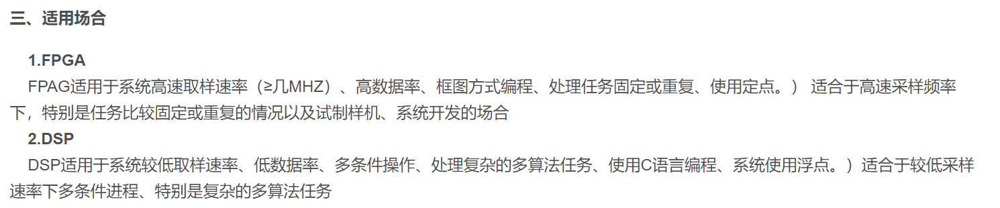
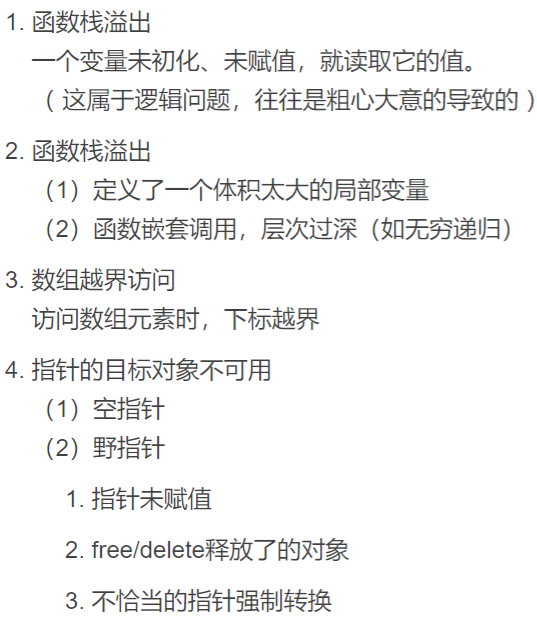
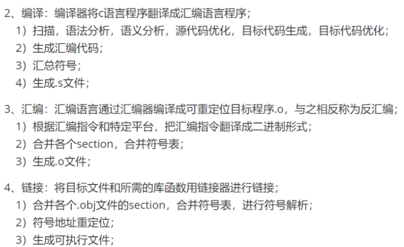

[TOC]

# 投递进度

## 研究所

- 2022.05.15  中电10所  嵌入式开发工程师  成都  提前批  有性格测试
- 2022.05.23  航天八院总体和149厂  嵌入式开发工程师  上海  提前批  有性格测试
- 2022.05.27  中电14所  嵌入式开发工程师  南京  提前批 （103室一面挂 303二面 407一面 Hr面）
- 2022.05.27  航天五院总体501  实习岗  北京  暑期实习 


## 私企

- 2022.06.15  TPLINK  嵌入式软件开发  杭州  提前批（三轮技术面 07.11 offer）

- 2022.06.25  联发科  嵌入式软件开发  武汉  提前批

- 2022.06.25  长江存储  嵌入式软件开发  上海  提前批

- 2022.07.01  蔚来  嵌入式软件开发（智能座舱）  提前批 

- 2022.07.08  OPPO  嵌入式软件开发  武汉/上海  提前批

- 2022.07.08  字节跳动  嵌入式软件开发  青岛  提前批

- 2022.08.9  理想  嵌入式软件开发  上海  正式批

- 2022.08.10  联想  嵌入式软件开发  武汉  正式批

- 2022.08.10  乐鑫科技  嵌入式软件开发  上海  提前批

  


# 笔试面试题目汇总

## 美团暑期实习

### 2022.04.02笔 试

​	题型为四道编程题和一道多选题，每道题都是20分，满分100分。	

*1.双色球，题目红色球和蓝色球的一个长度为n的排列，样例是rrbbr，其中r表示红色球，b表示蓝色球。以及小美现在口袋里还有a个红球，b个蓝球。现在往排列里插入球，使得相邻的球颜色不同，如果口袋里的球能满足，请输出插入球后的排列的最小长度，否则输出还需要多少个红球和蓝球。* 

​	标准的签到题，直接遍历很简单。但是题目一开始出错了，耽误了一些时间。官方修正后，最后ac。

*2.给一个数组，是一些数字的排列，如果能够从中间某个位置分开，使得前面的数组严格递增，后面的严格递减，就称这个数组是好数组。现在给你一个数组，你给某些数字加上一个整数，让它变成好数组，问加的总和最小是多少。示例`1,2,1,2,1`，答案只需要最中间的1变成3，数组变成`1,2,3,2,1`，所以加2即可。*

​	首先需要理解意思，分开数组应该从两个数之间左右分开，我的解题思路，使用两个数组，数组a存放把原数组刚好变成从左到右的严格递增数组的每个位置上的数需要加上的数，数组b存放把原数组刚好变成从右到左的严格递增数组的每个位置上的数需要加上的数，然后求数组a的前缀和，求数组b的倒序的前缀和，然后对两个数组从左往右遍历，求出`a[i]+b[i+1]`的最小值。

​	最后的通过率83%，不知道出了什么问题。

*3.题目给了两个字符串，一个是标语acac，一个是核心思想ac，求标语有多少个**指定子串**，其中要求核心思想字符串为**指定子串**的子序列。（同时题目中还介绍了子串和子序列的定义，自行百度）。*

​	题目给的子序列的定义好像有点奇怪，acac与ac的例子最后的答案是5。我的解题思路是从左往右遍历标语`a`，然后与核心思想`b`进行匹配，假设标语的`a[i]`和`a[k]`，刚好为以`b`为子序列的子串，则`a`中包含`a[i]~a[k]`的子串肯定也为**特定子串**，所以每次遍历找到一个子串就能求出一堆子串，然后一直对`a`往前遍历就行。

​	最后AC。

*4.小美买了一个三核CPU，一次只能完成三个任务，现在有一个任务时间组成的数组，需要将任务分成三组，求小美完成这些任务的最少时间。*

​	应该是背包问题，最后没时间做了。

*5.DMA相关的多选题，多选不得分，少选得部分分：*

​	a.可以不需要CPU取指执行来完成数据传输

​	b.用软件指向内存地址

​	c.传输数据时没有保护和恢复现场的操作

​	d.(忘记了，这个选项没有迷惑性)

### 2022.04.08一面

​	美团无人车部门，也是做底层BSP相关的。	

​	主要问了两段实习经历和毕业设计的内容，关于momenta的问的很细，我感觉我这部分的核心技术性的不是很多，不管是MCU端还是SOC端都不是很拿得出手，然后第一段实习经历的FreeRTOS现在已经忘了差不多了，所以回答还是挺吃力的。之后关于栈和堆，有点紧张回答的也不是很满意，之后还问了UART和SPI的问题，UART没复习，忘记了有没有开始位了，SPI问的很简单，但是我的回答他没听清，尬住了。

​	总的还说还是有点紧张，然后我也没时间认真准备。


## 阿里暑期实习

### 2022.04.12一面

​	阿里云IoT部门，做设备端安全服务的，还有服务器相关的，后端服务器和设备端数据通信相关的，具体也不清楚，嵌入式设备主要是跑linux的，还有部分FreeRTOS和阿里自己的RTOS的，linux端以C++为主。

​	常规流程，自我介绍 + 技术问答 + 手撕代码。

​	**自我介绍**后问了我的硕士专业相关的，关于课题组方向的问题，是否和嵌入式和硬件电路有关联，我就说了我的踝关节假肢的课题。还有机器学习和深度学习的开发经历，我回答了我EMGs的步态预测相关的。问我之后主要想往哪个方向发展，那必然说嵌入式呀。

​	**技术问答**问了很多问题，大概就是下面几个：

- I2C的具体流程。这个就正常回答，东西有点多，回答有点乱；
- 设计一个I2C通信系统，保证数据的安全（不是这个词）和完整性，好像类似于有探针在总线上怎么保证数据的安全和完整性。根本不会，就说了数据校验。
- 线程直接共享数据如何管理。我回答的有点乱，说了信号量和互斥量，应该就是互斥量；
- 问互斥量底层如何实现。这个我回答了代码临界区和原子性操作相关的，面包店算法和硬件的原子操作；
- 代码到二进制文件的流程。这个应该就是预编译，编译，汇编和链接；
- 描述一下链接过程。我目前还没有学到，就瞎说了把每个.o文件的代码段和数据段什么的，链接在一起；问安全协议，SSL和什么，我不太清楚；
- 好像是问linux系统如何加载ERF文件的过程。根本不会；
- *计算机网络的架构*，什么epco和slink什么来着，英文没听清。根本没听过；
- TCP的握手过程。这个回答的乱了点，三次握手以后要背一下。
- 是否了解*安全协议*，SSL什么的。根本不会；
- 通俗的解释一下上拉电阻和下拉电阻。这个也不太清楚，就随便说了说，默认电平和增大控制信号的带载能力；
- 问我硬件电路的设计、pcb绘制和硬件电路的制作是否都是一人完成。我就瞎说了说；
- 问我是否有参与或复现一些开源的嵌入式项目。我把之前抄书写的嵌入式操作系统说了说

​	**手撕代码环节**：

- 编写矩阵的初始化、打印、加法、数乘和乘法操作。主要就是二位数组的动态内存申请，然后矩阵乘法做了最简单的循环顺序的优化；
- 数组全排列。

​	感觉面试的很全面，有的知识点确实还没有学到，有的知识点只是知道但是还没有去按面试准备来背，主要是操作系统相关的东西；手撕代码也很常规，但是很基础的我还没有复习；面试官人也很好，感觉他们与嵌入式信息安全有点关系。


## 中电14所提前批

### 2022.05.28 总体部 一面

​	晚上6.30加我微信，问我今晚19.15是否可以面试，我害怕之后他就不理我了，我就直接答应了。14所一部，应该是总体。

​	面试开始为3~5分钟的自我面试，因为事发突然，我基本没认真准备。

​	基本**问答环节**：

- 问高考成绩和排名；如实回答。
- 问本科专业和学习的课程；如实回答。
- 问我有没有学过信号与系统和数字信号处理；只学过后者。问我DSP多少分；87，并且辩解说当时重心在打比赛。
- 简单介绍一下DSP讲的是什么；我说是对数字信号进行频域上的处理，提取它的频域特征，然后进行分析。
- 问DSP中有哪些操作；我不太会，只是DFT、FFT等；接着问FFT是什么；我说是快速傅里叶变换。
- 问是否知道窗函数；我忘记了，就瞎说了切比雪夫窗函数；接着问为什么加窗，加窗的作用；我根本不会。
- 问还记得FIR和IIR吗；我根本不记得。
- 问是否保研的，以及本科是自动化，研究生为什么去了机械；老问题了。
- 问会不会使用MATLAB；会
- 问你项目中遇到过什么大难题，又是怎么解决的，还提示我可以讲直接完成度过高的项目；我就回答了假肢如何解决自适应柔顺控制的。
- 问简历里写了抗压能力，请举个具体的例子；我没准备，说成怎么克服难题了，然后老师提醒说你压力大的时候是如何释放压力的，然后就跳过了。
- 问了一些有无女朋友，父母是否同意来南京工作的个人问题。
- 最后问如何看待加班和出差；我说加班还是以项目和工作量为主导，我说我喜欢今天的事情今天做，出差也差不多，以项目为主导，能够接受长差；他说新员工一般不鼓励出差的，但是之后会有，长的话甚至3~6月都有可能；我忘记问出差补贴的问题了。

​	**面试流程**，之后还有部长面，应该也算技术面。然后是HR面，主要面性格，比如抗压能力什么的，以及来14所工作的意愿。最后是性格评测，完全通过才有offer。他提示我自我介绍需要准备的丰富一点，需要包括直接本科研究的基本关键经历，*要有重点侧重（记不太清了）*，同时要有一定的逻辑性；同时下去还要好好准备基础知识，不要说自己学过，然后一问三不知；以及搞清楚在项目中的职位，项目负责人不能瞎写，因为负责人是统筹整个项目的（他们是总体部所以比较重视吧）。

​	**部门介绍**，中电14所一部，应该就是总体部，起整个14所科研牵头人的作用，就是甲方吧，工作内容包括谈项目，竞标，做方案和牵头系统测试验收等，然后还说了岗位用人要求，包括知识全面、说话和处理事情逻辑能力强、组织能力强、情商高、有前瞻性，全面全能等。

​	**待遇介绍**，一部招收的硕士生有半年的试用期，试用期税前月薪1.1w，第一年的年薪在17~21w，但是不包括公积金在内，公积金总共是50%，有餐补，交通补贴和单身公寓（可住5年），如果租房子，有南京市政府的租房补贴700左右。

​	同时他问我有没有其他部门联系，需要注意如果简历被哪个部门锁定了，就只能去那个部门了，所以当面试官说把简历推HR时，需要考虑好，确定了就不能换了，而且HR面大概在6月底。

​	我问我的专业不是很匹配，没有学过雷达相关的课程，他们会很在意吗；面试官说自动化还算比较贴合，他入职前也没学过，但是入职后需要自己学，同时他们也会带我学，确实需要我自己花点时间。

​	**结果**：部长说专业不匹配，给挂了

### 303室 

### 一面 2022.06.08

​	晚上8.00电话通知，8.10开始面试，大概20min，面试总体很随意，微信视频。

​	面试开始问高考成绩；然后是自我介绍，大概3min半左右；然后老师也没有问技术性的问题，说之后还有一轮科室的技术面试，问我如何回答关于我个人专业和他们雷达方向不是很匹配的问题；我说之前1部也面试过我，也讨论这个问题；然后他插过话题就教我应该怎么说，要说自己基础知识扎实，有信号处理相关的项目经历，和有较强的学习能力。之后就问了一些个人问题，是否独生子女，父母是否同意来南京工作等。

​	然后是关于科室的介绍，他们主要是做雷达数字信号处理的，包括使用matlab进行信号处理的仿真，然后将算法移植到嵌入式平台，包括DSP和FPGA上。

​	然后是我问待遇，他似乎也不太清楚，就说第一年大概20w以上，然后关于公积金的说法也含糊不清，可信度不高。

​	然后还聊了聊加班和出差的问题，我就还是回答我是任务导向型，不会为了加班而加班，能接受出差，但出差会打破自己规律的生活节奏，更喜欢不出差。他说他们部门加班和出差情况比1部好一点。

### 二面 2022.06.23

​	部门主任面试，微信语音，总共就11min左右，开局自我介绍，然后他们问我对他们部门的了解，然后主要问我的毕设和肌肉电流步态识别的项目，最后问我步态识别里面的深度学习算法能用在雷达上吗，问我为什么要报雷达所，我就大概把一面面试官教我的说法说了说，但是语言没组织好，然后就结束了。

​	**结果**：通过

### 2022.06.18 4部 一面

​	通知自我介绍15min，提问15min。

​	实际自我介绍12min，提问40min。

- 问我研究生毕设算法问题，我自我介绍的时候没有讲清楚输入的问题，导致面试官一直在问控制器的输入。
- 问DSP的选型问题，为什么用DSP，DSP相对于ARM系列的优势，然后什么情况下需要使用DSP+FPGA的优势。答得支支吾吾，没说出重点，可以看[dsp和ARM](http://www.javashuo.com/article/p-mogunuin-kn.html)、[DSP+FPGA](https://blog.csdn.net/YEYUANGEN/article/details/86716179?spm=1001.2101.3001.6650.12&utm_medium=distribute.pc_relevant.none-task-blog-2%7Edefault%7EBlogCommendFromBaidu%7ERate-13-86716179-blog-102650584.pc_relevant_paycolumn_v3&depth_1-utm_source=distribute.pc_relevant.none-task-blog-2%7Edefault%7EBlogCommendFromBaidu%7ERate-13-86716179-blog-102650584.pc_relevant_paycolumn_v3&utm_relevant_index=19)。大概就是DSP适合浮点运算，有专门的乘法器，适合实现复杂算法，适合进行FFT等运算；AMR主要是适合功能复杂的嵌入式系统，外设和网络接口比较多；FPGA适合数据的高速采样，可以并行处理，进行一些简单的预处理。



- 问为什么系统要用FreeRTOS，系统体量和系统代码量。答的不太好。
- 问CAN组网的项目有几个结点，组网需要注意什么。答不出来。
- 问了本科电赛的一些细节性的问题。我说忘记了。
- 问我将算法移植到嵌入式平台的经历，这个流程是什么，需要注意什么。因为我目前的算法很简单，这一块也答的不好。
- 问了一些个人问题，评估进所意向的。
- 问所里任务重，加班重，如何看待。我说自己能力还有待提高，还希望多干活提升自己的能力，能够接受之类的话。

​	这群面试官很专业，系统性的问题问的太多了，要么就是很基础性的问题，都答的不好。

​	**结果**：通过

### HR面 2022.06.29

​	HR面，腾讯会议，9min，自我介绍（3min）->提问环节。

​	自我介绍崩了，没背稿子，然后HR让眼睛盯着摄像头，不让看稿，有点忘词。

- 问肌肉电流项目的细节，主要负责工作。正常答
- 问为什么不去互联网。经济大环境不好，互联网裁员厉害，求稳定
- 问为什么来南京，也不待北京。主要考虑离家乡的问题

​	**结果**：给两方了，违约金1w

## 中电10所提前批

### 707室 一面 2022.06.23

​	腾讯会议面试，先自我介绍，然后提问，没有我提问的环节

- 问DSP上是否使用过实时操作系统？是否了解TI的操作系统。没有，不了解。

- 问QT了解的程度，项目中主要用了哪些功能，是否知道信号与槽的机制，Qt中多线程是如何通信的。

  答：项目就正常说，知道，我对信号与槽机制和多线程都了解的不多。

  A: 可以参考这两个博客[多线程](https://blog.csdn.net/u011156012/article/details/25508073)和[多线程通信](https://blog.csdn.net/hebbely/article/details/79428336)

- 问生产者和消费者模型如何实现，使用什么数据结构

  答：我就说用信号量，保证他们对资源操作的原子性，不知道用什么数据结构。

  A: 使用[阻塞队列](https://blog.csdn.net/a_struggling_monkey/article/details/90179137)，应该默认使用互斥锁保持线程安全的

- 问对实时操作系统的了解。我大概说了说

- 二值信号量和互斥信号的区别

  答：二值信号量不支持嵌套，上锁后，内部如果嵌套该信号量，会无法访问；而且二值信号量不是任务特有的，该任务上锁，能被另外一个任务解锁；二值信号量会出现优先级翻转问题。

- 循环队列的实现。我就说了数组模拟循环队列的方式，但是我当时考虑到队列满的情况，有点说的不自信

```C++
int q[N], hh = 0, tt = 0;	// hh 表示队头，tt表示队尾的后一个位置
q[tt++] = x;		// 向队尾插入一个数
if(tt==N) tt = 0;
hh++;				// 从队头弹出一个数
if(hh==N) hh = 0;
q[hh];// 队头的值
// 判断队列是否为空
if(hh!=tt) not empty;	// 这个地方有点问题，如果队列满的情况，hh==tt，感觉应该加一个变量记录队列长度
else empty;
```

- 问程序崩溃应该如何debug，有什么手段

  答：检查内存泄漏问题，检查栈空间是否溢出。关键点打印输出，设置断点什么的，面试官好像还不太满意。

  A: 可以参考[程序崩溃的调试方法及原因分类](https://blog.csdn.net/iamshaofa/article/details/51119643)

  

- 问多线程如何debug

  答：不知道

  A: 可以了解一下[gdb](https://blog.csdn.net/weixin_37921201/article/details/120117096)

- 问内存的分区，malloc的是存放在哪

  答：我说记不太清了，就说代码区，常量区，静态变量区，栈区和堆区。放在堆区

  A: C程序在执行时，将内存大方向划分为**4个区域**

  - 代码区：存放函数体的二进制代码，由操作系统进行管理的
  - 全局区：存放全局变量和静态变量以及常量
  - 栈区：由编译器自动分配释放, 存放函数的参数值,局部变量等
  - 堆区：由程序员分配和释放,若程序员不释放,程序结束时由操作系统回收

  之后还要==搞明白一下什么数据段的问题，以及RO和RW数据的问题==。

- 问static变量是什么时候初始化

  答：我就说函数中是第一次调用函数的时候初始化，全局的static忘记了。

  A: 全局变量、文件域的静态变量和类的静态成员变量在main执行之前的静态初始化过程中分配内存并初始化；局部静态变量（一般为函数内的静态变量）在第一次使用时分配内存并初始化。这里的变量包含内置数据类型和自定义类型的对象。

- 问打印log使用什么方式

  答：使用第三方库，zlog

- 问C++怎么样。我答自学过一些了解基本特性。

​	**结果**：通过，HR面应该给我挂了，大概率看出来我不想去成都

## TPllink提前批	

### 一面 2022.06.24

​	腾讯会议，25min，自我介绍，提问，我提问。问了很多项目的问题，包括电赛的无线充电小车，毕设的主动柔顺控制算法，然后问了几个问题。

- 问什么时候触发中断

  答：条件到了就触发中断了，比如定时中断

  A : 感觉对方可能想问ARM的中断机制，可以稍微往这个方向说一下

- 问指针函数和函数指针的区别

  答：指针函数是返回值为指针的函数，函数指针是指向函数入口的指针

- 问内核态和用户态的区别

  答：在内存中所属空间不一样，特权级不一样，用户态可以通过系统调用进入内核态，实际对底层硬件进行操作

- 堆栈的区别

  答：正常答，但是语言没组织太好

  A : 从申请方式，申请大小，申请效率简单比较；Stack的空间由操作系统自动分配/释放，Heap上的空间手动分配/释放。Stack空间有限，Heap是很大的自由存储区。Stack申请效率高，Heap申请效率低。

​	tplink做路由器，安防摄像头还有扫地机器人，主要使用linux开发。


### 二面 2022.06.29

​	腾讯会议，35min，自我介绍->提问->手撕代码（10min）。

- static变量的作用，static在C++的作用？

  答：是修饰变量在单文件中可见，减低耦合性。不清楚在C++的作用

  A: c/c++共有：修饰全局变量时，表明一个全局变量只对定义在同一文件中的函数可见。修饰局部变量时，表明该变量的值不会因为函数终止而丢失。修饰函数时，表明该函数只在同一文件中调用。      

  c++独有：修饰类的数据成员，表明对该类所有对象这个数据成员都只有一个实例。即该实例归所有对象共有。用static修饰不访问非静态数据成员的类成员函数。这意味着一个静态成员函数只能访问它的参数、类的静态数据成员和全局变量

- 编译和链接的过程

  答：把编译，汇编和链接的过程粗略说了下，答得不是很好

  A: 

  

- 虚拟内存和物理内存的区别

  答：没复习，把能想到的都说了，什么段页式，MMU，虚拟内存映射

  A: 物理内存就是内存条的内存大小，虚拟内存是操作系统一种管理内存的方式，它使得应用程序认为它拥有连续可用的内存（一个连续完整的地址空间），它通常是被分隔成多个物理内存碎片，还有部分暂时存储在外部磁盘存储器上，在需要时进行数据交换。

- 什么是内存泄漏，有遇到过吗，需要怎么调试

  答：未释放申请内存空间。有。不清楚调试方法

  A: 内存泄漏内存泄漏（Memory Leak）是指程序中已动态分配的堆内存由于某种原因程序未释放或无法释放，造成系统内存的浪费，导致程序运行速度减慢甚至系统崩溃等严重后果。可以使用根据分析程序运行内存大小，关注内存飙升的地方。可以了解一下[valgrind](https://blog.csdn.net/caijiwyj/article/details/99188644)。

- 归并排序，为什么时间复杂度是nlogn

  答：不断递归二分，然后向上归并。不是很清楚，就瞎说了说

  A: 该算法是采用分治法（Divide and Conquer）的一个非常典型的应用。将已有序的子序列合并，得到完全有序的序列；即先使每个子序列有序，再使子序列段间有序。若将两个有序表合并成一个有序表，称为2-路归并。归并排序的时间复杂度是O(nlogn)。
   假设被排序的数列中有N个数。遍历一趟的时间复杂度是O(N)，需要归并排序调用logn次。

- 手撕代码：三数之和

  10min，共享屏幕，用本地IDE编写，最后运行有一个小问题，面试官问解题思路。排序，利用单调性，使用双指针，然后考虑去重问题。


## 719所

719总体所，弱电控制，操作性控制，核动力控制，通用设备的控制。

硕士 第一年，试用期 ，第三年税后20 + 5w（公积金），干10年 8 年，升到组长，一年到手30w + 6w。

出差还是看部门的岗位和内容，不出差也是可能的，平均一年3 4月，保障部门可能一年7 8月，补贴一天200。

暂无单身宿舍，租房补贴 一月600

大概9月底 10月初开始面试


## 联发科提前批

### 一面 2022.07.15

​	视频面，30min，自我介绍->手撕代码->提问->反问

- 手撕库函数`strncopy`，不太会，这种库函数的编写，比较考验基础。

```C
// 默认target是由用户自己开辟足够大的空间
// 要保证source不能越界
char* my_strncopy(char* target, const char* source, int count) {
	char* dest = target;
	while (count && (*target++ = *source++)) {
		count--;
	}
	if (count) {
		while (--count) {
			dest += '\0';
		}
	}
	return dest;
}
```

- 基本没问什么问题，都是问是否熟悉或者了解什么，都没细问。问了遇到什么困难，然后怎么解决的，类似这些
- 闲聊，为什么想来武汉之类的问题，最后怎么选择工作地，比如同时拿到武汉华为和MDK的offer。
- 反问环节，说刚进去的时候可能会比较累，加班什么的，正常都是965，项目赶进度的时候，周末可能加班，有加班费。没很明白嵌入式在MDK里面主要做什么，可能就是芯片的底软吧，要么和买方合作，帮他们优化底层的性能。

​	面试氛围很轻松，大概对面对我不太感兴趣吧。

​	**结果**：GG


## 蔚来面试

### 一面 2022.07.21

​	蔚来嵌入式岗，智能座舱，50min，自我介绍->提问->反问，没有手撕代码

- 问了很多泛的而又不相关的问题，包括专业学习偏向，python使用情况，为什么不搞算法，深度学习算法相关，自动控制常见的算法，如何学习新知识，怎么解决问题、第二次实习主要做了什么，怎么熟悉项目的，如何从点解决问题然后从面了解问题，诸如此类，云云

- spi不同线制区别，四线制能实现全双工通信吗

  答：忘记了时钟线，，四线制是能全双工的，当时以为不能

- 不同通信协议的通信速率，距离有了解吗

  答：不清楚，不了解

- CAN通信相关，如何指定发送给其他设备，对汽车中的CAN通信系统了解吗

- freertos和linux的主要区别

- 网络编程会吗？

  答：不会

- static在C和C++中的作用

- 为什么static修饰的函数只能使用类中static变量


### 二面 2022.07.28

​	视频面，1h，自我介绍->提问->编程小问题->反问

- 问了关于项目和实习经历的问题，都问的比较多，项目控制算法这一块我不知道该怎么讲，实习我没什么好讲的，比较尴尬，都没有做的太深，但面试官一直在追问
- IIC通信怎么判断地址是否接入设备
- IIC、UART、SPI和CAN的协议内容
-  进程间通信的方式有哪些
- 消费者和生产者模型的实现方式，怎么保证线程安全，提到了条件变量
- Qt中信号与槽的实现机制
- STM32的启动过程
- C和C++混合编程中能使用new创建对象吗？
- C++中的template
- C++的多态是如何实现的，静态多态和动态多态，虚函数相关
- 编程相关问题1：快排问题，第一次快排后的数组序列
- 编程相关问题2：1234567为平衡二叉树的先序遍历，给出他的后序遍历和中序遍历

​	**结果**：GG


## 字节提前批

### 一面 2022.07.29

​	视频面，VR部门（pico）嵌入式，30min，自我介绍->提问->手撕代码->反问

- 问项目和实习，随便问了问，问为什么用dsp相关的问题

- IIC的起始信号、终止型号和应答信号，最多接多少个从机

  正解：2^7 - 1 = 127个，0x00不能使用

- SPI是全双工还是半双工

- IMU使用的型号，如何使用数据，做了哪些处理

  答：直接DMP解算出的欧拉角

- 结构体中字节对齐的规则

  正解：**自身对齐值：**数据类型本身的对齐值，例如char类型的是1，short类型是2；结构体或者类的自身对齐值为其成员中自身对齐值最大的那个值；
  ​	**指定对齐值：**编译器或程序员指定的结构体对齐值，32位单片机的指定对齐值默认是4，VS默认值是8；
  ​	**有效对齐值：**自身对齐值和指定对齐值中较小的那个。

  对齐有两个规则：

  ​	1、对于结构体或者类，要将其补齐为其有效对齐值的整数倍。
  ​	2、存放成员的起始地址必须是该成员有效对齐值的整数倍。

- linux中进程间通信方式，哪种最快，为什么最快

  答：管道、信号量、消息队列、信号、共享内存、套接字。共享内存。

- freeRTOS任务之间通信方式有几种，每种用途是什么

  答：消息队列、信号量、互斥锁（互斥信号量）、事件标志组以及任务通知。消息队列主要用于任务中传递大量的消息；信号量主要用于某个任务与单个事件或任务进行同步；事件标志组某个任务与多个事件或任务进行同步的有效机制之一，类似于全局的flag变量；任务通知每个任务都有 一个 32 位 的通知值，在大多数情况下，任务通知可以替代二值信号量、计数信号量、事件组，也可以替代长度为1的队列，比较灵活省资源。

- freeRTOS有几种任务调度方式，高优先级任务抢占低优先级任务的切换过程

  **疑问**：目前对于为什么高优先级抢占低优先级的底层实现不是很了解

- C++中引用和指针的区别

  正解：指针它指向一块内存，引用只是一块内存的别名。指针的内容是所指向的内存的地址，本身占内存空间，可以多级，sizeof 指针得到的是指针类型的大小。
  引用只是一块内存的别名，不占内存空间，不能为空，只能一级，指向不能更改，类似于指针常量。

- 网络通信字节序是大端还是小端

  正解：小端

- C++的三大特性

- linux中在中断上下文切换时，为什么不能睡眠

  答：没懂这个问题。

- linux中有多少个软中断

- malloc申请的内存在哪里

- 堆和栈的区别

- kmalloc和vmalloc的区别

  正解：

  1、 vmalloc()分配的内存虚拟地址是连续的，而物理地址无须连续。而kmalloc()确保页在物理地址上是连续的，自然虚拟地址也是连续的。硬件设备用的的任何内存区都必须是物理上连续的块，而不仅仅是虚拟地址连续上的块。
  2、 vmalloc()相比较于kmalloc()效率不高，因为获得的页必须转换为虚拟地址空间上连续的页，必须专门建立页表项。
  3、 vmalloc()仅在不得已时才使用——典型的就是为了申请大块内存。该函数可能睡眠，因此不能从中断上下文中调用，也不能从其他不允许阻塞的情况下进行调用。

- linux进程有几种状态

- 手撕代码：编写C库函数 memcpy

  答：gg

​		**结果**：GG


## OPPO提前批

### 一面 2022.08.05

​	视频面，手机底软部门，20min，自我介绍->提问->反问

- 问项目相关的问题

- 内核态和用户态的区别

  **正解**：操作系统的核心是内核(kernel)，它独立于普通的应用程序，可以访问受保护的内存空间，也有访问底层硬件设备的所有权限。为了保证内核的安全，现在的操作系统一般都强制用户进程不能直接操作内核：具体的实现方式基本都是由操作系统将虚拟地址空间划分为两部分，一部分为内核空间，另一部分为用户空间。针对Linux操作系统而言，最高的1G字节（从虚拟地址0xC0000000到0 xFFFFFFFF)由内核使用，称为内核空间。而较低的3G字节（从虚以地址0x00000000到0xBFFFFFFF)由各个进程使用，称为用户空间。对上面这段内容我们也可以这样理解：每个进程的4G地址空间中，最高1G都是一样的，即内核空间。只有剩余的3G才归进程自己使用。换句话说就是，最高1G的内核空间是被所有进程共享的！

- 异常和中断的区别

  **正解**：外中断——就是我们指的中断——是指由于外部设备事件所引起的中断，如通常的磁盘中断、打印机中断等；内中断——就是异常——是指由于 CPU 内部事件所引起的中断，如程序出错(非法指令、地址越界)。内中断(trap)也被译为“捕获”或“陷入”。异常是由于执行了现行指令所引起的。由于系统调用引起的中断属于异常。

- 硬链接和软链接的区别

  答：硬链接是有着相同 inode 号仅文件名不同的文件，软链接就是一个普通文件它数据块内容是另一文件的路径名的指向。

- SPI和IIC的相同和不同

  **正解**：相同点：两者都是同步串行一对多的通信；不同点：SPI是四线制、全双工、无应答机制、极性和时钟相位可变，IIC是二线制、半双工、有应答机制、极性和时钟相位固定。

- 介绍一下SPI的模式

  **正解**：根据时钟极性和时钟相位不同可以分为四种模式。

- 死锁产生的原因和条件

​	**结果**：GG

