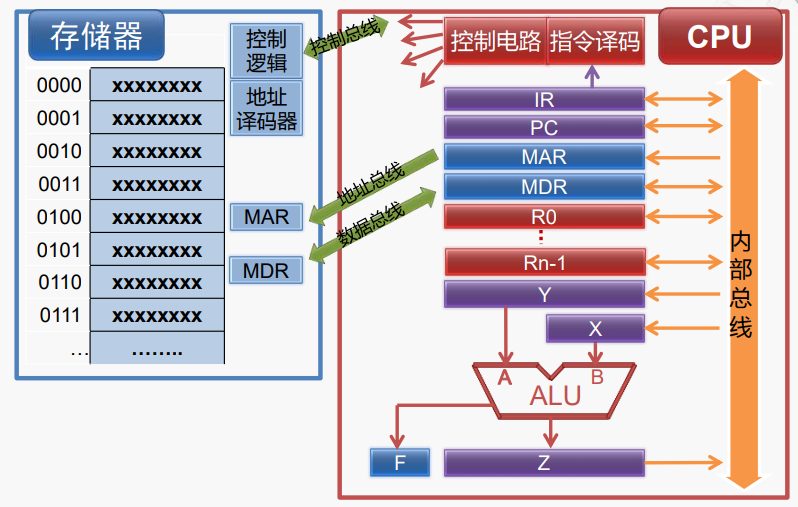
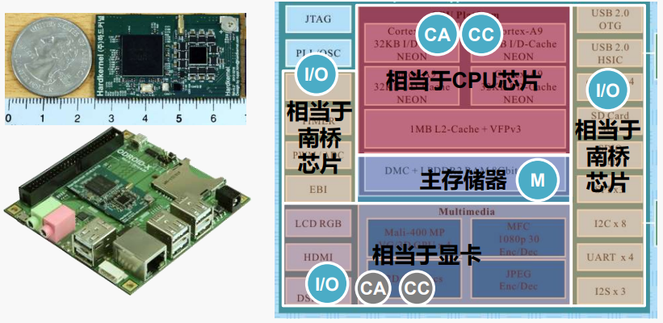
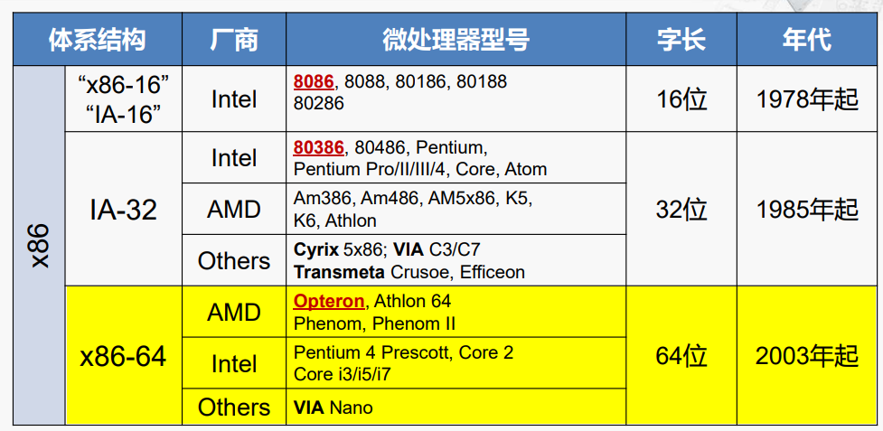
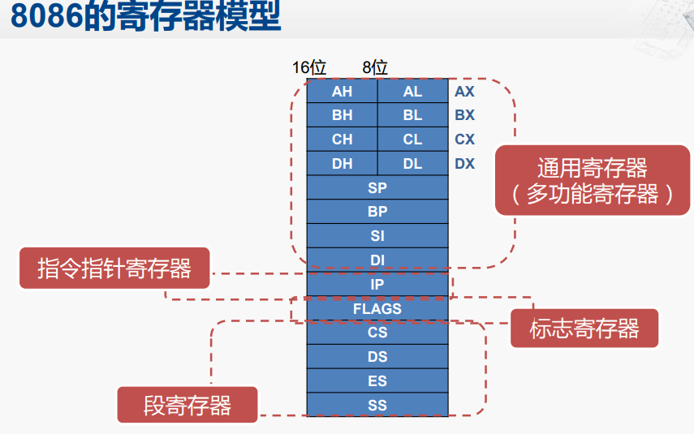
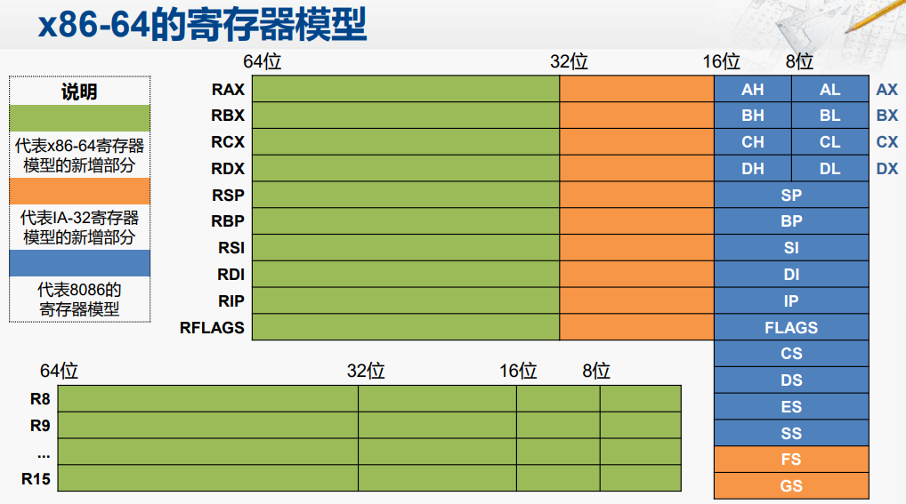
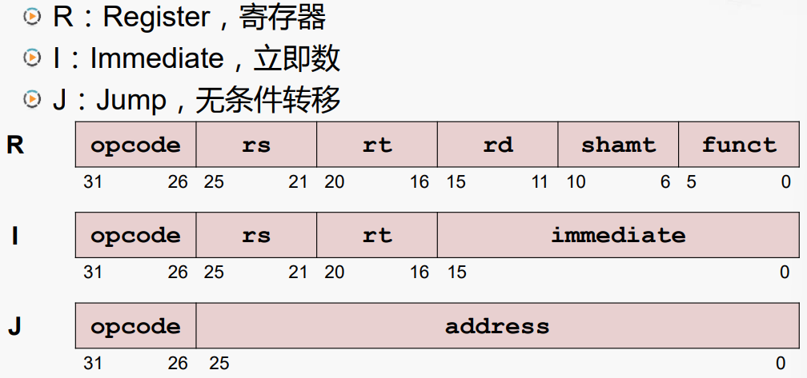
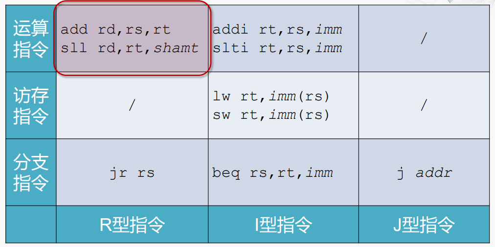

<h1 style="text-align:center">计算机组成</h1>

[TOC]

## 计算机基本结构

​	冯诺依曼结构的计算机主要由**运算器**、**控制器**、**存储器**、**输入设备**和**输出设备**组成。

​	现代计算机中的CPU主要包括运算器和控制器，当然其内部的cache缓存算作存储器，主要的存储器算作外接的内存，硬盘算作输入输出设备。下图为计算机结构的简化模型。

​	计算机执行一条指令的主要步骤为：**取指 -> 译码 -> 执行 -> 回写**

- 取指：根据PC寄存器中的地址从存储器中取出相应的指令。具体流程为PC寄存器通过内部的总线传入MAR（地址寄存器）中，通过地址总线传到存储器的MAR中，然后存储器内部的控制电路读取相应地址的数据，放入MDR（数据寄存器）中，然后通过数据总线传入CPU的MDR中，然后通过内部总线将数据放入IR（指令寄存器）中，操作完后PC会自动增加；
- 译码：控制器分析指令的操作性质，并向有关部件发出指令所需的控制信号；具体流程为对IR中的指令进行译码，然后通过控制电路发出相应的控制指令；
- 执行：主要是运算器（ALU）执行相应的指令操作；如指令为“ADD R0, [6]”，则会从存储器中地址为“6”的地方取出运算数，放入CPU的MDR中，然后CPU的MDR和R0寄存器中的数会送入ALU的运算数的寄存器中，然后进行加法运算，得到相应的运算结果；
- 回写：将运算结果写入通用寄存器或者存储器中。

​	对于输入输出设备，一般访问方法也是通过地址的方法，与CPU访问存储器（内存）类似，有与存储器统一编址和分开编址的方式，在现代计算机中的南桥芯片主要集成了各种IO设备的控制器，用来统一管理IO设备，包括键盘、硬盘、鼠标、USB设备等，而一些数据量大的IO设备，如显示屏，则有专门的显卡对他进行处理，一般CPU内部也会集成显卡的功能。

​	对于单片机（STM32、DSP）来说，它们内部一般都包括了冯诺依曼结构的五个部分，与计算机的CPU有所不同。

## 计算机的指令架构

​	计算机的指令系统体系结构是计算机软件和硬件相互沟通的桥梁。

### x86体系结构

​	x86体系结构的演变如下所示。从最开始的16位的8086发展到64位的酷睿系列，CPU的位数是指CPU内部寄存器的位数，当然随着位数的增加，数据总线和地址总线的宽度也在增加，最开始的8086位20位的地址总线，现代计算机基本都是64位宽度的地址总线，地址总线的宽度主要是决定了寻址范围，所以现代计算机的内存都可以很大，16G甚至更大，从地址总线宽度来看上限为$2^{32}Gib$.

​	8086的寄存器模型如下图所示，

​	IA-32的寄存器模型：

​	x86-64寄存器模型：

### MIPS

​	MIPS（Microprocessor without Interlocked Piped Stages）采用的是RISC（Reduced Instruction Set Computing）体系结构，而x86为CISC（Complex Instruction Set Computer）体系结构。其主要设计理念为减少指令的类型，降低指令的复杂度。主要特点如下：

- 固定的指令长度：32-bit，简化了从存储器取指令；
- 简单的寻址模型：简化了从存储器去操作数
- 指令数量少，指令功能简单：一条指令只完成一个操作，简化了指令的执行过程
- 只有Load和Store指令可以访问存储器：例如，不支持x86指令的这种操作：ADD AX,[3000H]
- 需要优秀的编译器支持

​	MISP指令的基本格式为RIJ型。

​	指令分类如下图所示。

​	ARM（Advanced RISC Machine）也是一种基于RISC的体系架构，相对来说，目前ARM比MISP的应用更加广泛，MISP主要是因为相对较为简单，所以一般用于教学之中。