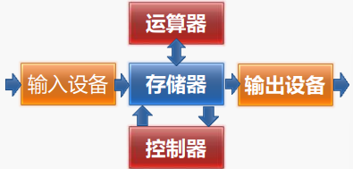

<h1 style="text-align:center">计算机组成</h1>

[TOC]

## 计算机基本结构

​	冯诺依曼结构的计算机主要由**运算器**、**控制器**、**存储器**、**输入设备**和**输出设备**组成。

​	现代计算机中的CPU主要包括运算器和控制器，当然其内部的cache缓存算作存储器，主要的存储器算作外接的内存，硬盘算作输入输出设备。下图为计算机结构的简化模型。

​	计算机执行一条指令的主要步骤为：**取指 -> 译码 -> 执行 -> 回写**

- 取指：根据PC寄存器中的地址从存储器中取出相应的指令。具体流程为PC寄存器通过内部的总线传入MAR（地址寄存器）中，通过地址总线传到存储器的MAR中，然后存储器内部的控制电路读取相应地址的数据，放入MDR（数据寄存器）中，然后通过数据总线传入CPU的MDR中，然后通过内部总线将数据放入IR（指令寄存器）中，操作完后PC会自动增加；
- 译码：控制器分析指令的操作性质，并向有关部件发出指令所需的控制信号；具体流程为对IR中的指令进行译码，然后通过控制电路发出相应的控制指令；
- 执行：主要是运算器（ALU）执行相应的指令操作；如指令为“ADD R0, [6]”，则会从存储器中地址为“6”的地方取出运算数，放入CPU的MDR中，然后CPU的MDR和R0寄存器中的数会送入ALU的运算数的寄存器中，然后进行加法运算，得到相应的运算结果；
- 回写：将运算结果写入通用寄存器或者存储器中。

​	对于输入输出设备，一般访问方法也是通过地址的方法，与CPU访问存储器（内存）类似，有与存储器统一编址和分开编址的方式，在现代计算机中的南桥芯片主要集成了各种IO设备的控制器，用来统一管理IO设备，包括键盘、硬盘、鼠标、USB设备等，而一些数据量大的IO设备，如显示屏，则有专门的显卡对他进行处理，一般CPU内部也会集成显卡的功能。

​	对于单片机（STM32、DSP）来说，它们内部一般都包括了冯诺依曼结构的五个部分，与计算机的CPU有所不同。

