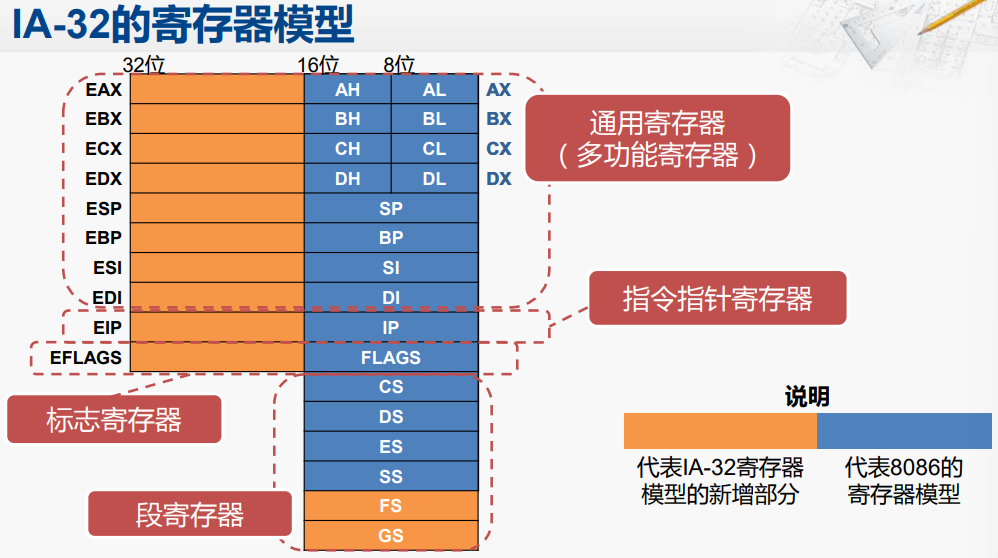
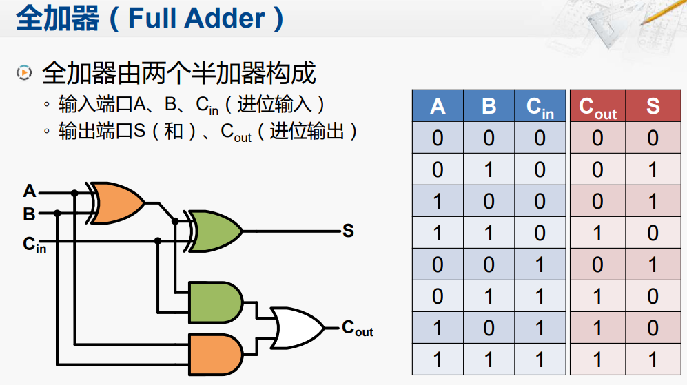
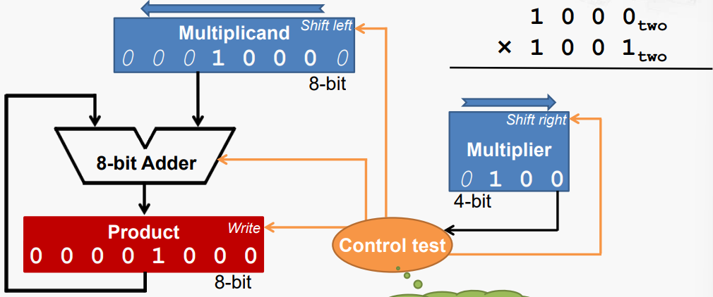
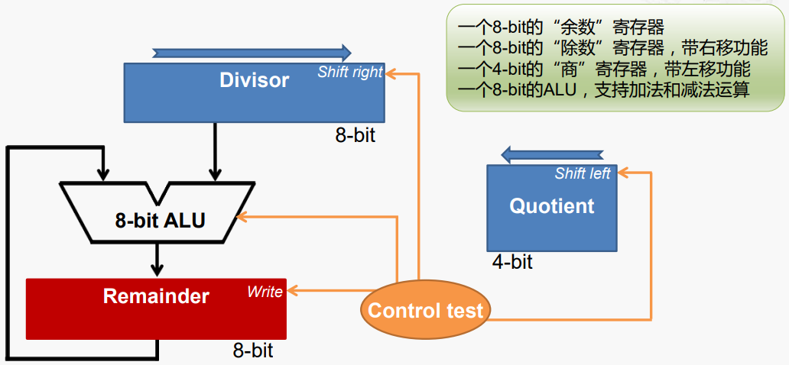
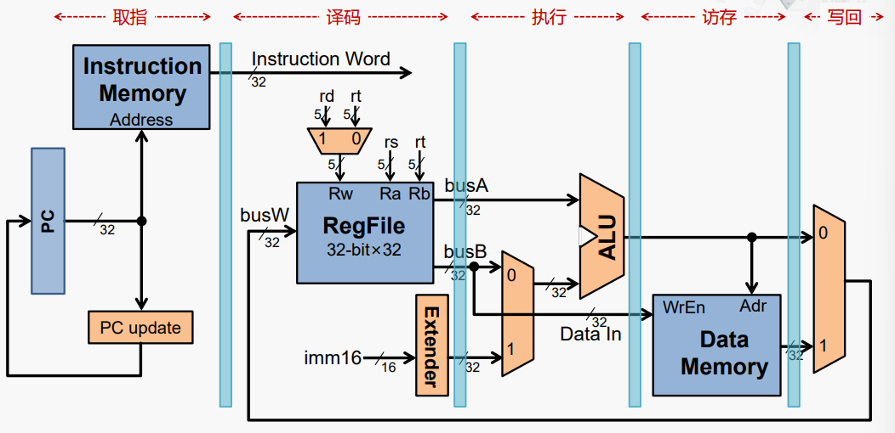
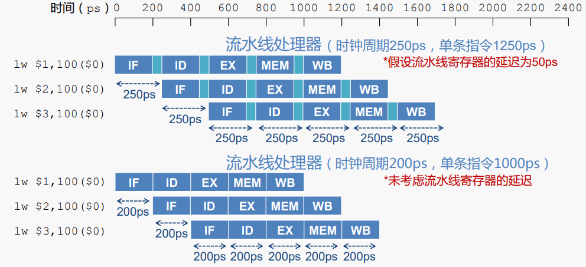

<h1 style="text-align:center">计算机组成</h1>

[TOC]


## 计算机基本结构

​	冯诺依曼结构的计算机主要由**运算器**、**控制器**、**存储器**、**输入设备**和**输出设备**组成。


​	现代计算机中的CPU主要包括运算器和控制器，当然其内部的cache缓存算作存储器，主要的存储器算作外接的内存，硬盘算作输入输出设备。下图为计算机结构的简化模型。


​	计算机执行一条指令的主要步骤为：**取指 -> 译码 -> 执行 -> 回写**

- 取指：根据PC寄存器中的地址从存储器中取出相应的指令。具体流程为PC寄存器通过内部的总线传入MAR（地址寄存器）中，通过地址总线传到存储器的MAR中，然后存储器内部的控制电路读取相应地址的数据，放入MDR（数据寄存器）中，然后通过数据总线传入CPU的MDR中，然后通过内部总线将数据放入IR（指令寄存器）中，操作完后PC会自动增加；
- 译码：控制器分析指令的操作性质，并向有关部件发出指令所需的控制信号；具体流程为对IR中的指令进行译码，然后通过控制电路发出相应的控制指令；
- 执行：主要是运算器（ALU）执行相应的指令操作；如指令为“ADD R0, [6]”，则会从存储器中地址为“6”的地方取出运算数，放入CPU的MDR中，然后CPU的MDR和R0寄存器中的数会送入ALU的运算数的寄存器中，然后进行加法运算，得到相应的运算结果；
- 回写：将运算结果写入通用寄存器或者存储器中。

​	对于输入输出设备，一般访问方法也是通过地址的方法，与CPU访问存储器（内存）类似，有与存储器统一编址和分开编址的方式，在现代计算机中的南桥芯片主要集成了各种IO设备的控制器，用来统一管理IO设备，包括键盘、硬盘、鼠标、USB设备等，而一些数据量大的IO设备，如显示屏，则有专门的显卡对他进行处理，一般CPU内部也会集成显卡的功能。

​	对于单片机（STM32、DSP）来说，它们内部一般都包括了冯诺依曼结构的五个部分，与计算机的CPU有所不同。


## 计算机的指令架构

​	计算机的指令系统体系结构是计算机软件和硬件相互沟通的桥梁。

### x86体系结构

​	x86体系结构的演变如下所示。从最开始的16位的8086发展到64位的酷睿系列，CPU的位数是指CPU内部寄存器的位数，当然随着位数的增加，数据总线和地址总线的宽度也在增加，最开始的8086位20位的地址总线，现代计算机基本都是64位宽度的地址总线，地址总线的宽度主要是决定了寻址范围，所以现代计算机的内存都可以很大，16G甚至更大，从地址总线宽度来看上限为$2^{32}Gib$.


​	8086的寄存器模型如下图所示，


​	IA-32的寄存器模型：



​	x86-64寄存器模型：


### MIPS

​	MIPS（Microprocessor without Interlocked Piped Stages）采用的是RISC（Reduced Instruction Set Computing）体系结构，而x86为CISC（Complex Instruction Set Computer）体系结构。其主要设计理念为减少指令的类型，降低指令的复杂度。主要特点如下：

- 固定的指令长度：32-bit，简化了从存储器取指令；
- 简单的寻址模型：简化了从存储器去操作数
- 指令数量少，指令功能简单：一条指令只完成一个操作，简化了指令的执行过程
- 只有Load和Store指令可以访问存储器：例如，不支持x86指令的这种操作：ADD AX,[3000H]
- 需要优秀的编译器支持

​	MISP指令的基本格式为RIJ型。


​	指令分类如下图所示。


​	ARM（Advanced RISC Machine）也是一种基于RISC的体系架构，相对来说，目前ARM比MISP的应用更加广泛，MISP主要是因为相对较为简单，所以一般用于教学之中。

## 算术运算和逻辑运算

​	最基本的门电路包括与门、或门、非门和异或门。

### 寄存器的内部结构

​	寄存器的每一个位都是由一个D触发器构成


### 加法器和减法器

​	全加器结构：




​	目前还不是很明白溢出检查的原理。


​	对于**减法器**可以看做$A-B=A+(-B)$来处理，对于计补码则有$A-B=A+(~B+1)$。

### 加法器的优化

​	单纯使用上述的行波进位加法器的结构（低位全加器的$C_{out}$连接到高一位全加器$C_{in}$）,则一个32位数的加法器完成一个加法运算延时间就较长，总延时时间大概为$(2n+1)T$，其中$T$为一个门电路的延时。其主要的问题在于进位信号的计算，如果能提前计算出进位信号则可以优化加法器的延时。

​	**超前进位加法器**：


​	通过上述方法，可以将4bit的加法器的门延时缩短到4级门延时，而行波进位加法器需要9级门延时。而对于32bit加法器如果单纯使用超前加法器实现理想的延时时间为4级门延时（行波进位为65级门延时），但是实际电路过于复杂，通常采用多个小规模的超前进位加法器拼接而成，如用4个8-bit的超前进位加法器连接成32-bit加法器。

### 乘法器

​	二进制的乘法比十进制的乘法的计算过程简单很多，不需要十进制乘法表。考虑如下一个二进制乘法。


​	在整个运算过程中，只会出现被乘数本身和0两个中间值。整个过程可以使用位移运算和加法运算来实现。

​	初略了解一下计算机关于二进制和十进制的选择问题。所以二进制运算+转换为十进制显示的计算机效益需要高于单纯使用十进制的计算机，选择二进制设计计算机才有意义。


​	最终乘法器的结构如下。


​	大致的过程如下：


​	被乘数左移，乘数右移



​	如果乘数末位为0，则被乘数直接左移，乘数右移；如果乘数末位为1，则被乘数与product寄存器中的数相加后，更新product寄存器的值，然后被乘数左移，乘数右移。同时在第四轮循环结束运算。


​	乘法器的运算流程图如下：


​	同时该乘法器还可以进一步优化，减少不必要的硬件资源，最终优化结构如下所示：


### 除法器

​	32位除法器的工作流程图：


​	具体原理详见ppt



​	除法器的优化方向也是减少不必要的硬件资源。

## 处理器的设计

​	处理器设计的主要步骤：

1. 分析指令系统，得出对数据通路的需求
2. 为数据通路选择合适的组件
3. 了解组件建立数据通路
4. 分析每条指令的实现，确定控制信号
5. 集成控制信号，形成完整的控制逻辑


### 指令取出单元

​	IFU（Instruction Fetch Unit），用PC的内容作为地址，访问指令存储器获得指令编码，顺序执行时PC+4，发生分支时PC为目标地址，该单元有一个更新程序计数器的控制信号***nPC_sel***。


### 运算单元的数据通路（ALU）


​	RegFile代表32个32位的寄存器，rs、rt、rd为寄存器的选择信号。

​	以加法运算为例，其存在add和addi指令，它们分别为R型和I型指令，所以根据它们的指令，需要在busB上有一个选择立即数的多选器，其选择控制信号为***ALUSrc***，而对于立即数需要扩展至32位，扩展方式有0扩展和符号扩展，所以存在一个扩展控制信号***ExtOp***。add指令的格式为 `add rd, rs, rt`，为将rs和rt对应的寄存器中的值进行加法运算，而ALU需要一个***ALUCtr***控制信号，最后写入rd寄存器中；addi的指令格式为`addi rt, rs, imm`，为将rs寄存器中的值和立即数相加，把结果写入rt寄存器中，所以在写目的寄存器的选择信号前也需要加一个多选器，其选择控制信号为***RegWr***。

​	对于访存指令，以lw为例，其用于从一个指定的地址加载值写入一个寄存器中，格式为`lw rt, imm(rs)`，其先从rs寄存器中取出值与imm立即数相加，然后ALU计算得到地址，从存储器对应位置取出数据存入目的寄存器rt中，所以在busW前需要加一个选择ALU结果和存储器数据多选器，控制信号为MemtoReg。而sw指令，用于将源寄存器中的值存入指定的地址，则需要busB直连存储器数据输入的分支，以及一个控制存储器写的控制信号***MemWr***。

​	最终CPU的数据通路如下图所示。


### 控制信号的集成

​	每一个指令都有自己的自己相应的控制码和对应的参数，而控制信号的集成电路，首先需要分析每个指令对应的控制信号的值（前面加粗斜体的控制指令），根据指令码使用合适的控制逻辑电路生成所需要的控制信号，如下图所示。


​	下表给出了一些指令对应的控制信号的值。


## 流水线

### 流水线基本原理

​	在之前的数据通路中加入流水线寄存器，用于暂时存放每个操作后的数数据。



​	将每条指令划分为取指、译码、执行、访存和写回五个步骤，但是实际并不是每条指令都有这个五个给出，如add指令就没有访存这个操作，在实际的流水线过程中，其访存过程为一个空操作。下图为流水线的性能分析。



​	流水线中的各个处理部件可并行工作，从而可使整个程序的执行时间缩短；流水线并不会缩短单条指令的执行时间（甚至会增加时间）， 而是提高了指令的吞吐率。


### 超标量流水线

​	通常，具有两条或两条以上并行工作的流水线结构称为超标量结构，亦称为**“超标量流水线”**。使用超标量结构的处理器称为超标量处理器。

​	由单周期→标量流水线：**时间并行性**的优化，主要是对现有硬件的切分；

​	标量流水线→超标量流水线：**空间并行性**的优化，需成倍增加硬件资源。

### 流水线的“冒险”

​	**冒险**为阻止下一条指令在下一个时钟周期开始执行的情况，分为以下三种情况。

	1. **结构冒险**：所需的硬件部件正在为之前的指令工作；
	2. **数据冒险**：需要等待之前的指令完成数据的读写；
	3. **控制冒险**：需要根据之前指令的结果决定下一步的行为。

​	数据冒险的解决方法：

 - 流水线停顿，产生空泡（空操作）；

 - 数据前递，如以下指令

   ```assembly
   sub $t0,$s1,$s2
   add $s3,$t0,$s4
   ```

   如果不做处理，add指令需要等上面sub指令将计算结果写回至寄存器t0中，才能执行；

   

   而实际sub指令完成减法操作后，ALU中就存在计算的结构，不需要等写回到寄存器t0中，可以新增一个旁路将ALU的计算结果直接引出，则add指令就可以正常执行。

   

 - 流水线停顿＋数据前递。

​	==***控制冒险的处理***：此处暂时空缺，还没有很理解。？？？==


## 存储层次结构

### 存储层次结构概况

​	存储器为带存储功能的部件，具有非易失性、可读可写、随机访问，我们较为关注存储器的访问时间、容量、价格和功耗。


### DRAM和SRAM

​	DRAM（Dynamic Random Access Memory，动态随机存取存储器）主要作为主存（内存），其基本存储单元如下所示。


​	因为其主要靠电容储存信号，所以相对速度较慢，优点为集成度高、功耗低、价格低，缺点为速度较慢、需要定时刷新。SDRAM（（synchronous dynamic random-access memory）为有一个同步接口的DRAM。

​	SRAM（Static Random-Access Memory，静态随机存取存储器）由双稳态触发器组成。的基本存储单元如下所示。


​	其基本结构如下所示。


​	其优点是速度较快，缺点是集成度低、功耗较高、价格较贵。现代CPU中的高速缓存通常用SRAM实现。

### 主存的工作原理

​	DRAM芯片的内部结构如下所示。


​	其读操作的访问过程如下。


​	DDR（Double Data Rate）的基本原理是在时钟的上升沿和下降沿都进行数据的传输，提高内存的数据传输速率，如下图示。


### 高速缓存的工作原理

​	计算机程序从时间和空间都表现出“局部性”。如以下程序段：

```C
for(int i = 0; i < 1000; i++)
    for(int j = 0; j < 200; j++)
        sum += a[i][j];
```

	- 时间局部性：最近被访问的存储器单元（指令或数据）很快还会被访问；
	- 空间局部性：正在被访问的存储器单元附近的单元很快会被访问。

​	Cache对空间局部性的利用：从主存中取回待访问数据时，会同时取回与位置相邻的主存单元的数据，以数据块（Block）为单位和主存进行数据交换。

​	Cache对时间局部性的利用：保存近期频繁被访问的主存单元的数据。


​		Cache中存在一个表项用来存放数据块，过程如下所示。


​	标签为主存地址的高两位，地址的第三位为表项中的有效位，之后16个数据块为第四位的数据，图中所示的表项1为2010H~201fH的数据。

​	当执行到第二条，Cache为未命中，则需要从主存将数据块传输到Cache的表项1中，原来表项1中的数据会被覆盖。


​	当执行到第三条，Cache未命中，则需要从主存将数据块传输到Cache的表项3中。


​	当执行到第四条，Cache命中，直接从Cache中读取数据。


​	一般高性能的同时使用写返回和写分配，硬件实现较复杂，但是效率更高。

### 高速缓存设计要点


