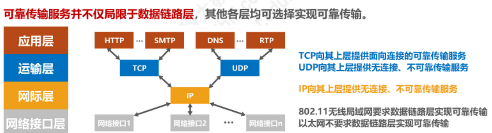
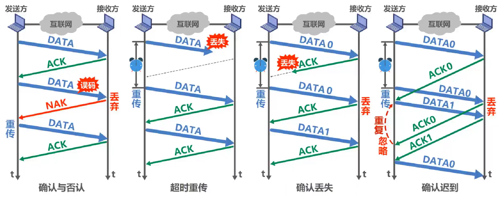
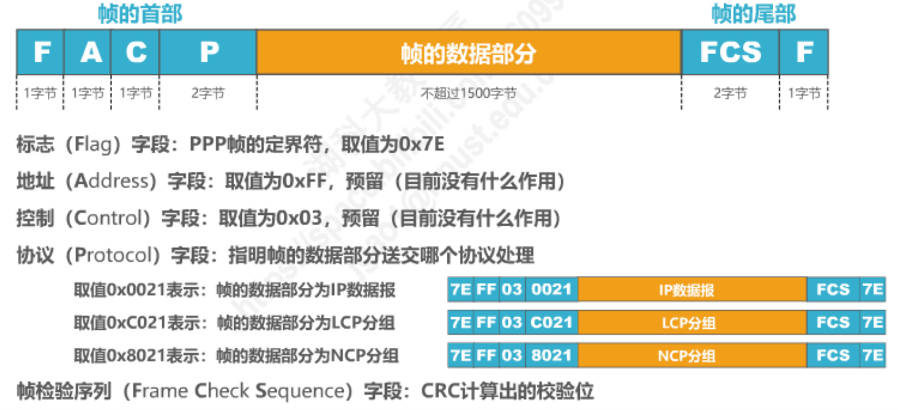
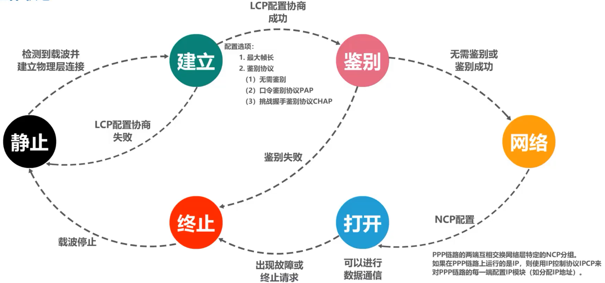
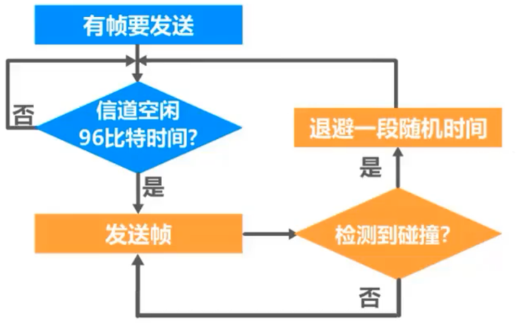
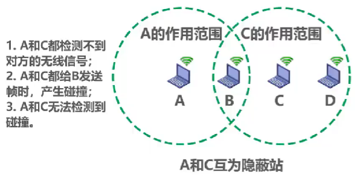
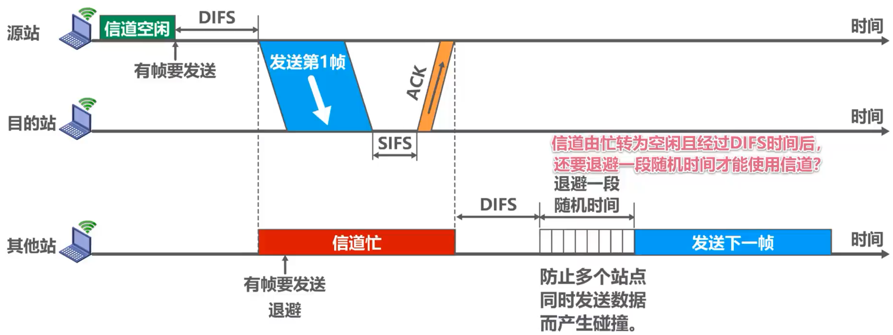
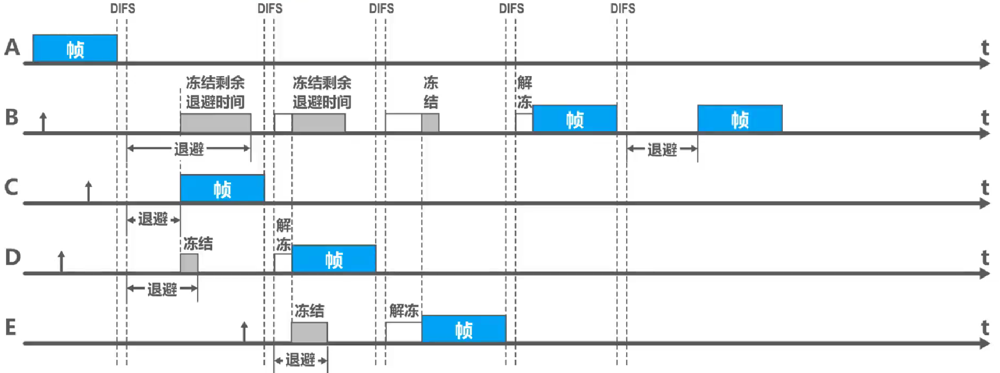

<h1 style="text-align:center">计算机网络</h1>

[TOC]

## 1. 计算机网络概述

​	ISP：互联网服务提供商（Internet Service Provider）	

​		交换方式：电话交换、报文交换、分组交换

​		计算机的主要性能指标：速率、带宽、吞吐量、时延、时延带宽积、往返时间、利用率、丢包率

​		OSI体系结构（自顶向下）：应用层、表示层、会话层、运输层、网络层、数据链路层、网络层

## 2.物理层

​	***物理层***考虑的是怎样才能在连接各种计算机的传输媒体上传输数据的比特流。	

​	传输介质（双绞线、光纤）不属于物理层的范畴。

​	物理层主要进行数据的编码和调制。

​	常见的一些编码方式：

## 3.数据链路层

***数据链路层***的主要职责是通过单个链路传输数据。主要包括封装成帧、差错检测、可靠传输

### 3.1 封装成帧

​	**封装成帧**是指数据链路层给上层交付的协议数据单元添加帧头和帧尾使之成为帧。

- 帧头和帧尾上包含重要的控制信息，如下图为PPP帧和MAC帧的格式

- 帧头和帧尾的作用之一是帧界定。对于PPP帧，头尾的1字节的标志即为帧界定；对于MAC帧，物理层会在帧头前加上前导码作为标识，同时帧之间的传输也会有固定的间隔。

​	**透明传输**：数据链路层对上层交忖的传输数据没有任何限制,就好像数据链路层不存在一样。

- 面向字节的物理链路使用字节填充的方式，如PPP帧格式，如果数据载荷中存在与帧界定一样的字节，会在其前面加入一个转义符来区别。
- 面向比特的物理链路使用比特填充的方式，如帧界定中存在6个连续的1，则在数据载荷中，每5个连续的1后就会填充一个0，避免数据载荷中的连续的1被识别为帧界定。

### 3.2 差错检测

​	使用帧尾的FCS作为差错检测码。

- 奇偶检验：在待发送的数据后面添加1位奇偶校验位,使整个数据(包括所添加的校验位在内)中“1”的个数为奇数(奇校验)或偶数(偶校验)。这种方法漏检率很高，出现偶数个位发生误码就会漏检。
- 循环冗余检验CRC（Cyclic Redundancy Check）

​		- 收发双方约定一个**生成多项式**

​		- 发送方基于待发送的数据和生成多项式计算出差错检测码（冗余码），将其添加到传输数据的后面一起传输。计算流程如下图所示。

​		- 接收方通过输出多项式来计算收到的数据的是否产生了误码

​	CRC的例子如下所示：

​	检错码只能检测岀帧在传输过程中岀现了差错,但并不能定位错误,因此无法纠正错误。

​	循环冗余校验CRC有很好的检错能力（漏检率非常低），虽然计算比较复杂，但非常易于用硬件实现,因此被广泛应用于数据链路层。

### 3.3 可靠传输

#### 可靠传输的基本概念

​	使用差错检测技术（例如循环冗余校验CRC）接收方的数据链路层就可检测出帧在传输过程中是否产生了误码（比特错误），数据链路层可向上层提供不可靠传输服务（仅仅丢弃误码），也可以提供可靠传输服务（让接收端一定能接收到发送端发送的数据）。

​	一般情况下，有线链路的误码率比较低，为了减小开销，并不要求数据链路层向上提供可靠传输服务。即使出现了误码，可靠传输的问题由其上层处理。无线链路易受干扰，误码率比较高，因此要求数据链路层必须向上层提供可靠传输服务。

​	比特差错只是传输差错的一种，从整个计算机网络体系结构来看，传输差错还包括分组丢失、分组失序和分组重复。可靠传输的主要实现方法有停止-等待协议、回退N帧协议和选择重传协议，这三种可靠传输实现机制的基本原理并不仅限于数据链路层，可以应用到计算机网络体系结构的各层协议中。

#### ==停止-等待协议（SW）==

​		基本方式如上图所示，发送端需要接收到接收端的确认信号后才会发送下一个数据，信道利用率较低。

​	详见湖科大ppt

#### ==回退N帧协议（GBN）==

​	详见湖科大ppt

#### ==选择重传协议（SR）==

​	详见湖科大ppt

### 点对点协议PPP

​	点对点协议PPP(Point-to-Point Protocol)是目前使用最广泛的点对点数据链路层协议。

​	PPP协议为在点对点链路传输各种协议数据报提供了一个标准方法，主要由以下三部分构成：

	- 对各种协议数据报的封装方法（封装成帧）
	- 链路控制协议LCP，用于建立、配置以及测试数据链路的连接
	- 一套网络控制协议NCPs，其中的每一个协议支持不同的网络层协议

​	其帧格式如下所示。

​	其也需要实现透明传输和差错检测的功能。

​	PPP协议的工作过程如下。

### 媒体接入控制

​	共享信道要着重考虑的一个问题就是如何协调多个发送和接收站点对一个共享传输媒体的占用，即媒体接入控制MAC(Medium Access Control)。

​	对于静态划分信道中，频分复用（FDM）和时分复用（TDM）都比较好理解，基本都是字面意思（光纤中还存在波分复用WDM）。码分复用（CDM）原理稍微复杂一些，==详见PPT==。

​	受控接入基本已经退出了历史舞台。

​	对于随机接入，需要解决的问题是如何避免碰撞以及发生碰撞后如何恢复信道通信。主要有CSMA/CD（载波监听多址接入/碰撞检测）和CSMA/CA（载波监听多址接入/碰撞避免）。

​	CSMA/CD协议已经成功地应用于使用广播信道的有线局域网，它的主要控制逻辑如下图所示。具体协议细节，包括截断二进制指数退避算法等，之后需要使用再去了解。

​	对于CSMA/CA，一般再无线局域网中使用。在无线局域网中，仍然可以使用载波监听多址接入CSMA,即在发送帧之前先对传输媒体进行载波监听。若发现有其他站在发送帧，就推迟发送以免发生碰撞。在无线局域网中，不能使用碰撞检测CD,原因如下：

	- 由于无线信道的传输条件特殊，其信号强度的动态范围非常大，无线网卡上接收到的信号强度往往会远远小于发送信号的强度（可能相差百万倍）。如果要在无线网卡上实现碰撞检测CD,对硬件的要求非常高。
 - 即使能够在硬件上实现无线局域网的碰撞检测功能，但由于无线电波传播的特殊性（存在
   隐蔽站问题)，进行碰撞检测的意义也不大。

​	CSMA/CA的工作原理如下图所示。

​	CSMA/CA的退避算法如下图所示。

