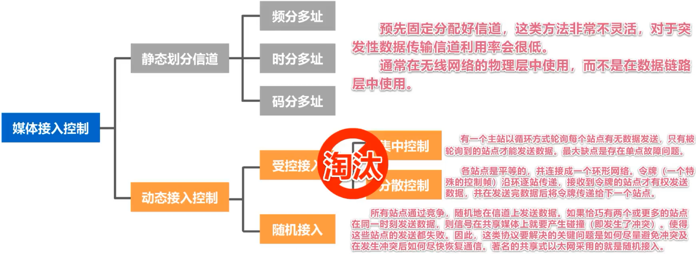
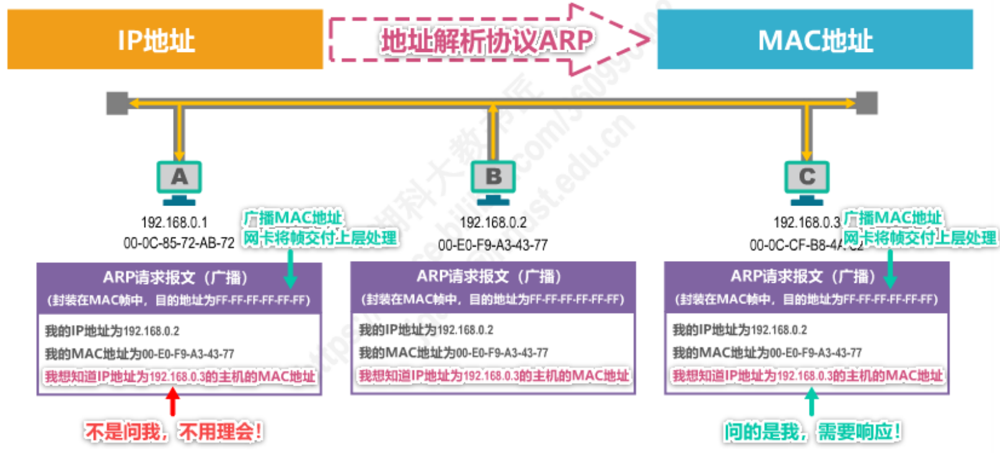

<h1 style="text-align:center">计算机网络</h1>

[TOC]

## 1.  计算机网络概述

​	ISP：互联网服务提供商（Internet Service Provider）	

​		交换方式：电话交换、报文交换、分组交换

​		计算机的主要性能指标：速率、带宽、吞吐量、时延、时延带宽积、往返时间、利用率、丢包率

​		OSI体系结构（自顶向下）：应用层、表示层、会话层、运输层、网络层、数据链路层、网络层

## 2. 物理层

​	***物理层***考虑的是怎样才能在连接各种计算机的传输媒体上传输数据的比特流。	

​	传输介质（双绞线、光纤）不属于物理层的范畴。

​	物理层主要进行数据的编码和调制。

​	常见的一些编码方式：

## 3. 数据链路层

***数据链路层***的主要职责是通过单个链路传输数据。主要包括封装成帧、差错检测、可靠传输

### 3.1 封装成帧

​	**封装成帧**是指数据链路层给上层交付的协议数据单元添加帧头和帧尾使之成为帧。

- 帧头和帧尾上包含重要的控制信息，如下图为PPP帧和MAC帧的格式

- 帧头和帧尾的作用之一是帧界定。对于PPP帧，头尾的1字节的标志即为帧界定；对于MAC帧，物理层会在帧头前加上前导码作为标识，同时帧之间的传输也会有固定的间隔。

​	**透明传输**：数据链路层对上层交忖的传输数据没有任何限制,就好像数据链路层不存在一样。

- 面向字节的物理链路使用字节填充的方式，如PPP帧格式，如果数据载荷中存在与帧界定一样的字节，会在其前面加入一个转义符来区别。
- 面向比特的物理链路使用比特填充的方式，如帧界定中存在6个连续的1，则在数据载荷中，每5个连续的1后就会填充一个0，避免数据载荷中的连续的1被识别为帧界定。

### 3.2 差错检测

​	使用帧尾的FCS作为差错检测码。

- 奇偶检验：在待发送的数据后面添加1位奇偶校验位,使整个数据(包括所添加的校验位在内)中“1”的个数为奇数(奇校验)或偶数(偶校验)。这种方法漏检率很高，出现偶数个位发生误码就会漏检。
- 循环冗余检验CRC（Cyclic Redundancy Check）

​		- 收发双方约定一个**生成多项式**

​		- 发送方基于待发送的数据和生成多项式计算出差错检测码（冗余码），将其添加到传输数据的后面一起传输。计算流程如下图所示。

​		- 接收方通过输出多项式来计算收到的数据的是否产生了误码

​	CRC的例子如下所示：

​	检错码只能检测岀帧在传输过程中岀现了差错,但并不能定位错误,因此无法纠正错误。

​	循环冗余校验CRC有很好的检错能力（漏检率非常低），虽然计算比较复杂，但非常易于用硬件实现,因此被广泛应用于数据链路层。

### 3.3 可靠传输

#### 可靠传输的基本概念

​	使用差错检测技术（例如循环冗余校验CRC）接收方的数据链路层就可检测出帧在传输过程中是否产生了误码（比特错误），数据链路层可向上层提供不可靠传输服务（仅仅丢弃误码），也可以提供可靠传输服务（让接收端一定能接收到发送端发送的数据）。

​	一般情况下，有线链路的误码率比较低，为了减小开销，并不要求数据链路层向上提供可靠传输服务。即使出现了误码，可靠传输的问题由其上层处理。无线链路易受干扰，误码率比较高，因此要求数据链路层必须向上层提供可靠传输服务。

​	比特差错只是传输差错的一种，从整个计算机网络体系结构来看，传输差错还包括分组丢失、分组失序和分组重复。可靠传输的主要实现方法有停止-等待协议、回退N帧协议和选择重传协议，这三种可靠传输实现机制的基本原理并不仅限于数据链路层，可以应用到计算机网络体系结构的各层协议中。

#### ==停止-等待协议（SW）==

​		基本方式如上图所示，发送端需要接收到接收端的确认信号后才会发送下一个数据，信道利用率较低。

​	详见湖科大ppt

#### ==回退N帧协议（GBN）==

​	详见湖科大ppt

#### ==选择重传协议（SR）==

​	详见湖科大ppt

### 3.4 点对点协议PPP

​	点对点协议PPP(Point-to-Point Protocol)是目前使用最广泛的点对点数据链路层协议。

​	PPP协议为在点对点链路传输各种协议数据报提供了一个标准方法，主要由以下三部分构成：

- 对各种协议数据报的封装方法（封装成帧）

- 链路控制协议LCP，用于建立、配置以及测试数据链路的连接
- 一套网络控制协议NCPs，其中的每一个协议支持不同的网络层协议

​	其帧格式如下所示。

​	其也需要实现透明传输和差错检测的功能。

​	PPP协议的工作过程如下。

### 3.5 媒体接入控制

​	共享信道要着重考虑的一个问题就是如何协调多个发送和接收站点对一个共享传输媒体的占用，即媒体接入控制MAC(Medium Access Control)。

​	对于静态划分信道中，频分复用（FDM）和时分复用（TDM）都比较好理解，基本都是字面意思（光纤中还存在波分复用WDM）。码分复用（CDM）原理稍微复杂一些，==详见PPT==。

​	受控接入基本已经退出了历史舞台。

​	对于随机接入，需要解决的问题是如何避免碰撞以及发生碰撞后如何恢复信道通信。主要有CSMA/CD（载波监听多址接入/碰撞检测）和CSMA/CA（载波监听多址接入/碰撞避免）。

#### CSMA/CD协议

​	CSMA/CD协议已经成功地应用于使用广播信道的有线局域网，它的主要控制逻辑如下图所示。关于碰撞检测，就是边发送边监听。就是网卡边发送数据边检测信道上的信号电压的变化情况，以便判断自己在发送数据的时候其他站是否也在发送数据。当几个站同时在总线上发送数据时，总线上的信号电压变化幅度将会增大（互相叠加），当网卡检测到的信号电压超过一定的门限值时，说明总线上至少有两个站同时在发送数据，表明产生了碰撞（冲突），所以也称为冲突检测。

​	具体协议细节，包括截断二进制指数退避算法等，之后需要使用再去了解。

#### CSMA/CA协议

​	对于CSMA/CA，一般再无线局域网中使用。在无线局域网中，仍然可以使用载波监听多址接入CSMA,即在发送帧之前先对传输媒体进行载波监听。若发现有其他站在发送帧，就推迟发送以免发生碰撞。在无线局域网中，不能使用碰撞检测CD,原因如下：

- 由于无线信道的传输条件特殊，其信号强度的动态范围非常大，无线网卡上接收到的信号强度往往会远远小于发送信号的强度（可能相差百万倍）。如果要在无线网卡上实现碰撞检测CD,对硬件的要求非常高。

 - 即使能够在硬件上实现无线局域网的碰撞检测功能，但由于无线电波传播的特殊性（存在
   隐蔽站问题)，进行碰撞检测的意义也不大。

​	CSMA/CA的工作原理如下图所示。

​	CSMA/CA的退避算法如下图所示。

### 3.6 MAC地址、IP地址和ARP协议

​	MAC地址是以太网的MAC（媒体接入控制）子层所使用的地址，属于数据链路层。

​	IP地址是TCP/IP体系结构网络层使用的地址。

​	ARP协议属于TCP/IP体系结构的网络层，其作用是已知设备所分配到的IP地址，使用ARP协议可以通过该IP地址获取到设备的MAC地址。

#### MAC地址

​	当多个主机连接在同一个广播信道上，要想实现两个主机之间的通信，则每个主机都必须有一个唯一的标识，即一个数据链路层地址；在每个主机发送的帧中必须携带标识发送主机和接收主机的地址。由于这类地址是用于媒体接入控制MAC(Media Access Control),因此这类地址被称为MAC地址。

- MAC地址一般被固化在网卡（网络适配器）的电可擦可编程只读存储器EEPROM中，因此MAC地址也被称为硬件地址；

- MAC地址有时也被称为物理地址。请注意：这并不意味着MAC地址属于网络体系结构中的物理层！

​	这个地方需要区分一下前面说到的PPP帧，这里主要说的是MAC帧，虽然它们都是数据链路层中使用的帧格式，==目前还不是很清楚它们两者的使用范围==，当时目前感觉MAC帧用的更加广泛。

​	目的地址分为单播MAC地址、多播MAC地址和广播MAC地址。

#### IP地址

​	数据包转发过程中IP地址与MAC地址的变化情况：

- 源IP地址和目的P地址保持不变：
- 源MAC地址和目的MAC地址逐个链路（或逐个网络）改变，有一个节点指向下一个节点。

#### ARP协议

​	一般来说，我们都是提前知道我们的目的IP地址，而不清楚其MAC地址；ARP协议就是通过IP地址得到目的MAC地址的。

​	以一个局域网链路为例：

​	B在自己的ARP高速缓存表中并没有目的计算机的MAC地址，则使用ARP请求报文广播出去（目的MAC地址为广播地址FF-FF-FF-FF-FF-FF），请求IP地址为192.168.0.3的主机的MAC地址。

​	而C在接收到这个广播信号后，会将自己的MAC地址单播发给B，同时在自己的高速缓存表中记录下B的MAC地址。而其他主机不会理会这个广播信息。

​	B接收到C的MAC地址后就可以正常发数据给C了。

​	对于广域网或者整个因特网来说，ARP请求报文无法像局域网中直接广播到目的主机上，我目前的理解是，都是在路由器下的局域网不断进行ARP协议，如下图所示。

​	R1路由器会查询自己的路由转发表，知道H2对应的IP应该如何转发，所以R1会将自己的MAC地址发给H1，H1就将要发给H2的数据包发给R1；R1再使用ARP协议，而R2知道H2对应的IP应该如何转发，则它会将自己的MAC地址发给R1，R1就将数据包转发给R2，而R2最终会转发给H2。以上都是目前的理解和猜测。

### 3.7 集线器和交换机

​	集线器只工作在物理层上，它的每个接口只简单的转发比特，不进行碰撞检测，使用集线器的以太网在逻辑上仍是一个总线网，各站共享总线资源，集线器一般都有少量的容错能力和网络管理功能。例如，若网络中某个网卡出了故障，不停地发送帧。此时，集线器可以检测到这个问题，在内部断开与出故障网卡的连线，使整个以太网仍然能正常工作。集线器扩大了广播域，也扩大了碰撞域。

​	以太网交换机的特点：

- 以太网交换机通常都有多个接口。每个接口都可以直接与一台主机或另一个以太网交换机相连。一般都工作在全双工方式。
- 以太网交换机具有并行性，能同时连通多对接口，使多对主机能同时通信，无碰撞（不使用CSMA/CD协议）。
- 以太网交换机一般都具有多种速率的接口，例如：10Mb/5、100Mb/5、1Gb/5、10Gb/s接口的多种组合。
- 以太网交换机工作在数据链路层（也包括物理层），它收到帧后，在帧交换表中查找顿的目的MAC地址所对应的接口号，然后通过该接口转发帧。
- 以太网交换机使一种即插即用设备，其内部的帧交换表是通过自学习算法自动地逐渐建立起来的。
- 帧的两种转发方式由存储转发和直通交换（采用基于硬件的交叉矩阵，交换时延非常小，但
  不检查帧是否右差错）。

​	交换机扩大了广播域，同时能隔离碰撞域，每一个接口都是一个独立的碰撞域。

​	以太网可以通过添加冗余链路提高以太网的可靠性，都是冗余链路也会带来负面效应，形成网络环路，带来广播风暴、主机收到重复的广播帧和交换机的帧交换表震荡等问题，为解决这些问题，以太网交换机使用生成树协议STP（Spanning Tree Protocol），不论交换机之间采用怎样的物理连接，交换机都能够自动计算并构建一个逻辑上没有环路的树形网络。

​	由于以太网中交换机相连的站点都属于同一个广播域，而过大的广播域会产生广播风暴、难以管理维护和潜在安全隐患等问题，而网络中会频繁的出现广播信息，如ARP协议、RIP协议和DHCP协议等，使用路由器隔离广播域的成本较高，所以虚拟局域网就孕育而生。

​	虚拟局域网VLAN(Virtual Local Area Network)是一种将局域网内的设备划分成与物理位置无关的逻辑组的技术，这些逻辑组具有某些共同的需求。以太网交换机就能够通过对端口类型的配置实现虚拟局域网的划分。不同虚拟局域网属于不同的广播域。

## 4. 网络层

#### 网络层概述

​	网络层的主要任务是实现网络互连，进而实现数据包在各网络之间的传输。

​	要实现网络层任务，需要解决以下主要问题：

- 网络层向运输层提供怎样的服务(“可靠传输”还是“不可靠传输”)
- 网络层寻址问题
- 路由选择问题

​	因特网(Internet)是目前全世界用户数量最多的互联网，它使用TCP/IP协议栈。由于TCP/IP协议栈的网络层使用网际协议IP,它是整个协议栈的核心协议，因此在TCP/IP协议栈中网络层常称为网际层。

​	网络层提供两种服务：面向连接的虚电路服务和无连接的数据包服务。TCP/IP体系结构的因特网的网络层提供的是简单灵活、无连接的、尽最大努力交付的数据报服务。

​	面向连接的虚电路服务：

- 可靠通信由网络来保证；
- 必须建立网络层的连接虚电路；
- 通信双方沿着已建立的虚电路发送分组；
- 目的主机的地址仅在连接建立阶段使用，之后每个分组的首部只需携带一条虚电路的编（构成虚电路的每一段链路都有一个虚电路编号)这种通信方式如果再使用可靠传输的网络协议，就可使所发送的分组最终正确到达接收方（无差错按序到达、不丢失、不重复)；
- 通信结束后，需要释放之前所建立的虚电路。

​	无连接的数据报服务：

- 可靠通信应当由用户主机来保证
- 不需要建立网络层连接；
- 每个分组可走不同的路径；
- 每个分组的首部必须携带目的主机的完整地址；
- 这种通信方式所传送的分组可能误码、丢失、重复和失序；
- 由于网络本身不提供端到端的可靠传输服务，这就使网络中的路由器可以做得比较简单，而且价格低廉（与电信网的交换机相比较）；
- 因特网采用了这种设计思想，也就是将**复杂的网络处理功能置于因特网的边缘（用户主机和其内部的运输层)**，而将相对简单的尽最大努力的分组交付功能置于因特网核心。

#### IPV4

分类编址的IPV4地址：

划分子网的IPv4地址：32比特的子网掩码可以表明分类P地址的主机号部分被借用了几个比特作为子网号

- 子网掩码使用连续的比特1来对应网络号和子网号；
- 子网掩码使用连续的比特0来对应主机号；
- 将划分子网的1PV4地址与其相应的子网掩码进行逻辑与运算就可得到PV4地址所在子网的网络地址。

无分类编址的IPv4地址：划分子网在一定程度上缓解了因特网在发展中遇到的困难，但是数量巨大的C类网因为其地址空间太小并没有得到充分使用，而因特网的P地址仍在加速消耗，整个PV4地址空间面临全部耗尽的威胁。1993年，IETF发布了无分类域间路由选择CIDR(Classless Inter-Domain Routing)的RFC文档：RFC1517~1519和1520。

- CIDR消除了传统的A类、B类和C类地址，以及划分子网的概念；
- CIDR可以更加有效地分配IPV4的地址空间，并且可以在新的1Pv6使用之前允许因特网的规模继续增长。

​	CIDR使用“斜线记法”，或称CIDR记法。即在IPV4地址后面加上斜线“/”，在斜线后面写上网络前缀所占的比特数量。

#### 路由选择协议

​	路由选择协议分为静态路由选择和动态路由选择，静态一般用于小规模网络。因特网采用的路由选择协议的主要特点：

​	常用的路由选择协议由：

​	关于具体的路由协议这个地方就不详细介绍，个人感觉不是我需要掌握的重点，大概知道一些就OK了。

#### IPv4首部格式

​	具体的每个部分代表什么意思也不在这里详细描述了，需要使用的时候再去看吧。

#### 网际控制报文协议ICMP

​	为了更有效地转发P数据报和提高交付成功的机会，在网际层使用了网际控制报文协议ICMP(Internet Control Message Protocol)。主机回或路由器使用ICMP来发送差错报告报文和询问报文。ICMP报文被封装在IP数据报中发送。

​	ICMP差错报告报文共有五种，终点不可达、源点抑制、时间超过、参数问题和改变路由（重定向）。

​	ICMP应用：

- 分组网间探测PING（Packet InterNet Groper）：用来测试主机或者路由器间的连通性，ping指令
- 跟踪路由traceroute：用来测试P数据报从源主机到达目的主机要经过哪些路由器，Windows为 tracert 指令，linux中为  traceroute 指令

#### 虚拟专用网VPN

​	虚拟专用网VPN（Virtual Private Network）：利用公用的因特网作为本机构各专用网之间的通信载体，这样的专用网又称为虚拟专用网。

​	由于IPV4地址的紧缺，一个机构能够申请到的IPV4地址数量往往远小于本机构所拥有的主机数量。因此，虚拟专用网中的各主机所分配的地址应该是本机构可自由分配的专用地址而不是需要申请的、在因特网上使用的公有地址。

​	专用（私有）地址有：10.0.0.0/8地址块、172.16.0.0/12地址块、192.168.0.0/16地址块

​	这个数据传输过程如上图所示，部门A和部门B只有其路由器是申请的全球IP，它们负载数据的转发。

​	有时一个机构的VPN需要有某些外部机构（通常就是合作伙伴）参加进来。这样的VPN就称为外联网VPN。在外地工作的员工需要访问公司内部的专用网络时，只要在任何地点接入到因特网，运行驻留在员工PC中的VPN软件，在员工的PC和公司的主机之间建立VPN隧道，即可访问专用网络中的资源。这种VPN称为远程接入VPN。

#### 网络地址转换NAT

​	虽然因特网采用了无分类编址方式来减缓IPV4地址空间耗尽的速度，但由于因特网用户数目的激增，特别是大量小型办公室网络和家庭网络接入因特网的需求不断增加，IPV4地址空间即将面临耗尽的危险仍然没有被解除。

​	1994年提出了一种网络地址转换NAT（Network Address Translation）的方法缓解了IPV4地址空间即将耗尽的问题。NAT能使大量使用内部专用地址的专用网络用户共享少量外部全球地址来访问因特网上的主机和资源。该转换方法存在一个问题：如果NAT路由器具有N个全球P地址，那么至多只能有N个内网主机能够同时和因特网上的主机通信。

​	由于绝大多数的网络应用都是使用运输层协议TCP或UDP来传送数据，因此可以利用运输层的端口号和P地址一起进行转换。这样，用一个全球P地址就可以使多个拥有本地地址的主机同时和因特网上的主机进行通信。这种将端口号和P地址一起进行转换的技术叫作网络地址与端口号转换NAPT(Network Address and Port Translation)。现在的路由器基本都是NAPT路由器了。

​	这种情况不能由外网主机首先发起通信，所以私有地址的主机不能充当因特网服务器。另外，由于NAT对外网屏蔽了内网主机的网络地址能为内网的主机提供一定的安全保护。

​	==对于一些P2P网络应用（比如QQ聊天）==，需要外网主机主动与内网主机进行通信，在通过NAT时会遇到问题，需要网络应用自己使用一些特殊的NAT穿越技术来解决问题。==这个地方还不是很懂，之后再来补充笔记。==

## 5. 运输层

### 运输层概述

​	在计算机网络中进行通信的真正实体是位于通信两端主机中的进程，如何为运行在不同主机上的应用进程提供直接的通信服务是运输层的任务，运输层协议又称为端到端协议。

​	运输层向高层用户屏蔽了下面网络核心的细节（如网络拓扑、所采用的路由选择协议等)，它使应用进程看见的就好像是在两个运输层实体之间有一条端到端的逻辑通信信道。根据应用需求的不同，因特网的运输层为应用层提供了两种不同的运输协议，即面向连接的TCP和无连接的UDP。

### 运输层端口号、复用与分用的概念

​	运行在计算机上的进程使用进程标识符PID来标志。因特网上的计算机并不是使用统一的操作系统，不同的操作系统(windows,Linux,Mac OS)又使用不同格式的进程标识符。为了使运行不同操作系统的计算机的应用进程之间能够进行网络通信，就必须使用统一的方法对TCP/IP体系的应用进程进行标识。
​	TCP/IP体系的运输层使用端口号来区分应用层的不同应用进程。端口号使用16比特表示，取值范围0~65535：

- 熟知端口号：0~1023，IANA把这些端口号指派给了TCP/IP体系中最重要的一些应用协议，例如：FTP使用21/20，HTTP使用80，DNS使用53。
- 登记端口号：1024~49151，为没有熟知端口号的应用程序使用。使用这类端口号必须在IANA按照规定的手续登记，以防止重复。例如：Microsoft RDP微软远程桌面使用的端口是3389。
- 短暂端口号：49152~65535，留给客户进程选择暂时使用。当服务器进程收到客户进程的报文时，就知道了客户进程所使用的动态端口号。通信结束后，这个端口号可供其他客户进程以后使用。

​	端口号只具有本地意义，即端口号只是为了标识本计算机应用层中的各进程，在因特网中，不同计算机中的相同端口号是没有联系的。

​	发送方的复用和接收方的分用：

​	TCP/IP体系的应用层常用协议所使用的运输层熟知端口号：

### UDP和TCP的对比

​	用户数据报协议UDP（User Datagram Protocol）和传输控制协议TCP（Transmission Control Protocol）

### TCP的流量控制

​		流量控制(flow control)就是让发送方的发送速率不要太快，要让接收方来得及接收。利用滑动窗口机制可以很方便地在TCP连接上实现对发送方的流量控制。

​	在这个过程发送窗口一开始为400字节，每100个字节为一组进行发送，当接收到接收方的确认信号后，就会根据确认信号中的已接收的序列号将窗口向前滑动，同时确认信号中还有接收窗口的调整窗口大小，发送方也会感觉这个调整窗口，如rwd=300，则发送方会将原来的400调整为300。

​	窗口大小被调整为0后，发送窗口就不会发送数据了，而接收端如果又可以接收数据，则将接收窗口调整为300，发送给发送方，如果这个信号丢失了，则发送方还是不会发送数据。

​	而实际发送方就算发送窗口为0，它也会定时发送一个零窗口探测报文，接收端就算接收窗口为0也一定要对零窗口探测报文进行响应，通告直接的接收窗口，从而打破之前死锁的局面。

### TCP的拥塞控制

​	在某段时间，若对网络中某一资源的需求超过了该资源所能提供的可用部分，网络性能就要变坏。这种情况就叫做拥塞(congestion)。若出现拥塞而不进行控制，整个网络的吞吐量将随输入负荷的增大而下降。

​	拥塞控制有四种基本算法：慢开始、拥塞避免、快重传和快恢复。假定如下条件：

- 数据是单方向传送，而另一个方向只是传送确认；
- 接收方总是有足够大的缓存空间，因而发送方发送窗口的大小由网络的拥塞程度来决定；
- 以最大报文段MSS的个数为讨论问题的单位，而不是以字节为单位。

	

​	发送方维护一个叫做拥塞窗口cwd的状态变量，其值取决于网络的拥塞程度，并且动态变化。

- 拥塞窗口cwd的维护原则：只要网络没有出现拥塞，拥塞窗口就再增大一些但只要网络出现拥塞，拥塞窗口就减少一些；
- 判断出现网络拥塞的依据：没有按时收到应当到达的确认报文（即发生超时重传）。

​	发送方将拥塞窗口作为发送窗口swnd，即swnd=cwnd

​	维护一个慢开始门限ssthresh状态变量：

- 当cwnd<ssthresh时，使用慢开始算法；cwnd的值为上一次的两倍。

- 当cwnd>ssthresh时，停止使用慢开始算法而改用拥塞避免算法；cwnd的值为上一次加一。

- 当cwnd=ssthresh时，既可使用慢开始算法，也可使用拥塞避免算法。

​	出现拥塞后（发送端重传计时器超时），将ssthresh的值更新为拥塞时的cwnd值的一半，将cwnd值减少为1，并重新开始慢开始算法。

​	慢开始和拥塞避免算法是1988年提出的TCP拥塞控制算法(TCP Tahoel版本)。1990年又增加了两个新的拥塞控制算法（改进TCP的性能），这就是快重传和快恢复(TCP Reno版本)。
​	有时，个别报文段会在网络中丢失，但实际上网络并未发生拥塞。

		- 这将导致发送方超时重传，并误认为网络发生了拥塞；
		- 发送方把拥塞窗口cwnd又设置为最小值1，并错误地启动慢开始算法，因而降低了传输效率。

​	采用**快重传算法**可以让发送方尽早知道发生了个别报文段的丢失。所谓快重传，就是使发送方尽快进行重传，而不是等超时重传计时器超时再重传。

- 要求接收方不要等待自己发送数据时才进行捎带确认，而是要立即发送确认；
- 即使收到了失序的报文段也要立即发出对已收到的报文段的重复确认；
- 发送方一旦收到3个连续的重复确认，就将相应的报文段立即重传，而不是等该报文段的超时重传计时器超时再重传。

​	这样的话，对于个别丢失的报文段，发送方不会出现超时重传，也就不会误认为出现了拥塞（进而降低拥塞窗口cwnd为1）。使用快重传可以使整个网络的吞吐量提高约20%。

​	发送方一旦收到3个重复确认，就知道现在只是丢失了个别的报文段。于是不启动慢开始算法，而执行**快恢复算法**：

	- 发送方将慢开始门限ssthresh值和拥塞窗口cwnd值调整为当前窗口的一半；开始执行拥塞避免算法。
	- 也有的快恢复实现是把快恢复开始时的拥塞窗口cwnd值再增大一些，即等于新的ssthresh+3。既然发送方收到3个重复的确认，就表明有3个数据报文段已经离开了网络，这3个报文段不再消耗网络资源而是停留在接收方的接收缓存中，可见现在网络中不是堆积了报文段而是减少了3个报文段，因此可以适当把拥塞窗口扩大些。

### TCP超时重传时间的选择

​	超时重传时间RTO的选择是TCP最复杂的问题之一，RTO太小会有不必要的重传，是网络负荷增大；RTO太大会是网络空闲时间增大降低了传输效率。RTO应该略大于往返时间RTT，但实际RTT并不是定值，而是会动态变化。（感觉这个部分不是很重要，这里就不详细说了，知道有这个东西就行）

### TCP的可靠传输

​	TCP基于以字节为单位的滑动窗口来实现可靠传输，

​	虽然发送方的发送窗口是根据接收方的接收窗口设置的，但在同一时刻，发送方的发送窗口并不总是和接收方的接收窗口一样大。

- 网络传送窗口值需要经历一定的时间滞后，并且这个时间还是不确定的。
- 发送方还可能根据网络当时的拥塞情况适当减小自己的发送窗口尺寸。

​	对于不按序到达的数据应如何处理，TCP并无明确规定。

- 如果接收方把不按序到达的数据一律丢弃，那么接收窗口的管理将会比较简单，但这样做对网络资源的利用不利，因为发送方会重复传送较多的数据。
- TCP通常对不按序到达的数据是先临时存放在接收窗口中，等到字节流中所缺少的字节收到后，再按序交付上层的应用进程。

​	TCP要求接收方必须有累积确认和捎带确认机制，这样可以减小传输开销。接收方可以在合适的时候发送确认，也可以在自己有数据要发送时把确认信息顺便捎带上。

- 接收方不应过分推迟发送确认，否则会导致发送方不必要的超时重传，这反而浪费了网络的资源。TCP标准规定，确认推迟的时间不应超过0.5秒。若收到一连串具有最大长度的报文段，则必须每隔一个报文段就发送一个确认[RFC 1122]。
- 销带确认实际上并不经常发生，因为大多数应用程序很少同时在两个方向上发送数据。

​	TCP的通信是全双工通信。通信中的每一方都在发送和接收报文段。因此，每一方都有自己的发送窗口和接收窗口。在谈到这些窗口时，一定要弄清楚是哪一方的窗口。

### TCP的连接建立

​	TCP是面向连接的协议，它基于运输连接来传送TCP报文段。TCP运输连接的建立和释放是每一次面向连接的通信中必不可少的过程。TCP运输连接有以下三个阶段：建立TCP连接、数据传送和释放TCP连接。TCP的运输连接管理就是使运输连接的建立和释放都能正常地进行。

​	TCP的连接建立要解决以下三个问题：

- 使TCP双方能够确知对方的存在；
- 使TCP双方能够协商一些参数（如最大窗口值、是否使用窗口扩大选项和时间戳选项以及服务质量等）；
- 使TCP双方能够对运输实体资源（如缓存大小、连接表中的项目等）进行分配。

​	TCP的三报文握手

​		需要注意客户端和服务器发送”握手“信息和接收到”握手“信息后的状态。客户端发送TCP连接请求信号后，处于”SYN-SEND“同步已发送状态；服务器一开始处于监听状态，接收到客户端的”握手信号“后，进入”SYN-RCVD“同步已接收状态，然后发送”TCP连接请求的确认信号；客户端接收到后，发送针对TCP连接请求的确认的确认信号，并处于连接已建立状态；服务器接收这个信号后，也会进入连接已建立状态，两者可以进行TCP数据传输。

​	如果是两报文握手的话，假设客户端第一个TCP连接请求信号有延迟，客户端超时重传，在第二个TCP连接完成后，到达服务器，服务器接收到后，会立刻进入连接已建立状态，并发送TCP连接请求确认信号，而客户端此时并没有发起TCP连接，就不会理会，而会让服务器一直处于连接建立状态等待客户端发送数据，造成服务器资源浪费。如果是三报文握手，服务器在接收到TCP连接请求信号后只会进入==”SYN-RCVD“同步已接收状态（这个地方也就是所同步已接收状态比连接已建立状态要省资源，只是单纯的状态变了，而不需要时刻等待接收数据）==，而不是连接已建立，所以三报文握手并不多余。

